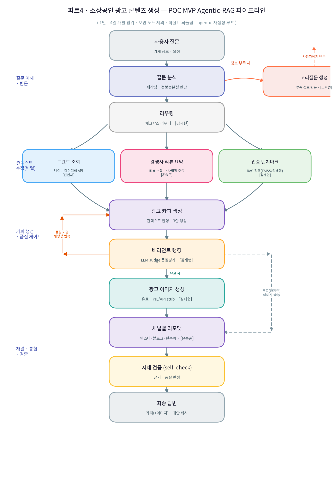

# 파트4 Version 2 POC · 소상공인 광고 카피 Agentic-RAG 챗봇

LangGraph 기반 **Agentic-RAG** 파이프라인으로 소상공인의 광고 카피(무료)와
광고 이미지+카피(유료)를 생성하는 MVP. **1인 · 4일(7/30~8/3) 개발 범위**.

> `sqlite3` DB 표준 라이브러리 사용. 보안 처리 노드 구현 POC 범위 제외.

---

## POC 아이디어 제안 사항
| 담당 | 기능 | 구현 위치 |
| --- | --- | --- |
| 전민재 | 네이버 데이터랩 트렌드 조회 | `backend/nodes/trend.py` |
| 윤승준 | 경쟁사 리뷰 요약·차별점 / 채널별 리포맷 | `backend/nodes/context.py`, `channel_format.py` |
| 김재헌 | 체크박스 라우터 / 업종 벤치마크 RAG / 이미지·게시물(유료) / 로그인·결제 DB / 평가 | `routing.py`, `retrieval.py`, `image_gen.py`, `db.py`, `eval/` |
| 조희원 | 정보 충분성 판단→꼬리질문(반문) / 대안(배리언트) 제시 | `question_analysis.py`, `ranking.py` |

---

## 파이프라인



---

## 디렉토리 구조
```
adcopilot/
├── backend/
│   ├── db.py                 # sqlite3 CRUD (users/payments/generations)
│   ├── config.py / config.yaml
│   ├── llm.py                # gpt-5-mini 래퍼(+오프라인 목)
│   ├── retrieval.py          # 업종 벤치마크 RAG(코사인)
│   ├── nodes/                # 그래프 노드들
│   ├── graph/                # state + build_graph
│   ├── pipeline.py           # get_ai_response 진입점
│   ├── main.py               # FastAPI
│   └── data/                 # 벤치마크 KB / 경쟁사 리뷰 샘플
├── frontend/streamlit_app.py
├── eval/                     # HitRate@k / MRR / LLM Judge
└── scripts/seed.py           # demo 계정
```

---

## 참고 자료

### 네이버 데이터랩
- OpenAPI 네이버 통합 검색어 트렌드 조회 명세서 — [바로 가기](https://developers.naver.com/docs/serviceapi/datalab/search/search.md#%EB%84%A4%EC%9D%B4%EB%B2%84-%ED%86%B5%ED%95%A9-%EA%B2%80%EC%83%89%EC%96%B4-%ED%8A%B8%EB%A0%8C%EB%93%9C-%EC%A1%B0%ED%9A%8C)

### 소상공인시장진흥공단
- OpenAPI 반경내 상가업소 조회 명세서 — <a href="https://2026-codeit-part4-6team.github.io/codeit-part4-poc-chatbot/소상공인시장진흥공단_상가(상권)정보_storeListInRadius_OpenApi.pdf">바로 가기</a>

- OpenAPI 활용가이드 — [다운로드](https://raw.githubusercontent.com/2026-Codeit-Part4-6Team/codeit-part4-poc-chatbot/main/docs/%EC%86%8C%EC%83%81%EA%B3%B5%EC%9D%B8%EC%8B%9C%EC%9E%A5%EC%A7%84%ED%9D%A5%EA%B3%B5%EB%8B%A8_%EC%83%81%EA%B0%80%28%EC%83%81%EA%B6%8C%29%EC%A0%95%EB%B3%B4_OpenApi%20%ED%99%9C%EC%9A%A9%EA%B0%80%EC%9D%B4%EB%93%9C.hwp)

- 업종분류(2302) 및 연계표 v1 — [다운로드](https://raw.githubusercontent.com/2026-Codeit-Part4-6Team/codeit-part4-poc-chatbot/main/docs/%EC%86%8C%EC%83%81%EA%B3%B5%EC%9D%B8%EC%8B%9C%EC%9E%A5%EC%A7%84%ED%9D%A5%EA%B3%B5%EB%8B%A8_%EC%83%81%EA%B0%80%28%EC%83%81%EA%B6%8C%29%EC%A0%95%EB%B3%B4_%EC%97%85%EC%A2%85%EB%B6%84%EB%A5%98%282302%29_%EB%B0%8F_%EC%97%B0%EA%B3%84%ED%91%9C_v1.xlsx)

- 주요상권현황 — [다운로드](https://raw.githubusercontent.com/2026-Codeit-Part4-6Team/codeit-part4-poc-chatbot/main/docs/%EC%86%8C%EC%83%81%EA%B3%B5%EC%9D%B8%EC%8B%9C%EC%9E%A5%EC%A7%84%ED%9D%A5%EA%B3%B5%EB%8B%A8_%EC%A3%BC%EC%9A%94%EC%83%81%EA%B6%8C%ED%98%84%ED%99%A9_20240101.csv)

---

## 실행
```bash
pip install -r requirements.txt
cp .env.example .env          # 키 입력(없어도 목 모드로 동작)

# 1) 백엔드
cd backend && python -m uvicorn main:app --host 0.0.0.0 --port 8000
# (별 터미널) 데모 계정: python ../scripts/seed.py  → demo / demo123

# 2) 프론트
cd ../frontend && BACKEND_URL=http://localhost:8000 streamlit run streamlit_app.py
```

---

## 시연 시나리오
1. `demo/demo123` 로그인 → 사이드바에서 컨텍스트 소스 체크박스, 플랜/채널 선택
2. "강남역 카페 여름 신메뉴 인스타 문구 만들어줘" → 카피 3안 + 최고안 + 근거
3. 정보 부족 질문("홍보 좀 해줘") → **꼬리질문 반문** 확인
4. 크레딧 충전 → **유료(paid)** → 광고 이미지 생성 확인
5. 채널을 banner로 바꿔 **현수막 문구** 리포맷 확인
6. `python eval/evaluate.py` → HitRate@5 / MRR / LLM Judge

---

## 오프라인 모드
`OPENAI_API_KEY`/네이버 키가 없으면 자동으로 목 응답·mock 트렌드로 폴백하여
파이프라인 흐름 전체를 키 없이 검증할 수 있음(실 시연 시 키 입력).

---

## 실서비스 확장 슬롯(인터페이스 유지 교체 지점)
- 주의사항: 네이버지도 API의 경우 리뷰 데이터 직접 가져오기 불가. 하여 웹 크롤링/스크래핑 방식으로 셀레니움(Selenium) 등의 도구 사용하여 네이버 플레이스 페이지에서 공개된 리뷰 데이터를 우회적으로 수집 가능 여부 추가 확인 필요
- `retrieval.py` → FAISS/Chroma
- `nodes/image_gen.py` → 팀 `backend_image_generator.py`(SDXL RealVisXL+IP-Adapter)
- `nodes/context.py` 경쟁사 → 상권정보 OpenAPI + 네이버지도 API
- `eval/` → RAGAS(Context Recall/Precision, Faithfulness, Answer Correctness 등.)