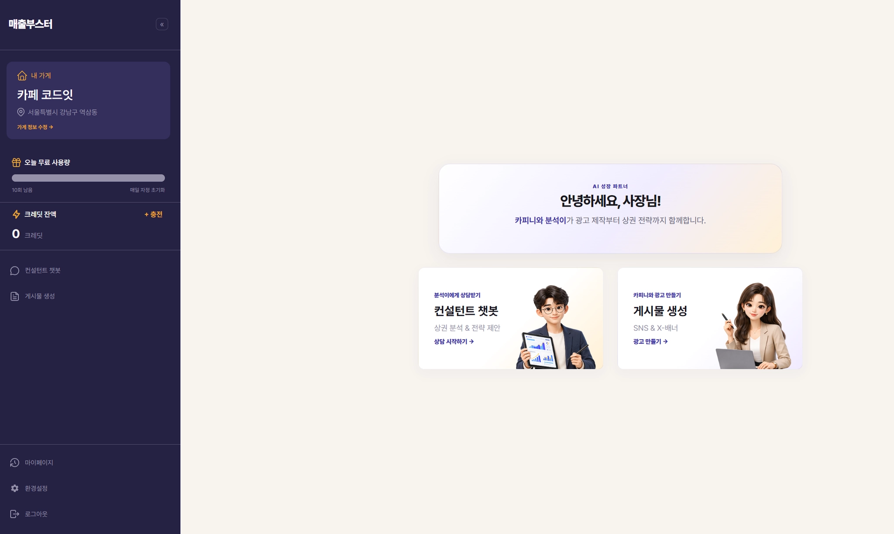
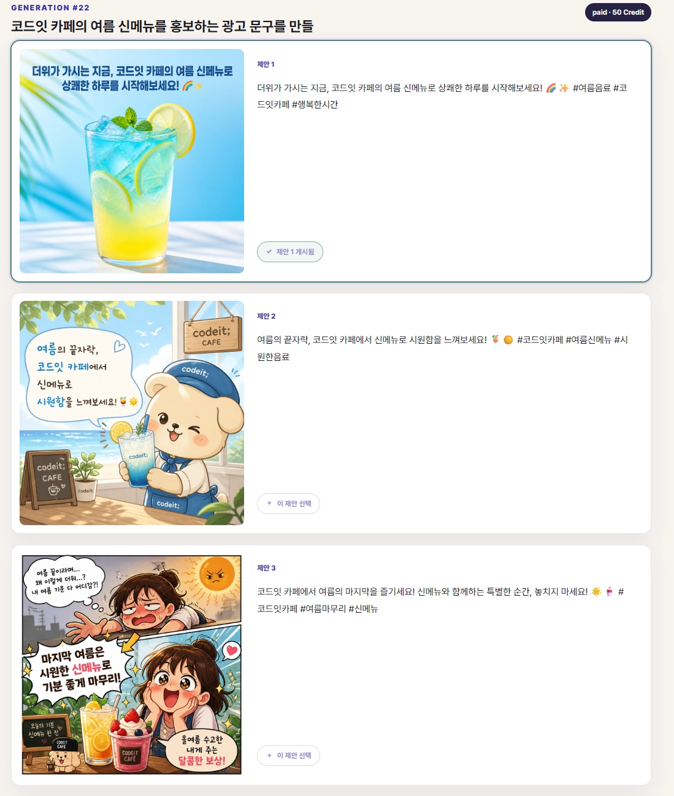
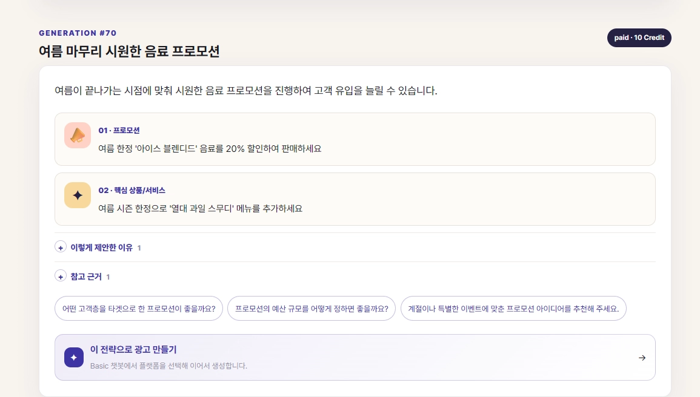
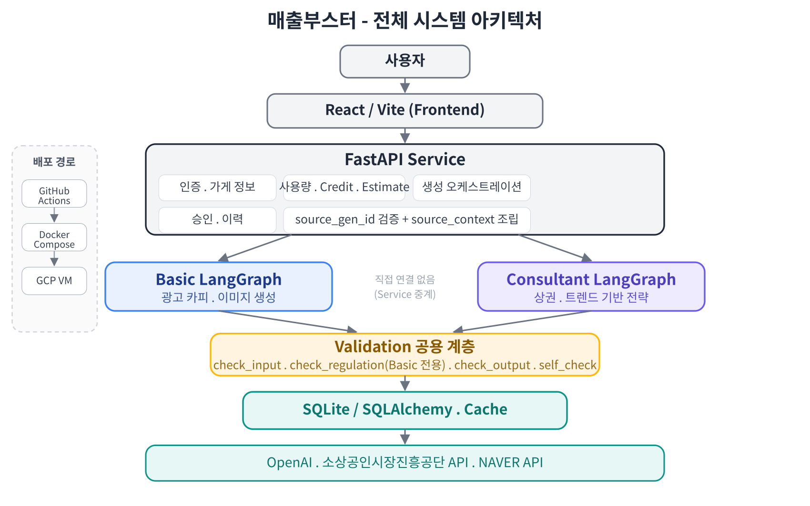
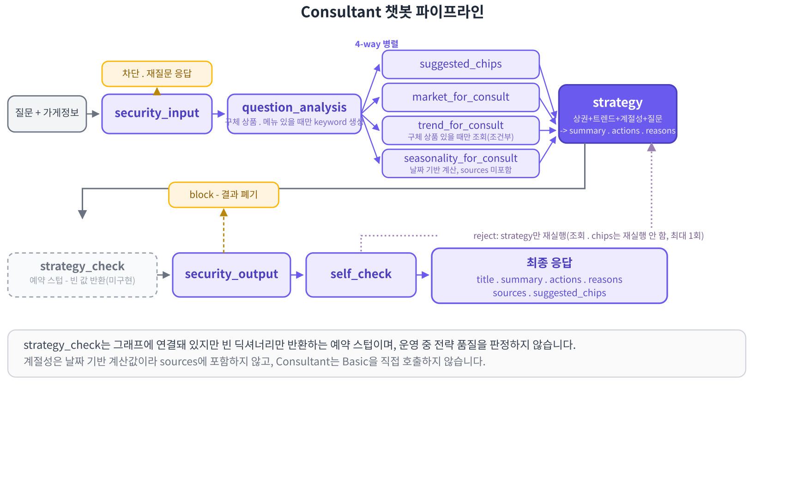
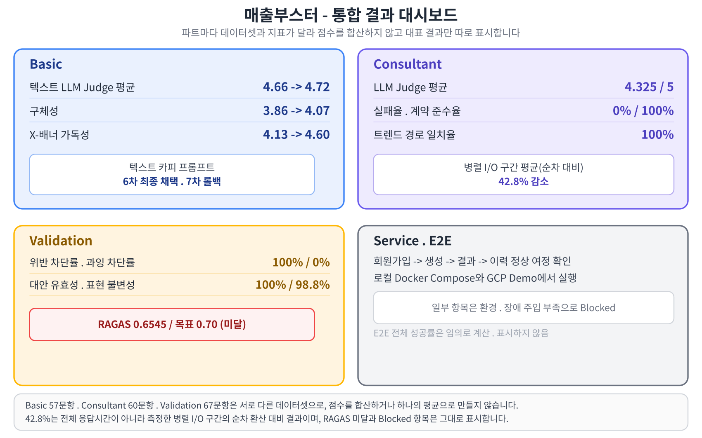

<!--
GitHub README 반영 전 확인할 것.
1. 이 문서에서 사용하는 이미지를 저장소의 docs/images/readme/로 복사하고 경로를 교체한다.
2. YOUTUBE_VIDEO_ID와 발표 자료·최종 보고서 링크를 실제 값으로 교체한다.
3. 팀 합의 후 LICENSE 파일을 추가한다.
-->

<div align="center">

# 🚀 매출부스터

### 상권·검색 트렌드 기반 전략 상담과 광고 콘텐츠 생성을 연결한 소상공인 마케팅 플랫폼

가게 정보를 등록하면 마케팅 전략을 상담받고, 같은 전략으로 인스타그램·X-배너 광고 문구와 이미지를 만들 수 있습니다.

<br>



<br>


</div>

---

## 📌 프로젝트 소개

| 항목 | 내용 |
| --- | --- |
| 프로젝트명 | 매출부스터 |
| 개발 기간 | 2026.08.04 - 2026.08.31 |
| 개발 인원 | 4명 |
| 대상 사용자 | 광고 전략과 콘텐츠 제작에 어려움을 겪는 소상공인 |
| 주요 기능 | 마케팅 전략 상담, 광고 문구·이미지 생성, 생성 결과 검증 |
| 배포 환경 | Docker Compose, GitHub Actions, GCP VM |

매출부스터는 역할이 다른 두 개의 챗봇으로 구성했습니다.

- **컨설턴트 챗봇**은 상권·검색 트렌드·계절성 데이터를 이용해 마케팅 전략을 제안합니다.
- **기본 챗봇**은 사용자의 요청이나 컨설팅 결과를 바탕으로 광고 문구와 이미지를 생성합니다.
- 생성 과정에는 입력 보안·규제·출력 보안·응답 완결성 검증을 연결했습니다.
- 서비스에서는 회원가입, 무료 사용량, 크레딧, 생성 이력을 관리합니다.

### 🎬 시연 영상

아래 이미지를 클릭하면 YouTube 시연 영상으로 이동합니다.

[](https://www.youtube.com/watch?v=N4SLRAgrLik)

---

## ✨ 주요 기능

<details>
<summary><strong>카피니 - 기본 챗봇</strong></summary>



- 인스타그램·X-배너 광고 문구 3안 생성
- 생성 결과 랭킹과 플랫폼별 형식 변환
- `gpt-image-2` 기반 광고 이미지 생성
- 상권·트렌드·업종 벤치마크 정보 반영
- 규제·출력·사실성 검증
- 결과 승인·재사용·다시 만들기

</details>

<details>
<summary><strong>분석이 - 컨설턴트 챗봇</strong></summary>



- 소상공인시장진흥공단 OpenAPI 기반 주변 상권 분석
- 구체적인 상품·메뉴가 있을 때만 검색 트렌드 조회
- 요청 날짜 기반 계절성 반영
- 상권·트렌드·계절성·추천 질문 노드 병렬 실행
- 전략 요약, 실행 항목, 근거, 데이터 출처 제공
- 후속 상담을 위한 추천 질문 3개 생성
- 컨설팅 결과를 기본 챗봇의 광고 생성으로 연결

</details>

### 검증과 서비스 기능

| 영역 | 기능 |
| --- | --- |
| 입력 검증 | 불법 키워드와 프롬프트 인젝션 탐지 |
| 규제 검증 | 표시광고법·식품표시광고법 관련 표현 확인 |
| 출력 검증 | 개인정보와 시스템 프롬프트 노출 탐지 |
| Self-check | 생성 결과의 근거와 완결성 확인 |
| 사용량·크레딧 | 무료 사용량 우선 적용, 크레딧 차감 및 실패 시 롤백 |
| 생성 이력 | 생성 결과 저장·조회·재사용 |

---

## 🏗️ 시스템 구조



<details>
<summary><strong>카피니 - 기본 챗봇 파이프라인</strong></summary>

카피니 - 기봇 챗봇은 LangGraph 기반의 상태 그래프 파이프라인을 채택하여 구축했다. 이 방식은 파이프라인의 각 단계를 노드로 정의하고 단계 간의 흐름을 조건부 엣지로 연결하여 제어한다. 이를 통해 챗봇의 핵심 로직인 검증 게이트의 판단 흐름과 규제 위반 시 발생하는 재시도 루프 구조를 그래프 아키텍처 내에 명시적으로 표현하고 안정적으로 제어할 수 있다. 

카피니 - 기본 챗봇의 전체 흐름은 아래와 같이 크게 네 구간으로 나뉜다. 

1. 입력 단계 - 입력 검증(security_input) 후 질문 분석(question_analysis)에서 정보 충분성 판정을 하고, 정보가 부족하면 재질문(reask)으로 종료한다. 
2. 컨텍스트 수집 단계 - 채널 확정(channel) 후 상권 요약(market_for_copy), 트렌드 요약(trend_for_copy), 벤치마크 요약(benchmark), 계절정보 힌트(seasonality_for_copy)를 순서대로 채운다.
3. 생성 및 검증 단계 - 카피 생성(copy_gen) → 랭킹(ranking, LLM Judge) → 규제 검증(regulation)을 거치며, 규제 위반 시 재시도 상한(2회) 내에서 카피 생성(copy_gen)으로 되돌아가는 루프가 있다. 이후 이미지 생성(image_gen) → 이미지 검수(image_review)에서도 디코딩 전부 실패 시 재시도 상한(2회) 내에서 카피 생성(copy_gen)으로 되돌아가는 루프가 있다. 
4. 출력 단계 - 채널 리포맷(channel_format)으로 서비스 응답 형태를 조립하고, 출력 검증(security_output) → 최종 검증(self_check)을 통과하면 그래프가 종료된다. 각 검증 게이트(security_input, security_output, self_check)는 위반 시 즉시 종료로 빠지는 별도 경로를 가진다. 


</details>

<details>
<summary><strong>분석이 - 컨설턴트 챗봇 파이프라인</strong></summary>

질문 분석 후 상권·트렌드·계절성·추천 질문 노드를 동시에 실행하고, 결과를 전략 생성 단계에서 합칩니다. 상권과 트렌드는 캐시를 먼저 확인하고 데이터가 없을 때만 외부 API를 호출합니다.



</details>

---

## 📊 평가 결과



<details>
<summary><strong>카피니 - 기본 챗봇 60문항</strong></summary>

| 지표 | Baseline | 최종 채택 6차 | 변화 |
| --- | ---: | ---: | ---: |
| LLM Judge 평균 | 4.66 | 4.72 | +0.06 |
| 요청 반영도 | 5.00 | 5.00 | 0.00 |
| 구체성 | 3.86 | 4.07 | +0.21 |
| 규제 안전성 | 5.00 | 5.00 | 0.00 |
| 채널 적합성 | 4.77 | 4.80 | +0.03 |
| 응답시간 P50 | 4.14초 | 7.89초 | +3.75초 |

품질이 조금 좋아졌지만 응답시간과 실패율은 악화됐다. 
6차의 실패 3건은 한 문항의 API 타임아웃으로 분석됐으나, 
사용자 입장에서는 결과 실패라는 점은 남는다. 따라서 이 결과를 모든 지표의 동시 개선으로 표현하지 않는다.

| 지표 | Baseline | 최종 채택 7차 | 변화 |
| --- | ---: | ---: | ---: |
| 브랜드제품정합성 (배너/인스타) | 5.00 / 4.90 | 4.80 / 5.00 | -0.20 / +0.10 |
| 가독성·적합성 (배너/인스타) | 4.13 / 5.00 | 4.63 / 4.87 | +0.50 / -0.13 |
| 분위기톤일치 (배너/인스타) | 5.00 / 5.00 | 4.95 / 5.00 | -0.05 / 0.00 |
| CLIP Score (배너/인스타) | 0.2721 / 0.3144 | 0.2819 | - |
| 규제문구위반 | - | 20% (전체) | - |

이미지·배너 평가에서 배너 가독성은 4.13에서 4.60으로 개선됐지만, 인스타그램 스타일을 다양화하는 과정에서 피드 적합성과 CLIP Score는 함께 하락했다.

</details>

<details>
<summary><strong>분석이 - 컨설턴트 챗봇 60문항</strong></summary>

외부 상권·트렌드 API 대신 문항별 고정 fixture를 주입하고, 
생성 모델과 Judge 모델을 분리해 같은 조건에서 답변을 비교했습니다.

| 지표 | 최종 결과 |
| --- | ---: |
| LLM Judge 평균 | **4.325 / 5.0** |
| 근거 충실도 | **4.267** |
| 실행 가능성 | **4.117** |
| 구체성 | **4.100** |
| 자연스러움 | **4.817** |
| 실패율 | **0% (0/60)** |
| 응답 계약 준수율 | **100% (60/60)** |
| 트렌드 경로 일치율 | **100% (60/60)** |
| 허용되지 않은 숫자 사용률 | **0% (0/60)** |
| 응답 시간 P50 | **5.20초** |
| 응답 시간 P95 | **6.97초** |

### 버전별 신뢰성 변화

| 지표 | v0 | v3 최종 |
| --- | ---: | ---: |
| 실패율 | 8.3% | **0.0%** |
| 계약 준수율 | 91.7% | **100.0%** |
| 트렌드 경로 일치율 | 83.6% | **100.0%** |

LLM Judge 점수만 높이는 것보다 서비스에서 사용할 수 있는 응답이 안정적으로 반환되는지를 먼저 확인했습니다.

### 병렬화 전후 I/O 구간 비교

신규 지역·키워드 8건의 콜드 캐시 조건에서 상권 조회, 트렌드 조회, 추천 질문 생성의 세 I/O 구간을 측정했습니다. 순차 실행 시간은 각 작업 시간의 합산값이며, 병렬 실행의 wall-clock 시간과 비교했습니다. 전체 E2E 응답시간을 뜻하지 않습니다.

| 실행 방식 | 세 I/O 구간 평균 |
| --- | ---: |
| 순차 실행 환산 | 2.87초 |
| 병렬 실행 | 1.64초 |
| 감소율 | **42.8%** |

### 추천 질문 평가

프롬프트 수정 후 10문항을 다시 실행해 추천 질문 30개를 확인했습니다.

| 지표 | 결과 |
| --- | ---: |
| 형식 계약 준수 | 100% |
| fallback | 0/10 |
| 화자 방향 | 10/10 |
| 직접 확인한 추천 질문 | 30/30개 |

</details>

<details>
<summary><strong>검증 함수 4종 67문항</strong></summary>

검증 함수는 PM·검증 담당자가 별도의 거부 골든 데이터셋으로 측정했습니다. 컨설턴트 전략 평가와 합산하지 않습니다.

| 지표 | 최종 결과 |
| --- | ---: |
| 위반 차단률 | 100% |
| 과잉 차단률 | 0% |
| 대안 제시율 | 100% |
| 대안 유효성 | 100% |
| 표현 불변성 | 98.8% |
| RAGAS 종합 점수 | 0.6545 |


> **RAGAS 미달은 트레이드오프의 결과입니다.** `context_recall` 1.000, `faithfulness` 1.000인데 `context_precision` 0.3871이 종합을 끌어내렸습니다. top-k=3 고정 구조에서 정답 조문이 1개인 문항의 precision 상한은 0.333입니다. 동적 top-k로 바꾸면 precision은 오르지만 **과잉 차단이 8.3% → 25%로 악화**되어 채택하지 않았습니다.

</details>

---

## 🛠️ 기술 스택

### 언어·프론트엔드


### 백엔드·데이터


### AI·평가


### 협업·배포


### 사용 모델

| 용도 | 모델 |
| --- | --- |
| 광고 문구·컨설팅 전략 생성 | `gpt-4o-mini` |
| 컨설턴트 평가 Judge | `gpt-4.1-mini` |
| 광고 이미지 생성 | `gpt-image-2` |
| 임베딩 | `text-embedding-3-small` |
| 이미지 유사도 기록 | CLIP · 비차단 평가 |

---

## 🚀 설치 및 실행

<details>
<summary><strong>Docker Compose로 실행하기</strong></summary>

### 저장소 복제

```bash
git clone https://github.com/2026-Codeit-Part4-6Team/codeit-part4-6team-project.git
cd codeit-part4-6team-project
```

### 환경 변수 설정

macOS·Linux에서 실행합니다.

```bash
cp .env.example .env
```

Windows PowerShell에서 실행합니다.

```powershell
Copy-Item .env.example .env
```

Mock 모드는 별도 API 키 없이 실행할 수 있습니다. 실제 모델과 외부 데이터를 사용하려면 각 제공기관에서 인증 정보를 발급받아 `.env`에 입력하고 `CHATBOT_MODE=actual`로 변경합니다.

| 환경변수 | 발급처·용도 | 구분 |
| --- | --- | --- |
| `OPENAI_API_KEY` | OpenAI · 광고 문구·이미지·컨설팅 전략 생성 | actual 모드 필수 |
| `MARKET_API_KEY` | 공공데이터포털 · 소상공인시장진흥공단 상권정보 조회 | 상권 분석 사용 시 필요 |
| `NAVER_CLIENT_ID`, `NAVER_CLIENT_SECRET` | NAVER API HUB · 검색어 트렌드 조회 | 트렌드 분석 사용 시 필요 |
| `NAVER_AD_API_KEY`, `NAVER_AD_SECRET_KEY`, `NAVER_AD_CUSTOMER_ID` | NAVER 검색광고 API · 연관 검색어 조회 | 선택, 미설정 시 연관 검색어 제외 |
| `NAVER_MAPS_API_KEY_ID`, `NAVER_MAPS_API_KEY` | NAVER Maps · 가게 주소 지오코딩 | 주소 기반 가게 등록 시 필요 |
| `HF_TOKEN` | Hugging Face · 모델 다운로드 인증 | 선택 |

API 키를 저장소에 커밋하지 않습니다. 전체 환경변수와 기본값은 [`.env.example`](.env.example)을 확인합니다.

</details>

<details>
<summary><strong>서비스 실행 명령어 모음</strong></summary>

서비스를 로컬에서 실행하거나 GCP 데모 환경을 점검할 때 사용하는 명령어입니다.
API 키, 비밀번호, 세션 키 등 실제 비밀값은 저장소에 기록하지 않습니다.

## 로컬 실행

```bash
cp .env.example .env
docker compose up -d --build
docker compose ps
curl http://127.0.0.1:18000/health
docker compose logs --tail=200
docker compose down
```

프론트엔드는 `http://127.0.0.1:8501`, 백엔드 API 문서는
`http://127.0.0.1:18000/docs`에서 확인합니다.

## 테스트

```bash
uv sync --locked --all-groups
uv run --locked --all-groups pytest
uv run --locked --group dev ruff check .
```

### 실제 모델 경계 점검

실제 Basic·Consultant 모델을 통합한 환경에서 E2E를 시작하기 전에 1회 실행합니다.
API 비용과 모델 가중치 다운로드가 발생할 수 있으므로 일반 PR CI에서는 실행하지 않습니다.

```bash
RUN_MODEL_BOUNDARY_SMOKE=1 uv run --locked --all-groups \
  pytest tests/integration/test_d7_model_boundary.py -q
```

## GCP 데모 환경

배포 VM의 앱 경로는 `/srv/team6/app`이며, 실제 환경 파일은 해당 경로의 `.env`에서만 관리합니다.

```bash
cd /srv/team6/app

docker compose -p team6-app \
  --env-file .env \
  -f compose.deploy.yaml up -d --wait --wait-timeout 180

docker compose -p team6-app \
  -f compose.deploy.yaml ps

docker compose -p team6-app \
  -f compose.deploy.yaml logs --tail=200

curl http://127.0.0.1:18000/health
```

기본 포트는 프론트엔드 `8501`, 백엔드 `18000`입니다. 컨테이너 내부 백엔드 포트는 `8000`이며,
프론트엔드는 Compose 네트워크의 `http://backend:8000`을 사용합니다.

## 데모 계정

`--topup`은 기존 생성 이력을 보존하고 데모 계정의 크레딧만 보충합니다.

```bash
docker compose -p team6-app \
  --env-file .env \
  -f compose.deploy.yaml exec -T backend \
  python -m backend.demo_seed --topup
```

`--reset`은 데모 계정과 관련 생성 이력·결제 이력을 삭제한 뒤 다시 만듭니다.
이력이 필요한 시연 전에는 사용하지 않습니다.

```bash
docker compose -p team6-app \
  --env-file .env \
  -f compose.deploy.yaml exec -T backend \
  python -m backend.demo_seed --reset
```

## CD 수동 실행

`main`에 병합된 커밋을 수동 배포할 때 GitHub Actions에서 실행합니다.

```bash
gh workflow run deploy.yml --ref main -f confirm_deploy=true
gh run watch
```

배포 후에는 GCP VM에서 `ps`, `logs`, `/health` 순서로 컨테이너 상태를 확인합니다.

</details>

<details>
<summary><strong>프로젝트 구조 보기</strong></summary>

```text
codeit-part4-6team-project/
├── backend/             # FastAPI 라우터와 서비스 로직
├── frontend/            # React·Vite 사용자 화면
├── models/
│   ├── basic/           # 광고 문구·이미지 생성 LangGraph
│   ├── consult/         # 마케팅 전략 상담 LangGraph
│   └── shared/          # 공용 State·LLM·평가 유틸
├── validation/          # 입력·규제·출력·Self-check
├── cache/               # 상권·트렌드 Cache-Aside 저장소
├── shared_data/         # 골든 데이터셋과 공용 데이터
├── tests/               # 서비스·계약·통합 테스트
├── docs/                # 개발 계획서와 계약 문서
├── scripts/             # 실행·검증 보조 스크립트
├── compose.yaml
└── README.md
```

</details>

---

## 👥 팀원 및 역할

| 이름 | 역할 | 주요 업무 |
| --- | --- | --- |
| 전민재 | PM·검증 | 일정·의사결정, 공용 계약, 검증 함수 4종, 평가 |
| 조희원 | 카피니 - 기본 챗봇 모델 | 광고 문구·이미지 생성 LangGraph |
| 김재헌 | 분석이 - 컨설턴트 챗봇 모델 | 상권·트렌드 데이터 계층, 전략 생성 LangGraph, 평가 |
| 윤승준 | 서비스 개발 | React·FastAPI 서비스, 인증·크레딧·생성 이력, 배포 |

---

## 📎 산출물과 사용 데이터

### 산출물

- [시연 영상](https://www.youtube.com/watch?v=N4SLRAgrLik)
- [카피니 - 기본 챗봇 최종 보고서](reports/basic_report.md)
- [분석이 - 컨설턴트 챗봇 최종 보고서](reports/consult_report.md)
- [검증 함수 최종 보고서](reports/validation_report.md)
- [서비스 최종 보고서](reports/service_report.md)
- [최종 프로젝트 보고서](reports/final_report.md)
- [최종 발표 자료](reports/final_presentation.pdf)
- [E2E 1회차 테스트 자료](https://app.notion.com/p/3b5efe95f43b80749aced13d0e08444b)
- [E2E 2회차 테스트 자료](https://app.notion.com/p/E2E-2-3caefe95f43b80eab598e4782cb903ce)

### 외부 API

| API | 사용 목적 |
| --- | --- |
| OpenAI API | 광고 문구·전략·이미지 생성과 평가 |
| 소상공인시장진흥공단 상권정보 OpenAPI | 반경 내 매장과 동일 업종 분석 |
| NAVER API HUB 검색어 트렌드 | 상품·메뉴 검색 추세 분석 |
| NAVER 검색광고 API | 연관 검색어 조회 |
| NAVER Maps Geocoding | 가게 주소를 위도·경도로 변환 |

외부 API와 모델은 각 제공기관의 이용 정책을 따릅니다. 저장소를 공개하기 전 팀에서 라이선스를 확정하고 `LICENSE` 파일을 추가해야 합니다.
