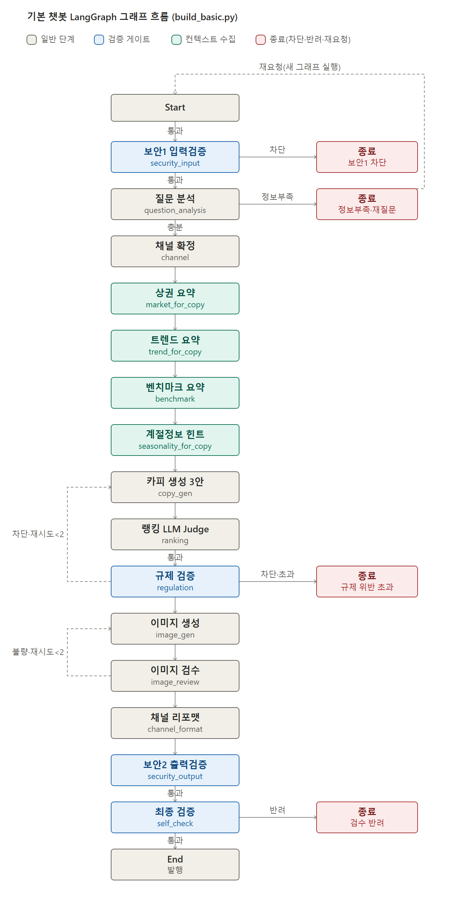
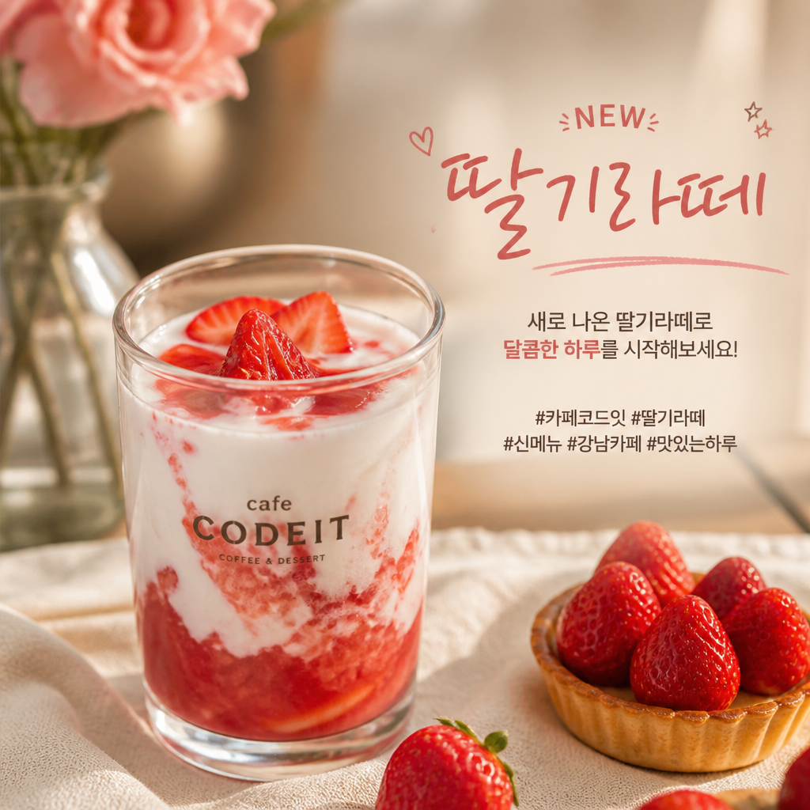
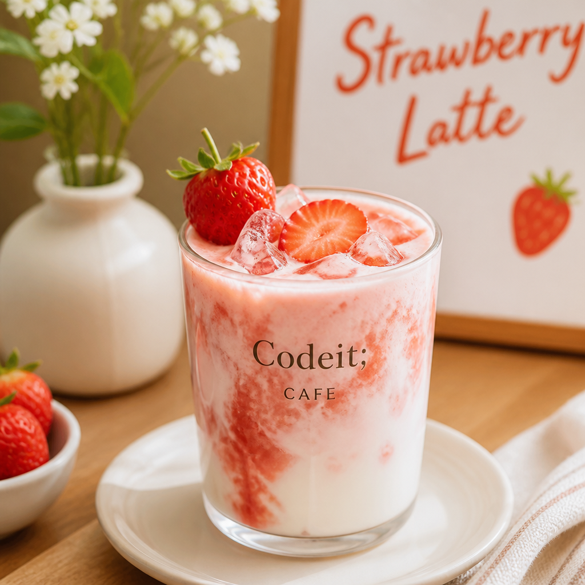
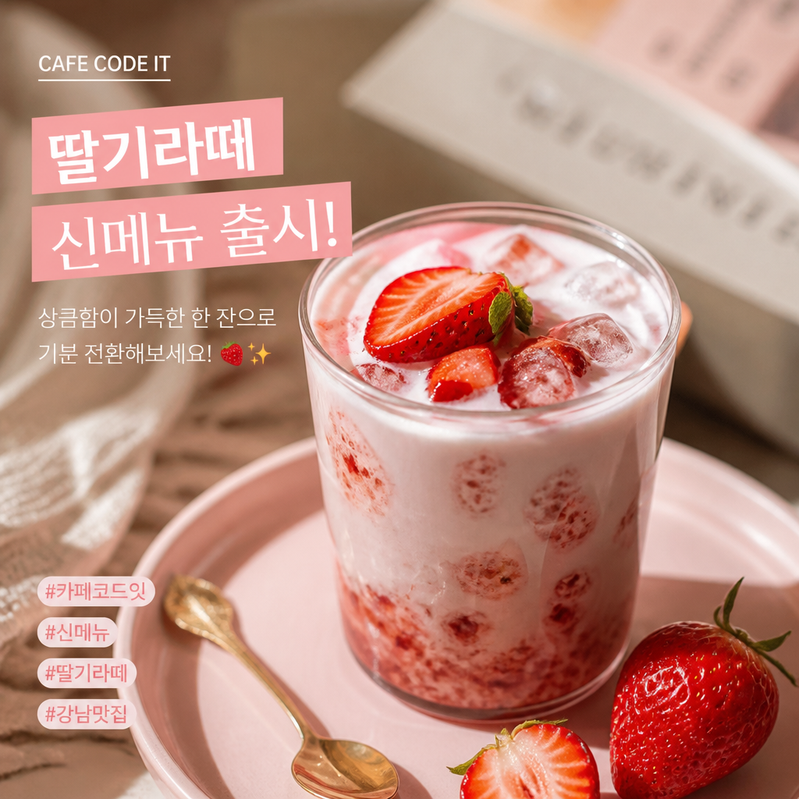

# Basic Model  최종보고서

## 목차

1. Introduction - 소개
2. Method - 시스템 설계와 구현
3. Experiment Setup - 실험 및 평가 환경
4. Results - 측정 결과
5. Discussion - 결과 해석과 한계
6. Conclusion - 결론

## Abstract - 초록

 본 보고서는 소상공인 대상 광고 콘텐츠 생성 플랫폼의 두 챗봇 중 기본 챗봇 모듈의 모듈의 개발·검증·평가 과정을 기록한다. LangGraph 기반 15개 노드 파이프라인(보안 검증 → 질문 분석 → 컨텍스트 수집 → 카피 생성 → 랭킹 → 규제 검증 → 이미지 생성 → 이미지 검수 → 채널 리포맷 → 출력 검증 → 자가 점검)을 설계 및 구현 했다. 

 노드 단위 테스트, 그래프 전체 통합 테스트, 서비스 계약 테스트를 통해 기능적 정확성을 검증했다. 이 과정에서 카피 생성 모델은 Groq llama-3.3-70b-versatile에서 다국어 오염과 추가 정보 필드 무시 문제가 발견되어 OpenAI gpt-4o-mini로 교체 했으며, 이미지 생성 모델은 gpt-image-1의 한글 텍스트 깨짐 문제를 해결하기 위해 PIL 합성 방식을 거쳐 최종적으로 gpt-image-2로 정착하는 반복 검증을 거쳤다. 평가 신뢰도 확보를 위해 LLM Judge 재현성을 사전 검증했고, CLIP Score 채점 시 한글 카피 대신 영문 캡션을 사용해야 정합성 판별력이 유지됨을 확인했다. 

 이 검증된 방법론을 바탕으로 골든 데이터셋 B-60문항에 대해 텍스트 카피 생성 프롬프트를 baseline부터 7차까지 반복 튜닝했으며, 6차 개선안을 최종 선택했다. 인스타그램·배너 이미지 생성 프롬프트는 baseline부터 7차(및 배너 세부사항 반영 2회)까지 총 10라운드에 걸쳐 튜닝했으며, 7차 개선안을 최종 선택했다.

 다만 두 트랙 모두 프롬프트 텍스트 지시만으로는 LLM/이미지 생성 모델의 특정 행동을 완벽히 통제하기 어렵다는 동일한 한계를 반복적으로 확인했고, 이에 대한 원인 분석과 남은 과제를 결론에서 함께 정리한다.

## 1. Introduction - 소개

 본 프로젝트가 만드는 서비스는 소상공인을 위한 통합 광고 플랫폼으로, 상권을 분석해 전략을 제안하는 컨설턴트 챗봇과 광고 문구와 이미지를 생성하는 기본 챗봇 두축으로 구성된다. 이 중 기본 챗봇은 사용자의 요청을 받아 톤이 다른 광고 카피 3안과 그에 대응하는 광고 이미지를 배너·인스타그램 플랫폼에 맞춰 생성해 반환하는 것이 핵심 기능이다. 

 본 보고서는 기본 챗봇 모델 개발 담당자가 수행한 작업을 아래 순서로 기록한다. 먼저 LangGraph로 설계한 파이프라인 구조와, 이를 노드 단위·파이프라인 전체 단위로 검증한 테스트 결과를 다룬다. 다음으로 정량 평가를 신뢰성 있게 수행하기 위해 선행된 LLM Judge 채점의 재현성과 CLIP 이미지 평가 지표의 유효성을 검증 결과를 다룬 뒤 본 평가의 측정 조건을 설명한다. 이어서 텍스트 카피 생성 프롬프트와 인스타그램·배너 이미지 생성 프롬프트를 각각 여러 라운드에 걸쳐 튜닝한 정량 결과를 제시한다. 마지막으로 전체 작업에서 반복적으로 관찰된 패턴과 남은 과제를 정리하며 마친다. 

## 2. Method - 시스템 설계와 구현

### 2.1 LanGraph 파이프라인 구조

 기봇 챗봇은 LangGraph 기반의 상태 그래프 파이프라인을 채택하여 구축했다. 이 방식은 파이프라인의 각 단계를 노드로 정의하고 단계 간의 흐름을 조건부 엣지로 연결하여 제어한다. 이를 통해 챗봇의 핵심 로직인 검증 게이트의 판단 흐름과 규제 위반 시 발생하는 재시도 루프 구조를 그래프 아키텍처 내에 명시적으로 표현하고 안정적으로 제어할 수 있다. 

 기본 챗봇의 전체 흐름은 아래와 같이 크게 네 구간으로 나뉜다. 

1. 입력 단계 - 입력 검증(security_input) 후 질문 분석(question_analysis)에서 정보 충분성 판정을 하고, 정보가 부족하면 재질문(reask)으로 종료한다. 
2. 컨텍스트 수집 단계 - 채널 확정(channel) 후 상권 요약(market_for_copy), 트렌드 요약(trend_for_copy), 벤치마크 요약(benchmark), 계절정보 힌트(seasonality_for_copy)를 순서대로 채운다.
3. 생성 및 검증 단계 - 카피 생성(copy_gen) → 랭킹(ranking, LLM Judge) → 규제 검증(regulation)을 거치며, 규제 위반 시 재시도 상한(2회) 내에서 카피 생성(copy_gen)으로 되돌아가는 루프가 있다. 이후 이미지 생성(image_gen) → 이미지 검수(image_review)에서도 디코딩 전부 실패 시 재시도 상한(2회) 내에서 카피 생성(copy_gen)으로 되돌아가는 루프가 있다. 
4. 출력 단계 - 채널 리포맷(channel_format)으로 서비스 응답 형태를 조립하고, 출력 검증(security_output) → 최종 검증(self_check)을 통과하면 그래프가 종료된다. 각 검증 게이트(security_input, security_output, self_check)는 위반 시 즉시 종료로 빠지는 별도 경로를 가진다. 



### 2.2 노드 단위 구현 및 검증

 15개 노드 각각에 대해 pytest 기반 단위 테스트를 진행했으며, 외부 의존성(LLM 호출, 상권/트렌드 API, 이미지 생성, CLIP 채점, 벤치마크 검색)은 전부 목업으로 대체해 결정론적으로 실행되도록 했다. 

 팀 공통 원칙으로, 다른 담당자가 의존하는 함수는 목업 반환값으로 먼저 커밋해 인터페이스 계약을 먼저 고정한 뒤 내부 구현을 채워 넣는 방식이다. 본 모듈의 노드 단위 테스트 다수가 이 원칙에 따라 외부 의존성을 목업으로 대체해 결정론적으로 실행된다.

 노드별 역할은 다음과 같다. 

| 노드 | 역할 |
| --- | --- |
| security_input_node | 입력 문구에 대한 보안 검증 |
| question_analysis_node | 질문 재작성, 정보 충분성 판단, 트렌드 검색용 키워드 추출 |
| channel_node | 요청 플랫폼 값 검증 및 정규화(instagram/xbanner) |
| market_for_copy | 위치·업종 기준 상권 데이터 조회 후 요약 문장 생성 |
| trend_for_copy | 키워드 기준 검색 트렌드 조회 후 요약 문장 생성 |
| benchmark | 업종 벤치마크 카피 예시 검색(임베딩+FAISS) |
| seasonality_for_copy | 요청 시점 기준 계절성 힌트 계산 |
| copy_gen | 컨텍스트·규제 힌트를 반영해 광고 카피 3안 생성 |
| ranking | LLM Judge로 카피 후보 채점 후 점수순 정렬 |
| regulation | 규제 기준으로 카피 검수, 위반 카피는 실패 슬롯으로 치환 |
| image_gen | 카피별 광고 이미지 생성 및 CLIP 채점용 영문 캡션 생성 |
| image_review | 생성 이미지 디코딩 및 CLIP 적합도 점수 기록 |
| channel_format | 최종 결과를 서비스 응답 형식으로 조립 |
| security_output | 생성된 카피별 출력 보안 검사 |
| self_check | 최종 응답이 요청 맥락에 부합하는지 자가 점검 |

#### 2.2.1 **security_input_node**

 파이프라인의 첫 번째 노드로, 질문 문구에 대한 보안 검증(불법 품목, 프롬프트 인젝션 패턴 탐지)을 수행한다. 

- 주요 동작 프로세스
    1. 보안 검증 및 판정 - 입력된 질문을 보안 검증 함수(check_input)에 전달하여 판정을 받는다. 
    2. 상태 반영 및 사유 기록- 판정 결과를 상태에 동기화하며, 차단 판정 시에는 즉시 상태를 ‘차단’으로 전환하고 해당 사유를 기록한다. 
    3. 라우팅- 검증 결과에 따라 차단시에는 즉시 종료 경로로 분기하고, 통과시에는 다음 단계인 질문 분석노드로 라우팅한다. 
- 핵심 기능 검증
    
    
    | 시나리오 | 확인 내용 |
    | --- | --- |
    | 정상 통과 | status가 정상을 유지하는지 |
    | 차단 판정 | status와 사유가 정확히 기록되는지 |

#### **2.2.2 question_analysis_node**

 보안 검증 통과 후 실행되며, 질문을 카피 생성에 쓰기 좋게 재작성하고 정보 충분 여부를 판단하며 트렌드 조회용 키워드를 추출한다.

- 주요 동작 프로세스
    1. 질문 분석 - 질문·가게 정보·추가 정보를 묶어 LLM을 호출해 재작성된 질문, 정보 충분 여부, 키워드를 받는다.
    2. 정보 충분성 판단 - 정보가 부족하면 상태를 되묻기(reask)로 전환하고 사유를 기록한다.
    3. 컨텍스트 갱신 - 정보가 충분하면 질문을 재작성된 값으로 교체하고 키워드를 반영한다. 키워드가 없으면 재작성된 질문으로 대체한다. 
    4. 라우팅 - 차단·오류 시 즉시 종료 경로로, 아니면 다음 단계인 채널 노드로 라우팅한다.
- 핵심 기능 검증
    
    
    | 시나리오 | 확인 내용 |
    | --- | --- |
    | 정보 충분 | status가 정상 처리되고 질문이 재작성된 값으로 교체되는지 |
    | 정보 부족(되묻기) | status가 차단으로 전환되고 되묻기 사유·메시지가 기록되는지 |
    | extra로 보완되어 충분 판정 | 보완된 정보로 재판정되어 정상 처리되는지 |
    | LLM 호출 실패 | status가 오류로 전환되고 분류된 사유가 기록되는지 |
    | keyword 미제공 | keyword가 재작성된 질문 값으로 폴백되는지 |

#### **2.2.3 channel_node**

 질문 분석 통과 후 실행되며, 요청된 플랫폼 값을 검증 및 정규화한다. 지원하지 않는 값은 기본값 instagram으로 대체한다. 

- 주요 동작 프로세스
    1. 값 정규화 - platform 값을 소문자로 변환한다.
    2. 폴백 매핑 - 지원 종료된 값(banner→xbanner)이면 매핑값으로 치환한다.
    3. 기본값 대체 - 최종 값이 지원 플랫폼(instagram, xbanner) 목록에 없으면 instagram으로 대체한다.
- 핵심 기능 검증
    
    
    | 시나리오 | 확인 내용 |
    | --- | --- |
    | 유효값(소문자) | 값이 그대로 인식되는지 |
    | 유효값(대문자) | 값이 정규화되는지 |
    | 미지원 값 | 기본값(instagram)으로 대체되는지 |
    | 빈 값 | 기본값으로 대체되는지 |
    | 키 자체 없음 | 기본값으로 대체되는지 |

#### 2.2.4 **market_for_copy**

 채널 확정 통과 후 실행되며, 가게 위치·업종 기준으로 상권 데이터를 조회해 "동일 업종 경쟁 매장 수·거리" 요약 문장을 만든다.

- 주요 동작 프로세스
    1. 상권 조회 - 위치와 업종 정보로 상권 데이터를 조회한다.
    2. 요약 문장 생성 - 동일 업종 매장 수·최근접 거리 여부에 따라 매장 존재/0곳/업종 비교 불가 세 가지 문장 패턴 중 하나로 요약한다.
    3. 실패 처리 - 조회에 실패하면 상권 정보를 비워두되 기존 컨텍스트의 다른 값은 그대로 보존한다.
- 핵심 기능 검증
    
    
    | 시나리오 | 확인 내용 |
    | --- | --- |
    | 동일 업종 매장 존재 | 요약 문장이 정확히 조립되는지 |
    | 업종 정보 없는 가게 | 업종 비교 없이 폴백 문구로 처리되는지 |
    | 동일 업종 매장 0곳 | 경쟁 매장 없음 문구로 구분되는지 |
    | 상권 조회 실패 | 기존 컨텍스트 값이 보존되는지 |

#### 2.2.5 **trend_for_copy**

 상권 요약 통과 후 실행되며, 질문 분석 단계에서 추출한 키워드로 검색 트렌드(연관 검색어)를 조회해 요약 문장을 만든다.

- 주요 동작 프로세스
    1. 키워드 확인 - keyword가 없으면 트렌드 조회 자체를 생략한다.
    2. 트렌드 조회 - keyword가 있으면 검색 트렌드를 조회한다.
    3. 요약 문장 생성 - 조회 결과가 있으면 상승/하락 기본 문장을 만들고, 연관 검색어가 있으면 절을 덧붙인다.
- 핵심 기능 검증
    
    
    | 시나리오 | 확인 내용 |
    | --- | --- |
    | 연관 검색어 존재 | 문장에 연관 검색어 절이 포함되는지 |
    | 연관 검색어 없음 | 절이 생략되는지 |
    | 트렌드 조회 실패 | 기존 컨텍스트 값이 보존되는지 |
    | keyword 없음 | API 호출이 스킵되는지 |

#### 2.2.6 **benchmark_node**

 트렌드 요약 통과 후 실행되며, 업종 기준 벡터 검색으로 업종 벤치마크 카피 예시를 찾아 카피 생성 참고 자료로 제공한다. 현재는 목업 데이터만 인덱싱돼 있어 실질적으로는 미가동 상태다.

- 주요 동작 프로세스
    1. 검색 쿼리 결정 - 업종 정보가 있으면 업종명, 없으면 질문 원문으로 검색한다.
    2. 벡터 검색 - 임베딩 기반으로 유사한 벤치마크 카피를 최대 3건 검색한다.
    3. 예외 처리 - 검색 중 예외가 발생해도 그래프를 막지 않고 빈 결과로 흡수한다.
    4. 요약 문장 생성 - 검색 결과가 있으면 카피 예시를 이어붙여 문장으로 만들고, 없으면 비워둔다.
- 핵심 기능 검증
    
    
    | 시나리오 | 확인 내용 |
    | --- | --- |
    | 검색 결과 존재 | 벤치마크 문장으로 병합되는지 |
    | 검색 결과 없음 | 값이 비워지는지 |
    | 업종 정보 없음 | 질문 원문으로 폴백해 검색되는지 |
    | 기존 컨텍스트 보존 | 다른 컨텍스트 값이 유지되는지 |
    | 검색 실패 | 예외 없이 값이 비워지는지 |

#### 2.2.7 **seasonality_for_copy**

 벤치마크 조회 통과 후 실행되며, 요청 시점 기준 계절성 힌트를 계산해 카피의 톤·소재 참고용으로 제공한다.

- 주요 동작 프로세스
    1. 계절성 계산 - 기준일로 계절·달력 구간을 계산한다.
    2. 컨텍스트 반영 - 계산 결과를 그대로 컨텍스트에 저장한다.
- 핵심 기능 검증
    
    
    | 시나리오 | 확인 내용 |
    | --- | --- |
    | 계절성 정보 반영 | 계산된 정보가 정확히 반영되고 기존 값이 보존되는지 |

#### 2.2.8 **copy_gen_node**

 계절성 반영 통과 후 실행되며, 수집된 컨텍스트(상권·트렌드·벤치마크·계절성)와 직전 규제 검수 힌트를 반영해 LLM으로 톤이 다른 광고 카피 3안을 생성한다. 컨설턴트 챗봇에서 연계된 요청이면 컨설턴트의 전략·근거도 함께 반영한다.

- 주요 동작 프로세스
    1. 요청 구성 - 질문·플랫폼·가게 정보·수집된 컨텍스트를 하나의 요청으로 묶는다.
    2. 회피 힌트 반영 - 직전 단계에서 규제 위반·경고가 있었다면 해당 사유와 대안을 프롬프트에 포함시켜 같은 표현을 피하도록 유도한다.
    3. 컨설턴트 연계 반영 - 컨설턴트 챗봇에서 넘어온 전략·근거가 있으면 프롬프트에 추가하고, 출처 정보도 최종 응답에 병합한다.
    4. 카피 생성 - LLM을 호출해 카피 3안을 받는다. 응답이 3개 미만이면 남은 자리를 생성 실패로 채운다.
    5. 재시도 처리 - 3안이 전부 실패하면 재시도 횟수를 늘리고, 상한(2회)에 도달하면 상태를 오류로 전환한다.
    6. 라우팅 - 오류면 즉시 종료, 재시도 여지가 있으면 카피 생성 재진입, 하나라도 성공하면 다음 단계인 랭킹 노드로 라우팅한다.
- 핵심 기능 검증
    
    
    | 시나리오 | 확인 내용 |
    | --- | --- |
    | 정상 3안 생성 | 카피 3안이 모두 채워지는지 |
    | 응답 개수 부족 | 남은 슬롯이 생성 실패로 처리되는지 |
    | 전부 실패(재시도 한도 미만) | 재시도 횟수만 늘고 계속 재시도되는지 |
    | 전부 실패(재시도 한도 도달) | 상태가 오류로 전환되는지 |
    | 규제 차단 힌트 전달 | 직전 차단 사유가 회피 힌트로 프롬프트에 전달되는지 |
    | LLM 호출 실패 | 상태가 오류로 전환되고 분류된 사유가 기록되는지 |
    | 컨설턴트 전략·근거 전달 | 프롬프트에 전략·근거가 반영되는지 |
    | 컨설턴트 출처 병합 | 출처 정보가 최종 응답에 병합되는지 |
    | 컨설턴트 연계 없음 | 관련 필드가 비는지 |
    | 계절성 컨텍스트 포함 | 계절 힌트가 프롬프트에 포함되는지 |

#### 2.2.9 **ranking_node**

 카피 생성 통과 후 실행되며, LLM Judge로 카피 후보를 채점해 점수가 높은 순으로 정렬한다.

- 주요 동작 프로세스
    1. 후보 분리 - 카피가 있는 후보와 생성 실패 슬롯을 나눈다.
    2. 채점 - 유효한 카피만 LLM에 보내 채점을 받는다. 유효 후보가 없으면 채점을 생략한다.
    3. 결과 병합 - 응답에 없거나 범위를 벗어난 인덱스는 무시하고, 언급되지 않은 후보는 원래 순서대로 점수 없이 뒤에 채워 넣어 개수를 보존한다.
    4. 정렬 - 점수순으로 정렬한 유효 후보 뒤에 생성 실패 슬롯을 그대로 붙인다.
- 핵심 기능 검증
    
    
    | 시나리오 | 확인 내용 |
    | --- | --- |
    | 정상 랭킹 | 점수 높은 순으로 정렬되는지 |
    | 생성 실패 후보 동반 | 실패 슬롯이 채점 없이 결과 뒤에 그대로 유지되는지 |
    | 전부 생성 실패 | LLM 호출 자체가 생략되는지 |
    | 응답 인덱스 누락·범위 오류 | 후보 개수가 그대로 보존되는지 |
    | LLM 호출 실패 | 상태가 오류로 전환되고 분류된 사유가 기록되는지 |

#### 2.2.10 **regulation_node**

 랭킹 통과 후 실행되며, 정렬된 카피를 규제 기준으로 검수한다. 위반 카피는 제거하지 않고 그 자리를 실패 슬롯으로 치환한다.

- 주요 동작 프로세스
    1. 개별 검수 - 카피가 있는 항목마다 규제 검사를 수행한다.
    2. 통과 처리 - 통과 판정이 하나라도 있으면 그것만 통과시키고, 나머지(경고·차단)는 그 자리를 실패 슬롯으로 치환한다.
    3. 전체 재시도 판단 - 통과가 하나도 없으면 대표 사유를 정하고 재시도 횟수를 늘린다. 재시도 상한에 도달하면 상태를 차단으로 전환한다.
    4. 라우팅 - 위반이지만 재시도 여지가 있으면 카피 생성으로 되돌아가고, 상한 초과면 즉시 종료, 통과면 다음 단계인 이미지 생성 노드로 라우팅한다.
- 핵심 기능 검증
    
    
    | 시나리오 | 확인 내용 |
    | --- | --- |
    | 전부 통과 | 카피와 실패 슬롯이 그대로 유지되는지 |
    | 차단, 재시도 한도 미만 | 재시도 횟수만 늘고 계속 재시도되는지 |
    | 차단, 재시도 한도 도달 | 상태가 차단으로 전환되는지 |
    | 검사할 카피 자체 없음 | 재시도 한도에 따라 동일하게 처리되는지 |
    | 일부만 차단 | 배열 길이와 순서가 유지되는지 |
    | 내부 판정 정보 미노출 | 최종 결과에 내부 판정 키가 노출되지 않는지 |
    | 중간 항목 차단 | 원래 순위가 유지되는지 |
    | 차단 메시지 빈 문자열 | 기본 문구로 대체되는지 |

#### 2.2.11 **image_gen_node**

 규제 검수 통과 후 실행되며, 통과한 카피마다 광고 이미지를 생성하고 CLIP 채점용 영문 캡션을 함께 만든다.

- 주요 동작 프로세스
    1. 대상 확인 - 카피가 없는 항목(생성 실패 슬롯)은 이미지 생성 없이 건너뛴다.
    2. 정보 추출(xbanner) - 배너 플랫폼이면 질문에서 전화번호·영업시간·행사기간 같은 세부정보를 먼저 추출한다.
    3. 이미지 생성 - 인스타그램은 템플릿(hero_product/character/meme)을 순환 배정해 1회 생성하고, xbanner는 스타일 쌍을 순환 배정해 카피를 상단(소개)·하단(혜택)으로 나눠 각각 생성한 뒤 세로로 합성한다.
    4. 캡션 생성 - 이미지 생성에 성공하면 CLIP 채점용 영문 캡션을 별도로 생성한다.
    5. 실패 처리 - 이미지 생성이 실패하면 해당 항목만 개별적으로 오류를 기록하고 나머지는 계속 진행한다.
- 핵심 기능 검증
    
    
    | 시나리오 | 확인 내용 |
    | --- | --- |
    | 정상 3건 생성 | 3건 모두 이미지가 채워지는지 |
    | 카피 없는 항목 | 생성 없이 건너뛰는지 |
    | 프롬프트 내용 검증 | 프롬프트에 업종·카피 내용이 포함되는지 |
    | 일부 생성 실패 | 나머지 항목은 계속 처리되는지 |
    | instagram 사이즈·스타일 | 플랫폼에 맞는 사이즈·템플릿이 적용되는지 |
    | xbanner 상하단 스티칭 | 상하단이 각각 생성되어 합쳐지는지 |
    | xbanner 생성 실패 | 오류가 개별 기록되는지 |
    | platform 누락 | 기본값(instagram)으로 처리되는지 |

#### 2.2.12 **image_review_node**

 이미지 생성 통과 후 실행되며, 생성된 이미지를 디코딩해 CLIP 적합도 점수를 기록한다. MVP 정책상 이미지가 없거나 점수가 낮아도 차단하지 않고, 디코딩이 전부 실패한 경우만 재생성 대상으로 본다.

- 주요 동작 프로세스
    1. 대상 확인 - 카피가 없거나 이미지가 없는 항목은 차단 없이 그대로 통과시킨다.
    2. 채점 텍스트 결정 - 영문 캡션을 우선 사용하고, 없으면 한글 프롬프트, 그마저 없으면 카피 원문을 사용한다.
    3. 점수 산출 - 이미지를 디코딩해 CLIP 점수를 계산한다(디코딩 실패는 해당 항목만 개별 처리).
    4. 재생성 판단 - 카피가 있는 항목이 전부 디코딩에 실패하면 재생성 대상으로 판정하고, 하나라도 성공하면 통과로 처리한다.
- 핵심 기능 검증
    
    
    | 시나리오 | 확인 내용 |
    | --- | --- |
    | 이미지 없음 | 차단하지 않고 통과되는지 |
    | 전부 디코딩 실패 | 재생성 대상으로 판정되는지 |
    | 일부만 디코딩 실패 | 차단하지 않는지 |
    | 채점 텍스트 인덱스 매칭 | 같은 인덱스의 항목과 정확히 매칭되는지 |
    | 중간 항목 카피 없음 | 나머지 항목이 올바르게 매칭되는지 |
    | 영문 캡션 우선순위 | 한글 프롬프트보다 영문 캡션이 우선 사용되는지 |

#### 2.2.13 **channel_format_node**

 이미지 검수 통과 후 실행되며, 최종 카피·이미지 결과를 서비스 응답 형식으로 정리하고 사용된 컨텍스트 출처와 임시 제목을 구성한다.

- 주요 동작 프로세스
    1. 결과 정리 - 각 항목을 카피·이미지 기본 필드만 남기고 정리하며, 실패한 항목에만 오류 정보를 붙인다.
    2. 출처 라벨링 - 컨텍스트에 값이 채워진 항목(상권·트렌드·벤치마크)마다 출처 라벨을 추가한다.
    3. 제목 생성 - 질문을 30자로 잘라 제목으로 쓰고, 질문이 비어 있으면 가게명 기반 문구로 대체한다.
- 핵심 기능 검증
    
    
    | 시나리오 | 확인 내용 |
    | --- | --- |
    | 전체 컨텍스트 존재+제목 절단 | 출처 라벨과 제목 길이 제한이 정확히 적용되는지 |
    | 컨텍스트 전부 없음 | 출처가 빈 값으로 처리되는지 |
    | 실패 항목만 오류 부착 | 성공 항목엔 오류 정보가 없고 실패 항목에만 붙는지 |
    | 필드 누락 | 오류 없이 기본값으로 처리되는지 |

#### 2.2.14 **security_output_node**

 응답 조립 통과 후 실행되며, 카피마다 개별적으로 출력 보안 검사(민감정보·금칙어 등)를 수행한다. 차단이면 상태를 전환하고, 경고면 해당 카피만 마스킹 처리한다.

- 주요 동작 프로세스
    1. 개별 검사 - 카피가 있는 항목마다 출력 보안 검사를 개별 호출한다.
    2. 차단 처리 - 차단 판정이 하나라도 있으면 즉시 상태를 차단으로 전환하고 결과를 비운다.
    3. 마스킹 처리 - 차단은 없고 경고만 있으면 해당 카피만 마스킹된 텍스트로 교체한다.
- 핵심 기능 검증
    
    
    | 시나리오 | 확인 내용 |
    | --- | --- |
    | 정상 통과 | 카피별로 개별 검사가 이루어지는지 |
    | 차단 | 상태와 사유가 정확히 기록되는지 |
    | 경고(마스킹) | 해당 카피만 마스킹 처리되는지 |

#### 2.2.15 **self_check_node**

 그래프의 마지막 노드로, 최종 조립된 응답이 요청 맥락에 부합하는지 자가 점검한다. 근거 부족 등으로 반려되면 응답을 내보내지 않고 차단하며, 카피 개수 부족·길이 미달 같은 경미한 품질 경고는 차단 없이 로그만 남긴다.

- 주요 동작 프로세스
    1. 자가 점검 - 최종 응답과 수집된 컨텍스트를 비교해 부합 여부를 판정한다.
    2. 경고 처리 - 경고 판정이면 차단하지 않고 로그만 남긴다.
    3. 반려 처리 - 반려 판정이면 재시도 횟수를 늘리고 상태를 차단으로 전환한다.
    4. 종료 - 반려가 아니면 그래프를 정상 종료한다.
- 핵심 기능 검증
    
    
    | 시나리오 | 확인 내용 |
    | --- | --- |
    | 정상 통과 | 상태가 정상 유지되는지 |
    | 반려(reject) | 상태가 차단으로 전환되고 사유가 기록되는지 |
    | 경고(warn) | 차단 없이 로그만 남는지 |
    | 반려 반복 시 재시도 횟수 누적 | 재시도 횟수가 정확히 누적되는지 |

### 2.3 통합테스트 (test_pipeline)

 노드 단위 테스트를 넘어, 그래프 전체를 실제로 실행해 최종 서비스 응답 형태까지 검증하는 End-to-End 테스트다.  LLM 호출, 상권·트렌드 조회, 이미지 생성, CLIP 채점, 벤치마크 검색 등 외부 의존성은 전부 목업으로 대체해 네트워크나 무거운 모델 로드 없이 빠르고 결정론적으로 실행되도록 했다. 아래의 5개 케이스를 모두 통과했다. 

- 핵심 기능 검증
    
    
    | 시나리오 | 확인 내용 |
    | --- | --- |
    | 배너 채널 요청 | 정상 요청이 3개의 제안으로 응답되는지 |
    | 정보 부족 질문 | 정보가 부족하면 되묻기로 응답되는지 |
    | 사전 폼 정보 충족 | 폼 정보가 충분하면 바로 정상 응답되는지 |
    | 되물음 답변 라운드트립 | 되묻기에 대한 답변으로 정보가 보완되면 정상 응답되는지 |
    | self_check 반려 | 자가 점검에서 반려되면 재시도 없이 즉시 차단되는지 |

### 2.4 계약 테스트 (test_contract)

 서비스로 나가는 최종 응답의 계약을 지키는지 검증한다. LLM 호출, 상권·트렌드 조회, 이미지 생성, CLIP 채점, 벤치마크 검색 등 외부 의존성은 전부 목업으로 대체해 네트워크나 무거운 모델 로드 없이 빠르고 결정론적으로 실행되도록 했다. 아래 34개 테스트 케이스를 모두 통과했다. 

- 핵심 기능 검증
    
    
    | 시나리오 | 확인 내용 |
    | --- | --- |
    | status 키가 없는 경우 | 오류로 처리되지 않고 정상 응답이 만들어지는지 |
    | sources가 없는 경우 | 빈 리스트로 처리되는지(None이 아닌지) |
    | sources가 있는 경우 | 값이 그대로 유지되는지 |
    | result가 비어 있는 경우 | 정상에서 오류로 강등되는지 |
    | 내부 판정 정보 미노출 | validation·issues·재시도 횟수·deadline 등 내부 필드가 응답에 노출되지 않는지 |
    | result 내부 값의 최상위 상태 덮어쓰기 방지 | 최상위 status가 유지되는지 |
    | 차단 사유 전달 | 차단 액션·사유·메시지가 그대로 전달되는지 |
    | issues가 비어 있는 차단 | 액션·사유·메시지가 비지 않고 채워지는지 |
    | 정의되지 않은 액션 값 | 기본값(차단)으로 대체되는지 |
    | 정의된 액션 값(3종) | 입력값이 그대로 유지되는지 |
    | 내부 실패 사유 매핑 | 카피 생성 실패 사유가 서비스 계약상의 사유(provider_error)로 매핑되는지 |
    | 정의되지 않은 내부 사유 | 기본값(unknown)으로 대체되는지 |
    | 알 수 없는 상태값 | 차단이 아닌 오류로 처리되는지 |
    | 모든 시나리오 형태 보장 | 상태값에 따라 필수 필드(사유·메시지 등)가 항상 채워지는지 |
    | 시나리오 | 확인 내용 |
    | 예외 전파 방지 | 그래프 내부에서 오류가 나도 run()이 예외를 던지지 않고 정상 형태로 응답하는지 |
    | 정상 경로 | 정상 요청이 3개의 제안과 함께 응답되는지 |
    | 필수 필드 누락 | 필수 정보가 없으면 그래프 호출 없이 즉시 오류로 처리되는지(불필요한 호출 비용 방지) |
    | 그래프 재컴파일 방지 | 동일 그래프로 여러 번 요청해도 컴파일이 1회만 일어나는지 |
    | 컨텍스트 전달 | 컨설턴트 연계 정보와 처리 기한이 그래프까지 정확히 전달되는지 |

## 3. Experiment Setup - 실험 및 평가 환경

### 3.1 텍스트 모델 선정 과정

 카피 생성에 사용할 LLM을 고르기 위해 배너 채널 요청, 정보 부족 질문, 사전 폼 정보 충족, 되물음 답변 라운드 트립 4가지 시나리오로 두 모델을 비교했다. 

 1차로 사용한 Groq llama-3.3-70b-versatile에서는 두 가지 문제가 발견됐다. 첫째, "한국어로만 작성한다"는 지침이 명시돼 있음에도 카피에 일본어, 베트남어 등의 표기가 섞이는 다국어 오염이 반복됐다. 프롬프트 튜닝으로는 해결되지 않아 모델 자체의 다국어 안정성 문제로 판단했다. 둘째, 사전 폼 정보(목적, 가격, 타켓 연령, 강점)가 전부 채워진 경우에도 정보가 부족하다고 판단해 되묻는 문제가 있었다. 또한 사전 폼 입력은 선택사항이기 때문에 정보가 채워지지 않아도 해당 사항에 관한 재질문이 발생하면 안되는데, 그러한 경우에도 정보가 부족하다고 판단해 되묻는 문제가 발생했다. 

 두 문제를 해결하기 위해 모델을 OpenAI gpt-4o-mini로 교체해 재테스트했다. 다국어 오염과 사전 폼 정보 필드 무시 문제는 모두 해결되었다. 

| 모델 | 생성된 카피 예시 |
| --- | --- |
| Groq llama-3.3-70b-versatile | '카페 코드잇에서 여름을凉하게! 아이스 아메리카노 신메뉴 출시했습니다 #카페코드잇 #신메뉴 #여름날씨 🌞☕️' |
| OpenAI gpt-4o-mini	 | '☕️새로운 맛의 향연! 당일 로스팅 원두로 만든 특별한 커피를 만나보세요 #카페코드잇 #신메뉴’ |

### 3.2 이미지 모델 선정 과정

 광고 이미지 생성에 쓸 모델과 텍스트 처리 방식을 정하기 위해, 동일한 카피 3안을 대상으로 4단계에 걸쳐 반복 검증했다.

1. baseline (gpt-image-1)
    
    
    
    
    
    
    
    
    별도 텍스트 처리 없이 그대로 생성했다. 이미지 3장 전부에 한글 배너 문구가 직접 그려졌는데, 텍스트가 깨져서 생성된다. 
    
2. 텍스트·로고·브랜드명 생성 금지 지시 추가 (gpt-image-1)
    
    
    
    
    
    
    
    
    프롬프트에 텍스트·로고·브랜드명을 생성하지 말라는 지시를 추가했다. 그 결과 3장 중 2장은 사진 자체는 깨끗해졌지만 컵에 영문 브랜드명이 남았고, 1장은 여전히 한글 문구가 깨진 채 남아있었다. 프롬프트 지시만으로는 텍스트를 완전히 배제할 수 없다는 한계를 확인했고 광고 이미지에 텍스트를 아예 제외시킬 수 없다는 문제가 있다. 
    
3. 텍스트 생성 제외 + PIL 합성 (gpt-image-1)
    
    
    
    
    
    
    
    
    프롬프트에서 텍스트 생성 자체를 완전히 제외하고, PIL로 Noto Sans KR 폰트를 이용해 짧은 문구를 반투명 배너와 함께 별도로 합성하는 방식으로 전환했다. 그러나 합성한 문구가 잘리고 이미지와 어울리지 않는 새로운 문제가 나타났다.
    
4. 모델 교체 + PIL 합성 제외 (gpt-image-2)
    
    
    
    
    
    
    
    
    모델을 gpt-image-2로 교체하고, 프롬프트에서 텍스트 생성 제외 지시와 PIL 별도 합성 방식을 모두 걷어냈다. 텍스트가 깨지거나 잘리지 않는 안정적인 결과물을 얻어 최종 방식으로 채택했다.
    

### 3.3 배너 생성 프로토타이핑

 세로형 스탠스 배너 이미지는 처음에 가로형으로 제작하려 했으나, 이미지 생성 모델이 지원하는 최대 종횡비가 2:3이어서 한장으로는 가로로 긴 배너 전체를 담을 수 없었다. 이미지 두장을 생성해 이어 붙이는 경우 가로형은 좌우 두 장을 이어 붙여야 하는데, 이 경우 이음새 양쪽이 자연스럽게 연결되도록 만들기가 어려웠다. 이 때문에 세로형으로 방향을 전환해, 상단과 하단 두 장을 따로 생성한 뒤 이어붙이는 방식으로 프로토타이핑했다. 주요 반복 개발 이력은 다음과 같다.

```
1. 가로형 배너의 비율을 1536×1024로 조정한다. 
```


```
2. 왼쪽 배경/오른쪽 피사체로 두장의 이미지를 생성하여 이어 붙인다. 
```


```
3. 스타일을 사진에서 그래픽 포스터로 변경하고 1536×1024 이미지 한장을 생성하여 가장자리를 늘린다. 
```


```
4. 이미지 한 장을 생성하고 아웃페인팅 API 호출 방식으로 가장자리를 채운다. 
```


```
4. 이미지 한 장을 생성하고 아웃페인팅 API 호출 방식으로 가장자리를 채운다. 
```


```
5. 상단과 하단 이미지 두장을 생성하여 합성한다. 주어지지 않은 정보는 포함하지 않고, 하단 이미지에 관련 없는 타 브랜드 광고가 생성되지 않도록 지시한다. 
```


### 3.4 LLM Judge 재현성 검증

 사람이 채점  기준을 일일이 만들기 어려운 생성형 결과를 LLM에게 rubric 기준으로 채점시키는 방법론이다. 다만 이 방법은 채점 자체의 재현성이 담보되어야 신뢰할 수 있으므로, 본 프로젝트에서는 본 평가 이전에 재현성을 별도로 검증했다. 

 LLM Judge가 같은 응답을 여러 번 채점해도 점수가 흔들리지 않는지를 본 평가 전에 확인했다. Judge가 불안정하면 프롬프트 튜닝 전후 점수 차이가 실제 개선인지 judge의 노이즈인지 구분할 수 없기 때문에, 문항 5개를 뽑아 응답을 1회 생성 후 고정하고 같은 응답을 judge에게 3회 채점시켰다.

| 항목 | 값 | 기준 |
| --- | --- | --- |
| 판정 결과 | 통과 | — |
| 총 세션 수 | 3회 | — |
| 총 응답 수 | 5건 | — |
| 측정 셀 | 20개 (응답 5 × rubric 4) | — |
| 흔들린 비율 | 5% | — |
| ① 편차 2 이상 셀 | 0건 | 0건이어야 통과 |
| ② 문항 평균 편차 | 0건 초과 | 0건이어야 통과 |
| ③ 60문항 환산 SD | 0.0072 | 0.05 이하 |
| 최소 검출 가능 효과 | ±0.03 | — |
| judge 프롬프트 해시 | d1880aabb6f9 | 본 평가와 동일해야 함 |

### 3.5 CLIP 지표 검증

 이미지와 텍스트를 같은 임베딩 공간에 투영해 코사인 유사도로 정합성을 재는 방법이다. 다국어 지원이 약한 사전학습 모델의 한계를 프로젝트 내에서 실측으로 확인하고 우회 방법을 채택했다. 

 CLIP Score는 생성 이미지가 문구 내용과 실제로 맞아떨어지는지를 재는 지표인데, clip-vit-base-patch32는 영어 전용 모델이라 한국어 카피를 그대로 채점하면 점수가 무작위에 가까운 문제가 있었다. 이에 이미지 생성용 프롬프트와 별도로 CLIP 채점 전용 영문 캡션을 추가 생성하도록 수정하고, 5개 업종·채널 쌍으로 한글 카피 기준과 영문 캡션 기준의 정답-오답 점수 차이를 비교해 검증했다.

| 업종/채널 | 생성된 카피 | 영문 캡션 | 정답 점수(한글) | 오답 평균(한글) | 차이(한글) | 정답 점수(영어) | 오답 평균(영어) | 차이(영문) |
| --- | --- | --- | --- | --- | --- | --- | --- | --- |
| 카페
/instagram | ☕️ 여름을 시원하게! 코드잇 카페의 아이스 아메리카노 신메뉴로 더위를 날려보세요! #코드잇카페 #아이스아메리카노 #여름음료 #시원한한잔 #강남카페 | "Cool off this summer with the refreshing new iced Americano at CodeIt Cafe!" | 0.3200 | 0.2566 | +0.0634 | 0.3970 | 0.2319 | **+0.1651** |
| 베이커리
/banner | 매일 아침, 갓 구운 빵의 향연! 코드잇 베이커리에서 만나요! | "Experience the delightful aroma of freshly baked bread every morning at Codeit Bakery!" | 0.3023 | 0.2766 | +0.0256 | 0.3538 | 0.2180 | **+0.1358** |
| 헬스장
/instagram | 💪 전문 트레이너와 함께하는 PT 프로그램! 나만의 운동 목표를 이루어보세요! 🏋️‍♂️ #코드잇헬스장 #PT프로그램 #운동목표 #강남헬스 #건강한삶 | "Achieve your fitness goals with personalized training programs led by expert trainers at our gym!" | 0.3642 | 0.2728 | +0.0914 | 0.2879 | 0.1849 | **+0.1030** |
| 꽃집
/instagram | 🌸 특별한 날, 특별한 꽃다발! 코드잇 꽃집에서 사랑을 전해보세요. 💐 #꽃다발 #선물 #코드잇꽃집 | "Send love with a special bouquet from CodeIt Florist for those unforgettable moments!" | 0.3068 | 0.2600 | +0.0468 | 0.3360 | 0.2042 | **+0.1318** |
| 세탁소
/banner | 찌든 얼룩, 코드잇 세탁소에서 깨끗하게! | "Say goodbye to stubborn stains with Codeit Laundry!" | 	0.2725 | 0.2527 | +0.0199 | 0.3592 | 0.2536 | **+0.1056** |
| **평균** | — | — | **0.3131** | 0.2637 | **+0.0494** | **0.3468** | **0.2185** | **+0.1283** |

 5개 업종·채널 쌍 전부에서 영문 캡션 기준 정답-오답 점수 차이(평균 +0.1283, 개별 항목 전부 +0.10 이상)가 한글 기준 차이(평균 +0.0494)보다 뚜렷하게 크게 나타났다. 한글 카피를 그대로 CLIP에 넣으면 정답과 오답의 점수 차이가 흐릿해지는 반면, 영어로 번역해 캡션화하면 이미지-텍스트 정합성을 CLIP이 실제로 구분해낸다는 것을 확인했다. 인스타그램 채널의 해시태그와 이모지가 섞인 실제 스타일 카피를 번역한 캡션으로도 이 구분력이 유지됐다는 점에서, 번역이 채점에 필요한 의미를 훼손 없이 보존한다고 판단한다.

 한계로는 세 가지가 있다. 번역 결과 자체의 정확도는 별도로 검증하지 않았고, 번역을 카피당 1회만 수행해 같은 카피를 여러 번 번역했을 때의 캡션 표현 일관성은 확인하지 않았다. 또한 5쌍은 통계적 유의성을 주장하기엔 적은 표본이며 방향성 확인용이다. 

### 3.6 텍스트 평가 조건

 텍스트 카피 튜닝 라운드는 아래 조건으로 고정하고 측정했다.

| 항목 | 값 |
| --- | --- |
| 대상 문항 | 골든 데이터셋 B-60문항(area=basic), 되묻기 대상 3문항(B-012·B-040·B-057) 제외 시 유효 57문항 |
| 생성 모델 | gpt-4.1-mini (temperature 0.3) |
| 채점 모델 | LLM Judge, gpt-4.1-mini (temperature 0) |
| 채점 항목 | 요청_반영도·구체성·규제_안전성·채널_적합성 (1~5점) |
| 보조 지표 | Faithfulness, Answer Relevance, 계약 준수율, 생성 실패율, 3안 완성률, 응답시간 p50 |

### 3.7 이미지 평가 조건

 이미지·배너 튜닝 라운드는 아래 조건으로 측정했다.

| 항목 | 값 |
| --- | --- |
| 대상 문항 | xbanner 5문항, instagram 10문항, 각 3안 |
| 이미지 모델 | gpt-image-2 |
| 평가 지표 | CLIP Score, Image Rubric(플랫폼별 3~4항목, 1~5점), Moderation(success_rate) |
| Image Rubric 항목 | 브랜드제품정합성, 배너_가독성/인스타피드적합성, 분위기톤일치, 텍스트_정확도 |
| 측정 기간 | baseline~7차, 2026-08-25~08-27 |

## 4. Results - 측정 결과

### 4.1 텍스트 카피 평가 라운드별 튜닝 결과

 골든 데이터셋 B-57문항에 대해 baseline부터 7차까지 8라운드에 걸쳐 측정한 결과는 다음과 같다. 6차가 최종 채택안, 7차는 롤백 처리됐다.

| **라운드** | **LLM Judge평균** | **요청반영도** | **구체성** | **규제_안전성** | **채널_적합성** | **계약준수율** | **생성실패율** | **응답시간p50** |
| --- | --- | --- | --- | --- | --- | --- | --- | --- |
| baseline | 4.66 | 5.00 | 3.86 | 5.00 | 4.77 | 100% | 0% (0/57) | 4.14초 |
| 1차 | 4.88 | 5.00 | 4.66 | 4.98 | 4.89 | 98% | 0% (0/57) | 6.20초 |
| 2차 | 4.83 | 5.00 | 4.43 | 5.00 | 4.89 | 98% | 0% (0/57) | 5.66초 |
| 3차 | 4.73 | 5.00 | 4.09 | 5.00 | 4.84 | 100% | 0% (0/57) | 5.30초 |
| 4차 | 4.61 | 5.00 | 3.72 | 4.98 | 4.72 | 100% | 3.5% (2/57) | 7.33초 |
| 5차 | 4.64 | 5.00 | 3.77 | 5.00 | 4.79 | 100% | 1.8% (1/57) | 7.58초 |
| 6차 | 4.72 | 5.00 | 4.07 | 5.00 | 4.80 | 98% | 5.3% (3/57) | 7.89초 |
| 7차 | 4.67 | 4.98 | 3.97 | 5.00 | 4.74 | 100% | 4.8% (3/62) | 7.52초 |

### 4.2 텍스트 카피 라운드별 주요 변경과 발견

#### 4.2.1 baseline

 baseline에서는 LLM Judge 평균 4.66 중 구체성만 3.86으로 4개 채점 기준 중 유일하게 4점 미만이었다. 15개 문항에서 카피가 가게와 상권 특성을 구체적으로 반영하는 대신 일반적인 홍보 문구에 머무는 경향이 원인으로 지목됐다.

#### 4.2.2 1차 프롬프트 튜닝

 일반론 회피, market, trend, extra 반영, 없는 정보 지어내지 않기, 구체적/일반론 예시를 추가한 "구체성 원칙" 섹션을 신설했다. 구체성이 3.86에서 4.66으로 크게 개선됐다. 계약 준수율은 100%에서 98%로 하락했다. B-029 안1에 "최고의 미용 서비스"라는 표현이 나왔는데, SYSTEM_PROMPT 맨 위에 이미 "'최고', '유일', '1등'... 쓰지 않는다"는 가드가 있었음에도 뚫린 것이다. B-029 안3에는 "가까운 경쟁 매장보다 더 특별한"이라는 market 비교 표현도 남아 있었다. 이 시점엔 market 비교를 금지하는 규정 자체가 아직 없었다. 응답시간도 4.14초에서 6.20초로 늘었다.

#### 4.2.2 2차 프롬프트 튜닝

 market 정보 중 경쟁 매장 수, 거리 등 비교 데이터는 카피에 직접 인용하거나 비교 문구로 쓰지 않는다는 규정을 추가했다. 계약 준수율은 98%로 그대로였다. 위반 지점만 B-029에서 B-049로 옮겨갔다. B-049 안1 "역삼동에서 80m 거리의 맛있는 커피!"는 신설 규정을 정면으로 어기며 market의 실제 거리 수치를 그대로 인용했고, 안2에는 "최고의 맛"이 또 나왔다. 구체성도 4.66에서 4.43으로 하락했다.

#### 4.2.3 3차 프롬프트 튜닝

 "구체성 확보용 정보 반영" 목록에서 market을 아예 제외하고, 비교 금지 문구도 부분 제한에서 전면 배제("절대 언급하지 않는다")로 강화했다. 계약 준수율 100%를 달성해 3라운드 연속 재발하던 "최고"류 위반을 완전히 해결했다. 그러나 구체성이 4.43에서 4.09로 급락했다. 1차 4.66, 2차 4.43, 3차 4.09로 3라운드 연속 하락 추세를 만들었다. B-049에서도 2차와 달리 지역명 언급이 아예 빠졌다.

#### 4.2.4 4차 프롬프트 튜닝

 3차에서 제안된 market 규정 분리는 이번에 반영되지 않았고, 대신 seasonality 힌트를 분위기와 소재 참고용으로만 쓰도록 제한하는 "계절성 원칙" 섹션이 신설됐다. 거의 전 지표가 하락했다. 구체성이 3.72로 baseline(3.86)보다도 낮아졌고, 응답시간도 5.30초에서 7.33초로 늘었다. 신규 후보 실패도 2건 발생했다.

#### 4.2.5 5차 프롬프트 튜닝

 계절 힌트는 톤과 분위기에 반영해도 되지만, trend나 extra 값이 있으면 그 구체적 사실을 대체하지 않도록 함께 반영한다는 문구를 추가했다. 구체성이 3.72에서 3.77로 소폭 반등했지만 여전히 baseline에 못 미쳤다. B-049에서 "역삼동" 언급이 다시 나타났다. 

#### 4.2.6 6차 프롬프트 튜닝 (최종 채택)

 **** '대체 금지' 보호 범위를 trend, extra에서 위치 정보까지 확장했다. 구체성이 4.07로 뚜렷하게 개선됐다. 생성 실패율은 5.3%로 악화됐지만, 원인은 B-007 전체가 API 타임아웃으로 실패한 것으로 프롬프트 내용과 무관한 인프라 이슈였다. 이 라운드를 최종 채택안으로 확정했다.

#### 4.2.7 7차 프롬프트 튜닝

 과장 표현 금지 예시를 3개(최고, 유일, 1등)에서 8개(완벽한, 100% 보장, 절대, 국내 최초, 무한 리필 추가)로 확장하고 "비슷한 결의 표현 전반을 피하라"는 포괄적 지시를 덧붙였다. 목표였던 지표는 전부 하락했다. 구체성은 4.07에서 3.97로 떨어졌다. 예시 목록에 "완벽한"을 명시적으로 추가했음에도 6차 1건에서 7차 2건으로 오히려 늘었다. 계약 준수율과 3안 완성률이 개선된 것처럼 보였지만, 이는 6차에서 타임아웃으로 완전 실패했던 B-007이 이번엔 정상 처리된 덕분일 뿐 프롬프트 변경과는 무관했다. 이에 따라 이번 변경은 롤백해 6차를 최종 채택안으로 확정했다.

#### 4.2.8 실제 산출물 비교

| 문항 | baseline | 6차 |
| --- | --- | --- |
| B-001 (1안) | 신선한 여름 맛, 카페 코드잇에서 만나보세요! 🍹☕️ #여름메뉴 #강남역 #카페코드잇 | "뜨거운 여름, 카페 코드잇의 신메뉴로 더위를 날려보세요! 시원한 음료가 여러분을 기다리고 있어요! ☀️ #신메뉴출시 #여름필수 #강남역카페 #맛있는여름" |
| B-001 (2안) | 여름을 시원하게! ☀️ 카페 코드잇의 신메뉴로 더위를 날려보세요! #여름신메뉴 #카페코드잇 #강남카페 | "여름의 끝자락, 카페 코드잇에서 신메뉴로 시원한 여름을 만끽해보세요! 🍹 #여름신메뉴 #카페코드잇 #강남카페 #시원한음료 #여름맛집" |
| B-001 (3안) | 여름의 맛을 담은 신메뉴가 출시되었습니다! 지금 바로 카페 코드잇으로 오세요! 🌞🍧 #신메뉴 #강남카페 #여름 | "여름의 마지막을 카페 코드잇의 신메뉴와 함께! 시원한 음료로 더위를 잊어보세요! 🌊 #여름신메뉴 #카페코드잇 #강남구 #여름의끝" |

### 4.3 이미지 카피 평가 라운드별 결과

| **라운드** | **대상** | **브랜드제품정합성** | **가독성/적합성** | **분위기톤일치** | **CLIP Score** | **규제문구위반** | **생성시간** |
| --- | --- | --- | --- | --- | --- | --- | --- |
| baseline | 배너 15/인스타 30 | 5.00 / 4.90 | 4.13 / 5.00 | 5.00 / 5.00 | 0.2721 / 0.3144 | - | - |
| 1차 | 배너 15/인스타 30 | 4.96/5 | 4.40 / 4.80 | 4.98/5 | 0.2812 | - | - |
| 2차 | 배너 15/인스타 30 | 4.89/5 | 4.27 / 4.80 | 4.98/5 | 0.2792 | - | 32.09초 |
| 3차 | 배너 15/인스타 30 | 4.86/5 | 4.33 / 4.72 | 5.00/5 | 0.2707 | - | 31.27초 |
| 4차 | 배너 15/인스타 30 | 4.91/5 | 4.60 / 4.70 | 4.96/5 | 0.2775 | - | 31.36초 |
| 5차 | 배너 15 | 4.73 | 4.27 | 4.80 | 0.2542 | - | 40.25초 |
| 6차 | 배너 15 | 4.90 | 4.60 | 4.93 | 0.2757 | 20% (6/30) | 47.42초 |
| 세부사항1차 | 배너 (원본15+세부정보15) | 4.90 | 4.60 | 4.93 | 0.2757 | 20% (6/30) | 47.42초 |
| 세부사항2차 | 배너 30/인스타 30 | 4.97 | 4.67 | 4.97 | 0.2720 | 16.7% (5/30) | 46.09초 |
| 7차 | 배너 30/인스타 30 | 4.80/5 | 4.63 / 4.87 | 4.95/5 | 0.2819 | 20% (전체) | 39.26초 |

### 4.4 이미지 카피 라운드별 주요 변경과 발견

#### **4.4.1 baseline**

 15문항(xbanner 5문항, instagram 10문항) 전부 생성에 성공했고 moderation 위반도 0건이었다. 브랜드제품정합성, 인스타피드적합성, 분위기톤일치는 전부 4.9에서 5.0으로 고르게 높았지만, 배너_가독성만 4.13으로 유독 낮았다. 생성된 이미지 중 13장이 4점에 그쳐 특정 문항이 아니라 xbanner 전반에 나타나는 패턴이었다. 이미지를 직접 확인한 결과, 상단과 하단 텍스트 철자는 정확했지만 하단부(가게 정보) 레이아웃에 여백이 과도하게 남는 구조적 문제였다. 하단 프롬프트가 주어지지 않은 정보는 지어내지 말라는 최소주의 원칙만 강조해, 상호와 주소 두 줄 외엔 채울 내용이 없었기 때문이다.

#### **4.4.2 1차 프롬프트 튜닝**

 배너 하단에 혜택 내용이 있으면 배너나 스티커로 강조 배치하고, 남는 여백을 도형이나 패턴으로 채우라는 지시를 추가했다. instagram도 단일 톤에서 실사형, 캐릭터형, 밈형, 대화 캡처형 네 가지 스타일 로테이션으로 확장했다. 배너_가독성은 4.13에서 4.40으로 개선됐지만, instagram 쪽에서 트레이드오프가 발생했다. 인스타피드적합성이 5.00에서 4.80으로 하락했고, CLIP Score도 0.3144에서 0.2851로 떨어졌다. 새로 나타난 문제도 여러 건이었다. 디자인 스타일이 모든 배너에 플랫 그래픽 포스터로 고정됐고, 상단과 하단에 같은 문구가 반복 노출됐다. 인스타 캐릭터는 매번 우측에 배치된 여성 캐릭터로 고정됐고, 대화 캡처형의 대화 구조는 고객과 업장 2인 채팅으로 단조로웠다. B-012 이미지에는 라면 모바일 할인 문구처럼 카피나 프롬프트 어디에도 없는 내용이 그려지는 환각 문제도 발견됐다. 원인은 스타일 요소에 귀엽고 개성 있는 같은 추상적 지시만 있고, 캐릭터를 무작위로 바꾸라거나 상단과 하단에 다른 텍스트를 쓰라는 구체적 변주 규칙이 없었기 때문으로 판단됐다.

#### **4.4.3 2차 프롬프트 튜닝**

 배너 상단 문구를 정확한 철자 표시에서 할인이나 이벤트의 구체적 내용을 제외한 핵심 내용 표시로 바꾸고, 디자인 스타일도 고정에서 4종 중 자유 선택으로 바꿨다. 배너 하단에는 상단에 이미 들어간 문구를 하단에 그대로 반복하지 않는다는 금지 지시를 추가했다. 대화 캡처형 스타일은 업장에 직접 문의하는 구조에서, 친구 사이에 이 가게를 자연스럽게 추천하는 입소문 대화 구조로 재설계했다. 결과는 rubric과 CLIP 점수 모두 1차 대비 큰 변동이 없었다. 그러나 목표였던 상단과 하단 문구 중복 문제는 명시적 금지 지시를 추가했음에도 오히려 더 넓게 재현됐다. 15장 중 14장에서 상단 헤드라인이 하단에 그대로 또는 거의 그대로 반복됐다. 상품 사진과 하단 정보 카드 사이에 빈 공간이 남는 문제도 있었다. instagram에서는 대화 캡처형의 답변 말풍선에 광고 카피 원문이 거의 그대로 들어가 대화 맥락에서 어색한 광고체 말투로 보였고, 실제 혜택이 없는데도 혜택 배지가 표시되는 문제, 완벽한 선택처럼 과장 표현이 이미지 안에 그대로 노출되는 문제도 나타났다. 대화 캡처형 3건 중 2건은 프로필 아이콘이 카카오프렌즈를 뚜렷하게 닮아 캐릭터 저작권 위험도 확인됐다. 상단과 하단 중복이 14장 중 15장에서 재현됐다는 것은, 반복해서 다시 쓰지 않는다는 텍스트 지시가 이미지 생성 모델에 거의 먹히지 않는다는 것을 강하게 보여주는 증거로 해석됐다.

#### **4.4.4 4차 프롬프트 튜닝**

 xbanner 상단과 하단을 사진형, 플랫 그래픽형, 타이포그래피형 3종으로 나눠 후보마다 다르게 적용했다. 배너 하단의 혜택 문구는 이미지 생성 모델에게 맡기는 대신, 문장을 미리 분리해 조립하는 방식으로 바꿨다. 대화 캡처형에도 문구를 그대로 옮기지 말고 새로 만들어 적으라는 지시를 추가했다. 원본 채점만 보면 instagram 전 항목이 하락한 것처럼 보였지만, 확인 결과 B-010 세 번째 후보의 rubric이 비전 채점 과정에서 전부 0점으로 잘못 처리된 채점 오류였다. 이 오류를 빼고 계산하면 instagram은 2차와 거의 동일했다. 다만 대화 캡처형의 브랜드제품정합성은 여전히 낮고 불안정했다. 실제 제품 사진이 전혀 없는 순수 텍스트 대화 캡처 형식이라 문항에 따라 3점에서 5점까지 편차가 컸다. 형식 자체의 구조적 한계로 판단돼, 대화 캡처형을 유지할지 제품 썸네일을 끼워 보완할지 아예 로테이션에서 뺄지 결정이 필요한 상태로 남았다.

#### **4.4.5 4차 프롬프트 튜닝**

인스타그램 스타일에서 대화 캡처형을 제외하고 실사형, 캐릭터형, 밈형 3종으로 축소했다. 배너 하단에는 혜택 문구를 상호 텍스트보다 크게 강조하는 지시를 추가했다. 배너_가독성이 4.33에서 4.60으로 뚜렷하게 개선됐고, instagram 브랜드제품정합성도 4.79에서 4.97로 개선됐다. 다만 정량 지표에 잡히지 않는 문제가 육안 확인에서 발견됐다. xbanner 상단에 실존하는 과자, 라면 등 편의점이나 마트 브랜드 패키지가 그려지는 상표권 리스크였다. 배너 상단 프롬프트가 관련 제품이나 메뉴를 강조한 이미지를 배치한다고만 지시해, 이미지 생성 모델이 구체적으로 어떤 제품을 그릴지 스스로 판단하다가 카피의 실제 소재를 벗어나 일반적인 편의점 이미지로 채운 것으로 보였다.

#### **4.4.6 5차 프롬프트 튜닝(배너만 재측정)**

 혜택 핵심 단어를 화면에서 가장 크게 강조하도록 지시했다. 목표와 반대로 배너_가독성이 4.60에서 4.27로 크게 하락했다. B-011 안2에서 코드잇 마트에서 음료 두 잔 구매 시라는 조건 문구는 작은 말풍선 안에 남고, 무료!만 조건과 완전히 분리된 채 화면에서 압도적으로 크게 강조돼 있었다. 이 문항은 브랜드제품정합성 2점, 분위기톤일치 3점까지 떨어졌다. 프롬프트가 핵심 단어를 크게라고만 지시하고 조건과 묶어서를 명시하지 않아, 혜택이 있는 문항 전반에서 조건 문구와 혜택 단어가 시각적으로 분리되는 결과를 낳은 것으로 판단됐다.

#### **4.4.7 6차 프롬프트 튜닝**

 할인, 무료, 증정 문구를 넣을 때는 조건을 반드시 함께 적는다, 한국어는 큰 글씨 위주로 하고 작은 보조 문구는 최소화한다는 공통 이미지 규칙을 신설했다. 배너_가독성이 4.27에서 4.60으로, 브랜드제품정합성이 4.73에서 4.90으로 개선됐다. 다만 목표였던 조건 없는 혜택 강조 문제는 완전히 해결되지 않았다. 조건 없이 무료!만 강조되는 사례가 일부 남았는데, 이 단어만 계속 시각적으로 두드러지게 만드는 경향이 프롬프트 지시 하나로는 완전히 제거되지 않은 것으로 판단됐다.

#### **4.4.8 배너 세부사항 반영 1차**

전화번호, 영업시간, 행사기간 등 세부정보를 하단 정보란에 반영하는 것을 처음으로 측정했다. 세부정보가 있는 문항과 없는 문항을 비교한 결과, 세부정보 추가가 rubric, CLIP, 톤일치 등 품질 지표를 떨어뜨리지는 않았다. 다만 세 가지 문제가 발견됐다. 첫째, 전화번호와 영업시간이 하단 정보란뿐 아니라 상단 카피 문구에도 그대로 노출됐다. 둘째, 타이포그래피 스타일에서 두 잔 사면 한 잔 무료가 상단과 하단에 똑같이 중복됐고, 카피 자체가 영업시간 24시간을 24시간 진행 이벤트로 잘못 서술하는 문제도 있었다. 셋째, 세부정보가 없는 문항인데도 하단 정보란에 세 번째 아이콘 행이 생기고, 거기에 혜택 문구가 캘린더 아이콘 옆에 잘못 표시됐다. 세 문제 모두 정보 역할 분리가 프롬프트 지시만으로는 지켜지지 않는다는 같은 원인에서 비롯됐다. 카피 생성 단계가 질문 원문을 그대로 받아 세부정보를 카피에도 재사용하고, 하단 배너 이미지 모델은 정확한 항목 개수 제약 없이 목록을 채우려는 경향을 보였다.

#### **4.4.9 배너 세부사항 반영 2차**

 카피 생성 단계에 전화번호, 영업시간, 행사기간을 카피 문구에 담지 않는다는 가드를 추가했다. 카피 전체가 혜택 문장뿐이라 상단에 반복할 소개 문장이 없을 때는, 혜택 조건을 뺀 소개 문구를 별도로 만들어 채우도록 했다. 하단 배너 프롬프트에는 상단 혜택 배지 문구를 정보란에 재사용하지 않는다는 문장도 추가했다. 규제 문구 위반이 6건에서 5건으로 줄고 나머지 지표도 소폭 개선됐다. 하지만 문제는 완전히 해결되지 않았다. 상단 정보 중복은 부분적으로 재발했다. 카피 생성 가드가 전화번호는 걸러냈지만 영업시간과 행사기간은 여전히 걸러내지 못한 것이다. 세부정보가 없는 문항의 하단 정보란 자리 채우기 문제도 변형된 형태로 재발했다. 재사용 금지 문장을 추가해도 이미지 생성 모델이 일관되게 지키지 않는다는 것이 재확인됐다.

#### **4.4.10 7차 프롬프트 튜닝**

 카피 생성의 시간과 날짜 가드를 공통 규칙에서 xbanner 전용 채널 규칙으로 좁히고 구체적 예시를 추가했다. 하단 배너 정보란에는 나열되지 않은 항목을 넣지 말라는 소극적 지시 대신, 정확한 항목 개수를 숫자로 명시했다. 인스타그램 캐릭터형과 밈형 스타일에는 캐릭터 저작권 방어 문구도 추가했다. 정량 지표는 준수한 수준을 유지했지만, 6차부터 남아 있던 두 문제는 이번에도 해결되지 않았다. 상단 시간과 날짜 노출은 여전히 실패했다. 하단 정보란 자리 채우기도 여전히 실패했다. 정확히 2개 항목만이라고 숫자로 못박아도 이미지 모델이 그대로 무시한 것이다. 두 문제 모두 이 세션에서 반복 확인된 동일한 근본 원인으로 판단됐다. 텍스트나 이미지 생성 모델에게 특정 패턴을 쓰지 마라, 정확히 N개만 그려라 같은 지시를 프롬프트로만 전달하면 안정적으로 지켜지지 않는다는 것이다. 이 문제는 해결하지 못한 채 추후 과제로 남겨졌다.

#### **4.2.11 실제 산출물 비교**

baseline 산출물








7차 프롬프트 튜닝 산출물


## 5. Discussion - 결과 해석과 한계

### 5.1 텍스트 카피 평가 라운드별 결과 분석


 이번 튜닝 과정에서 두 가지 패턴이 뚜렷하게 나타났다.

 첫째, 과장 표현 금지는 프롬프트 상단의 짧은 가드만으로는 지켜지지 않았다. baseline엔 없던 "최고"류 표현이 1차 B-029, 2차 B-049로 형태를 바꿔가며 재발했고, 3차에서 market 관련 규정을 전면 강화하고서야 겨우 해결됐다. 그런데 7차에서 금지 예시를 3개에서 8개로 늘리고 포괄적 회피 지시까지 추가했음에도 "완벽한"이라는 표현이 6차 1건에서 7차 2건으로 오히려 늘었다. 예시를 아무리 촘촘히 나열해도 나열되지 않은 표현은 물론 나열한 표현조차 완전히 막지 못한다는 것이 재확인된 셈이다.

 둘째, 구체성과 규제 안전성은 이번 튜닝 과정에서 트레이드오프 관계로 나타났다. market 정보 활용을 제한할수록 규제 위반은 줄었지만 구체성도 함께 하락했다. market을 구체성 확보용 정보원에서 완전히 빼버린 대가로, 위치와 상권 기반의 구체적 디테일을 쓸 근거 자체가 프롬프트에서 사라졌기 때문이다. 이 트레이드오프는 market 규정 자체를 다시 여는 대신, 계절성 원칙에 위치 보호 문구를 추가하는 우회 경로로 일부 회복됐다. market의 비교와 수치 인용은 여전히 금지한 채로, 위치 정보만 별도로 보호해 구체성 요건에 계속 활용하도록 한 것이다. 이 방식으로 구체성이 3.77에서 4.07까지 올라오면서 6차가 최종 채택안으로 확정됐다.

 다만 market 규정 자체의 근본적인 재설계는 이번 세션에서 다루지 못하고 향후 과제로 남았다. 6차의 개선은 근본 원인을 고친 것이 아니라 다른 경로로 구체성을 보충한 우회책에 가깝다.

### 5.2 이미지 카피 평가 라운드별 결과 분석


 이미지와 배너 튜닝에서도 텍스트 카피와 동일한 패턴이 반복됐다. 프롬프트에 "하지 마라"는 부정 지시를 추가하는 방식은 이미지 생성 모델에서도 거의 통하지 않았다. 1차에서 상단과 하단 문구를 반복하지 말라는 지시를 추가했지만, 2차 측정에서는 오히려 15장 중 14장에서 중복이 재현됐다. 배너 세부사항 반영 단계에서는 세부정보가 없는 문항의 하단 정보란을 임의로 채우는 문제가 나타났는데, 재사용 금지 문장을 추가해도 형태만 바뀐 채 계속 재발했다. 7차에서는 아예 정확한 항목 개수를 숫자로 못박는 방식으로 전환했지만, 그마저도 이미지 생성 모델이 그대로 무시했다. 텍스트 지시만으로 특정 패턴을 막으려는 시도가 여러 형태로 반복됐지만 끝내 안정적으로 통하지 않았다.

 이 한계에 대응하는 과정에서 텍스트 지시를 코드 레벨 처리로 옮기는 시도도 병행됐다. 혜택 문구가 카피 전체를 차지할 때 상단에 그대로 반복되는 문제는, 이미지 모델에게 일부만 추출하도록 맡기는 대신 혜택 문장과 나머지 문장을 파이썬에서 미리 분리하는 방식으로 해결을 시도했다. 하단 정보란 항목 개수도 나열되지 않은 항목은 넣지 말라고 텍스트로 지시하는 대신, 정확한 개수를 코드에서 세어 프롬프트에 숫자로 넘기는 방식을 시도했다. 다만 이 숫자 제약조차 이미지 생성 모델 단계에서는 지켜지지 않아, 코드 레벨 개입이 텍스트 생성 단계에는 효과가 있었지만 이미지 생성 단계에는 한계가 있었다.

 한편 instagram 스타일 다양화 과정에서는 품질과 다양성 사이의 트레이드오프도 확인됐다. instagram 스타일을 1차에서 실사형, 캐릭터형, 밈형, 대화 캡처형 네 가지로 확장하면서 인스타피드적합성과 CLIP Score가 함께 하락했는데, 스타일이 늘어난 것 자체가 원인의 일부로 보인다. 그중 대화 캡처형은 실제 제품 사진이 들어갈 자리가 구조적으로 없어 브랜드제품정합성이 문항마다 3점에서 5점까지 특히 불안정했고, 결국 4차에서 로테이션에서 제외됐다.

  7차까지도 상단 카피의 시간과 날짜 노출, 하단 정보란 자리 채우기 두 문제는 해결되지 못한 채 향후 과제로 남았다. 반면 배너_가독성은 baseline 4.13에서 6차 4.60까지 꾸준히 개선됐는데, 이는 여백 채우기, 스타일 로테이션, 공통 규칙 신설처럼 프롬프트 구조 자체를 바꾼 접근이 누적된 결과로 볼 수 있다.

## 6. Conclusion - 결론

### 6.1 요약

 기본 챗봇 모듈의 LangGraph 파이프라인을 설계 및 구현하고, 노드 단위·통합·계약 테스트로 기능적 정확성을 검증했다. 평가 지표(LLM Judge, CLIP Score)의 신뢰성을 사전에 별도로 검증한 뒤, 이를 근거로 텍스트 카피 생성 프롬프트를 8라운드, 인스타·배너 이미지 생성 프롬프트를 10라운드에 걸쳐 반복 튜닝했다. 텍스트 카피는 baseline 대비 LLM Judge 평균이 소폭 개선(4.66→4.72, 최종 채택안 6차 기준)됐고, 인스타·배너 이미지 프롬프트는 xbanner 배너_가독성이 뚜렷하게 개선(4.13→4.60)됐다. instagram 쪽은 스타일을 4종으로 다양화하는 과정에서 인스타피드적합성과 CLIP Score가 baseline보다 다소 낮아지는 트레이드오프가 있었다.

### 6.2 작성자 소견

 이번 개발 과정에서 가장 인상 깊었던 점은, 텍스트 카피와 인스타·배너 이미지라는 서로 다른 두 트랙에서 독립적으로 진행된 튜닝임에도 동일한 근본 패턴이 반복됐다는 것이다. 텍스트 쪽에서는 "최고"·"완벽한" 같은 금지 표현이 예시를 늘려도 3라운드 연속 재발했고, 이미지 쪽에서는 "상단/하단 문구를 반복하지 마라", "정확히 N개 항목만 표시하라" 같은 지시가 여러 라운드에 걸쳐 시도됐음에도 끝내 안정적으로 지켜지지 않았다. 두 사례 모두 프롬프트에 규칙을 나열하는 방식의 사전 예방에는 구조적 한계가 있고, 오히려 규칙을 늘릴수록 결과물이 밋밋해지거나 다른 품질 지표가 흔들리는 부작용이 함께 따라왔다.
 이 경험에서 얻은 판단은, 생성 단계의 프롬프트 지시만으로 100% 통제를 시도하기보다 사후 검증 단계에 실질적인 방어를 맡기는 편이 더 안정적이라는 것이다. 실제로 7차 텍스트 튜닝에서는 이 판단에 따라 카피 텍스트 레벨의 추가 예방을 포기하고 사후 검출에 맡기기로 결정했는데, 이는 단순히 손을 놓은 것이 아니라 어느 계층에서 무엇을 막을지에 대한 명시적인 설계 결정이었다고 생각한다. 또한 텍스트 구체성과 규제 안전성 사이의 트레이드오프는, 두 목표가 같은 정보원을 두고 경쟁할 때 한쪽을 온전히 배제하기보다 활용 방식을 세분화하는 접근이 더 나은 절충점을 만들어낸다는 점도 확인할 수 있었다.

### 6.3 한계

1. LLM Judge 재현성 검증은 5문항 표본으로 수행되어 60문항 전체의 안정성을 완전히 보장하지는 않는다.
2. CLIP Score 영문 캡션 방식은 번역 자체의 정확도일관성을 별도로 검증하지 않았고, 검증 표본(5쌍)도 통계적 유의성보다는 방향성 확인 수준이다.
3. 이미지배너 평가는 라운드마다 측정 대상과 지표 항목이 달라져 라운드 간 완전히 동일한 조건의 비교는 아니다.
4. 업종 벤치마크 RAG는 목업 데이터(16건)만 인덱싱된 상태로, 실서비스 수준 데이터는 아직 준비되지 않았다.