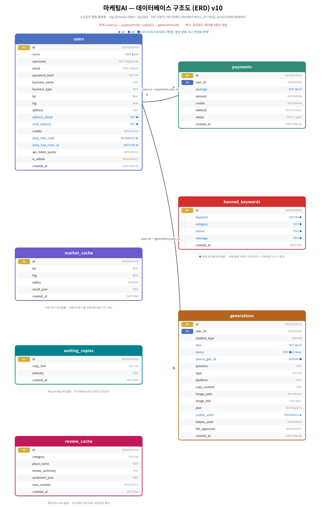

## 소프트웨어 개발 계획서(SDP)

### 골든 데이터셋

참고: https://huggingface.co/datasets/dwb2023/ragas-golden-dataset

참고 2: https://paperdrop.tistory.com/87

참고 3: https://brunch.co.kr/@327roy/156

참고 4: https://itcase.tistory.com/entry/3-2-RAG-나침반-골든-데이터셋Golden-Dataset-구축하기

### 소프트웨어 개발 계획서 목차 및 추가 설명

예시) 목차1

| **구성 요소** | **핵심 내용** | **간단한 질문** |
| --- | --- | --- |
| **1. 프로젝트 개요** | 프로젝트의 존재 이유와 최종 목표 | "우리가 왜 이 일을 하는가?" |
| **2. 범위 (Scope)** | 개발할 기능과 포함되지 *않을* 기능의 명확한 정의 | "정확히 무엇을 만들고, 무엇을 만들지 *않는가*?" |
| **3. 방법론** | 애자일(스크럼, 칸반), 워터폴 등 개발 접근 방식 | "어떤 과정을 걸쳐 만들어갈 것인가?" |
| **4. 일정 및 마일스톤** | 주요 단계와 완료 시점을 보여주는 실현 가능한 타임라인 | "언제까지 무엇을 해내야 하는가?" |
| **5. 자원 및 역할** | 필요한 인력, 기술 스택, 예산 배분 | "누가, 무엇을 가지고 이 일을 하는가?" |
| **6. 위험 관리** | 예상되는 기술적, 운영적 리스크와 완화 계획 | "무엇이 문제가 될 수 있고, 어떻게 막을 것인가?"
**[출처]** 소프트웨어 개발 계획서(SDP)를 작성하라: 성공을 위한 첫걸음|**작성자** hitekkorean |

예시) 목차1 추가 설명

**1. 프로젝트 개요: 이야기의 서문**

한 페이지로 요약할 수 있을 만큼 간결하면서도, 프로젝트의 영혼을 담아야 합니다. 비즈니스 목표, 해결하려는 과제, 기대되는 성과를 명료하게 서술하세요.

**2. 범위 정의: 'No'라고 말하는 용기**

**SDP 작성**에서 가장 어렵고도 중요한 부분입니다. 스코프 크리프(Scope Creep)는 예산 초과와 일정 지연의 가장 흔한 원인입니다. "이것도 있으면 좋겠다"는 유혹을 차단하기 위해, '미포함 범위'를 반드시 명시하세요. 예를 들어, "초기 버전에는 관리자 페이지 통계 기능을 포함하지 않는다"와 같이 말이죠.

**3. 방법론 선택: 당신에 맞는 도구를 골라라**

**애자일 방법론**이 현대 소프트웨어 개발의主流가 되었지만, 그것이 유일한 정답은 아닙니다. 규모가 크고 요구사항이 명확한 프로젝트라면 **워터폴** 모델이 더 적합할 수 있습니다. 당신의 팀 문화와 프로젝트 특성에 맞는 프레임워크를 선택하는 것이 중요합니다.

**4. 실전적인 일정 수립: 계획은 유연하게, 실행은 확고하게**

이상적인 마감일이 아닌, 현실적인 마감일을 설정하세요. 작업을 가능한 한 작은 단위로 분해(WBS: Work Breakdown Structure)하고, 각 작업에 소요될 시간을 팀과 함께 산정합니다. **간트 차트**는 이 과정을 시각화하는 데 탁월한 도구입니다. 주요 **마일스톤**을 설정하여 팀의 사기를 진작시키고 진행 상황을 가시적으로 관리하세요.

**5. 자원 관리: 팀워크의 과학**

누가 무엇을 책임지고, 그를 위해 어떤 기술과 예산이 필요한지 매핑합니다. 프론트엔드 개발자, 백엔드 개발자, 디자이너 등 각 구성원의 역할과 책임(R&R)을 명확히 하여 중복과 공백을 방지합니다.

**6. 위험 관리: 미래의 불확실성에 대비하라**

"모든 것이 계획대로 된다면, 그것은 계획이 아닙니다."라는 말이 있습니다. 데이터 마이그레이션 실패, 특정 기술의 학습 곡선, 타사 API의 불안정성 등 가능한 위험을 나열하고, 각각의 발생 가능성과 영향을 평가한 후, 이를 최소화할 전략을 세웁니다.

예시) 목차2

| **항목** | **내용** |
| --- | --- |
| 프로젝트 개요 | 목표, 범위, 배경 설명 |
| 프로젝트 일정 | 마일스톤, 작업 분할 구조(WBS), 일정 관리 도구 활용 |
| 리소스 관리 | 인력, 예산, 장비 및 도구 리스트업 |
| 위험 관리 | 잠재적 위험 식별 및 대응 계획 수립 |
| 품질 보증 | 테스트 계획 및 품질 기준 정의 |

예시) 목차2 추가 설명

### **1. 프로젝트 개요**

- **목표**: 프로젝트의 최종 목표와 기대 결과를 명확히 정의합니다.
- **범위**: 개발할 소프트웨어의 기능과 비기능 요구사항을 상세히 기술합니다.
- **배경**: 프로젝트가 시작된 배경과 필요성을 설명합니다.

### **2. 프로젝트 일정**

- **마일스톤**: 주요 단계별 완료 시점을 설정합니다.
- **작업 분할 구조(WBS)**: 프로젝트를 세부 작업으로 나누고, 각 작업의 소요 시간과 담당자를 지정합니다.
- **일정 관리 도구**: Jira나 Trello와 같은 도구를 활용해 일정을 시각적으로 관리합니다.

### **3. 리소스 관리**

- **인력**: 프로젝트에 참여하는 팀원의 역할과 책임을 명시합니다.
- **예산**: 프로젝트에 필요한 비용을 추정하고, 예산 사용 계획을 수립합니다.
- **장비 및 도구**: 개발에 필요한 하드웨어, 소프트웨어, 라이선스 등을 리스트업합니다.

### **4. 위험 관리**

- **잠재적 위험**: 프로젝트 진행 중 발생할 수 있는 위험 요소를 식별합니다.
- **대응 계획**: 각 위험에 대한 대응 전략을 마련합니다.

### **5. 품질 보증**

- **테스트 계획**: 소프트웨어의 품질을 검증하기 위한 테스트 전략을 수립합니다.
- **품질 기준**: 프로젝트의 성공 기준을 명확히 정의합니다.

---

## **SDP 작성 시 주의사항**

1. **명확성**: 모든 내용은 명확하고 간결하게 작성해야 합니다. 모호한 표현은 오해를 불러일으킬 수 있습니다.
2. **실현 가능성**: 계획은 현실적으로 실행 가능해야 합니다. 지나치게 야심찬 목표는 프로젝트 실패로 이어질 수 있습니다.
3. **유연성**: 예상치 못한 변화에 대비해 계획에 유연성을 포함시킵니다.
4. **소통**: 팀원과 이해관계자 간의 원활한 소통을 위해 문서를 공유하고 피드백을 수렴합니다.

---

## **SDP 작성의 실제 사례**

예를 들어, 모바일 앱 개발 프로젝트의 SDP를 작성한다고 가정해 보겠습니다. 프로젝트 개요에는 “사용자 친화적인 UI/UX를 갖춘 모바일 앱 개발”이라는 목표를 명시하고, 범위에는 “회원가입, 로그인, 결제 기능 포함”과 같은 세부 사항을 기술합니다. 일정은 6개월로 설정하고, 주요 마일스톤으로 “1개월 차: 요구사항 정의 완료, 3개월 차: 프로토타입 완성” 등을 포함시킵니다.

위험 관리 측면에서는 “개발 지연 가능성”과 “예산 초과 위험”을 식별하고, 각각에 대한 대응 계획을 마련합니다. 예를 들어, 개발 지연 시 추가 인력 투입을 고려하거나, 예산 초과 시 비용 절감 방안을 검토합니다.

---

## **SDP 작성에 도움되는 도구**

- **프로젝트 관리 도구**: Asana, Microsoft Project
- **문서 작성 도구**: Google Docs, Notion
- **버전 관리 시스템**: GitHub, GitLab

---

## **SDP 작성의 중요성: 왜 필요한가?**

SDP는 프로젝트의 성공을 위한 필수 문서입니다. 이 문서는 다음과 같은 이점을 제공합니다:

1. **명확한 방향성**: 팀원들이 프로젝트의 목표와 진행 방향을 명확히 이해할 수 있습니다.
2. **효율적인 리소스 관리**: 예산, 인력, 시간을 효과적으로 배분할 수 있습니다.
3. **위험 최소화**: 잠재적 문제를 미리 예측하고 대응할 수 있습니다.
4. **품질 보장**: 품질 기준을 명확히 정의해 고품질의 결과물을 도출할 수 있습니다.

### 팀 프로젝트 진행 방식

전민재 PM 주관하에 팀원 전체 회고 진행

**각 스플린트에서 수행할 목적과 리스크를 작성하고 스프린트가 끝날 때 마다 회고 진행**

- 매일 10~15분씩 데일리 스크럼(Daily Scrum)을 추가 진행하여 ****`[어제 한 일 / 오늘 할 일 / 막히는 부분(Blocker)]`을 공유하여 투명성을 유지
- 스프린트 회고에서는 KPT(Keep, Problem, Try)를 진행
    - Keep: 좋았던 점, 계속 유지할 점
    - Problem: 아쉬웠던 점, 기술적/소통적 문제점
    - Try: 문제를 해결하기 위해 다음 스프린트에 시도할 구체적 액션

### 요구사항 분석 및 팀 별 역할 분배

- 프로젝트 가이드를 전반적으로 팀원들과 같이 읽어보며 어떤 작업을 수행해야하는지 파악해보세요.
- 좀 더 체계적인 협업을 위해, 아래와 같이 역할군을 나눌 것을 권장드려요.
    - 반드시 아래 가이드라인을 따를 필요는 없어요. 팀 상황과 개인의 관심사에 맞게 역할을 자유롭게 부여하여 프로젝트를 진행해보세요.

| 역할명 | 상세 |
| --- | --- |
| Project Manager | - 프로젝트의 협업 과정을 매니징하는 역할
- 애자일/스프린트 방식으로 단위를 분리하고 회의를 주도
- 서비스 기획
- 서비스 테스트 및 평가
- 성능 평가 담당 |
| 모델 개발 담당 | - 생성 모델 선정 및 텍스트 생성 옵션 설정
- 모델 운영 파이프라인 구현
- (필요 시)데이터 수집하여 모델 파인튜닝
- 모델 성능 평가
- 모델 응답 고도화(정확도, 포맷, 길이, 톤 등)
- 대화 흐름 유지 및 히스토리 반영 전략 설계 |
| 모델 서빙 담당 | - 모델 서빙 전략 수립 및 구현
- 추론 시 속도 및 메모리 최적화 |
| 서비스 개발 담당 | - 서비스 요구사항에 기반해 화면 구현
- 서비스 요구사항에 맞춰 서버 환경을 구성하고 프론트엔드(UI/UX), 백엔드(RestAPI, DB 테이블) 로직 개발 |

### 팀 프로젝트 일정 관리 - 예상 마일스톤(진행 순서 - 변경 가능)

참고: [애자일 기법](https://ko.wikipedia.org/wiki/%EC%95%A0%EC%9E%90%EC%9D%BC_%EC%86%8C%ED%94%84%ED%8A%B8%EC%9B%A8%EC%96%B4_%EA%B0%9C%EB%B0%9C), [프로토타입 기법](https://ko.wikipedia.org/wiki/%ED%94%84%EB%A1%9C%ED%86%A0%ED%83%80%EC%9E%85)
참고 2: [마일스톤 (프로젝트 관리)](https://ko.wikipedia.org/wiki/%EB%A7%88%EC%9D%BC%EC%8A%A4%ED%86%A4_(%ED%94%84%EB%A1%9C%EC%A0%9D%ED%8A%B8_%EA%B4%80%EB%A6%AC))
Part 1. 서비스 기획 (1주차)
- 고객 요구사항 분석 
- 서비스 기획 
- 개발 계획서 초안 작성
- GitHub PR 머지, 리뷰 정책 논의
- API 유료 사용 정책 논의 및 초안 작성
- 불법 광고 문구, 이미지 규제 법률 기반 정책 논의 및 초안 작성

Part 2. 개발 환경 구축 (1주차)
- GitHub 리포지토리
- GCP 리눅스 서버

Part 3. 프로젝트 시작 (2~3주차)
- 팀원 업무 분배
- 단위 테스트 기능 구현(베이스라인 포함)
- 로직 설계 
- 단위 테스트
- 담당자별 통합 보고서 초안 작성(작업 내역 + 관련 자료 + 개인 생각 등 포함)
- 프로젝트 중간 보고(문서 작업 포함) 
- 트러블 슈팅 통한 문제 원인 파악 및 해결(단위 테스트 작업 진행 후 발견 된 오류들을 우선순위 별로 리스트업 한 후 진행)
- 통합 테스트(라이브 시연 준비 목적)
- 서비스 안정화
- API 유료 사용 정책 논의 및 최종본 작성
- 불법 광고 문구, 이미지 규제 법률 기반 정책 논의 및 최종본 작성

Part 4. 프로젝트 완료 (4주차)
- 담당자별 통합 보고서 최종본 작성(작업 내역 + 관련 자료 + 개인 생각 등 포함)
- 프로젝트 완료 보고(문서 작업 포함)
- 발표 준비
- 라이브 시연
- Q&A 예상 질문/답변

참고

**일정 및 스프린트 관리 (Timeline & Sprint)**

- 타임박싱 일정에 맞춰 개발 스코프를 냉정하게 제한합니다. 구현하고 싶은 기능이 많더라도 4주 안에 끝낼 수 없다면 과감히 백로그(보류 과제)로 돌립니다.
- 매일 팀원들의 개발 상황을 체크하고, 특정 파트에서 막힘이 생기면 리소스를 재배치하거나 일정을 즉시 조율하여 병목 현상을 해결합니다.
- 스프린트가 끝날 때마다 간단하게 KPT(Keep, Problem, Try) 회고를 진행하여 다음 스프린트를 원할하게 합니다.

**소통 및 애자일 협업 프로세스 (Communication)**

- 매일 데일리 스크럼을 통해 각 팀원간 수행하는 내용에 대하여 투명성을 유지해 줍니다. 데일리 스크럼이 아니더라도 필요하면 그때 그때 바로 소통을 통해 주요 이슈들을 공유합니다.
- 일일 통합(Daily Merge) 원칙을 세워 각자 개발한 내용을 마지막에만 합치기 보단 최소 2일 단위로 코드를 GitHub에 머지하고 통합 테스트를 수행하도록 리드합니다.
- 프롬프트 실험 결과, Chunking 전략, API 명세서 등이 파편화되지 않도록 노션이나 GitHub Issue에 기록하는 규칙을 만듭니다.

**베이스라인 설계 및 기술 조율 (Baseline & Tech Stack)**

- 이번 실습에는 GCP의 인스턴스를 추가로 활용하므로 기본적인 VM 세팅과 공유 환경을 세팅해야 합니다.
- 챗봇에 추가될 수 있는 기능(에이전트화)들을 제공하고자 하는 서비스에 맞게 설계하고 이에 따른 역할을 배정합니다.
- 기본적인 서비스 형태에 대한 디자인 설계, 서빙 방식, 네트워크 구조 등 큰 그림을 설계합니다.
- 챗봇의 충실도(Faithfulness), 답변 관련성(Answer Relevance) 등을 정량 지표화하기 위한 골든 데이터셋(질문-정답 쌍 50~100개)을 조기에 구축해 놓습니다.
- 모델의 어떤 평가적 기준을 둘지를 우선순위에 따라 목록을 정리하고, 이에 맞는 모델 후보를 찾고 실험을 통해 최종 모델을 찾습니다.

### 팀 프로젝트 평가 방식

평가 방식은 크게 `과정 중 평가`와 `결과 평가`로 나뉩니다.

`결과 평가`의 경우 `팀 단위 평가`와 `개인 단위 평가`로 나누어 시행합니다.

- **과정 중 평가**
    - 평가자 : 각 팀의 멘토님들
    - 평가단위 : 개인 단위 평가
    - 평가항목 : 적극성, 문제 해결 능력, 의사소통 능력, 성장 가능성 (각 25점, 총 100점)
    - 평가시점 : 프로젝트 종료 후 돌아오는 일요일 23:59분까지
    - **프로젝트 기간 중 멘토링 시간 및 디스코드 채널 내 팀원 간 소통하시는 모습 등 다양한 경로**를 통해 멘토님들께서 스프린터 분들의 소프트 스킬을 평가합니다.
- **결과 평가 (팀 단위)**
    - 평가자 : 주 강사님
    - 평가단위 : 팀 단위 평가
    - 평가항목 : 하단 토글 확인
        - 평가 항목 리스트
            - **프로젝트 기획 및 주제 선정**
                - 프로젝트 난이도 및 요구 사항에 적합한 주제를 선정하였나요?
            - **데이터 전처리 및 탐색**
                - 문제 해결에 필요한 데이터를 적절히 수집하였나요?
                - 충분한 데이터 전처리 과정을 진행하였나요?
            - **모델 선정 및 설계**
                - 적절한 딥러닝 모델을 선택하고 설계하였나요?
                - 모델 설계와 선택 이유를 명확히 설명하고 있나요?
            - **모델 훈련 및 평가**
                - 적절한 하이퍼파라미터 튜닝을 수행하였나요?
                - 성능을 적절한 평가 지표로 평가하였나요?
                - 성능 개선을 위해 다양한 시도를 하였나요?
            - **코드 품질 및 문서화**
                - 코드가 가독성과 유지보수성을 고려하여 작성되었나요?
                - 코드 내 주석 및 마크다운이 잘 작성되어 있나요?
            - **결과 해석 및 비즈니스 시사점**
                - 결과를 비즈니스 관점에서 해석하고 시사점을 도출하였나요?
                - 결과가 초기 문제 정의와 목표를 잘 충족하고 있나요?
            - **결과 발표**
                - 발표에 흐름, 결과, 시사점이 잘 나타나 있나요?
                - 발표 내용을 청자들에게 효과적으로 전달하고 있나요?
    - 평가시점 : 프로젝트 최종 발표 직후
    - **프로젝트 최종 발표 내용과 보고서, Github Repository**를 기반으로 프로젝트 결과를 종합적으로 평가합니다.
- **결과 평가 (개인 단위)**
    - 평가자 : 주 강사님
    - 평가단위 : 개인 단위 평가
    - 평가항목 : 하단 토글 확인
        - 평가 항목 리스트
            - **주제 선정**
                - 프로젝트 주제 선정을 위해 유의미한 아이디어를 제시하거나, 아이디어에 대한 적절한 의견을 제시했나요?
            - **데이터 전처리 및 탐색**
                - 데이터에 적합한 전처리 과정을 진행하였나요?
                - 충분한 탐색적 데이터 분석을 통해 데이터의 주요 패턴과 특징을 발견했나요?
            - **모델 훈련 및 평가**
                - 모델 훈련 및 평가 과정에 있어 유의미한 기여를 했나요?
            - **업무 수행**
                - 합의된 프로젝트 타임라인을 지키고 담당한 업무를 정확히 수행했나요?
            - **결과 발표**
                - 발표시간 혹은 질의응답 시간에 적극적으로 참여하였나요?
    - 평가시점 : 프로젝트 최종 발표 직후
    - **개인이 작성한 협업일지, 발표 세션 참여 내역** 기반으로 프로젝트 내 개인 성과를 종합적으로 평가합니다.

### 공통: 전민재님, 윤승준님, 김재헌님, 조희원님

- Lanchain, Langgraph 기반 AI 에이전트 기능 구현
- 단위/통합 테스트 진행(문서 작업 포함)
- 데일리 리포트, 데이터셋 정리, 소스 정리, 발표 문서 작업, 발표 준비 등.

참고

추가 할만한 Lanchain, Langgraph 기반 AI 에이전트 구현 기능 예시

### 구현 기능 예시

| 기능 | 입력 | 출력 |
| --- | --- | --- |
| 상품 이미지에 어울리는 
광고 문구 제안 | - 상품 이미지
- 문구에 대한 요청 사항(스타일, 톤 등) | 광고 문구 |
| 광고 이미지 만들기 1: 
텍스트 입력만 | - 광고 문구
- 또는 이미지에 대한 요청 사항 | 광고 문구 또는 요청 사항에 맞춰 제작된 이미지 |
| 광고 이미지 만들기 2: 
입력 이미지를 레퍼런스로 사용 | - 레퍼런스용 이미지
- 이미지에 대한 요청 사항
- 또는 스타일 템플릿 | 레퍼런스 이미지와 요청 사항에 맞춰 제작된 이미지 |
| 광고 이미지 만들기 3: 
입력 이미지를 보존 | - 제품 사진
- 이미지에 대한 요청 사항
- 또는 스타일 템플릿 | 제품 사진 이미지가 보존된 상태에서 요청 사항에 맞춰 제작된 광고 이미지 |
| 광고 이미지 만들기 4: 
스케치를 그려서 이미지 만들기 | - 스케치 이미지
- 이미지에 대한 요청 사항
- 또는 스타일 템플릿 | 스케치 및 요청 사항에 맞춰 제작된 광고 이미지 |
| 또는, 위에 준하는 수준의 기능을 
자유롭게 선정 | 자율 | 자율 |

### 필수 기능 구현

보안 노드 2종 + 규제 검증 + HITL + 이미지 자동 검수 노드 추가(part4_team_pipeline_v2.png 반영)

#### 3. 기능 요구사항

##### [MVP] 필수 구현 (발표·시연 대상)
| ID | 기능 | 입력 | 출력 |
| --- | --- | --- | --- |
| FR-01 | 주소→좌표 지오코딩 | 주소 문자열 | lat, lng |
| FR-02 | 상권 정보 조회 | 좌표+반경(≤2000m) | 반경 내 매장 리스트(업종3단계·좌표·행정동 포함) |
| FR-03 | 상권 정량 분석 | FR-02 결과 | 경쟁밀도·동일업종수·최근접거리·업종다양성 |
| FR-04 | 업종 트렌드 조회 | 업종·키워드 | 검색어 트렌드 추이 |
| FR-05 | 플랫폼별 문구 생성 | 소재+플랫폼(인스타/블로그/현수막) | 플랫폼별 문구 3안 |
| FR-06 | 광고 이미지 생성 | **확정 카피(FR-21 통과) + 스타일** | 광고 이미지(SDXL) · base64 |
| FR-07 | 게시물 생성(유료) | 생성요청+플랜 | 유료:문구+이미지(필요 시 무료:문구 추가) |
| FR-08 | 대안 제시·재생성 | 최초 생성물 | **제안 1/2/3 카드** — v9 '1안/2안'에서 **3안으로 확정**(스토리보드) → 선택 |
| FR-09 | 꼬리질문 정보 보완 | 최초 질문 | 반문 질문→반영 결과 |
| FR-10 | 회원가입·로그인 | 이메일·비밀번호·가게정보 | 세션 발급 |
| FR-11 | 크레딧 결제·차감 | 충전 요청 / 유료 생성 | 크레딧 잔액·차감 결과 |
| FR-12 | 라우터 분기 | **chatbot_type(사이드바 클릭값)** + 사용자 질의 | 적합 노드로 라우팅 (LLM 자동판단 아님) |
| FR-13 | 품질 평가(개발용) | 생성물·참조데이터 | HitRate@k / MRR / LLM Judge |

##### [MVP 추가] v6 신규 기능 요구사항 (add_sw_req_spec.md 반영)
| ID | 기능 | 입력 | 출력 | 근거 |
| --- | --- | --- | --- | --- |
| FR-14 | 컨설턴트 챗봇 (별도 페르소나) | 상권·업종 질의 | 근거 포함 컨설팅 답변 | add 13, 14 |
| FR-15 | 상권/업종 분석 기반 메뉴·차별점 추천 | 업종·좌표·반경 | 유행 메뉴, 반경 내 미판매(차별) 아이템 추천 | add 8 |
| FR-16 | 마케팅 전략 제안 | 상권 정량 분석 결과 | 프로모션·이벤트·가격·타겟팅 전략(근거 포함) | add 8 |
| FR-17 | 실시간 시의성 데이터 반영 카피 | 날씨/뉴스/트렌드 API | 시의성 반영 카피(예: 눈 예보→겨울 카피) | add 5 |
| FR-18 | 채널별 포맷팅 상세 규칙 적용 | 소재 + 채널 | 인스타(해시태그·이모지), 블로그(장문·소제목), 현수막(짧은 한 줄·가독성) | add 3, 4 |
| FR-19 | 보안1: 입력 검증 노드 | 사용자 질의 | 프롬프트 인젝션·탈옥 차단, **banned_keywords 사전 대조로 불법 키워드 차단/재질문** | add 16 + add_sw_req_spec2.md |
| FR-20 | 보안2: 출력 검증 노드 | 생성 답변 | 민감정보·신상·시스템 프롬프트 누출 차단 | add 16 |
| FR-21 | 규제 준수 검증 노드 (**키워드 사전 기반**) | 생성 카피 | 금지 표현('최고'·'유일' 등)·불법 품목 키워드 판정 + 재질문/생성 거부 안내 | add 16 + add_sw_req_spec2.md |
| FR-22 | 이미지 자동 검수 노드 | 생성 이미지 | 품질·금지요소 검사, 불량 시 재생성 트리거 | add 16 |
| FR-23 | 휴먼 승인 (HITL) | 최종 생성물 | **제안 3안 카드 제시 → [다시 만들기] 또는 [승인하고 발행]** | add 16 + 스토리보드 |
| FR-24 | 대기 화면 문구 랜덤 노출 | - | **"AI가 최적의 광고를 생성하고 있어요" + 사전 저장 문구** 5초마다 노출(스토리보드 확정) | add 12 + 스토리보드 |
| FR-25 | API 토큰 사용 제한 + 추가 결제 | 사용자 요청 | 쿼터 초과 시 차단, 추가 결제 시 사용 가능 | add 15 |
| FR-26 | OpenAI 429 방지 호출 제어 | API 호출 요청 | 요청 간격 확보·큐잉·재시도(백오프)로 429 최소화 | add 17, 18 |
| FR-27 | OpenAI 키 폴백 전환 | 429/한도 초과 감지 | 대체 키(개인 크레딧)로 자동 전환(로컬 테스트 한정) | add 17 |
| FR-28 | 메인 페이지 UI (사이드바·챗 UI) | 사용자 클릭 | 로그인, 사이드바(내 가게·무료사용량·크레딧·메뉴 4종), 채팅 화면 | add 7 + 스토리보드 |
| FR-29 (=FR-13b) | 이미지 품질 평가(개발용) | 생성 이미지+프롬프트 | CLIP Score / Aesthetic Score / 멀티모달 LLM-Judge | add 모델 성능 평가 지표 |

#### 4. 비기능 요구사항
- **성능**:
  - 텍스트 생성: OpenAI API(gpt 계열). 응답 목표 p95 < 15초.
  - 이미지 생성: **GCP VM(L4 GPU)에서 자체 호스팅 SDXL(Stable Diffusion XL) + Triton 서빙.**
    - 실행 위치: 개발·추론 모두 **GCP 서버**에서 수행(로컬 PC GPU 미사용).
      로컬은 편집만, 실행은 VSCode Remote-SSH로 서버에서.
    - 구현 순서(서버 내부에서): ① diffusers로 SDXL 직접 로드·품질/프롬프트 확보
      → ② ONNX/TensorRT 변환 → ③ Triton 서빙 + FastAPI↔Triton gRPC 연결.
      **①을 건너뛰고 Triton부터 붙이지 않는다.**(Triton은 품질 확보 후 서빙 최적화 단계)
    - 폴백: Triton 전환이 지연될 경우, ①의 diffusers 직접 서빙 상태로도 시연 가능하게 유지.
    - 모델 가중치는 GCP 디스크에 캐싱(재다운로드 방지, 디스크 100GB 한도 내 관리).
    - 이미지 응답은 base64 인라인 반환(파일경로/URL 아님).
    - 이미지 생성 목표 지연: 1장 기준 p95 < 20초(콜드스타트 제외).
- **배포/운영**: GitHub Actions 자동배포(main merge→빌드→VM pull&restart)만 허용.
  VM 직접 코드 수정 금지. SSH는 트러블슈팅 전용, 팀원 전원 개방.
  **GPU 컨테이너는 nvidia-container-toolkit로 GPU 접근 보장(--gpus all).**
- **보안**: 비밀번호 해시 저장(평문 금지), API 키는 .env(서버)·GitHub 금지,
  네이버/OpenAI 키 분리 관리, 결제정보 최소 보관.
- **사용성**: 비전문가용 클릭·대화 흐름. 로딩 상태·실패 메시지 노출.
  **이미지 생성처럼 수 초 이상 걸리는 작업은 진행 표시(스피너/예상 시간) 필수.**
- **확장성**: 노드 기반 구조로 신규 노드 추가 용이.
- **모니터링**: 구조화 로그 필수. GPU 사용량(nvidia-smi) 주기 확인. Prometheus/Grafana는 [확장].

##### 4.1 (v6 추가) 외부 API 호출 안정성 — HTTP 429 대응 (add 17, 18)
- **429 발생 원인**: HTTP 요청 간격이 짧을 때, 또는 한 번에 여러 번 동시 요청할 때 발생.
- **로컬 테스트/평가 단계(운영 배포 대상 제외)**
  - 코드잇 제공 OpenAI API 키로 대규모 평가(골든 데이터셋 전량) 실행 시 429 빈발.
  - 대응: **평가 전용 호출 로직 분리** + 대체 키(팀원 개인 크레딧) 폴백 전환.
  - 평가 스크립트는 **직렬 실행 + 요청 간 time.sleep**을 기본값으로 한다(병렬 금지).
- **운영 배포 이후(사용자 직접 이용)**
  - **요청 큐잉**: 사용자 요청을 큐에 넣고 워커가 순차 처리(동시 호출 수 상한 설정).
  - **요청 간격 확보(rate limit)**: 초당/분당 호출 상한을 코드 레벨에서 강제.
  - **지수 백오프 재시도**: 429 수신 시 대기 시간을 늘려가며 재시도(최대 N회).
  - **파이프라인 Step 분산**: 한 요청에서 LLM을 연속 호출하지 않도록 노드 사이에 간격/캐시 삽입.
  - **호출 횟수 자체 절감**: 컨텍스트 캐싱(market_cache/review_cache), 배리언트 수 상한, 재생성 횟수 상한.
  - **토큰 쿼터 사전 확인**: 요청 진입 시 users.api_token_quota 확인 → 초과 시 차단·결제 유도(FR-25).
- **목표**: 운영 중 429 발생률 1% 미만, 발생 시 사용자에게 즉시 실패가 아닌 재시도·대기 안내 노출.

##### 4.2 (v6 추가) 대기 시간 UX (add 12)
- 광고 문구·이미지 생성은 수십 초가 소요될 수 있으므로, **대기 화면**을 필수 구현한다.
- **사전 저장 문구 100건**을 DB(waiting_copies)에 프리로드하고, **5초마다 랜덤으로 1건씩 노출**한다.
- 목적: 대기 시간이 길어도 사용자가 이탈하지 않고 유하게 받아들이도록 함.
  좋은 결과물(광고 문구·이미지)이 나오는 것이 속도보다 우선이라는 서비스 철학 반영.
- 진행률/예상 소요 시간(초)도 함께 표시한다.

##### 4.3 (v6 추가) 보안·규제 준수 (add 16)
- **보안1(입력 검증)**: 프롬프트 인젝션·탈옥 시도 차단, **불법 광고 문구/게시물 요청 거부**.
- **보안2(출력 검증)**: 개인정보·신상정보·시스템 프롬프트 누출 차단.
- **규제 준수 검증**: 표시광고법(거짓·과장/기만/부당비교/비방), 식품 등의 표시·광고에 관한 법률
  (질병 예방·치료 효능 표현 금지) 등 **광고규제 KB를 RAG로 참조**하여 위반 위험 문구를 판정하고
  안전한 대안 문구를 제시한다. 위반 판정 시 카피 생성 노드로 되돌려 재생성한다.
- **이미지 자동 검수**: 생성 이미지의 품질(해상도·왜곡)과 금지 요소(부적절 콘텐츠, 타사 로고 등)를
  검사하고, 불량 시 재생성 루프로 되돌린다.
- **HITL(휴먼 승인)**: 최종 발행 전 사용자가 결과물을 확인하고 OK/Cancel로 승인한다.
  승인 결과는 generations.hitl_approved에 기록한다.


#### 5. 데이터 요구사항 (DB: SQLAlchemy, SQLite3)

##### users
| 컬럼 | 타입 | 설명 |
| --- | --- | --- |
| id | INTEGER PK AUTOINCREMENT | 사용자 ID |
| name | TEXT | **(v8 신규)** 표시용 이름(스토리보드 회원가입 '이름' 필드). username과 분리 — 이름은 중복 가능해야 함 |
| username | TEXT UNIQUE NOT NULL | 사용자 이름 |
| email | TEXT UNIQUE | 로그인 아이디 |
| password_hash | TEXT NOT NULL | 비밀번호 해시(**구현 방식 팀 통일 필요**: 현행 POC=SHA-256+hmac / 권장=bcrypt) |
| business_name | TEXT | 가게명 |
| business_type | TEXT | 업종(상권·트렌드에 사용) |
| lat | REAL | 위도(상권 API용, 지오코딩 결과 저장) |
| lng | REAL | 경도 |
| address | TEXT | 원본 주소(가입 시 입력, 예: '서울 강남구 역삼동') |
| address_detail | TEXT | **(v9 신규)** 상세 주소(예: '시그니처타워 동관 10층'). 상권 분석 정밀도 향상용 |
| road_address | TEXT | **(v9 신규)** 도로명 전체 주소(지오코딩 표준화 결과 저장) |
| credits | INTEGER DEFAULT 0 | 보유 크레딧(유료 차감 대상) |
| daily_free_used | INTEGER DEFAULT 0 | **(v8 신규)** 오늘 사용한 무료 생성 횟수(사이드바 진행바·마이페이지 '오늘 무료' 표시용) |
| daily_free_reset_at | DATETIME | **(v8 신규)** 무료 사용량 초기화 기준 시각(매일 자정 리셋) |
| api_token_quota | INTEGER DEFAULT 0 | **(v6 추가)** 잔여 API 토큰 쿼터(FR-25, 초과 시 추가 결제 유도) |
| is_admin | BOOLEAN DEFAULT FALSE | 관리자 여부 |
| created_at | DATETIME NOT NULL | 가입일시 |

##### payments
| 컬럼 | 타입 | 설명 |
| --- | --- | --- |
| id | INTEGER PK AUTOINCREMENT | 결제 ID |
| user_id | INTEGER NOT NULL FK→users.id | 결제자 |
| package | TEXT | **(v8 신규)** 결제 패키지명(starter/standard/pro — 스토리보드 S-09) |
| amount | INTEGER NOT NULL | 결제 금액(원) |
| credits | INTEGER NOT NULL | 충전된 크레딧 수 |
| method | TEXT DEFAULT 'mock' | 결제수단(POC=mock) |
| status | TEXT DEFAULT 'paid' | pending/refunded/completed/failed |
| created_at | DATETIME NOT NULL | 결제 일시 |

##### generations  (※ v1의 content/contents 명칭 혼용 → generations 통일)
| 컬럼 | 타입 | 설명 |
| --- | --- | --- |
| id | INTEGER PK AUTOINCREMENT | 생성물 ID |
| user_id | INTEGER NOT NULL FK→users.id | 요청자 |
| chatbot_type | TEXT NOT NULL | **(v6 추가)** 'basic'(기본 챗봇) / 'consultant'(컨설턴트 챗봇) |
| title | TEXT | **(v8 신규)** 생성물 제목(마이페이지 이력에 표시. 예: '선착순 할인 이벤트 홍보') |
| question | TEXT | 사용자 요청 |
| type | TEXT NOT NULL | 'copy+image(카피+이미지)'(필요 시 'copy(카피)'/ 추가) |
| platform | TEXT | instagram/blog/banner |
| copy_content | TEXT | 생성 문구 |
| image_path | TEXT | **(레거시)** 파일경로 방식. Cloud Run 파일시스템 이슈로 미사용 — 실제 렌더링은 image_b64 |
| image_b64 | TEXT nullable | 유료 이미지(**base64 인라인**, 파일경로/URL 아님) |
| plan | TEXT | **요금 등급 표기용**(free/paid). §2.1에 따라 기능 제한 용도가 아니며, 실제 사용 제어는 credits·api_token_quota로 수행 |
| credits_used | INTEGER DEFAULT 0 | **(v8 신규)** 이 생성에 차감된 크레딧(0이면 무료 사용. 마이페이지 '무료'/'-50 크레딧' 뱃지 근거) |
| tokens_used | INTEGER DEFAULT 0 | 토큰 사용량 |
| hitl_approved | BOOLEAN DEFAULT FALSE | **(v6 추가)** 휴먼 승인(HITL) 통과 여부 |
| created_at | DATETIME NOT NULL | 생성 일시 |

##### market_cache (신규 — 상권 조회 결과 캐시)
| 컬럼 | 타입 | 설명 |
| --- | --- | --- |
| id | INTEGER PK AUTOINCREMENT | 캐시 ID |
| lat | REAL | 조회 중심 위도 |
| lng | REAL | 조회 중심 경도 |
| radius | INTEGER | 조회 반경(m) |
| result_json | TEXT | 상권 API 응답(JSON 직렬화) |
| created_at | DATETIME | 조회 일시(TTL 관리용) |

##### review_cache (v6 신규 — 경쟁사 리뷰 사전 수집 캐시)
| 컬럼 | 타입 | 설명 |
| --- | --- | --- |
| id | INTEGER PK AUTOINCREMENT | 캐시 ID |
| category | TEXT NOT NULL | 업종/카테고리 |
| place_name | TEXT | 경쟁사 상호명 |
| review_summary | TEXT | LLM 리뷰 요약(불만·강점 키워드) |
| sentiment_json | TEXT | 감성분석 결과(긍/부정·측면별 집계 JSON) |
| num_reviews | INTEGER DEFAULT 0 | 수집 리뷰 수 |
| crawled_at | DATETIME | 수집 일시(신선도 표기용) |

##### waiting_copies (v6 신규 — 대기 화면용 문구 프리로드)
| 컬럼 | 타입 | 설명 |
| --- | --- | --- |
| id | INTEGER PK AUTOINCREMENT | 문구 ID |
| copy_text | TEXT NOT NULL | 대기 화면에 노출할 문구(총 100건 목표) |
| industry | TEXT | 업종(선택적 필터링용) |
| created_at | DATETIME | 등록 일시 |

##### 5.1 데이터베이스 구조도 (ERD)


- **관계**: `users(1) ─ payments(N)`, `users(1) ─ generations(N)`
- **독립 테이블**: `market_cache`, `review_cache`, `waiting_copies` (FK 없음, 캐시/프리로드 용도)
- 산출물 파일: `erd_v10.png`


#### 11. (v8 신규) 화면 목록 — 초안 스토리보드 분석

> 스토리보드 16종 화면을 분석해 정리했다. **각 화면이 어떤 FR과 연결되는지**를 함께 적어,
> 프론트 담당자가 "이 화면을 만들면 어떤 요구사항이 충족되는지" 바로 알 수 있게 했다.

| # | 화면 | 핵심 구성 | 연결 FR |
| --- | --- | --- | --- |
| S-01 | **로그인** | 아이디(이메일)·비밀번호·로그인 버튼·회원가입 링크. 서비스명 "매출부스터", 소개문 "소상공인을 위한 AI 마케팅 어시스턴트" | FR-10 |
| S-02 | **회원가입** | 이름 / 아이디(이메일) / 비밀번호 / **업종**(예: 카페, 음식점, 미용실) / **위치**(예: 서울 강남구 역삼동) | FR-10, FR-01 |
| S-03 | **메인 대시보드** | 인사말 + 기능 카드 2개(컨설턴트 챗봇 "상권 분석 & 전략 제안" / 게시물 생성 "SNS & 블로그 & 현수막") | FR-28 |
| S-04 | **사이드바(공통)** | 내 가게 카드 / 오늘 무료 사용량 진행바(매일 자정 초기화) / 크레딧 잔액 + 충전 / 메뉴 4종 | FR-28, FR-25 |
| S-05 | **컨설턴트 챗봇 시작** | "상권 분석을 시작하세요" + **추천 질문 칩 3개** | FR-14 |
| S-06 | **게시물 생성 시작** | 챗봇 인사 + **플랫폼 선택 버튼 3종**(인스타그램/블로그/현수막) | FR-05, FR-18 |
| S-07 | **보조정보 입력** | 플랫폼 선택 후 "가게 정보를 조금 더 알려주세요 · **모두 선택사항**" + 폼(홍보 목적, 가격대 등) | FR-09 |
| S-08 | **마이페이지** | 통계 카드 4종(총 생성 / 오늘 무료 / 사용 크레딧 / 잔여 크레딧) + **생성 이력 리스트** | **FR-30(신규)** |
| S-09 | **크레딧 충전** | 과금 정책 안내 + **패키지 3종**(스타터/스탠다드/프로) + 결제 수단 | FR-11, **FR-31(신규)** |
| S-10 | **에러: 크레딧 부족** | "크레딧이 부족합니다 · 추가 사용을 위해 크레딧을 충전해주세요" + [크레딧 충전하기] | **FR-32(신규)** |
| S-11 | **에러: 일시적 오류** | "일시적인 오류가 발생했어요 · 잠시 후 다시 시도해주세요" + [다시 시도] | **FR-32(신규)**, FR-26 |
| S-12 | **사이드바 접힘(반응형)** | 햄버거 버튼으로 사이드바 토글. 모든 화면에 접힘/펼침 상태 존재 | **FR-33(신규)** |

##### 11.1 (v8 신규) 스토리보드에서만 확인된 기능 요구사항

| ID | 기능 | 입력 | 출력 | 근거 |
| --- | --- | --- | --- | --- |
| FR-30 | **마이페이지(생성 이력·크레딧 현황)** | 사용자 세션 | 통계 4종 + 생성 이력 목록(제목·날짜·플랫폼·비용) | S-08 |
| FR-30a | **이력 "재사용"** | 과거 생성물 선택 | 저장된 결과를 그대로 다시 표시/복사 (**추가 과금 없음**) | S-08 |
| FR-30b | **이력 "재생성"** | 과거 생성 조건 선택 | 같은 조건으로 **새로 생성**(**과금 발생** — 신규 생성과 동일 취급) | S-08 |
| FR-31 | **크레딧 패키지 결제** | 패키지 선택 + 결제수단 | 크레딧 충전, payments 기록 | S-09 |
| FR-32 | **오류·부족 상태 UI 처리** | 에러 코드(402/429/5xx) | 상태별 안내 문구 + 복구 버튼([다시 시도] / [크레딧 충전하기]) | S-10, S-11 |
| FR-33 | **사이드바 토글(반응형)** | 햄버거 클릭 | 사이드바 접힘/펼침 전환 | S-12 |
| FR-34 | **추천 질문 칩 제공** | 컨설턴트 챗봇 진입 | 예시 질문 3개 노출(클릭 시 즉시 질의) | S-05 |
| FR-35 | **회원가입 시 위치 → 좌표 변환** | 위치 텍스트(예: 서울 강남구 역삼동) | 지오코딩 결과 lat/lng를 users에 저장 | S-02 + FR-01 |

> **FR-30b(재생성) 주의**: 재생성은 LLM·이미지 모델을 다시 호출하므로 **비용이 발생한다.**
> "재사용은 공짜, 재생성은 과금"이라는 원칙을 UI에도 명시해야 사용자 불만이 생기지 않는다.

##### 11.2 (v8 신규) 추천 질문 칩 확정 문구 (S-05)
```
· 우리 카페 어떻게 홍보하면 좋을까요?
· 주변 경쟁사는 얼마나 되나요?
· 어떤 이벤트가 효과적일까요?
```
> 업종에 따라 "카페"를 users.business_type으로 치환해 노출하면 개인화 효과가 커진다.


#### 14. (v8) 스토리보드에 아직 없는 화면 — 추가 설계 필요

> v7에서 정의했으나 시안에 반영되지 않은 항목이다. **기능이 틀린 게 아니라 화면이 아직 없는 것**이므로,
> 디자인 담당자와 협의해 추가하거나, 범위에서 제외할지 결정해야 한다.

| 항목 | v7 근거 | 상태 | 제안 |
| --- | --- | --- | --- |
| **대기 화면**(문구 100건 랜덤) | FR-24 | 시안 없음 | 생성 버튼 클릭 후 결과 사이에 삽입. 진행률 + 문구 카드 |
| **HITL 승인**(발행 전 OK/Cancel) | FR-23 | 시안 없음 | 결과 표시 후 하단에 [사용하기]/[다시 만들기] 형태로 자연스럽게 |
| **대안(1안/2안) 선택** | FR-08 | 시안 없음 | 결과 카드를 좌우 스와이프 또는 탭으로 제시 |
| **컨설턴트 챗봇 과금 여부** | §10 | 정책 미정 | 마이페이지 이력에는 게시물만 보임 → 컨설팅도 과금할지 확정 필요 |
| **서비스명 통일** | 전 문서 | 문서=AdCopilot / 시안=매출부스터 | **서비스명 통일 권장**(시안·발표자료 일관성) |


#### 15. (v9 신규) 규제·보안 검증 구현 상세 — 키워드 사전 방식 (add_sw_req_spec2.md 반영)

> add_sw_req_spec2.md가 "법령 OPEN API + 정제 + LLM 추론은 너무 무겁다"고 지적했다. 그 대안을 구체화한다.
> **핵심 아이디어: 판단을 LLM에 맡기지 말고, 미리 만든 금지어 사전과 문자열 대조로 빠르게 거른다.**

##### 15.1 왜 키워드 방식인가 (근거)
```
[무거운 방식 — 지양]
사용자 요청 → 법령 OPEN API 호출(수백 ms~초) → 응답 XML 파싱·정제
            → LLM에 "이거 위법이야?" 추론(초 단위) → 판정
문제: 단계마다 지연이 쌓이고, 광고 생성(LLM/SDXL)까지 더하면 사용자 대기가 과도.

[가벼운 방식 — 채택]
사용자 요청 → banned_keywords 사전과 문자열 대조(ms 미만) → 즉시 판정
장점: 빠름 · 구현 단순 · 오탐 시 사전만 수정하면 됨.
```

##### 15.2 banned_keywords 테이블 (기본 채택 형식)
| 컬럼 | 타입 | 설명 |
| --- | --- | --- |
| id | INTEGER PK AI | 키워드 ID |
| keyword | TEXT NOT NULL | 금지/주의 단어(예: '최고', '유일', '마약', '도박') |
| category | TEXT | 유형: 'illegal'(불법품목) / 'exaggeration'(과장표현) / 'medical'(의학효능) 등 |
| action | TEXT | 처리 방식: 'block'(생성 거부) / 'reask'(재질문) / 'warn'(경고 후 대안) |
| message | TEXT | 사용자에게 보여줄 안내 문구 |
| created_at | DATETIME | 등록 일시 |

> **저장 형식 3가지 비교(add_sw_req_spec2.md 요구)**
> | 형식 | 장점 | 단점 | 판정 |
> | --- | --- | --- | --- |
> | ① 시스템 프롬프트 문자열 | 구현 즉시 | 수정 시 코드 변경·재배포, 목록 길면 토큰 낭비 | 보조용 |
> | ② JSON 파일 | 코드와 분리, 버전관리 쉬움 | 운영 중 수정하려면 파일 배포 필요 | 초기 프로토타입 |
> | ③ **DB 테이블(banned_keywords)** | **운영 중 추가/수정 즉시 반영**, 관리자 화면 연동 가능 | 테이블 설계 필요 | **기본 채택** |
>
> POC 초기엔 ②(JSON)로 빠르게 시작하고, 안정화되면 ③(DB)으로 옮기는 것도 좋다.

##### 15.3 처리 규칙 (예시)
```
· '마약', '도박' 등 illegal 키워드 → action='block'
    → "해당 품목/주제는 광고 문구·이미지를 생성할 수 없습니다."
· '최고', '유일', '1등' 등 exaggeration 키워드 → action='warn'
    → "'최고'와 같은 표현은 표시광고법상 부당광고가 될 수 있어요. 다른 표현을 제안드릴까요?"
· 정보가 애매하면 → action='reask'
    → "혹시 어떤 의미로 말씀하신 걸까요? 조금 더 알려주세요."
```

##### 15.4 어디에 적용되나 (파이프라인 2곳)
- **보안1(입력 검증, FR-19)**: 사용자 **요청**에 불법 키워드가 있으면 진입 차단/재질문.
- **규제 준수 검증(FR-21)**: **생성된 카피**에 금지 표현이 있으면 카피 생성 노드로 되돌려 재생성.
- 두 곳 모두 같은 `banned_keywords` 사전을 공유한다.

> **주의**: 키워드 방식은 **완벽하지 않다.** '최고급 원두'처럼 정당한 표현도 걸릴 수 있으므로,
> category/context로 예외를 두거나, warn(경고)은 차단이 아니라 **대안 제안**으로 처리해 과잉 차단을 막는다.

---

#### 16. (v9 신규) 위치 데이터 정책 (add_sw_req_spec2.md 반영)

##### 16.1 왜 상세 위치가 필요한가
상권 분석 API(`storeListInRadius`)는 **좌표(cx, cy) + 반경**으로 조회한다.
위치가 '역삼동'처럼 넓으면 좌표가 부정확해 **엉뚱한 반경**을 분석하게 된다.
→ 회원가입 주소를 **네이버 Maps Geocoding으로 좌표·도로명으로 표준화**해 정밀도를 높인다.

##### 16.2 입력·저장 흐름
```
회원가입 위치 입력(예: "서울 강남구 역삼동" 또는 "서울특별시 중구 청계천로 100 …")
 → 네이버 Maps Geocoding 호출
 → 결과 저장: road_address(도로명 표준) + lat + lng + address_detail(상세)
 → 상권 분석 시 lat/lng를 그대로 사용
```

##### 16.3 결정 필요 (CASE 1 vs CASE 2)
| 케이스 | 위치 | add_sw_req_spec2.md 질문 |
| --- | --- | --- |
| CASE 1 | **회원가입 화면**에서 입력·저장 | 필수 |
| CASE 2 | **사이드바 '내 가게'** 에서 표시/수정 | 여기서도 수정 가능하게 할지? |
> **PM 제안**: 가입 시 필수 입력(CASE 1) + 사이드바에서 **수정 가능**(CASE 2)하게. 가게 이전·오입력 대응이 쉬워진다.

---

#### 17. (v9 신규) 데이터 보관 정책 (add_sw_req_spec2.md 반영 · FR-36)

> 재사용/재생성(FR-30a/b)을 위해 **모든 생성 이력을 저장**하기로 했으므로, 무한 적재를 막는 정책이 필요하다.

| ID | 기능 | 내용 |
| --- | --- | --- |
| FR-36 | 데이터 보관기간 관리 | generations 등 사용자 데이터의 보관 유효기간을 정하고(예: 6개월), 초과분을 자동 삭제 |
| FR-36a | 만료 데이터 삭제 배치 | 주기적으로(예: 매일 새벽) `created_at`이 기준을 넘은 레코드 정리 |

```
· 보관기간: (팀 확정) 예) 생성 이력 6개월, 상권/리뷰 캐시 TTL 7일
· 삭제 방식: 하드 삭제 vs soft delete(deleted_at 플래그) — 복구 필요성에 따라 결정
· 개인정보: 탈퇴 시 즉시 삭제 원칙(법적 요건 확인)
```
> **주의**: 이미지(image_b64)는 용량이 크므로, 보관기간이 지난 이미지는 우선 삭제해 **DB 용량**을 관리한다.

---

#### 18. (v10 신규) 스토리보드로 확정된 흐름 상세

> 이번 수정 스토리보드가 확정한 4개 화면을, **구현 담당자가 바로 만들 수 있도록** 순서·데이터와 함께 정리한다.

##### 18.1 컨설팅 → 광고 연계 ([이 전략으로 광고 만들기])
**화면**: 컨설턴트 챗봇 답변 카드 하단에 주황색 **[이 전략으로 광고 만들기]** 버튼.
```
[사용자] 컨설턴트 챗봇에서 전략 추천받음
   → 답변 카드 하단 [이 전략으로 광고 만들기] 클릭
   → 시스템: 전략 텍스트를 기본 챗봇(게시물 생성)으로 전달 + 화면 전환
   → 기본 챗봇이 그 전략을 반영해 광고 생성 흐름 시작(§18.2로 연결)
   → generations.source_gen_id 에 원본 컨설팅 레코드 id 저장(파생 추적)
```
> **왜 source_gen_id가 필요한가**: 나중에 "이 광고는 어떤 컨설팅에서 나왔나"를 추적하면,
> 마이페이지에서 컨설팅↔광고를 연결해 보여줄 수 있고, 재생성 시 맥락을 잃지 않는다.

##### 18.2 생성 전 크레딧 동의창 + 대기 화면
**화면 A(동의창)**: "좋아요! 해당 내용들로 게시물을 생성할까요? / **예상 차감 크레딧 10** / **차감 후 잔액 55** / [취소] [확인]"
**화면 B(대기)**: "AI가 최적의 광고를 생성하고 있어요. 잠시만 기다려 주세요." + (대기 문구 출력)
```
[생성 요청]
 → 서버: 일일 무료 잔여 확인
      · 무료 남음 → 무료로 처리(예상 차감 0) 안내 후 바로 생성
      · 무료 소진 → 예상 차감 크레딧 + 차감 후 잔액 계산해 [동의창] 표시
 → 사용자 [확인] → credits 차감 확정 → 상태 generations.status='generating'
 → [대기 화면] 표시(waiting_copies 문구 5초마다) 
 → 생성 완료 → status='done' → [결과·승인 화면](§18.3)
 → 사용자 [취소] → 차감 없이 종료
```
> **핵심 원칙(v9 §11과 연결)**: 크레딧은 **[확인] 시점에만** 차감한다. 대기 중 실패하면 **차감 롤백**(중복·손실 방지).
> 동의창의 "예상 차감/차감 후 잔액" 숫자는 **서버가 계산해 내려주는 값**이어야 화면 간 불일치가 없다.

##### 18.3 생성 결과 + 승인(HITL) — 제안 3안
**화면**: "광고 생성이 완료되었어요. 마음에 드는 제안이 있으신가요? / **[제안1] [제안2] [제안3]** / [다시 만들기] [승인하고 발행]"
```
[생성 완료]
 → 제안 3안 카드로 표시(FR-08: v9 '1안/2안' → v10 '3안'으로 확정)
 → 사용자 선택 후:
      · [승인하고 발행] → hitl_approved=true → 최종 발행/다운로드 → 마이페이지 이력에 저장
      · [다시 만들기]  → 카피/이미지 재생성(주의: 재생성은 과금 — FR-30b와 동일 원칙)
```
> **v9 대비 명확한 변경**: 대안 개수가 **2안 → 3안**이다. LLM Judge 랭킹(FR-13)도 **상위 3개**를 뽑도록 맞춘다.
> **[다시 만들기] 과금 주의**: 결과가 마음에 안 들어 다시 만들면 모델을 재호출하므로 비용이 든다.
> 무한 [다시 만들기]로 크레딧이 급감하지 않도록, 동의창(§18.2)을 재생성 때도 한 번 더 보여줄지 팀이 정한다(§17).

##### 18.4 (v10 신규) 생성 상태(status) 값 정의
`generations.status` 컬럼으로 생성 진행을 추적한다(대기 화면·오류 복구에 사용).
| status | 의미 | 다음 상태 |
| --- | --- | --- |
| `pending` | 동의창 표시, 사용자 확인 대기 | confirm 시 generating / 취소 시 삭제 |
| `generating` | 생성 중(대기 화면 노출) | 완료 시 done / 실패 시 failed |
| `done` | 생성 완료(결과·승인 화면) | 승인 시 published |
| `failed` | 생성 실패 | 재시도(크레딧 롤백 후) |
| `published` | 사용자 승인·발행 완료 | 마이페이지 이력 |

---

#### 19. (v10) 화면 목록 보강 — 수정 스토리보드 반영

> §9의 화면 목록에 이번에 확정된 4개를 추가한다(S-13 ~ S-16). §9 원본은 유지된다.

| # | 화면 | 핵심 구성 | 연결 FR |
| --- | --- | --- | --- |
| S-13 | **컨설턴트 답변 + 연계 버튼** | 컨설턴트 답변 카드 + **[이 전략으로 광고 만들기]** | FR-14, EX-05, §18.1 |
| S-14 | **크레딧 동의창** | "예상 차감 크레딧 / 차감 후 잔액 / [취소][확인]" | FR-11, §18.2 |
| S-15 | **대기 화면** | "AI가 최적의 광고를 생성하고 있어요" + 대기 문구 | FR-24, §18.2 |
| S-16 | **결과 + 승인(3안)** | "제안 1/2/3 / [다시 만들기][승인하고 발행]" | FR-08, FR-23, §18.3 |

### 데이터 처리

데이터 작업 사항
(예시)
- market_cache (신규 — 상권 조회 결과 캐시)
- review_cache (v6 신규 — 경쟁사 리뷰 사전 수집 캐시)
- waiting_copies (v6 신규 — 대기 화면용 문구 프리로드)
- 15.2 banned_keywords 테이블 (기본 채택 형식): 키워드 사전 방식, 사전 대조로 불법 광고 문구, 이미지 생성 요청 키워드 차단/재질문
- 골든 데이터셋 구축 및 성능 평가 진행

예) 골든 데이터셋 활용하여 LLM 성능 하락 이슈가 발생하는 경우를 찾고 
필요 시 이를 LLM 모델이 학습할 수 있는 데이터셋 추가 구축 필요 

- 그 외 기타 작업 진행.

#### 10. (v6 추가) 골든 데이터셋

- **세트 1**: 총 92 문항(단일 문서 질문 52개, 다중 문서 질문 40개)
- **세트 2**: 총 122 문항(단일:79 / 다중:14 / 후속:7 / 기타:22)
  - 기타에는 "모른다"가 정답인 문항, 문체 변환, 범위 밖의 질문(답변 거부가 정답)인 경우 해당
  - 데이터: 파싱 파이프라인 Parity 검증율
- **세트 3**: 총 63 문항(단일 20 / 다중 15 / 후속 15 / 거부 13)
  - 데이터: 문서 로딩 성공률, 메타데이터 결측률, 청크 길이 분포, 민감정보 마스킹 정확도, 골든 데이터셋 검증율

> **운영 주의(add 17 반영)**: 골든 데이터셋 전량 평가는 OpenAI API 호출이 대량 발생하여 429가 빈발한다.
> 평가 스크립트는 **직렬 실행 + 요청 간 time.sleep**을 기본으로 하고, 필요 시 대체 키로 폴백한다.

### 모델 성능 평가

- 답변의 품질을 평가할 때는 다음과 같은 기준을 사용할 수 있습니다.
    - 사용자가 요청한 내용을 단일 문서에서 정확하게 뽑아내 답변하는지
    - 사용자가 여러 문서에 대해 요청한 내용을 잘 종합해서 답변하는지
    - 후속 질문의 맥락을 잘 이해하고 답변하는지
    - 문서에 포함되어 있지 않은 내용에 대해서는 모른다고 답변하는지
- 위와 같은 기준을 어떤 방식으로 평가하고 어떤 지표로 나타낼지 선정해 보세요.
- 주어진 문서 데이터에 맞게 다양한 질문 세트를 준비하여 성능 평가에 활용해 보세요.

#### 9. (v6 추가) 모델 성능 평가 지표

##### 9.1 검색(Retrieval) 지표
- **세트 1**: all-hit@20(다중 문서 질문에 대해 양쪽 문서 모두 회수한 비율), Hit Rate@5(정답 근거가 상위 5개 안에 든 비율)
- **세트 2**(골든 데이터셋 1~100번 문항 활용): Recall@3, Recall@5, Recall@10, MRR
- **세트 3**: Hit Rate@5, MRR(Mean Reciprocal Rank), Context Recall, Context Precision

##### 9.2 생성(Generation) 지표
- **세트 1**: RAGAS — Faithfulness, Answer-Relevance, Context-Recall, Context-Precision
- **세트 2**(골든 데이터셋 101~122번 문항 활용): 생성 실패율, 응답시간, Faithfulness, Answer Relevance,
  Context Recall, Context Precision, Retrieval Accuracy
- **세트 3**: Faithfulness, Answer Correctness, RAGAS-Score(종합 지표), ROUGE-1, ROUGE-L, BERTScore-F1, BLEU

##### 9.3 이미지 생성 지표
기본: FID (Fréchet Inception Distance), CLIP Score

- **축 1 — 텍스트-이미지 정합성 (가장 중요, 이 축을 두껍게)**
  CLIP Score, CLIPScore의 확장 — ImageReward, VQAScore / TIFA
  > **[v7 보정]** 원문 예시에는 이 축에 FID가 포함돼 있었으나, **FID는 정합성 지표가 아니다.**
  > FID는 생성 이미지 *집합*과 실제 이미지 *집합*의 **분포 거리**를 재는 지표로, 프롬프트와의 일치 여부를 전혀 보지 않는다.
  > 따라서 FID는 아래 '축 2(품질·다양성)'의 참고 지표로 옮긴다.
- **축 2 — 미적 품질·분포 (광고는 "예뻐야" 함, 이 축이 광고엔 특히 중요)**
  Aesthetic Score (LAION Aesthetic Predictor), HPS v2 (Human Preference Score),
  **FID(분포 유사도·다양성 — 샘플 수백 장 확보 시에만 유의미)**
- **축 3 — 사람 평가 (정량 지표의 한계를 보완, 가장 신뢰도 높음)**
  LLM-as-a-Judge (멀티모달): GPT 계열 비전 모델 / 간단한 A/B 사용자 평가

| ID | 기능 | 입력 | 출력 |
| --- | --- | --- | --- |
| FR-13b (=FR-29, 동일 기능) | 이미지 품질 평가(개발용) | 생성 이미지+프롬프트 | ① CLIP Score(정합성) ② Aesthetic Score(미적품질) ③ 멀티모달 LLM-Judge(광고매력도·규제위험) / FID는 샘플 확보 시 참고용 |

> **지표 선택 근거(발표용)**: 본 과제는 **정답 이미지가 없는 순수 생성(Text-to-Image)** 태스크이므로,
> 참조 이미지가 필요한 **PSNR·LPIPS는 기본 평가에서 제외**한다.
> 단, EX-06(IP-Adapter 제품 사진 보존)을 구현할 경우 **입력 제품 대비 보존도 측정에 LPIPS를 제한적으로 사용**한다.
> FID는 통계적 신뢰를 위해 다수 샘플이 필요하므로, 샘플 확보 시 참고 지표로만 활용한다.

> 참고 자료: 이미지 생성과 변환에 대한 이해, 이미지생성_GAN.ipynb, 이미지변환_Pix2pix.ipynb, 디퓨전_모델.ipynb
> (강의 노트북은 `diffusers.DiffusionPipeline` + Stable Diffusion v1.5 기준. 본 프로젝트는 SDXL로 확장 적용)

---