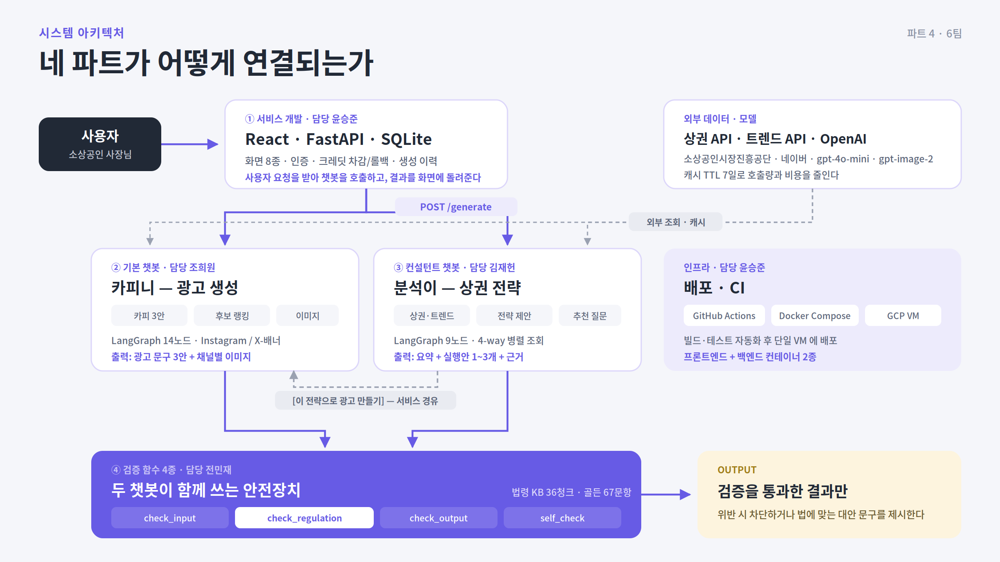

<div align="center">

# 매출부스터 (Sales Booster)

### 상권 데이터로 전략을, 전략으로 광고를

**근거 기반 전략 수립과 안전한 광고 생성을 연결한 소상공인 마케팅 AI 플랫폼**

[](https://www.python.org/)
[](https://fastapi.tiangolo.com/)
[](https://react.dev/)
[](https://langchain-ai.github.io/langgraph/)
[](https://docs.docker.com/compose/)

**코드잇 스프린트 AI 엔지니어 10기 · 파트4 고급 프로젝트 · 6팀**

</div>

---

## 🎬 동영상

<div align="center">

[](https://www.youtube.com/watch?v=N4SLRAgrLik)

**▶️ 이미지를 클릭하면 유튜브로 이동합니다**

</div>

---

## 목차

1. [프로젝트 개요](#1--프로젝트-개요)
2. [주요 기능](#2--주요-기능)
3. [시스템 아키텍처](#3--시스템-아키텍처)
4. [설치 및 실행 방법](#4--설치-및-실행-방법)
5. [프로젝트 구조](#5--프로젝트-구조)
6. [성능 측정 결과](#6--성능-측정-결과)
7. [팀 소개](#7--팀-소개)
8. [타임라인](#8--타임라인)
9. [산출물](#9--산출물)
10. [기술 스택 및 라이선스](#10--기술-스택-및-라이선스)

---

## 1. 📌 프로젝트 개요

### 배경

소상공인 사장님의 고민은 세 가지입니다.

| 고민 | 현실 |
| --- | --- |
| **무엇을 팔아야 할지 모른다** | 상권 데이터를 볼 줄도, 볼 시간도 없다 |
| **어떻게 알려야 할지 모른다** | 광고 대행사를 쓸 예산이 없다 |
| **광고가 법에 걸리는지 모른다** | 표시광고법을 아는 사장님은 드물다 |

직접 만든 광고 문구가 이렇게 나오는 경우가 있습니다.

> "우리 동네 **최고**의 카페, 이 **커피 한 잔이 피로를 풀어드립니다**"

두 군데가 법에 걸립니다. `"최고"`는 표시광고법 시행령 제3조 제1항의 객관적 근거 없는 절대적 표현, `"피로를 풀어드립니다"`는 식품표시광고법 제8조 제1항 제1호의 질병 예방·치료 효능 표현입니다.

**문제는 사장님이 이 사실을 모른다는 것입니다.** 그대로 인쇄되어 가게 앞에 걸립니다.

### 목표

- 상권·트렌드 데이터를 근거로 **무엇을 팔지** 제안한다
- 그 전략을 이어받아 **광고 문구와 이미지**를 만든다
- 만든 결과가 **법에 걸리지 않는지 자동으로 검증**하고, 걸리면 **대안 문구를 제시**한다

### 기대 효과

| 항목 | 내용 |
| --- | --- |
| **의사결정 근거 확보** | 반경 내 동일 업종 수·검색 추이로 판단 |
| **제작 시간 단축** | 문구 3안 + 채널별 이미지를 한 번의 요청으로 생성 |
| **법적 위험 감소** | 위반 문구를 차단하고 바로 쓸 수 있는 대안 제시 |

---

## 2. 🚀 주요 기능

### 분석이 — 컨설턴트 챗봇

상권과 트렌드를 근거로 실행 가능한 전략을 제안합니다.

- 질문을 재작성하고 검색 키워드를 추출
- **상권·트렌드·추천질문·계절성을 4-way 병렬 조회**
- 요약 + 실행안 1~3개 + **근거(reasons)** 를 함께 제시
- 이어서 물어볼 만한 **추천 질문 3개** 자동 생성

### 카피니 — 기본 챗봇

전략이나 요청을 받아 광고 문구와 이미지를 생성합니다.

- 톤이 다른 **광고 문구 3안 동시 생성** → LLM Judge 랭킹
- **법률 규제 검증을 이미지 생성 앞에 배치** — 위반 문구로 이미지를 만들지 않는다
- Instagram(정사각) / X-배너(세로형 상하단 합성) 채널별 대응

### 공용 검증 계층

두 챗봇이 **같은 검증 함수를 공유**합니다.

| 함수 | 검사 대상 | 연결 |
| --- | --- | --- |
| `check_input` | 사용자 질문 | 두 챗봇 |
| `check_regulation` | 생성된 카피 | 기본 챗봇 |
| `check_output` | 최종 응답 | 두 챗봇 |
| `self_check` | 응답 근거·완결성 | 두 챗봇 |

**차단만 하지 않습니다.** `"최고의 카페"`가 걸리면 법에 맞는 대안 문구를 만들어 돌려주고, **그 대안을 다시 한 번 검사**합니다.

### 전략 → 광고 연계

컨설턴트 결과 화면의 **[이 전략으로 광고 만들기]** 버튼을 누르면, 서비스가 저장된 전략을 조회·재검증해 기본 챗봇에 넘깁니다. **두 챗봇이 직접 통신하지 않습니다.**

---

## 3. 🏗 시스템 아키텍처



### `check_regulation` — 2단 구조

```
카피 입력
   │
   ├─[1단] 키워드 스크리닝 ─── 명백한 위반 패턴 매칭 (LLM 0회)
   │         │
   │         ├─ 확실한 위반 → 즉시 block, 법률 조문·대안 반환
   │         └─ 애매함 ─────┐
   │                        ▼
   └─[2단] 벡터 검색 (text-embedding-3-small, top-k=3)
             │              KB 36청크에서 관련 법률 조문 검색
             ▼
           LLM 판정 (gpt-5.4-mini, temperature 0)
             │   검색된 법률 조문만 근거로 사용 — 조문을 지어내지 않는다
             ▼
           action ∈ {pass, warn, block} + law + alternative
```

---

## 4. ⚙️ 설치 및 실행 방법

### 1) 사전 요구사항

| 항목 | 버전 |
| --- | --- |
| Python | 3.11 (3.12 미만) |
| React | 18 |
| Docker / Docker Compose | 최신 |
| [uv](https://docs.astral.sh/uv/) | 0.11.32 |

### 2) 저장소 클론 및 의존성 설치

```bash
git clone https://github.com/2026-Codeit-Part4-6Team/codeit-part4-6team-project.git
cd codeit-part4-6team-project

uv sync --locked --all-groups
```

### 3) 환경 변수 설정

```bash
cp .env.example .env
```

`.env` 를 열어 아래 값을 채웁니다. **실제 키는 커밋하지 않습니다.**

```bash
FRONTEND_BIND_ADDRESS=0.0.0.0
FRONTEND_PORT=8501
BACKEND_BIND_ADDRESS=127.0.0.1
BACKEND_PORT=18000
BACKEND_URL=http://backend:8000
APP_ENV=development
# 데모 계정 seed는 로컬/시연 환경에서만 켭니다. 운영에서는 반드시 false로 둡니다.
DEMO_ACCOUNTS_ENABLED=false
# 결제는 현재 provider=pending 모의 처리입니다. production에서는 반드시 false로 둡니다.
DEMO_PAYMENT_ENABLED=true
DEMO_INITIAL_CREDITS=20000
# 실제 데모 비밀번호는 커밋하지 말고 로컬 .env에서만 입력합니다.
DEMO_ACCOUNT_PASSWORD=
# 역할별 비밀번호가 필요하면 공통값보다 우선합니다(값은 로컬에서만 입력).
# DEMO_PM_PASSWORD=
# DEMO_BASIC_PASSWORD=
# DEMO_CONSULTANT_PASSWORD=
# DEMO_SERVICE_PASSWORD=
APP_DATA_DIR=/srv/team6/data

# 소상공인시장진흥공단 상권정보 OpenAPI 인증키(디코딩 키)
MARKET_API_KEY=

# NAVER API HUB 검색어 트렌드 API 인증 — X-NCP-APIGW-API-KEY-ID / X-NCP-APIGW-API-KEY 헤더로 사용
NAVER_CLIENT_ID=
NAVER_CLIENT_SECRET=

# 네이버 검색광고(Search Ad) API 인증 — get_trend()의 related(연관 검색어) 채우는 용도, 발급되면 채울 것
NAVER_AD_API_KEY=
NAVER_AD_SECRET_KEY=
NAVER_AD_CUSTOMER_ID=
DATABASE_URL=sqlite:///./data/app.db
DAILY_FREE_LIMIT=10
BASIC_CREDIT_COST=50
CONSULTANT_CREDIT_COST=10
MODEL_REQUEST_TIMEOUT_SECONDS=180
MODEL_THREAD_POOL_WORKERS=2
# 모델 timeout(180초) 이후 정상 지연을 허용하므로 240초로 설정합니다.
STALE_RECOVERY_SECONDS=240
# 배포 VM에서는 CHATBOT_MODE=actual로 설정
CHATBOT_MODE=mock
MAX_APPROVED_IMAGE_BYTES=5242880
SESSION_SECRET_KEY=change-this-in-real-environments
SESSION_MAX_AGE_SECONDS=28800
SESSION_COOKIE_SECURE=false
NAVER_MAPS_API_KEY_ID=
NAVER_MAPS_API_KEY=
GEOCODE_FALLBACK_ENABLED=false
GEOCODE_FALLBACK_LAT=37.4979
GEOCODE_FALLBACK_LNG=127.0276

# ── HTTP 시연 VM override ─────────────────────────────────────────────
# 배포 VM의 비공개 .env에서 아래 값을 적용합니다(이 파일에 실비밀번호·API 키를 넣지 않습니다).
# APP_ENV=demo
# CHATBOT_MODE=actual
# GEOCODE_FALLBACK_ENABLED=true
# DEMO_PAYMENT_ENABLED=true
# DEMO_ACCOUNTS_ENABLED=true  # 비밀번호를 채운 뒤에만 활성화

# 실제 모델 호출 인증
OPENAI_API_KEY=

# 모델 실험용 override (미설정 시 models/shared/config.py 기본값 사용)
OPENAI_MODEL=
OPENAI_BASE_URL=
LLM_TEMPERATURE=
# LLM Judge 전용 모델 — 미설정 시 OPENAI_MODEL 과 동일(D-251)
OPENAI_JUDGE_MODEL=

# 검증 함수 LLM Judge 전용 모델
VALIDATION_JUDGE_MODEL=
# 검증 함수 전용 TOP_K
VALIDATION_TOP_K=3
VALIDATION_DYNAMIC_TOP_K=0
VALIDATION_MAX_TOP_K=3
VALIDATION_RAG_ENABLED=1
VALIDATION_REQUIRE_LEGAL_KB=1
VALIDATION_MIN_KB_CHUNKS=30

# Hugging Face 인증/캐시 — HF_TOKEN 값은 VM의 실제 .env에만 입력합니다.
HF_TOKEN=
HF_HOME=/app/.cache/huggingface
HF_HOME_HOST_PATH=/srv/team6/models
```

### 4) 지식베이스·인덱스 빌드

법령 KB와 벡터 인덱스는 저장소에 커밋하지 않습니다. **최초 1회 빌드가 필요합니다.**

```bash
# 법령 KB (36청크) 생성
uv run python -m validation.scripts.build_legal_kb

# 벡터 인덱스 생성 (text-embedding-3-small)
uv run python -m validation.scripts.build_legal_index

# 업종 벤치마크 인덱스 (기본 챗봇용)
uv run python -m models.basic.scripts.build_benchmark_index
```

### 5) 실행

```bash
docker compose up --build
```

| 서비스 | 주소 |
| --- | --- |
| 프론트엔드 | http://localhost:8501 |
| 백엔드 API | http://localhost:18000 |
| API 문서 | http://localhost:18000/docs |

### 6) 시연용 계정 생성 (선택)

```bash
DEMO_ACCOUNTS_ENABLED=true \
DEMO_ACCOUNT_PASSWORD=<로컬에서만 입력> \
docker compose run --rm backend python -m backend.demo_seed

# 계정과 이력을 초기화하고 다시 만들려면
docker compose run --rm backend python -m backend.demo_seed --reset
```

### 7) 테스트 및 평가 실행

```bash
# 전체 테스트
uv run --locked --all-groups pytest

# 린트
uv run --locked --group dev ruff check .

# 검증 함수 평가 (골든 67문항)
uv run python -m validation.eval.eval_refusal --full

# 기본 챗봇 평가
uv run python -m models.basic.eval.eval_generation \
    --dataset shared_data/golden_dataset.json --area basic

# 컨설턴트 평가 (60문항)
uv run python -m models.consult.eval.eval_strategy --full

# 회차 간 비교 (조건이 다르면 비교를 거부한다)
uv run python -m models.shared.eval.compare_reports <before.json> <after.json>
```

> ⚠️ 평가 실행은 실제 LLM API를 호출합니다. 전체 실행 전 팀 예산을 확인하세요.

---

## 5. 📂 프로젝트 구조

```
sales-booster/
│
├── validation/                        # ★★ [유효성 검증]
│
├── cache/                             # ★★ [마켓/트렌드/리뷰 캐시]
│
├── shared_data/                       # ★ [공유 데이터]
│
├── backend/                           # ★★ [백엔드 전체]
│   ├── main.py                        # FastAPI 앱 조립 · 라우터 등록 · CORS
|   |
│   ├── routers/                       # ★ API 라우터 (서비스 개발 담당)
│   │
│   ├── services/                      # ★ 비즈니스 로직
│   │
│   └── clients/                       # ★ 모델 담당 연동부 (계약 경계)
│
├── frontend/                          # ★ React UI
│
├── models/                            # ★★★ [모델]
│   │
│   ├── shared/                        # ★ [모델 공용]
│   │
│   ├── basic/                         # ★★ 카피니 - 기본 챗봇(게시물 생성)
│   │   ├── main.py                    # 챗봇 진입점 (서비스 개발 담당자가 호출)
|   |   |
│   │   ├── graph/                     # ★ LangGraph 골격
│   │   │
│   │   ├── nodes/                     # ★ 노드
│   │   │
│   │   ├── clients/                   # ★ 외부 연동부 (교체 가능하게 분리)
│   │   │
│   │   ├── retrieval/                 # 벤치마크 RAG (인덱싱·검색)
│   │   │
│   │   ├── scripts/                   # ★ 배치 스크립트
│   │   │
│   │   ├── eval/                      # ★ 평가
│   │   │
│   │   └── tests/                     # ★ 테스트
│   │
│   └── consult/                       # ★★ 분석이 - 컨설턴트 챗봇
│       ├── main.py                    # 챗봇 진입점 (서비스 개발 담당자가 호출)
│       │
│       ├── graph/                     # ★ LangGraph 골격
│       │
│       ├── nodes/                     # ★ 노드
│       │
│       ├── clients/                   # ★ 외부 API 호출부 (Cache-Aside의 '미스' 경로)
│       │
│       ├── analysis/                  # 컨설팅 분석 유틸
│       │
│       ├── scripts/                   # ★ 배치 스크립트
│       │
│       ├── eval/                      # ★ 평가
│       │
│       └── tests/                     # ★ 테스트
│
├── scripts/                           # ★ 전민재 PM 배치 스크립트 (루트)
│
├── tests/                             # ★ 루트 테스트 — 서비스 개발 담당 + 전민재 PM
│                                      #   ※ 모델 테스트는 각 models/*/tests/ 에 위치
│
├── docs/                              # ★ 팀 공용 문서 — 한 곳에 모음
│   │                                  #   ※ 흩어져 있으면 못 찾으므로 루트로 통합
|   └── templates/                     # 템플릿 문서
│
├── docker-compose.yml                 # [서비스] 로컬 통합 실행
├── .env.example                       # [서비스] 환경변수 템플릿
├── requirements.txt / pyproject.toml (uv)   # 루트 공통 의존성
└── README.md                          # 프로젝트 최상위 안내
```

---

## 6. 📊 성능 측정 결과

### 검증 계층

| 지표 | 목표 | 결과 | 판정 |
| --- | --- | --- | --- |
| 위반 차단률 | 100% | **100%** | ✅ |
| 과잉 차단률 | 10% 이하 | **0%** | ✅ |
| 대안 제시율 | 100% | **100%** | ✅ |
| 대안 유효성 (재검사 통과) | 95% 이상 | **100%** | ✅ |
| 표현 불변성 | 95% 이상 | **98.8%** | ✅ |
| RAGAS 종합 | 0.70 이상 | 0.6545 | ❌ |

> **RAGAS 미달은 트레이드오프의 결과입니다.** `context_recall` 1.000, `faithfulness` 1.000인데 `context_precision` 0.3871이 종합을 끌어내렸습니다. top-k=3 고정 구조에서 정답 조문이 1개인 문항의 precision 상한은 0.333입니다. 동적 top-k로 바꾸면 precision은 오르지만 **과잉 차단이 8.3% → 25%로 악화**되어 채택하지 않았습니다.

### [분석이] 컨설턴트 챗봇

| 지표 | 결과 |
| --- | --- |
| 실패율 | **0%** |
| 계약 준수율 | **100%** |
| 트렌드 경로 일치율 | **100%** |
| 허용되지 않은 숫자 사용률 | **0%** |
| LLM Judge 평균 | 4.325 / 5.0 |
| 응답시간 P50 / P95 | 5.20초 / 6.97초 |
| I/O 구간 응답시간 | 2.87초 → **1.64초** (4-way 병렬화, 42.8% 감소) |

### [카피니] 기본 챗봇

| 지표 | Baseline | 최종 채택 | 변화 |
| --- | --- | --- | --- |
| LLM Judge 평균 | 4.66 | **4.72** | +0.06 |
| 구체성 | 3.86 | **4.07** | +0.21 |
| X-배너 가독성 | 4.13 | **4.60** | +0.47 |

### E2E 테스트 — 43 시나리오 · 2회 실행

| 회차 | 전체 통과율 | P0 통과율 |
| --- | --- | --- |
| 1차 (2026-08-26) | 69.8% (30/43) | 72.4% (21/29) |
| 2차 (2026-08-28) | **76.7%** (33/43) | **82.8%** (24/29) |

---

## 7. 👥 팀 소개

| 역할 | 이름 | 담당 |
| :---: | :---: | --- |
| **PM · 검증** | **전민재** | 검증 함수 4종 · 법령 RAG · 골든 데이터셋 · 일정·예산 조율 |
| **기본 챗봇** | **조희원** | 카피니 파이프라인 · 프롬프트 튜닝 · 이미지 생성 |
| **컨설턴트 챗봇** | **김재헌** | 분석이 파이프라인 · 상권·트렌드 연동 · 전략 평가 |
| **서비스 · 인프라** | **윤승준** | React · FastAPI · DB · 크레딧 정책 · CI/CD · 배포 |

### 협업 방식

- **계약 우선** — 인터페이스(`backend/schemas.py`·`contract.ts`)를 먼저 고정하고 목(Mock)과 스텁(Stub)으로 기능 테스트 및 병렬 개발
- **의사결정 로그** — 판단과 근거를 `docs/decisions.md` 에 로그 기록
- **PR 리뷰** — 전 PR 리뷰 필수, 머지 순서와 리베이스를 로그로 관리

---

## 8. 📅 타임라인

| 기간 | 마일스톤 | 주요 산출물 |
| --- | --- | --- |
| 1주차 | 서비스 기획·개발 환경 구축 | 개발 계획서(SDP) 4종 · 인터페이스 계약 · Mock 응답 형식 |
| 2주차 | 단위 테스트 기능 구현·담당자별 보고서 초안 작성 | LLM·이미지 생성 모델 연동 · 상권·트렌드·검색광고·날씨 외부 API 연동 · Cache-Aside · 법령 KB |
| 3주차 | 파이프라인 구현 및 단위 기능 고도화 | LangGraph 그래프 · 검증 함수 4종 · 화면 8종 |
| 4주차 | E2E 1·2차 테스트 진행 및 문서 작업 | E2E 테스트 시나리오, 결과서, 최종 보고서, 최종 발표 PPT 문서, 발표 스크립트  |
| 최종 | 배포·발표 | GCP 배포 · 프로젝트 최종 발표 |

---

## 9. 📎 산출물

| 문서 | 내용 |
| --- | --- |
| [팀 최종 보고서](docs/reports/팀_최종_프로젝트_보고서.md) | 전체 설계·측정·한계 (7절 구성) |
| [검증 함수 보고서](docs/reports/validation_최종_보고서.md) | 검증 4종 설계·구현·3계층 평가 |
| [기본 챗봇 보고서](docs/reports/Basic_Model_최종보고서_v2.md) | 카피니 파이프라인·프롬프트 튜닝 |
| [컨설턴트 챗봇 보고서](docs/reports/컨설턴트_챗봇_최종_보고서.md) | 분석이 파이프라인·60문항 측정 |
| [서비스 개발 보고서](docs/reports/서비스_개발_최종보고서.md) | 서비스·인프라·배포 |
| [검증 함수 계약서](docs/validation_contract.md) | 검증 함수 4종 반환 계약·챗봇별 연결 |
| [골든 데이터셋 기준 문서](docs/golden_dataset.md) | 문항 설계·평가 실행 규칙 |
| [E2E 테스트 결과서](docs/e2e_reports/) | 43 시나리오 · 2회차 실행 결과 |
| [의사결정 로그](docs/decisions.md) | 판단과 근거 로그 기록 |

---

## 10. 🛠 기술 스택 및 라이선스

### 기술 스택

| 구분 | 기술 |
| --- | --- |
| **Frontend** | React 18 · TypeScript · Vite · Vitest |
| **Backend** | FastAPI · SQLAlchemy 2.0 · Pydantic · pytest |
| **AI / ML** | LangGraph · OpenAI API · FAISS · Transformers (CLIP) |
| **Database** | SQLite |
| **Infra** | Docker Compose · GitHub Actions · GCP Compute Engine |
| **Tooling** | uv · ruff |

### 사용 모델

| 용도 | 모델 |
| --- | --- |
| 카피·전략 생성 | `gpt-4o-mini` (temperature 0.3) |
| 법률 규제 판정 | `gpt-5.4-mini` (temperature 0) |
| 임베딩 | `text-embedding-3-small` (1536차원) |
| 이미지 생성 | `gpt-image-2` |
| 이미지-텍스트 정합도 | `openai/clip-vit-base-patch32` |

### 외부 데이터

| 출처 | 용도 |
| --- | --- |
| [소상공인시장진흥공단 상권정보](https://www.data.go.kr/tcs/dss/selectApiDataDetailView.do?publicDataPk=15012005) | 반경 내 상가업소 · 업종코드 기반 판정 |
| [네이버 검색어 트렌드](https://api.ncloud-docs.com/docs/naver-api-hub-search-trend) | 검색 추이 · 연관 검색어 |
| [네이버 검색광고](https://naver.github.io/searchad-apidoc/#/guides) | 검색어 연관 광고 |
| [네이버 지도](https://api.ncloud-docs.com/docs/application-maps-geocoding) | 회원가입 주소 지오코딩 |
| [표시광고법](https://www.law.go.kr/lsSc.do?section=&menuId=1&subMenuId=15&tabMenuId=81&eventGubun=060101&query=%ED%91%9C%EC%8B%9C%EA%B4%91%EA%B3%A0%EB%B2%95#undefined) · [식품표시광고법](https://www.law.go.kr/LSW/lsSc.do?section=&menuId=1&subMenuId=15&tabMenuId=81&eventGubun=060101&query=%EC%8B%9D%ED%92%88%ED%91%9C%EC%8B%9C%EA%B4%91%EA%B3%A0%EB%B2%95#undefined) | 법령 KB 36청크 |

---

<div align="center">

**코드잇 스프린트 AI 엔지니어 10기**

이 저장소는 파트4 6팀 프로젝트 산출물입니다.

</div>
