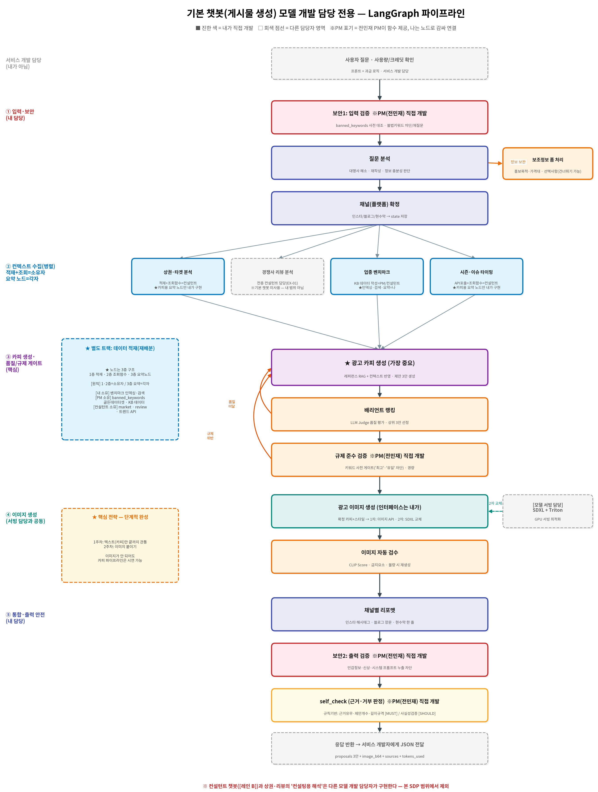

# 소프트웨어 개발 계획서 (SDP)
## 기본 챗봇(게시물 생성) 모델 개발 담당 전용 — 마케팅AI 통합 플랫폼

- **작성 기준**: 코드잇 스프린트 파트4 고급 프로젝트 / 요구사항 명세서 v10 기반
- **개발 기간**: 2026년 8월 10일(월) ~ 8월 22일(토)
- **투입 인원**: 기본 챗봇(게시물 생성) 모델 개발 담당 **1명** (초급 AI 엔지니어)
- **문서 버전**: SDP-Model v1.1 (검증 함수 스텁 선제공 원칙 추가)

---

## 1. 프로젝트 개요 (Project Overview)

### 1.1 우리가 만드는 것
**소상공인을 위한 통합 플랫폼 "마케팅AI"**. 챗봇이 2개다.

- **기본 챗봇(게시물 생성)** — 광고 문구 + 광고 이미지를 만들어 준다.
- **컨설턴트 챗봇** — 상권을 분석해 전략을 제안한다. **이제 그 전략을 바로 광고로 만들 수 있다(v10 확정).**

**왜 2개인가**: 소상공인의 고민은 "광고를 어떻게 쓰지?"만이 아니라 "뭘 팔아야 하지?"도 있기 때문이다.
두 챗봇을 한 플랫폼에 담는 것이 다른 팀과의 차별점이다.

**어떻게 쓰는가(스토리보드 기준)**: 로그인 → 좌측 사이드바에서 **두 챗봇 중 하나를 클릭** →
채팅으로 대화 → 결과물 확인. 하루 무료 사용 횟수가 있고, 초과하면 크레딧을 쓴다.

### 1.2 이 문서의 목적
위 서비스에서 **기본 챗봇(게시물 생성) 모델 개발 담당 1명이 맡는 부분만**  분리 후, 10일 안에 개발 가능한 실행 계획 작성.

### 1.3 기본 챗봇 모델 개발 담당의 한 줄 정의
> **"소상공인의 요청을 받아, 상권·트렌드를 반영한 광고 카피 3안과 이미지 생성 기본 챗봇(게시물 생성) 개발

---

## 2. 개발 범위(Scope)

> 스코프 정의는 SDP에서 가장 중요하다. **'No'라고 말하는 용기**가 일정을 지킨다.

### 2.1 ✅ 포함 범위 (In-Scope)

| 영역 | 내용 |
| --- | --- |
| **LangGraph 파이프라인 골격** | GraphState 정의 · 노드 조립 · 조건부 엣지(재생성 루프) |
| **기본 챗봇 노드 개발** | 질문분석 · 채널확정 · **카피생성** · 랭킹 · 이미지연동 · 이미지검수 · 채널리포맷 |
| **검증 함수 노드 연결** | 전민재 PM이 제공하는 검증 함수 4종을 **LangGraph 노드로 감싸 연결**<br>⚠️ **함수 구현 자체는 전민재 PM 담당**(§2.4) |
| **컨텍스트 요약 노드(3층)** | **상권**·**시즌/이슈** — 타인의 조회 함수를 받아 **카피용 요약 노드만** 구현<br>**업종 벤치마크** — **인덱싱·검색·요약**(데이터 작성은 전민재 PM/컨설턴트 모델 개발 담당자)(§2.6) |
| **평가 스크립트 코드** | HitRate·MRR·LLM Judge·CLIP Score **측정 코드**<br>※ **골든 데이터셋 문항 작성은 전민재 PM 주도**(§2.7) |
| **OpenAI 429 대응** | 모델 호출 측 요청 간격·재시도·토큰 절감 |
| **API 계약 준수** | 서비스 개발 담당이 호출할 응답 JSON 형식 준수 |
| **★ 프롬프트 튜닝** | 카피 품질 개선 — **재배분으로 확보한 시간을 여기에 재투입**(§2.7) |

### 2.2 ❌ 미포함 범위 (Out-of-Scope)

| 미포함 항목 | 담당 |
| --- | --- |
| **컨설턴트 챗봇 기능 구현 전체** | **컨설턴트 챗봇 모델 개발 담당자** |
| 마케팅 전략 제안 노드(메뉴·프로모션·타겟팅) | 컨설턴트 챗봇 모델 개발 담당자 |
| **상권·리뷰 데이터의 '컨설팅용 해석'**(전략 제안 형태로 가공) | **컨설턴트 챗봇 모델 개발 담당자** |
| **경쟁사 리뷰 노드 전체**(적재·조회·요약 3층 모두) | **컨설턴트 챗봇 모델 개발 담당자** |
| 경쟁사 리뷰 차별화 전략 요약(EX-01) | 컨설턴트 챗봇 모델 개발 담당자 |
| **`market_cache` 적재 + 조회 함수**(1·2층) | **컨설턴트 챗봇 모델 개발 담당자** |
| **`review_cache` 적재 + 조회 함수**(1·2층) | **컨설턴트 챗봇 모델 개발 담당자** |
| **트렌드 API 호출 + `get_trend()` 조회 함수**(1·2층) | **컨설턴트 챗봇 모델 개발 담당자** (§2.7) |
| **업종 벤치마크 KB 데이터 작성**(JSON 내용 채우기) | **전민재 PM 또는 컨설턴트 챗봇 모델 개발 담당자** (§2.7) |
| **골든 데이터셋 문항 설계·작성**(55문항) | **전민재 PM 주도** **(§2.7) |
| **`banned_keywords` 사전 설계·작성** | **전민재 PM** |
| **보안1(입력 검증) 판정 함수 구현** | **전민재 PM** |
| **규제 준수 검증 판정 함수 구현** | **전민재 PM** |
| **보안2(출력 검증) 판정 함수 구현** | **전민재 PM** |
| **self_check 판정 함수 구현** | **전민재 PM** |
| 프론트엔드 화면(예: Streamlit UI) | 서비스 개발 담당 |
| REST API 라우터 · 세션 · 로그인 | 서비스 개발 담당 |
| **DB 테이블, 스키마 설계**(테이블 생성) | 서비스 개발 담당 |
| 크레딧·일일 무료 사용량 과금 로직 | 서비스 개발 담당 |
| HITL 승인 화면 · 대기 화면 UI | 서비스 개발 담당 |
| SDXL Triton 서빙 · GPU 최적화 | 모델 서빙 담당 |
| GCP VM 배포 · CI/CD | 임시 인프라 담당 - 윤승준 |

> ⚠️ **경계에서 헷갈리기 쉬운 것 7가지**
> 1. **캐시 테이블**: **테이블을 만드는 건 서비스 개발 담당**, **데이터를 채우는 건 담당별 분담**이다(§2.5). → D1에 스키마 협의 필수
> 2. **이미지 생성**: **호출 인터페이스는 기본 챗봇(게시물 생성) 담당자가**, **SDXL 서빙 최적화는 서빙 담당**이다
> 3. **검증 4종**: **판정 함수는 전민재 PM이 개발하고**, **그것을 그래프 노드로 감싸 연결하는 건 기본 챗봇(게시물 생성) 모델 개발 담당자가**구현한다(§2.4)
> 4. **컨텍스트 해석**: **원본 캐시는 두 챗봇이 함께 읽지만**, 그것을 **어떤 형태로 요약할지는 챗봇마다 다르다.**
>    → 같은 "반경 300m에 카페 12곳" 데이터라도
>      · **기본 챗봇**은 *"경쟁 밀집 지역이니 차별점을 강조하는 카피"* 로 쓰고
>      · **컨설턴트 챗봇**은 *"밀도 상위 15%입니다. 선착순 할인을 제안드립니다"* 로 쓴다
>    → **원본은 공유하고, 요약 함수는 각자 개발한다.** 그래야 "형식 바꿔달라"는 요청으로 서로 멈추지 않는다
> 5. **한 파일에는 주인이 한 명**: `build_basic.py`·`state.py`는 **기본 챗봇(게시물 생성) 모델 개발 담당자가 관리**한다. 전민재 PM은 함수만 제공하고 그래프는 관여하지 않는다. → 머지 충돌 방지
> 6. **컨텍스트 노드 3층 구조**(§2.6): **1층 적재 + 2층 조회 함수는 같은 사람이 관리**하고, **3층 요약 노드만 각자** 개발한다.
>    → 데이터를 **넣은 사람이 꺼내는 문까지** 만들어야, 저장 형식이 바뀔 때 한 사람만 고치면 된다
> 7. **평가는 "코드"와 "데이터" 분리**(§2.7): **측정 스크립트 코드는 기본 챗봇(게시물 생성) 모델 개발 담당자가**, **골든 데이터셋 문항은 전민재 PM**이 개발한다.
>    → **만든 사람이 자기 채점 기준을 만들면 편향**이 생기므로, 검증 기준은 제3자가 정하는 게 원칙이다

### 2.3 우선순위 — MUST / SHOULD / COULD

> 10일 안에 다 못 만들 수 있다. 하여 **미리 우선 순서를 정해둔다.**

| 등급 | 항목 | 판단 기준 |
| --- | --- | --- |
| 🔴 **MUST** | LangGraph 골격, 질문분석, 채널확정, **카피 생성(3안)**, 랭킹, 채널리포맷, **전민재 PM 검증 함수 4종 노드 연결**, API 계약 준수 | **없으면 라이브 시연 불가** |
| 🟠 **SHOULD** | 이미지 생성 연동, 이미지 자동 검수, 벤치마크 인덱싱·검색, 시즌·이슈 요약 노드, **상권 카피용 요약 노드**, 평가 스크립트, **★프롬프트 튜닝** | **구현 시 기술적 완성도 향상** |
| 🟢 **COULD** | SDXL 자체 호스팅 교체, RAGAS 전체 지표, 재생성 루프 고도화 | **필요 시 구현 진행** |

### 2.4 ⚠️ 검증 4종 노드 — 전민재 PM 직접 개발

> **대상**: 보안1(입력 검증) · 규제 준수 검증 · 보안2(출력 검증) · **self_check(모델 답변 검증)**
> **개발 주체**: **전민재 PM이 판정 함수를 직접 구현**한다.
> **기본 챗봇(게시물 생성) 모델 개발 담당자 역할**: 제공받은 함수를 **LangGraph 노드로 감싸 파이프라인에 연결**한다.

**왜 전민재 PM이 직접 개발하는가 (배분 근거)**
1. **정책 판단 영역** — "무엇을 차단할 것인가"는 코딩보다 **서비스 기획 판단**이다. 코드잇 스프린에서 안내해준 프로젝트 상세 가이드에 적힌 PM 역할에도 *"서비스 기획"*, *"서비스 테스트 및 평가"*가 명시돼 있다.
2. **의존성이 낮다** — 입력은 문자열, 출력은 판정 결과. 로직이 독립적이라 **전민재 PM의 조율 업무와 병행 가능**하다.
3. **기본 챗봇 담당자 업무 부하 완화** — 덜어낸 시간을 **카피 프롬프트 튜닝(D10)** 에 쓸 수 있다.

**★ 함수 인터페이스 (D1 합의 — 반환 형식 통일)**
```python
# validation/ — 전민재 PM 개발
# 코드 예시
def check_input(text: str) -> dict:
    """보안1: 입력 검증 (불법 키워드 · 프롬프트 인젝션 대표 패턴)"""
    return {"action": "pass"/"warn"/"block", "message": "..."}

def check_regulation(copy: str) -> dict:
    """규제 준수 검증 (표시광고법 · 식품표시광고법 키워드 게이트)"""
    return {"action": "pass"/"warn"/"block", "message": "..."}

def check_output(text: str) -> dict:
    """보안2: 출력 검증 (민감정보 · 신상 · 시스템 프롬프트 누출)"""
    return {"action": "pass"/"warn"/"block", "message": "..."}

def self_check(result: dict, context: dict) -> dict:
    """모델 답변 검증 — 근거 · 완결성 판정"""
    return {
        "action": "pass"/"warn"/"reject",
        "reasons": ["근거 없음", "제안 개수 부족"],   # 실패 사유
        "message": "..."                             # 사용자 안내 문구
    }
```

> **반환 형식 통일 이유**: 네 함수를 **같은 방식으로 노드에 감쌀 수 있어** 연동 코드가 단순해진다.

**★★ 스텁 선제공 원칙 — D1에 4개 함수를 "껍데기"로 먼저 만들어 둔다**

> **문제**: 함수마다 완성 시점이 다르다(`check_input`은 D2, `check_output`·`self_check`는 D5).
> 완성된 것만 제공하면, 담당자는 **나머지를 import조차 못 해 기다리게 된다.**
>
> **해법**: **D1에 전민재 PM이 4개 함수를 전부 `pass` 반환 스텁으로 만들어 커밋**한다.
> 담당자는 D1부터 **네 함수를 모두 import해 노드를 연결**할 수 있고,
> 전민재 PM은 이후 **함수 내용만 채워 넣으면** 담당자 코드는 손대지 않아도 된다.

```python
# validation/security.py — D1에 이 상태로 먼저 커밋 (전민재 PM)

def check_input(text: str) -> dict:
    """보안1: 입력 검증 — D2에 구현 완료 예정"""
    return {"action": "pass", "message": ""}   # ← D2에 내용 채움

def check_output(text: str) -> dict:
    """보안2: 출력 검증 — D5에 구현 예정"""
    return {"action": "pass", "message": ""}   # ← D5에 내용 채움
```

> **`check_output`은 D2 시점에 아직 만들지 않지만, `pass` 스텁으로 먼저 존재해야 한다.**
> 그래야 담당자가 D2에 `security.py`를 import할 때 **함수가 없어 에러가 나지 않는다.**
> 같은 원칙을 `regulation.py`·`self_check.py`에도 적용한다.

**⚠️ 범위 한정 — 프롬프트 인젝션 방어**
- 완벽한 방어법은 존재하지 않으므로, **대표 패턴 5~10개 차단**으로 범위를 한정한다.
  (예: "이전 지시 무시", "시스템 프롬프트", "너는 이제 ~야")
- 출력 측에서는 **시스템 프롬프트 문자열이 그대로 노출되는지**만 검사한다.
- 발표 시: *"완벽 방어는 불가능하다고 판단해 대표 패턴 차단으로 범위를 정했다"* 로 설명한다.

**⚠️ 범위 한정 — self_check**
| 구분 | 내용 | 등급 |
| --- | --- | --- |
| **(A) 규칙 기반** | 근거(sources) 유무 · 제안 3개 완결성 · 채널별 길이 규격 · 필수 필드 누락 | 🔴 **MUST** |
| **(B) 사실성 검증** | Faithfulness — 카피 내용이 컨텍스트와 일치하는가(LLM 재호출 필요) | 🟠 **SHOULD** |

> **(B)를 SHOULD로 둔 이유**: LLM을 한 번 더 호출해야 해 **OpenAI $30 한도 리스크**가 커지고,
> 판정 자체도 부정확할 수 있다. **(A)만으로도 "모델 답변 검증 노드 구현"의 근거는 충분하다.**

**개발 순서 주의**
> self_check는 **파이프라인 맨 끝**에 있어, 앞 노드(카피생성 D3·랭킹 D4)가 완성돼야 실제 검증이 가능하다.
> → 전민재 PM이 미리 만들어두고, 기본 챗봇(게시물 생성) 모델 개발 담당자는 **D5에 연결**한다. 그전까지는 **통과(pass-through) 처리**해 서로 막지 않는다.

### 2.5 데이터 적재 재배분

> **"그 데이터를 가장 깊이 쓰는 사람이 채운다"**는 원칙에 따라 업무 재배분한다.

| 테이블/데이터 | 적재 담당 | 배분 근거 |
| --- | --- | --- |
| 업종 벤치마크 KB **데이터** | **전민재 PM 또는 컨설턴트 챗봇 개발 담당자** | **코딩이 아니라 자료 수집·정리** 작업 |
| 업종 벤치마크 **인덱싱·검색 코드** | **기본 챗봇(게시물 생성) 모델 개발 담당자** | FAISS 인덱싱은 **개발 작업** |
| `banned_keywords` | **전민재 PM** | 이를 사용하는 **검증 함수 4종을 전민재 PM이 직접 개발**하므로 사전도 전민재 PM이 설계 진행 |
| `market_cache` | **컨설턴트 챗봇 모델 개발 담당** | **상권 분석이 컨설턴트의 주력 기능**(추천 질문 "주변 경쟁사는 얼마나 되나요?") |
| `review_cache` | **컨설턴트 챗봇 모델 개발 담당** | **EX-01(경쟁사 리뷰 분석)이 컨설턴트 소속으로 확정**됨(v9 반영) |
| **트렌드 API 호출** | **컨설턴트 챗봇 모델 개발 담당** | 상권 API 클라이언트와 **작업 패턴이 동일**(호출·파싱·캐시). 한 사람이 묶어 만드는 게 빠름 |

**공유 원칙**
```
· 원본 캐시는 두 챗봇이 함께 읽는다
· 읽어서 요약하는 코드는 각자 개발한다
```

> **이 재배분의 효과 3가지**
> 1. **업무량 균형** — 기본 챗봇(게시물 생성) 모델 개발 담당자는 카피·이미지·평가에 집중할 시간이 확보된다
> 2. **컨설턴트 챗봇 개발 담당자 독립적인 업무 수행** — 기본 챗봇(게시물 생성) 모델 개발 담당자가 데이터 적재할 때 까지 기다리지 않고 본인 일정으로 진행 가능
> 3. **데이터 품질 향상** — 자기가 쓸 데이터를 자기가 채우면 필드 부족 시 즉시 보완

### 2.6 ★ 컨텍스트 노드 3층 구조 구현 — 업무 분배

> 컨텍스트 노드는 사실 **한 덩어리가 아니라 3층**이다. 층별로 담당을 나눠야 충돌이 없다.

```
[1층] 데이터 확보  — API 호출 / 크롤링 → DB 적재   (배치, 파이프라인 밖)
[2층] 조회 함수    — DB에서 원본 꺼내오기            (공용)
[3층] 요약 노드    — 꺼낸 원본을 "기본 챗봇(게시물 생성)이 쓸 형태"로 가공  (각자)
```

**★ 분배 원칙 한 줄**
> **1층과 2층은 같은 사람이 관리한다. 3층 요약 노드만 각자 개발한다.**

**분배표**

| 컨텍스트 | 1층 적재 | 2층 조회 함수 | 3층 요약 노드 |
| --- | --- | --- | --- |
| **상권·타겟** | 컨설턴트 | **컨설턴트** | **각자** (기본용=기본 챗봇(게시물 생성) / 컨설팅용=컨설턴트) |
| **경쟁사 리뷰** | 컨설턴트 | **컨설턴트** | **컨설턴트** — 기본 챗봇(게시물 생성) 미사용 |
| **업종 벤치마크** | **전민재 PM/컨설턴트(데이터) | **기본 챗봇(게시물 생성)**(인덱싱·검색) | **기본 챗봇(게시물 생성)** |
| **시즌·이슈** | **컨설턴트** | **컨설턴트** | **기본 챗봇(게시물 생성)** |

**분배 근거 3가지**
1. **적재한 사람이 조회 함수도 만들어야 한다** — 저장 형식(JSON 구조·좌표 반올림·TTL)을 아는 사람이 꺼내는 함수까지 만들어야, *"이 필드가 왜 이렇게 들어있죠?"* 라는 왕복이 없다.
2. **3층만 분리하면 충돌이 안 난다** — 서로 다른 파일을 만지므로 동시 작업해도 머지 충돌이 없다.
3. **경쟁사 리뷰는 기본 챗봇(게시물 생성) 몫이 아예 없다** — EX-01은 **컨설턴트 소속·[확장] 등급**으로 확정됐으므로, 기본 챗봇(게시물 생성)모델 개발 담당자는 **3층 요약 노드조차 개발하지 않는다.**

**파일 관리 예시**
```
[컨설턴트 관리]
  cache/market_repo.py         ← 적재 + 조회 함수 (1·2층)
  cache/review_repo.py         ← 적재 + 조회 함수 (1·2층)
  cache/trend_repo.py          ← 트렌드 API 호출 + 조회 함수 (1·2층)
  nodes/market_for_consult.py  ← 컨설팅용 요약 (3층)
  nodes/review_for_consult.py  ← 컨설팅용 요약 (3층)

[기본 챗봇(게시물 생성) 관리]
  nodes/market_for_copy.py     ← 카피용 요약 (3층), market_repo를 import만
  nodes/trend_for_copy.py      ← 카피용 요약 (3층), trend_repo를 import만
  ※ review 관련 파일은 만들지 않음
```

**★ D1에 받을 조회 함수 시그니처 (컨설턴트 챗봇 모델 개발 담당자 제공)**
```python
# cache/market_repo.py — 컨설턴트 챗봇 모델 개발 담당자 제공
def get_market(lat: float, lng: float, radius: int = 500) -> dict:
    """상권 캐시 조회. 없으면 None."""
    return {
        "total_count": 43,           # 반경 내 전체 매장 수
        "same_industry_count": 12,   # 동일 업종 수
        "nearest_distance_m": 55,    # 최근접 동일업종 거리
        "industry_breakdown": {...}  # 업종별 분포
    }

# cache/trend_repo.py — 컨설턴트 챗봇 모델 개발 담당자 제공
def get_trend(keyword: str, industry: str = None) -> dict:
    """검색어 트렌드 조회. 없으면 None."""
    return {
        "keyword": "아이스아메리카노",
        "direction": "상승",          # 상승/하락/유지
        "related": ["여름음료", "냉커피"],
        "weather": {"temp": 31, "sky": "맑음"}   # 선택
    }
```

- **이 반환 형식만 정해지면**, 컨설턴트 챗봇 모델 개발 담당자의 데이터 적재가 끝나기 전에도 **mock으로 요약 노드를 먼저 만들 수 있다.**
- 서로 기다리지 않는 구조가 여기서도 적용된다.
- ※ **컨설턴트 챗봇 모델 개발 담당자에게도 §2.4의 스텁 선제공 원칙을 동일하게 요청**한다(D1에 `pass`/mock 반환으로 먼저 커밋).

**이 분배로 줄어든 기본 챗봇(게시물 생성) 작업**
- `context_review.py` **삭제** — 경쟁사 리뷰는 기본 챗봇 미사용
- 상권 **조회 함수 불필요** — 컨설턴트 챗봇 모델 개발 담당자가 제공, 기본 챗봇(게시물 생성) 모델 개발 담당자는 요약만
- **트렌드 API 클라이언트 불필요** — 컨설턴트 챗봇 모델 개발 담당자가 제공, 기본 챗봇(게시물 생성) 모델 개발 담당자는 요약만
- **벤치마크 KB 데이터 작성 불필요** — 전민재 PM/컨설턴트 챗봇 모델 개발 담당자가 작성, 기본 챗봇(게시물 생성) 모델 개발 담당자는 인덱싱·검색만

### 2.7 ★ 업무 재배분 3건 — 확보 시간 재투입

> **"코딩이 아닌 일"과 "편향이 생기는 일"을 덜어내고, 그 시간을 카피 품질에 투입한다.**

**재배분 3건과 근거**

| # | 넘기는 작업 | 받는 사람 | 근거 |
| --- | --- | --- | --- |
| 1 | **트렌드 API 호출 + 조회 함수**(1·2층) | **컨설턴트 챗봇 모델 개발 담당자** | 상권 API 클라이언트와 **작업 패턴이 동일**(호출·파싱·캐시·재시도). 한 사람이 두 개를 만드는 게 두 사람이 하나씩 만드는 것보다 빠르다 |
| 2 | **골든 데이터셋 문항 설계·작성**(55문항) | **전민재 PM 주도** | ① *"무엇이 좋은 답인가"* 를 정하는 **검증 기준 설계**로, 코드잇 스프린트 제공해준 프로젝트 가이드의 전민재 PM 역할 **"서비스 테스트 및 평가"** 에 해당<br>② **만든 사람이 자기 채점 기준을 만들면 편향**이 생긴다. 잘 만든 것 위주로 문항을 짜게 됨<br>③ **거부 10문항은 전민재 PM이 구현한 검증 함수를 검증**하는 용도라 이미 전민재 PM 영역 |
| 3 | **업종 벤치마크 KB 데이터 작성**(JSON 내용) | **전민재 PM 또는 컨설턴트 챗봇 모델 개발 담당자** | *"업종별 잘 쓴 광고 카피 예시"* 수집·정리는 **코딩이 아니라 자료 작업**이다. 반면 **FAISS 인덱싱 코드는 개발**이므로 기본 챗봇(게시물 생성) 담당자가 유지 |

**★ 절대 넘기지 않는 것 3가지 (반대 근거)**

| 유지 항목 | 왜 넘기면 안 되는가 |
| --- | --- |
| **카피 생성 노드 + 프롬프트 튜닝** | **기본 챗봇(게시물 생성)의 존재 이유**이자 D10 튜닝과 한 몸. 개발한 담당자가 튜닝해야 *"이 표현을 바꾸니 결과가 이렇게 달라진다"* 는 감이 생긴다. 다른 담당자가 만들면 튜닝 때마다 왕복 발생 |
| **LangGraph 그래프 조립** | `build_basic.py`는 노드를 만들 때마다 고치는 파일. **관리자가 한 명**이어야 머지 충돌이 없다 |
| **이미지 생성 연동** | **R1(최대 리스크)** 이라 문제 발생 시 즉시 대응할 사람이 붙어 있어야 한다. 1차 API → 2차 SDXL 교체도 인터페이스 설계자가 해야 매끄럽다 |

**★ 확보한 시간과 재투입 계획**

| 이관 작업 | 절약 시간 |
| --- | --- |
| 트렌드 API 호출(1·2층) | 약 0.5일 |
| 골든 데이터셋 55문항 작성 | 약 1.0일 |
| 벤치마크 KB 데이터 작성 | 약 0.5일 |
| **합계** | **약 2일 (10일 중 20%)** |

```
[재투입 원칙]
확보한 2일 → D3 카피 생성 + D10 프롬프트 튜닝에 투입한다.

왜 여기인가:
· 결과물 품질이 가장 크게 달라지는 지점
· 시연에서 심사자가 실제로 보는 것이 '카피 그 자체'
· 평가 항목 "생성 품질"과 직결
```

> ⚠️ **전민재 PM 업무 과부하 주의**
> 전민재 PM은 이미 **검증 함수 4종**을 맡았다. 여기에 **골든 데이터셋 55문항 + 벤치마크 KB 데이터**까지 얹으면 부담이 크다.
> → **권고**: 골든 데이터셋은 전민재 PM이 **기준(유형별 문항 수·정답 판정 기준)만 정하고**,
>   실제 55문항 작성은 **팀원이 나눠서**(각 15문항) 쓰고 **전민재 PM이 검수**하는 방식을 권한다.
>   그래야 전민재 PM이 조율 업무를 놓지 않는다.

---

## 3. 개발 방법론 (Methodology)

### 3.1 애자일 · 2 스프린트 구성
- 1인 개발 + 2주 → 모놀리식 코드라도 동작 먼저, 리팩토링 나중
- 매일 데일리 스크럼 참여 필수
- **스프린트 1**(8/10~8/14): **텍스트(카피) 파이프라인 관통**
- **스프린트 2**(8/17~8/21): 이미지 붙이기 + 평가 + 서비스 연동 + **카피 튜닝**
- **8/22(토)**: 통합 테스트 + 버퍼

### 3.2 ★ 핵심 전략 — 단계적 완성 (중요!)

- **문제**: 카피 생성 + 이미지 생성 + 평가를 동시에 하면 초급자는 셋 다 미완성으로 끝난다.
- **해법**: 1주차엔 **이미지 생성 기능 개발 작업 보류.**

```
(예시)
[1주차] 텍스트(카피)만 끝까지 관통
        질문 → 컨텍스트 → 카피 3안 → 랭킹 → (규제검증) → 리포맷 → 응답
        ※ 이 상태만으로도 시연 가능
   ↓
[2주차] 이미지 붙이기 + 평가 + 튜닝
        이미지 생성 연동 → 검수 → 성능 측정 → 프롬프트 튜닝
```

**왜 이 방식인가**: 이미지 생성은 **GPU·모델 로딩·용량 문제로 막힐 확률이 가장 높다.**
카피 파이프라인을 먼저 완성해두면, **이미지가 끝내 안 되어도 시연할 것이 남는다.**

### 3.3 ★ 이미지 생성 2단계 전략 (리스크 분산)

| 단계 | 방식 | 시점 | 비고 |
| --- | --- | --- | --- |
| **1차(확실)** | **이미지 생성 API 호출** | D6 | 코드잇 제공 OpenAI 이미지 모델 활용. GPU 불필요 |
| **2차(도전)** | **SDXL 자체 호스팅** | D10 이후 / COULD | 모델 서빙 담당자가 Triton에 올리면 **엔드포인트만 교체** |

- **설계 원칙**: `image_client.py` 하나로 감싸서, **호출부 코드는 그대로 두고 내부만 바꾼다.**
- 이렇게 해두면 SDXL이 늦어져도 파이프라인 전체가 멈추지 않는다.

### 3.4 데일리 스크럼 참여
매일 10~15분 **[어제 한 일 / 오늘 할 일 / 막히는 부분(Blocker)]** 공유.
초급 개발자는 혼자 오래 파는 경향이 있으므로 **30분 룰**(30분 시도해도 안 되면 즉시 공유)을 지킨다.

### 3.5 일일 통합(Daily Merge) 원칙
최소 2일 단위로 GitHub에 머지한다. 특히 **서비스 개발 담당자와의 연동부**는 빨리 합칠수록 좋다.

### 3.6 ★ 스텁 우선(Stub-First) 협업 원칙

> **팀 전체에 적용하는 원칙**: 남에게 제공할 함수는 **D1에 `pass`/mock 반환 껍데기로 먼저 커밋**한다.

```
(예시)
[문제] 함수가 완성돼야 제공 → 받는 사람은 그때까지 import조차 못 함 → 대기 발생

[해법] D1에 스텁부터 제공
   전민재 PM      → check_input / check_regulation / check_output / self_check  (모두 pass 반환)
   컨설턴트 → get_market() / get_trend()                                  (mock 데이터 반환)
   ↓
   담당자는 D1부터 전부 import해 노드를 연결할 수 있다
   ↓
   제공자는 이후 내용만 채운다 → 받는 사람 코드는 손댈 필요 없음
```

> **이 원칙의 효과**: 팀원 누구도 **"남의 코드를 기다리느라 멈추는 시간"**이 없어진다.
> §3.2의 단계적 완성 전략과 함께, 이 SDP 개발 계획서의 **2대 협업 안전장치**다.

---

## 4. 일정 및 마일스톤 (Schedule & Milestones)

> **실작업일 계산**: 8/10~8/22 중 주말(8/15·8/16 일부) 제외 → **실작업 11일 + 8/22(토) 버퍼**
> ★ **업무 재배분으로 대략 2일 확보 → D3 확장 + D10 튜닝에 재투입**(§2.7)

### 4.1 스프린트 1 — 텍스트 파이프라인 관통 (8/10 월 ~ 8/14 금)

| 일자 | 작업 내용 | 완료 기준(DoD) |
| --- | --- | --- |
| **D1** 8/10(월) | · **서비스 개발 담당자와 API 계약(JSON 형식) 합의** ← 최우선<br>· **캐시 테이블 스키마 협의**(기본 챗봇(게시물 생성) 모델 개발 담당자가 읽을 컬럼 확인)<br>· **컨설턴트 챗봇 모델 개발 담당자와 3층 분배 확정 + `get_market()`·`get_trend()` 시그니처 수령**(§2.6)<br>· **⚠️ 전민재 PM과 검증 함수 4종 인터페이스 합의**(§2.4)<br>· **★ 전민재 PM·컨설턴트 챗봇 모델 개발 담당자에게 스텁 선제공 요청**(§3.6) — D1 중 `pass`/mock 커밋<br>· **전민재 PM과 골든 데이터셋 기준 합의**(§2.7)<br>· **전민재 PM 주재 GraphState 공통 규격 확정**<br>· LangGraph 프로젝트 구조 + GraphState 정의<br>· OpenAI 키 연결 테스트 | 그래프가 빈 노드로 START→END 실행됨<br>**타인 함수 6종을 전부 import 가능** |
| **D2** 8/11(화) | · 질문 분석 노드(재작성·정보충분성)<br>· **전민재 PM 제공 `check_input()` 을 보안1 노드로 감싸 연결**<br>· **★ `check_output()`·`self_check()` 도 이 시점엔 `pass` 스텁 상태이므로,<br>&nbsp;&nbsp;노드 연결까지 미리 해둔다**(D5에 전민재 PM이 내용만 채우면 자동 반영)<br>· (전민재 PM 함수 미완 시) **통과 처리 스텁**으로 두고 진행 | 질문 분석 노드 동작 / **검증 노드 4개 자리 모두 확보** |
| **D3** 8/12(수) | · **★ 광고 카피 생성 노드**(가장 중요)<br>· 프롬프트 설계 · 제안 **3안** 생성<br>· 채널(플랫폼) 확정 반영<br>· **★확보 시간 재투입: 채널별 프롬프트 차별화까지 이날 완성** | "여름 신메뉴 홍보" 입력 → 카피 3안 출력<br>인스타/현수막 결과가 **뚜렷이 다름** |
| **D4** 8/13(목) | · 배리언트 랭킹 노드(LLM Judge)<br>· **전민재 PM 제공 `check_regulation()` 을 규제검증 노드로 연결**<br>· 재생성 루프(품질미달·규제위반) | 품질 미달 카피가 재생성됨 |
| **D5** 8/14(금) | · 채널별 리포맷(인스타/현수막)<br>· **전민재 PM이 `check_output()`·`self_check()` 내용을 채움 → 기본 챗봇(게시물 생성) 담당자가 직접 구현한  노드는 수정 불필요**(D2에 연결 완료)<br>· 동작 확인 및 판정 결과 처리 검증<br>· **API 계약 형식으로 JSON 반환**<br>· **스프린트 1 회고(KPT)** | **텍스트 파이프라인 E2E 관통 완료** |

> **스프린트 1 목표(가장 중요)**: **"이미지는 없지만 카피(문구)는 끝까지 나오는 챗봇"**.
> 이 상태가 되면 이후에 무슨 일이 생겨도 시연할 것이 있다.

### 4.2 스프린트 2 — 이미지 + 평가 + 튜닝 (8/17 월 ~ 8/21 금)

| 일자 | 작업 내용 | 완료 기준(DoD) |
| --- | --- | --- |
| **D6** 8/17(월) | · `image_client.py` 인터페이스 설계<br>· **1차: 이미지 생성 API 연동**<br>· base64 반환 형식 맞추기 | 카피 기반 이미지 1장이 생성되어 base64로 반환 |
| **D7** 8/18(화) | · **서비스 개발 담당자와 실연동 작업 진행**(Mock → 실제 교체)<br>· 응답 형식 불일치 대응<br>· 429 대응(요청 간격·재시도·백오프) | 서비스 화면에서 기본 챗봇(게시물 생성) 결과가 표시됨 |
| **D8** 8/19(수) | · 이미지 자동 검수(CLIP Score·금지요소)<br>· **벤치마크 인덱싱·검색 코드**(데이터는 전민재 PM/컨설턴트 챗봇 모델 개발 담당자 제공분 사용)<br>· **시즌·이슈 카피용 요약 노드**(`get_trend()` 연동)<br>· **★확보 시간: 컨텍스트 주입 전후 카피 비교 실험** | 벤치마크·트렌드가 카피에 반영됨<br>주입 전후 차이를 **문서로 기록** |
| **D9** 8/20(목) | · **평가 스크립트 코드 작성**(HitRate·MRR·LLM Judge)<br>· **전민재 PM 제공 골든 데이터셋으로 1차 측정**<br>· **상권 카피용 요약 노드**(`get_market()` 연동) | 평가 스크립트 1회 실행 → 점수 산출 |
| **D10** 8/21(금) | · **★★ 프롬프트 튜닝 집중일**(확보 시간 재투입)<br>&nbsp;&nbsp;— 평가 점수 기반 개선 → 재측정 → 반복<br>&nbsp;&nbsp;— 튜닝 전후 비교표 작성(발표 자료용)<br>· 이미지 지표 측정(CLIP Score)<br>· **스프린트 2 회고(KPT)** | **튜닝 전후 점수 비교표 완성**<br>(발표에서 그대로 사용) |

### 4.3 마무리 (8/22 토)
- 팀 전체 통합 테스트(§8 시나리오)
- 버그 수정 · 발표용 시연 리허설
- 버퍼: 앞선 일정이 밀렸다면 못했던 개발 작업 이어서 진행

### 4.4 마일스톤 요약

| 마일스톤 | 날짜 | 판정 기준 |
| --- | --- | --- |
| **M1** API 계약·스키마·3층 분배·검증 인터페이스·평가 기준 확정 + **스텁 6종 수령** | 8/10 | 서비스 개발 담당·컨설턴트 챗봇 모델 개발 담당·전민재 PM과 합의 완료 |
| **M2** 카피 생성 성공 | 8/12 | 프롬프트로 카피 3안이 실제로 나옴 + 채널별 차별화 |
| **M3** 텍스트 파이프라인 관통 | 8/14 | 질문→응답 JSON까지 끊김 없이 동작 |
| **M4** 이미지 생성 성공 | 8/17 | 이미지 1장이 base64로 반환 |
| **M5** 서비스 연동 완료 | 8/18 | 서비스 화면에 기본 챗봇(게시물 생성) 결과가 표시됨 |
| **M6** 평가 수치 확보 | 8/20 | 골든 데이터셋 기반 점수 산출 |
| **M7** 튜닝 성과 확보 | 8/21 | **튜닝 전후 점수 비교표** 완성 |

---

## 5. 자원 및 역할 (Resources & Roles)

### 5.1 인력
| 역할 | 인원 | 비고 |
| --- | --- | --- |
| **기본 챗봇 모델 개발 담당** | **1명 (초급 AI 엔지니어)** | **본 SDP의 대상** |
| 컨설턴트 챗봇 모델 개발 담당 | 별도 | 그래프 구조 공유 · **market/review/trend 1·2층 관리** · 조회 함수 제공 |
| 서비스 개발 담당 | 별도 | 기본 챗봇(게시물 생성)을 **호출**함 (API 계약) |
| 모델 서빙 담당 | 별도 | SDXL Triton 서빙(2차) |
| 인프라 담당 | 임시-윤승준 | 배포·CI/CD |
| **전민재 PM** | **전민재** | 일정·의사결정 · **검증 함수 4종 직접 개발**(§2.4) · **골든 데이터셋·KB 데이터**(§2.7) · **GraphState 규격 주재** |

### 5.2 기술 스택

| 영역 | 선택 | 선택 이유 |
| --- | --- | --- |
| 파이프라인 | **LangGraph** | 조건부 엣지로 재생성 루프 구현 용이 |
| LLM | **코드잇 제공 OpenAI API** | 팀 공통. 한도 $30 주의 |
| 임베딩/검색 | **text-embedding-3-small + FAISS** | 가볍고 학습 완료된 스택 |
| 이미지 생성 | **1차: 이미지 생성 API / 2차: SDXL** | §3.3 참조. 리스크 분산 |
| 규제 검증 | **키워드 사전(JSON→DB)** | 법령 API 대비 지연 최소(v9 §14 확정) · **전민재 PM 직접 개발** |
| 평가 | **직접 구현(HitRate·MRR·LLM Judge)** | RAGAS 전체는 COULD · **코드는 기본 챗봇(게시물 생성) 모델 개발 담당자, 데이터는 전민재 PM** |

### 5.3 개발 환경
- GCP VM(L4 GPU) — VSCode Remote-SSH로 접속 (팀 표준)
- 코드 반영: **GitHub PR → main merge** (VM 직접 수정 금지 — 팀 원칙)
- 브랜치: `feature/model-basic-*` 네이밍
- **파일 관리권**: `graph/`·`nodes/`(기본 챗봇(게시물 생성) 3층) 는 **기본 챗봇(게시물 생성) 모델 개발 담당자가 관리**, `validation/` 은 **전민재 PM**, `cache/`(1·2층) 는 **컨설턴트 챗봇 모델 개발 담당자** → 머지 충돌 방지

### 5.4 ⚠️ OpenAI API 예산 관리 (팀 공통 자원)
- 팀 전체 한도 **$30**, 초과 시 **키 즉시 비활성화**
- 디스코드 팀 채널에서 `!usage`로 사용량 확인 (1분 1회)
- **평가 원칙**: 평가 스크립트는 **직렬 실행 + 요청 간 sleep**. 병렬 호출 금지
- 대량 평가 전 **전민재 PM에게 사전 공유**하고 실행
- ⚠️ **D10 튜닝일은 재측정을 반복**하므로 호출량이 몰린다. **전날 전민재 PM과 잔여 예산 확인** 필수
- ⚠️ **self_check (B) 사실성 검증**은 LLM 재호출이므로, 적용 시 호출량 증가를 전민재 PM과 사전 협의

---

## 6. 시스템 설계

### 6.1 파이프라인 (기본 챗봇 모델 개발 관점)


```
(예시)
[서비스 개발 담당] 사용자 질문 · 사용량/크레딧 확인
        ↓
① 보안1: 입력 검증 (banned_keywords 사전 대조)   ※전민재 PM 직접 개발
        ↓
  질문 분석 (재작성·정보충분성)  →(정보 부족)→ 보조정보 폼 처리
        ↓
  채널(플랫폼) 확정 → state 저장
        ↓
② 컨텍스트 수집(병렬)   ※ 1·2층=관리자 / 3층 요약 노드=각자 (§2.6)
   · 상권·타겟 분석    → 적재+조회함수=컨설턴트 / ★카피용 요약 노드=기본 챗봇(게시물 생성) 모델 개발 담당자
   · 경쟁사 리뷰 분석  → 전층 컨설턴트 담당(EX-01) / ※기본 챗봇 미사용
   · 업종 벤치마크     → KB 데이터 작성=전민재 PM/컨설턴트 챗봇 모델 개발 담다자 / ★인덱싱·검색·요약=기본 챗봇(게시물 생성) 모델 개발 담당자
   · 시즌·이슈 타이밍  → API호출+조회함수=컨설턴트 / ★카피용 요약 노드=기본 챗봇(게시물 생성) 모델 개발 담당자
        ↓
③ ★ 광고 카피 생성 (제안 3안)  ←──┐
        ↓                          │ 품질 미달
   배리언트 랭킹 (LLM Judge) ───────┤
        ↓                          │ 규제 위반
   규제 준수 검증 (키워드 게이트) ──┘   ※전민재 PM 직접 개발
        ↓
④ 광고 이미지 생성 (1차 API → 2차 SDXL)
        ↓
   이미지 자동 검수 (CLIP·금지요소)
        ↓
⑤ 채널별 리포맷
        ↓
   보안2: 출력 검증                    ※전민재 PM 직접 개발
        ↓
   self_check (근거·거부 판정)         ※전민재 PM 직접 개발
        ↓
[서비스 개발 담당] 응답 JSON 전달 → 화면 표시

※ 별도 트랙: 노드는 3층 구조 (§2.6)
   1층 적재 · 2층 조회 함수 · 3층 요약 노드
   [원칙] 1·2층은 같은 사람이 관리, 3층 요약만 각자 개발한다
   [기본 챗봇(게시물 생성) 모델 개발 담당자 관리] 벤치마크 인덱싱·검색
   [전민재 PM 관리] banned_keywords · 골든데이터셋 · KB 데이터
   [컨설턴트 챗봇 모델 개발 담당자 관리] market_cache · review_cache · 트렌드 API
```

### 6.2 ★ 서비스 개발 담당자와의 API 계약 (D1에 반드시 합의)

> 이 계약만 정해지면 **양쪽이 서로를 기다리지 않고 병렬로 개발**할 수 있다.
> 서비스 개발 담당은 이 형식의 Mock으로 화면을 만들고, 기본 챗봇(게시물 생성) 담당자는 이 형식을 채우기만 하면 된다.

**요청 (서비스 → 기본 챗봇(게시물 생성))**
```json
{
  "chatbot_type": "basic",
  "user_id": 1,
  "question": "여름 신메뉴 홍보 문구 만들어줘",
  "platform": "instagram",
  "store": { "name": "카페 코드잇", "type": "카페",
             "address": "서울 강남구 역삼동", "lat": 37.5, "lng": 127.0 },
  "extra": { "purpose": "신메뉴 출시", "price_range": "5000-8000" }
}
```

**응답 (기본 챗봇(게시물 생성) → 서비스)**
```json
{
  "status": "ok",
  "title": "여름 신메뉴 홍보",
  "proposals": [
    { "copy": "제안1 문구...", "image_b64": "iVBORw0KG..." },
    { "copy": "제안2 문구...", "image_b64": "..." },
    { "copy": "제안3 문구...", "image_b64": "..." }
  ],
  "sources": ["상권분석", "트렌드"],
  "tokens_used": 1520
}
```

**차단·거부 시 응답** *(전민재 PM 검증 함수 판정 결과 그대로 전달)*
```json
{
  "status": "blocked",
  "reason": "exaggeration",
  "message": "'최고'와 같은 표현은 표시광고법상 부당광고가 될 수 있어요. 다른 표현을 제안드릴까요?"
}
```

> **협의 포인트**: ① 제안 개수 **3개 고정**(스토리보드 확정) ② 이미지는 **base64 인라인**
> ③ 실패 시 `{"status":"error"}` ④ 이미지 생성 실패해도 **카피만이라도 반환**(부분 성공 허용)

### 6.3 ★ 데이터 적재 (담당별 분담)

> **역할 구분**: 테이블(스키마)은 **서비스 개발 담당자가** 개발하고, **데이터는 담당별로 나눠서 채운다.**
> 채워진 **원본 데이터는 두 챗봇이 함께 읽되**, **읽어서 요약하는 코드는 각자** 개발한다.

**[기본 챗봇(게시물 생성) 모델 개발 담당자 기능 구현 사항 — 코드만]**

| 대상 | 기능 구현 사항 | 우선순위 |
| --- | --- | --- |
| 업종 벤치마크 | **FAISS 인덱싱 코드 + 검색 함수 + 요약 노드**<br>※ KB **데이터(JSON 내용)는 전민재 PM/컨설턴트 챗봇 모델 개발 담당자 제공** | 🟠 SHOULD (D8) |
| 평가 스크립트 | HitRate·MRR·LLM Judge·CLIP Score **측정 코드**<br>※ **골든 데이터셋 문항은 전민재 PM 제공** | 🟠 SHOULD (D9) |

**[전민재 PM 제공 — 기본 챗봇(게시물 생성) 모델 개발 담당자는 사용만]**

| 대상 | 내용 | 기본 챗봇(게시물 생성) 담당자가 하는 일 |
| --- | --- | --- |
| `banned_keywords` | 불법·과장·의학 키워드 + 처리방식 + 안내문구 | **직접 접근하지 않음.** 전민재 PM 검증 함수만 호출 |
| 골든 데이터셋 55문항 | 질문-정답 쌍 (단일25·다중15·후속5·거부10) | **평가 스크립트에 입력**해 점수 산출 |
| 벤치마크 KB 데이터 | 업종별 우수 카피 레퍼런스 JSON | **인덱싱해서 검색**에 사용 |

**[컨설턴트 챗봇 모델 개발 담당지가 적재·조회 — 3층만 기본 챗봇(게시물 생성) 모델 개발 담당자가 적재·조회]**

| 대상 | 내용 | 기본 챗봇(게시물 생성) 담당자가 하는 일 |
| --- | --- | --- |
| `market_cache` | 좌표+반경 기준 상권 API 응답 JSON | **`get_market()` 호출해 카피용 요약** 노드(3층)만 구현 |
| **트렌드 데이터** | 검색어 트렌드 · 날씨 | **`get_trend()` 호출해 카피용 요약** 노드(3층)만 구현 |
| `review_cache` | 경쟁사 리뷰 요약 + 감성분석 결과 | **없음** — 기본 챗봇 미사용(EX-01, [확장]) |

**banned_keywords 예시** *(전민재 PM 데이터 적재)*
```
keyword   | category      | action | message
----------|---------------|--------|--------------------------------------
최고       | exaggeration  | warn   | '최고'는 표시광고법상 부당광고 위험이 있어요
유일       | exaggeration  | warn   | 객관적 근거 없는 '유일' 표현은 피해주세요
1등        | exaggeration  | warn   | 순위 표현은 근거가 필요해요
마약       | illegal       | block  | 해당 품목은 광고를 생성할 수 없습니다
도박       | illegal       | block  | 해당 품목은 광고를 생성할 수 없습니다
다이어트    | medical       | warn   | 식품에 효능 표현은 식품표시광고법 위반 위험이 있어요
면역력      | medical       | warn   | 질병 예방·치료 효능 표현은 사용할 수 없어요
```

> ⚠️ **과잉 차단 주의**: '최고급 원두'처럼 정당한 표현도 걸린다.
> 그래서 과장 표현은 **block이 아니라 warn(대안 제안)** 으로 처리한다. → **전민재 PM 판단 사항**

### 6.4 ★ 카피 생성 노드 설계 (가장 중요 — D3에 집중)

```
(예시)
[입력] 질문 + 채널 + 가게정보 + 컨텍스트(상권·트렌드·벤치마크)
   ↓
[프롬프트 구성]
   · 시스템: "너는 소상공인 광고 카피라이터다. 표시광고법을 준수한다."
   · 채널 규칙: 인스타(해시태그·이모지) / 현수막(짧은 한 줄)
   · 컨텍스트: 상권 밀도 · 트렌드 키워드 · 업종 벤치마크
   · 금지: '최고', '유일', 질병 효능 표현
   ↓
[출력] 서로 다른 톤의 제안 3안 (JSON)
```

**초급자를 위한 구현 순서**
1. 컨텍스트 없이 **질문만으로 카피 1안** 생성 → 동작 확인
2. 채널 규칙 추가 → 인스타/현수막 결과가 달라지는지 확인
3. 3안 생성으로 확장 → JSON 파싱 안정화
4. 컨텍스트(상권·트렌드) 주입 → 결과가 실제로 달라지는지 확인

> **한 번에 완성하려 하지 말 것.** 위 4단계를 하루 안에 순서대로 밟는다.
> ★ **업무 재배분으로 확보한 시간 덕분에, D3에 4단계까지 여유 있게 진행 가능**

### 6.5 OpenAI 429 대응 (모델 호출 측)

```
· 노드 간 LLM 호출은 직렬 실행 (병렬 금지)
· 429 수신 시 지수 백오프 재시도 (최대 3회: 2초 → 4초 → 8초)
· 재생성 루프 상한: 품질 미달 재생성 최대 2회
· 컨텍스트 캐싱: 같은 좌표는 market_cache 재사용 → API 호출 절감
· 평가 스크립트는 요청 간 time.sleep 필수
· D10 튜닝일은 재측정 반복으로 호출이 몰림 → 전날 잔여 예산 확인
```

---

## 7. 프로젝트 디렉토리 구조

> **초급자 기준으로 의도적으로 얕게** 구성했다.

```
(예시) - 추후 필요 시 변동 예정
marketing-ai/
├── validation/                       # ★ 전민재 PM 관리 — 기본 챗봇(게시물 생성) 모델 개발 담당자는 import만
│   ├── keywords.py                   # banned_keywords 로딩·대조 (공통 사전)
│   ├── security.py                   # check_input(보안1) + check_output(보안2)
│   │                                 #   ※ 둘 다 순수 보안이라 한 파일로 관리
│   │                                 #   ★ D1에 두 함수 모두 pass 스텁으로 먼저 커밋
│   │                                 #     check_input  → D2에 내용 채움
│   │                                 #     check_output → D5에 내용 채움
│   ├── regulation.py                 # check_regulation  ★ D1 스텁 → D4 구현
│   ├── self_check.py                 # self_check (품질 검사 — 보안 아님)
│   │                                 #   ★ D1 스텁 → D5 구현
│   └── data/banned_keywords.csv      # 규제 키워드 사전 (전민재 PM 작성)
│
├── cache/                            # ★ 컨설턴트 챗봇 모델 개발 담당자가 관리 (1·2층) — 기본 챗봇(게시물 생성) 모델 개발 담당자는 import만
│   ├── market_repo.py                # market_cache 적재 + get_market() 조회
│   ├── review_repo.py                # review_cache 적재 + 조회 (기본 챗봇(게시물 생성) 모델 개발 담당자 미사용)
│   └── trend_repo.py                 # 트렌드 API 호출 + get_trend() 조회 ← v1.5
│                                     #   ★ D1에 mock 반환 스텁으로 먼저 커밋
│
├── shared_data/                      # ★ 전민재 PM/컨설턴트 챗봇 모델 개발 담당자가 채우는 데이터 — 기본 챗봇(게시물 생성) 모델 개발 담당자는 읽기만
│   ├── benchmark_kb.json             # 업종 벤치마크 KB 데이터 (전민재 PM/컨설턴트 작성) ← v1.5
│   └── golden_dataset.json           # 골든 데이터셋 55문항 (전민재 PM 주도 작성) ← v1.5
│
└── model_basic/                      # ★ 기본 챗봇(게시물 생성) 모델 개발 담당자 작업 영역 (기본 챗봇)
    ├── main.py                       # 챗봇 진입점 (서비스 개발 담당자가 호출)
    ├── config.py                     # 모델명·온도·재시도 횟수 등 상수
    ├── llm.py                        # OpenAI 호출 래퍼(+429 백오프)
    │
    ├── graph/                        # ★ LangGraph 골격 (기본 챗봇(게시물 생성) 모델 개발 담당자가 관리)
    │   ├── state.py                  # GraphState 정의(질문·채널·컨텍스트·제안)
    │   └── build_basic.py            # 노드 조립 + 조건부 엣지(재생성 루프)
    │
    ├── nodes/                        # ★ 기본 챗봇(게시물 생성) 모델 개발 담당자가 개발하는 노드들
    │   ├── security_input.py         # 보안1 노드 — 전민재 PM의 check_input() 감싸기
    │   ├── question_analysis.py      # 질문 분석·정보충분성
    │   ├── extra_form.py             # 보조정보 폼 처리(선택사항)
    │   ├── channel.py                # 채널(플랫폼) 확정
    │   ├── market_for_copy.py        # 상권 카피용 요약(3층) — cache.get_market() 호출
    │   ├── trend_for_copy.py         # 시즌·이슈 카피용 요약(3층) — cache.get_trend() 호출 ← v1.5
    │   ├── benchmark_node.py         # 업종 벤치마크 RAG 검색·요약(3층)
    │   ├── copy_gen.py               # ★ 광고 카피 생성 (가장 중요)
    │   ├── ranking.py                # 배리언트 랭킹(LLM Judge)
    │   ├── regulation_node.py        # 규제검증 노드 — 전민재 PM의 check_regulation() 감싸기
    │   ├── image_gen.py              # 광고 이미지 생성 노드
    │   ├── image_review.py           # 이미지 자동 검수
    │   ├── channel_format.py         # 채널별 리포맷
    │   ├── security_output.py        # 보안2 노드 — 전민재 PM의 check_output() 감싸기
    │   └── self_check_node.py        # self_check 노드 — 전민재 PM의 self_check() 감싸기
    │   # ※ context_review.py 없음 — 경쟁사 리뷰는 컨설턴트 전담(v1.4)
    │   # ※ context_trend.py 없음 — 트렌드 API 호출은 컨설턴트 전담(v1.5)
    │   # ★ 검증 노드 4개는 D2에 모두 연결 완료 — 전민재 PM이 스텁 내용만 채우면 자동 반영
    │
    ├── clients/                      # ★ 외부 연동부 (교체 가능하게 분리)
    │   └── image_client.py           # 1차 API → 2차 SDXL 교체 지점
    │   # ※ trend_api.py 없음 — cache/trend_repo.py(컨설턴트)로 이관
    │
    ├── retrieval/                    # 벤치마크 RAG (인덱싱·검색 = 기본 챗봇(게시물 생성) 담당자 영역)
    │   ├── vectorstore.py            # FAISS 인덱스 로드·검색
    │   └── embedder.py               # text-embedding-3-small
    │
    ├── scripts/                      # ★ 기본 챗봇(게시물 생성) 모델 개발 담당자 배치 (별도 트랙)
    │   └── build_benchmark_index.py  # KB 데이터(전민재 PM 제공) → FAISS 인덱싱
    │   # ※ 데이터 작성 자체는 전민재 PM/컨설턴트 영역
    │
    ├── eval/                         # ★ 평가 — 코드는 기본 챗봇(게시물 생성) 모델 개발 담당자, 데이터는 전민재 PM
    │   ├── eval_retrieval.py         # HitRate@5 · MRR
    │   ├── eval_generation.py        # LLM Judge · Faithfulness
    │   ├── eval_image.py             # CLIP Score
    │   └── reports/                  # 평가 결과 리포트 · 튜닝 전후 비교표
    │   # ※ golden_dataset.json 은 shared_data/ 에 위치(전민재 PM 작성)
    │
    ├── tests/
    │   └── test_pipeline.py          # 그래프 E2E 테스트
    │   # ※ test_regulation.py(검증 함수 단위 테스트)는 전민재 PM 영역
    │
    ├── docs/
    │   ├── sdp_model_basic.md        # 본 문서
    │   ├── pipeline_basic_sdp.png    # 파이프라인 다이어그램
    │   ├── api_contract.md           # ★ 서비스 개발 담당자와의 API 계약서
    │   └── prompt_tuning_log.md      # ★ 프롬프트 튜닝 실험 기록(D10) ← v1.5
    │
    ├── requirements.txt / pyproject.toml (uv)
    └── README.md
```

---

## 8. 품질 보증 (QA)

### 8.1 골든 데이터셋

> **골든 데이터셋(Golden Dataset)이란**
> 인공지능(AI) 및 머신러닝 시스템에서 모델의 성능을 평가하고 검증하기 위해
> 사람이 직접 검증하여 신뢰성을 확보한 **고품질의 표준(Reference) 데이터셋**을 의미한다.

**구축 계획 (초급자 현실 기준 — 프로젝트 팁 권장치 50~100개)**
> ⚠️ **v1.1 개정**: **문항 설계·작성은 전민재 PM 주도**(§2.7). 기본 챗봇(게시물 생성) 담당자는 **측정 코드**를 만들고 결과를 해석한다.

| 유형 | 문항 수 | 내용 |
| --- | --- | --- |
| 단일 조건 | 25 | "강남역 카페 여름 신메뉴 인스타 문구" |
| 다중 조건 | 15 | 채널+타깃+톤이 모두 명시된 질문 |
| 후속 질문 | 5 | 보조정보 입력 후 재요청 |
| **거부(규제)** | 10 | '최고', 불법 품목 등 **차단이 정답**인 문항 |
| **합계** | **55** | 사람이 직접 검증한 질문-정답 쌍 |

> **거부 문항이 중요한 이유**: 규제 검증 노드가 제대로 막는지 확인하려면
> **"차단이 정답"인 문항**이 반드시 필요하다. 이게 없으면 안전장치를 검증할 수 없다.
> ※ 이 10문항은 **전민재 PM의 검증 함수를 검증**하는 용도이므로, 전민재 PM이 직접 설계하는 것이 자연스럽다.

> **왜 만든 사람이 문항을 짜면 안 되는가**: 자기가 잘 만든 것 위주로 문항을 구성하게 되어
> **평가가 후해진다.** 만든 사람과 채점 기준을 만드는 사람이 다른 것이 검증의 기본 원칙이다.

### 8.2 모델 성능 평가 지표

**검색(Retrieval) — 벤치마크 RAG 대상**
- Hit Rate@5 (정답 근거가 상위 5개 안에 든 비율)
- MRR (Mean Reciprocal Rank)
- Context Recall, Context Precision

**생성(Generation) — 카피 품질**
- LLM Judge 점수(1~5): 요청 반영도 · 구체성 · 규제 안전성
- Faithfulness (컨텍스트에 근거했는가)
- Answer Relevance (질문에 맞는가)
- 생성 실패율 · 평균 응답시간

**이미지 생성**
- **CLIP Score** (텍스트-이미지 정합성) ← 가장 중요
- Aesthetic Score (미적 품질 — 광고엔 특히 중요)
- 멀티모달 LLM-Judge (광고 매력도·규제 위험)
- FID는 샘플 수백 장 확보 시 참고용

> **지표 선택 근거(발표용)**: 정답 이미지가 없는 순수 생성 태스크이므로
> 참조 기반 지표(PSNR·LPIPS)는 제외했다. CLIP Score(정합성) 중심으로 본다.

### 8.3 통합 테스트 시나리오 (8/22)

```
(예시)
1. "강남역 카페인데 여름 신메뉴 홍보 인스타 문구" → 카피 3안 반환
2. 채널을 '현수막'으로 변경 → 짧은 한 줄 문구로 리포맷 확인
3. "우리 가게가 최고야" 포함 요청 → 규제 검증에 걸려 경고+대안 제안 (전민재 PM 함수 연동 확인)
4. 불법 키워드 포함 요청 → 보안1에서 차단 (전민재 PM 함수 연동 확인)
5. 정보 부족 질문 → 보조정보 폼 제안
6. 이미지 포함 요청 → base64 이미지 반환
7. 근거(sources) 없는 응답 → self_check가 걸러내는지 확인 (전민재 PM 함수 연동 확인)
8. 컨설턴트의 get_market() 연동 → 상권 정보가 카피에 반영되는지 확인
9. 컨설턴트의 get_trend() 연동 → 시의성 키워드가 카피에 반영되는지 확인
10. 서비스 담당 화면에서 위 결과가 그대로 표시되는지 확인
```

### 8.4 코드 품질 기준
- 노드마다 docstring + 한 줄 주석 (평가 항목: *"코드 내 주석 및 마크다운이 잘 작성되어 있나요?"*)
- 프롬프트는 **코드에 하드코딩하지 말고** 별도 상수/파일로 분리 → 튜닝 이력 추적 가능
- 실험 결과(프롬프트 변경 전후 점수)는 **`docs/prompt_tuning_log.md` 에 기록** → **발표 자료로 그대로 사용**

---

## 9. 위험 관리 — "무엇이 문제가 될 수 있고, 어떻게 막을 것인가?"

| # | 리스크 | 발생 확률 | 영향 | 대응책 |
| --- | --- | --- | --- | --- |
| R1 | **이미지 생성 실패**(GPU·모델 로딩·용량) | 높음 | 높음 | **§3.3 2단계 전략** — 1차 API로 확실히 확보, SDXL은 2차 |
| R2 | **OpenAI $30 한도 초과 → 키 비활성화** | 중 | **치명적** | 직렬 호출·sleep·재생성 상한. **D10 튜닝일 전날 잔여 예산 확인** |
| R3 | **카피 품질이 기대 이하** | 높음 | 중 | **업무 재배분으로 확보한 2일을 D3·D10에 재투입**(§2.7) |
| R4 | **API 계약 불일치**(서비스 연동 시) | 중 | 높음 | D1에 계약 문서화(`docs/api_contract.md`) |
| R5 | **캐시 테이블 스키마 미정** | 중 | 중 | D1에 서비스 개발 담당자와 협의. 안 되면 **JSON 파일로 우회** |
| R6 | **상권/트렌드 API 키 발급 지연** | 중 | 중 | 컨설턴트 챗봇 개발 담당자 영역. **mock 반환값으로 요약 노드 먼저 개발** |
| R7 | **초급자 LangGraph 난이도** | 중 | 중 | 파트3 학습자료 재활용. **30분 룰** 적용 |
| R8 | **일정 지연** | 중 | 높음 | COULD 항목 개발 대상 제외(§2.3). 8/22 버퍼 확보 |
| R9 | **컨설턴트 챗봇 모델 개발 담당자와 컨텍스트 형식 충돌** | 중 | 중 | **원본 캐시는 공유, 요약 함수는 각자** 원칙을 D1에 합의(§2.2 주의사항 4·6) |
| R10 | **전민재 PM 검증 함수 제공 지연**(전민재 PM은 조율 업무 병행) | 중 | 중 | **★ 스텁 선제공 원칙**(§2.4·§3.6) — D1에 pass 스텁을 받아 노드를 미리 연결. 함수 도착 시 **기본 챗봇(게시물 생성) 담당자 코드 수정 불필요** |
| R11 | **컨설턴트 챗봇 모델 개발 담당자의 `get_market()`·`get_trend()` 제공 지연** | 중 | 중 | **★ 스텁 선제공 원칙**(§3.6) — D1에 mock 반환 스텁 수령. 함수 도착 시 import만 그대로 |
| R12 | **검증 함수 반환 형식 불일치** | 중 | 중 | D1에 **4개 함수 반환 형식 통일**(§2.4). 전민재 PM과 문서로 고정 |
| R13 | **전민재 PM 업무 과부하로 골든 데이터셋·KB 데이터 지연** | 중 | 중 | **전민재 PM은 기준만 정하고 문항 작성은 팀 분담**(§2.7 권고). 지연 시 **소규모(20문항)로 먼저 측정** |

> **가장 큰 리스크는 R1과 R2다.**
> R1은 2단계 전략으로, R2는 호출 규율로 막는다. 둘 다 **사전에 정한 규칙**으로만 막을 수 있다.
> **R10·R11은 스텁 선제공 원칙(§3.6)으로 구조적으로 해소된다.**

---

## 10. 팀 협업 규칙

### 10.1 데일리 스크럼 (매일 10~15분)
[어제 한 일 / 오늘 할 일 / 막히는 부분(Blocker)] 공유

### 10.2 스프린트 회고 — KPT
| 항목 | 내용 |
| --- | --- |
| **Keep** | 좋았던 점, 계속 유지할 점 |
| **Problem** | 아쉬웠던 점, 기술적/소통적 문제점 |
| **Try** | 다음 스프린트에 시도할 구체적 액션 |

- 1차 회고: 8/14(금) · 2차 회고: 8/21(금)

### 10.3 협업일지 (매일 작성 — 평가 항목)
> 코드잇 평가에 포함된다. **오늘 팀을 위해 기본 챗봇(게시물 생성) 담당자가 하는 일이 어떤 기여를 했는지**를 중심으로,
> 작성한 코드·프롬프트 실험 결과·했던 고민·실수까지 구체적으로 남긴다.
> 특히 **프롬프트 변경 전후 결과 비교**는 발표 자료로 그대로 쓸 수 있다.

### 10.4 다른 담당자와의 인터페이스

| 상대 | 무엇을 주고받나 | 시점 |
| --- | --- | --- |
| **서비스 개발 담당** | API 계약(JSON) · 캐시 테이블 스키마 | **D1 필수** |
| **컨설턴트 챗봇 모델 개발 담당** | GraphState 구조 공유 · **3층 분배 확정** · **`get_market()`·`get_trend()` 시그니처 + mock 스텁 수령**(§2.6·§3.6) | **D1 필수** |
| **전민재 PM(전민재)** | **검증 함수 4종 인터페이스 + pass 스텁 수령**(§2.4·§3.6) · **골든 데이터셋 기준·문항**(§2.7) · **벤치마크 KB 데이터** · **GraphState 규격 주재** · OpenAI 사용량 | **D1 필수** / 매일 |
| **모델 서빙 담당** | SDXL 엔드포인트 규격 | D6 이후 |

---

## 11. 미확정 사항 — 개발 시작 전 확정 필요

| # | 항목 | 현재 상태 | 기한 |
| --- | --- | --- | --- |
| 1 | **API 응답 계약** | 본 SDP §6.2 초안 | **8/10 D1** |
| 2 | **캐시 테이블 스키마**(기본 챗봇(게시물 생성) 담당자가 읽을 컬럼) | 서비스 개발 담당자와 협의 필요 | **8/10 D1** |
| 3 | **컨텍스트 3층 분배 확정**(§2.6) | 본 SDP v1.1 제안 | **8/10 D1** |
| 4 | **`get_market()`·`get_trend()` 반환 형식**(컨설턴트 제공) | 본 SDP §2.6 초안 | **8/10 D1** |
| 5 | **⚠️ 검증 함수 4종 인터페이스**(§2.4) | **전민재 PM과 합의 필요** | **8/10 D1** |
| 6 | **★ 스텁 선제공 원칙 팀 합의**(§3.6) | 본 SDP v1.1 제안 | **8/10 D1** |
| 7 | **골든 데이터셋 작성 주체·기준**(§2.7) | 본 SDP는 **전민재 PM 주도 + 팀 분담** 제안 | **8/10 D1** |
| 8 | **벤치마크 KB 데이터 작성 담당**(전민재 PM/컨설턴트 챗봇 모델 개발 담당자) | 본 SDP v1.1 제안 | **8/10 D1** |
| 9 | **GraphState 공통 규격**(두 챗봇 공유 필드) | **전민재 PM 주재 확정 필요** | **8/10 D1** |
| 10 | **이미지 생성 방식**(API vs SDXL 1차) | 본 SDP는 API 1차 제안 | **8/10 D1** |
| 11 | 제안 개수 3안 확정 | 스토리보드 기준 3안 | 8/10 D1 |
| 12 | self_check (B) 사실성 검증 적용 여부 | 본 SDP는 SHOULD 제안 | 8/14 D5 |
| 13 | 골든 데이터셋 문항 수(55 vs 100) | 본 SDP는 55 제안 | 8/19 D9 |

---

## 12. 완료 정의 (Definition of Done)

**이 SDP 개발 계획서가 성공적인 산출물이라고 말할 수 있는 조건**

- [ ] LangGraph 그래프가 START→END까지 끊김 없이 실행된다
- [ ] "강남역 카페 여름 신메뉴" 질문에 **카피 3안**이 나온다
- [ ] 채널(인스타/현수막)에 따라 결과가 실제로 달라진다
- [ ] **전민재 PM의 검증 함수 4종이 노드로 연결되어 동작한다**
- [ ] '최고' 같은 과장 표현이 규제 검증에 걸려 대안이 제시된다
- [ ] 불법 키워드 요청이 보안1에서 차단된다
- [ ] 근거 없는 응답을 self_check가 걸러낸다
- [ ] 광고 이미지가 base64로 반환된다
- [ ] 벤치마크 KB가 인덱싱되어 카피에 반영된다
- [ ] **컨설턴트 챗봇 모델 개발 담당자가 구현한 `get_market()`·`get_trend()` 를 연동해 상권·트렌드가 카피에 반영된다**
- [ ] 서비스 개발 담당자 구현한 화면에서 기본 챗봇(게시물 생성) 결과가 표시된다
- [ ] 골든 데이터셋 기반 평가 점수가 산출된다
- [ ] **★ 프롬프트 튜닝 전후 비교표가 작성되어 있다**(발표 자료)
- [ ] OpenAI 한도를 초과하지 않았다

---

## 부록. 참고 문서
- 요구사항 명세서 v10 (`v10_sw_req_spec.md`)
- 팀 통합 파이프라인 (`pipeline_v10.png`)
- 데이터베이스 구조도 (`erd_v10.png`)
- 서비스 개발 담당 SDP (API 계약 상대 문서)
- 파이프라인 다이어그램 (`pipeline_basic_sdp.png`)
- API 계약서 (`docs/api_contract.md` — D1 작성 예정)
- 프롬프트 튜닝 기록 (`docs/prompt_tuning_log.md` — D10 작성 예정)