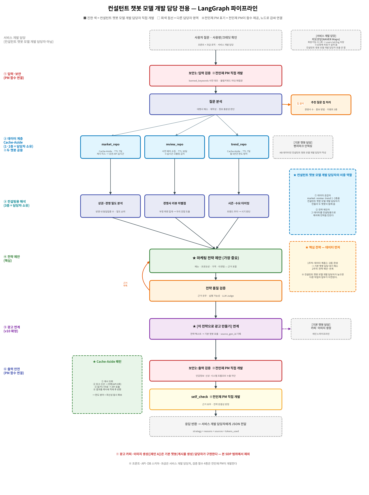

# 소프트웨어 개발 계획서 (SDP)
## 컨설턴트 챗봇 모델 개발 담당 전용 — 마케팅AI 통합 플랫폼

- **작성 기준**: 코드잇 스프린트 파트4 고급 프로젝트 / 요구사항 명세서 v10 기반
- **개발 기간**: 2026년 8월 10일(월) ~ 8월 22일(토)
- **투입 인원**: 컨설턴트 챗봇 모델 개발 담당 **1명** (초급 AI 엔지니어)
- **문서 버전**: SDP-Consult v1.1 (Cache-Aside 방식 · TTL 정책 · 지오코딩 담당 구분 반영)

---

## 1. 프로젝트 개요 (Project Overview)

### 1.1 우리가 만드는 것
**소상공인을 위한 통합 플랫폼 "마케팅AI"**. 챗봇이 2개다.

- **기본 챗봇(게시물 생성)** — 광고 문구 + 광고 이미지를 만들어 준다.
- **컨설턴트 챗봇** — 상권을 분석해 전략을 제안한다. **이제 그 전략을 바로 광고로 만들 수 있다(v10 확정).**

**왜 2개인가**: 소상공인의 고민은 "광고를 어떻게 쓰지?"만이 아니라 "뭘 팔아야 하지?"도 있기 때문이다.
두 챗봇을 한 플랫폼에 담는 것이 다른 팀과의 차별점이다.

**어떻게 쓰는가(스토리보드 기준)**: 로그인 → 좌측 사이드바에서 **두 챗봇 중 하나를 클릭** →
채팅으로 대화 → 결과물 확인. 하루 무료 사용 횟수가 있고, 초과하면 크레딧을 쓴다.

### 1.2 이 문서의 목적
위 서비스에서 **컨설턴트 챗봇 모델 개발 담당 1명이 맡는 부분만**   분리 후, 10일 안에 개발 가능한 실행 계획 작성.

### 1.3 컨설턴트 챗봇 모델 개발 담당의 한 줄 정의
> **"소상공인에게 '뭘 팔아야 하는지, 어떻게 알려야 하는지'를 데이터 근거로 제안한다.
> 그리고 두 챗봇이 함께 쓰는 데이터 계층 공급 및 개발."**

### 1.4 ★ 컨설턴트 챗봇 모델 개발 담당자의 이중 역할 (가장 먼저 이해할 것)

> 다른 담당자와 결정적으로 다른 점이다. **컨설턴트 챗봇 모델 개발 담당자는 두 가지 일을 동시에 한다.**

```
[역할 ①] 데이터 공급자
   market_repo · review_repo · trend_repo 의 1·2층(적재+조회함수)을 관리한다.
   → 이 데이터는 컨설턴트 챗봇만 쓰는 게 아니라, 기본 챗봇(게시물 생성)도 함께 읽는다.
   → 즉 컨설턴트 챗봇 모델 개발 담당자가 늦으면 기본 챗봇 담당자가 멈춘다.

[역할 ②] 전략 제안자
   같은 데이터를 '컨설팅용'으로 해석해 마케팅 전략을 만든다.
   → 기본 챗봇(게시물 생성)은 같은 데이터를 '카피용'으로 해석한다(3층은 각자).
```

**왜 이렇게 배분됐나**: 상권·리뷰 분석이 **컨설턴트의 주력 기능**이라,
그 데이터를 가장 깊이 쓰는 사람이 데이터 적재까지 맡는 것이 자연스럽다.
(*"데이터를 넣은 사람이 꺼내는 문까지 만든다"* — 팀 공통 원칙)

### 1.5 ★ 데이터 확보 방식 한 줄 요약

> **"DB 캐시 테이블을 유지하되, Cache-Aside 방식으로 캐시에 없으면 API를 실시간 호출해 채운다.
> 확보한 데이터와 사용자 질문을 조합해 LLM 모델이 전략을 추론한다."**

이 문장이 **발표에서 그대로 쓰인다.** 상세 설계는 §2.7 참조.

---

## 2. 개발 범위(Scope)

> 스코프 정의는 SDP에서 가장 중요하다. **'No'라고 말하는 용기**가 일정을 지킨다.

### 2.1 ✅ 포함 범위 (In-Scope)

| 영역 | 내용 |
| --- | --- |
| **LangGraph 파이프라인 골격(컨설턴트)** | `build_consultant.py` 조립 · 조건부 엣지(재생성 루프) |
| **데이터 계층 1·2층 전체** | `market_repo`·`trend_repo`·`review_repo`<br>**★ Cache-Aside 패턴**(캐시 우선 조회 → 캐시 미스 발생 시 API 실시간 호출 → 적재)(§2.7)<br>★ **두 챗봇 공용 — 기본 챗봇 담당자에게 조회 함수 제공** |
| **컨설팅용 해석 노드(3층)** | 상권·경쟁 밀도 분석 · 경쟁사 리뷰 차별점 · 시즌·수요 타이밍 |
| **★ 마케팅 전략 제안 노드** | 메뉴 · 프로모션 · 가격 · 타겟팅 — **근거 포함**(가장 중요) |
| **전략 품질 검증 노드** | 근거 유무 · 실행 가능성 · LLM Judge |
| **★ 광고 연계 노드** | **[이 전략으로 광고 만들기]** → 기본 챗봇 (게시물 생성)호출 · `source_gen_id` 기록 |
| **질문 분석 · 추천 질문 칩** | 대명사 해소 · 재작성 · 추천 질문 3종 처리 |
| **검증 함수 노드 연결** | 전민재 PM이 제공하는 검증 함수 3종(보안1·보안2·self_check)을 **노드로 감싸 연결** |
| **업종 벤치마크 KB 데이터 작성** | JSON 내용 채우기 (PM과 분담 — §2.5) |
| **골든 데이터셋 · 평가 스크립트** | 컨설팅 답변 품질 측정 코드 |
| **OpenAI 429 대응** | 모델 호출 측 요청 간격·재시도·토큰 절감 |
| **API 계약 준수** | 서비스 개발 담당이 호출할 응답 JSON 형식 준수 |

### 2.2 ❌ 미포함 범위 (Out-of-Scope)

| 미포함 항목 | 담당 |
| --- | --- |
| **광고 카피 생성 노드**(제안 3안) | **기본 챗봇(게시물 생성) 담당자** |
| **광고 이미지 생성 · 이미지 자동 검수** | 기본 챗봇 담당자 (SDXL은 모델 서빙 담당) |
| **배리언트 랭킹(LLM Judge for 카피)** | 기본 챗봇 담당자 |
| **규제 준수 검증 노드** | 기본 챗봇 담당자 (함수는 전민재 PM 제공) |
| **채널별 리포맷**(인스타·현수막) | 기본 챗봇 담당자 |
| **채널(플랫폼) 확정 노드** | 기본 챗봇 담당자 |
| **업종 벤치마크 인덱싱·검색 코드**(FAISS) | **기본 챗봇 담당자** ※ 데이터 작성만 내 몫 |
| **`build_basic.py` 그래프 조립** | 기본 챗봇 담당자 |
| **★ 지오코딩(NAVER Maps) 호출** | **서비스 개발 담당자** ← v1.1 명확화(§2.8) |
| **`users` 테이블 lat/lng 저장** | 서비스 개발 담당자 |
| **캐시 테이블 스키마 생성**(DDL) | **서비스 개발 담당자** ※ 적재·조회 로직은 컨설턴트 챗봇 모델 개발 담당자가 직접 구현 |
| **`banned_keywords` 사전 설계·작성** | **전민재 PM** |
| **보안1(입력 검증) 판정 함수 구현** | **전민재 PM** |
| **보안2(출력 검증) 판정 함수 구현** | **전민재 PM** |
| **self_check 판정 함수 구현** | **전민재 PM** |
| **규제 검증 판정 함수 구현** | **전민재 PM** |
| **골든 데이터셋 기준 설계**(전체 팀 기준) | 전민재 PM 주도 ※ 컨설팅 문항은 컨설턴트 챗봇 모델 개발 담당자가 작성 |
| 프론트엔드 화면(Streamlit UI) | 서비스 개발 담당 |
| REST API 라우터 · 세션 · 로그인 | 서비스 개발 담당 |
| 크레딧·일일 무료 사용량 과금 로직 | 서비스 개발 담당 |
| HITL 승인 화면 · 대기 화면 UI | 서비스 개발 담당 |
| SDXL Triton 서빙 · GPU 최적화 | 모델 서빙 담당 |
| GCP VM 배포 · CI/CD | 임시 인프라 담당 - 윤승준 |

> ⚠️ **경계에서 헷갈리기 쉬운 것 8가지**
> 1. **데이터 계층은 공용**: `market_repo`·`review_repo`·`trend_repo`는 **컨설턴트 챗봇 모델 개발 담당자가 만들지만 기본 챗봇도 읽는다.**
>    → 내 편의만 생각해 설계하면 안 되고, **D1에 조회 함수 시그니처를 합의**해야 한다(§2.4)
> 2. **3층 해석은 각자**: 같은 "반경 300m에 카페 12곳" 데이터라도
>    · **컨설턴트 챗봇** 은 *"밀도 상위 15%입니다. 선착순 할인을 제안드립니다"* 로 쓰고
>    · **기본 챗봇**은 *"경쟁 밀집 지역이니 차별점을 강조하는 카피"* 로 쓴다
>    → **원본은 공유하고, 해석 함수는 각자 만든다**
> 3. **벤치마크는 반대 구조**: **데이터 작성은 컨설턴트 챗봇 모델 개발 담당자가(또는 전민재 PM)**, **인덱싱·검색 코드는 기본 챗봇 담당자**다
> 4. **검증 3종**: **판정 함수는 전민재 PM이 만들고**, **그것을 그래프 노드로 감싸 연결하는 건 컨설턴트 챗봇 모델 개발 담당자**다
> 5. **한 파일에는 관리자가 한 명**: `build_consultant.py`·`cache/`는 **컨설턴트 챗봇 모델 개발 담당자가 관리**한다.
>    `build_basic.py`는 기본 챗봇 담당자 것이므로 건드리지 않는다 → 머지 충돌 방지
> 6. **광고 연계는 "호출"까지만**: [이 전략으로 광고 만들기]를 누르면 **기본 챗봇을 호출**하는 것까지가 컨설턴트 챗봇 모델 개발 담당자가 하는 일이고,
>    **카피·이미지를 만드는 건 기본 챗봇 담당자**다
> 7. **★ 캐시 테이블은 "생성"과 "사용"이 다르다**(v1.1): **테이블 DDL은 서비스 개발 담당자**가 만들고,
>    **데이터 적재·조회 로직(Cache-Aside)은 컨설턴트 챗봇 모델 개발 담당자가** 구현한다
> 8. **★ 지오코딩은 컨설턴트 챗봇 모델 개발 담당자가 구현하는 일이 아니다**(v1.1): 회원가입 시 **서비스 담당이 1회 호출**해 `users.lat/lng`에 저장하고,
>    컨설턴트 챗봇 모델 개발 담당자는 **요청 JSON에 실려 온 좌표를 쓰기만** 한다(§2.8)

### 2.3 우선순위 — MUST / SHOULD / COULD

> 10일 안에 다 못 만들 수 있다. 하여 **미리 우선 순서를 정해둔다.**

| 등급 | 항목 | 판단 기준 |
| --- | --- | --- |
| 🔴 **MUST** | **`market_repo` Cache-Aside 구현**, LangGraph 골격, 질문분석, 상권·경쟁 밀도 분석, **마케팅 전략 제안**, 전민재 PM 검증 함수 3종 노드 연결, API 계약 준수 | **없으면 라이브 시연 불가**<br>※ market_repo는 **기본 챗봇도 대기 중**이라 최우선 |
| 🟠 **SHOULD** | `trend_repo` Cache-Aside, 시즌·수요 타이밍, 전략 품질 검증, **광고 연계 노드**, 추천 질문 칩, 벤치마크 KB 데이터, 골든 데이터셋·평가 | **구현 시 기술적 완성도 향상** |
| 🟢 **COULD** | `review_repo`(리뷰 배치 수집+감성분석), 경쟁사 리뷰 차별점 노드, 채팅 중 지역 변경 지오코딩, RAGAS 전체 지표 | **필요 시 구현 진행** |

> **`review_cache`가 COULD인 이유**: 요구사항 명세 v10에서 **EX-01(경쟁사 리뷰 분석)은 [확장] 등급**으로 확정됐다.
> 네이버 플레이스(지도) 크롤링은 **약관·안정성 리스크**가 크고, 선택자가 자주 바뀌어 시연 당일 실패 확률이 높다.
> → **사전 배치 수집한 캐시만 사용**하고, 시간 없으면 개발 대상 제외.

### 2.4 ★ 기본 챗봇 담당자에게 제공할 조회 함수 (D1 최우선)

> **이것이 이 SDP에서 가장 먼저 해야 할 일이다.**
> 기본 챗봇 담당자의 SDP 개발 계획서를 보면 **D8·D9에 컨설턴트 챗봇 모델 개발 담당자 구현한 함수를 기다린다.** 늦으면 다른 작업자 업무가 지연된다.

```python
# cache/market_repo.py — 컨설턴트 챗봇 모델 개발 담당자가 제공
def get_market(lat: float, lng: float, radius: int = 500) -> dict:
    """상권 조회 — Cache-Aside(캐시 우선, 미스 시 API 실시간 호출). 실패 시 None."""
    return {
        "total_count": 43,           # 반경 내 전체 매장 수
        "same_industry_count": 12,   # 동일 업종 수
        "nearest_distance_m": 55,    # 최근접 동일업종 거리
        "industry_breakdown": {...}  # 업종별 분포
    }

# cache/trend_repo.py — 컨설턴트 챗봇 모델 개발 담당자가 제공
def get_trend(keyword: str, industry: str = None) -> dict:
    """검색어 트렌드 조회 — Cache-Aside. 실패 시 None."""
    return {
        "keyword": "아이스아메리카노",
        "direction": "상승",          # 상승/하락/유지
        "related": ["여름음료", "냉커피"],
        "weather": {"temp": 31, "sky": "맑음"}   # 선택
    }
```

> **중요**: 함수 시그니처는 **캐시든 API든 동일하다.**
> 기본 챗봇 담당자는 **내부가 어떻게 동작하는지 알 필요가 없다.**

**★ 스텁 선제공 원칙 (팀 공통)**
> **D1에 위 두 함수를 mock 반환 껍데기로 먼저 커밋**한다.
> 그래야 기본 챗봇 담당자가 **D1부터 import해 요약 노드를 개발**할 수 있고,
> 컨설턴트 챗봇 모델 개발 담당자는 이후 **내용만 채우면** 상대 코드는 손댈 필요가 없다.

```python
# D1에 이 상태로 먼저 커밋
def get_market(lat, lng, radius=500) -> dict:
    """상권 조회 — D2에 Cache-Aside 실제 구현 예정"""
    return {"total_count": 40, "same_industry_count": 10,
            "nearest_distance_m": 60, "industry_breakdown": {}}   # mock
```

### 2.5 데이터 관리 분담 (팀 전체)

| 테이블/데이터 | 적재 담당 | 배분 근거 |
| --- | --- | --- |
| **`market_cache`** | **컨설턴트** | **상권 분석이 컨설턴트의 주력 기능** |
| **`review_cache`** | **컨설턴트** | **EX-01이 컨설턴트 소속으로 확정**(v9 반영) |
| **`trend_cache`** | **컨설턴트** | 상권 API 클라이언트와 **작업 패턴이 동일**(호출·파싱·캐시) |
| 업종 벤치마크 KB **데이터** | **전민재 PM 또는 컨설턴트 챗봇 모델 개발 담당자** | **코딩이 아니라 자료 수집·정리** 작업 |
| 업종 벤치마크 **인덱싱·검색 코드** | 기본 챗봇 담당자 | FAISS 인덱싱은 **개발 작업** |
| `banned_keywords` | **전민재 PM** | 검증 함수 4종을 전민재 PM이 직접 개발 및 데이터 적재. DB 테이블, 스키마 설계는 서비스 개발 담당자가 진행. |
| **캐시 테이블 DDL(스키마 생성)** | **서비스 개발 담당자** | DB 테이블, 스키마 설계 서비스 개발 담당 영역 — 컨설턴트 챗봇 모델 개발 담당자는 **적재·조회 로직만** 구현 |

**공유 원칙**
```
· 원본 캐시는 두 챗봇이 함께 읽는다
· 읽어서 해석하는 코드는 각자 만든다
```

### 2.6 컨텍스트 노드 3층 구조 — 컨설턴트 챗봇 모델 개발 담당자 관리 범위

```
[1층] 데이터 확보  — Cache-Aside(캐시 미스 발생 시 API 실시간 호출) → DB 적재   ← 컨설턴트 챗봇 모델 개발 담당자 관리
[2층] 조회 함수    — get_market() / get_trend() / get_review()             ← 컨설턴트 챗봇 모델 개발 담당자 관리 (기본 챗봇도 사용)
[3층] 해석 노드    — 꺼낸 원본을 "컨설팅용"으로 가공                        ← 컨설턴트 챗봇 모델 개발 담당자 관리
                    (기본 챗봇은 같은 원본을 "카피용"으로 별도 가공)
```

| 컨텍스트 | 1층 적재 | 2층 조회 함수 | 3층 해석 노드 |
| --- | --- | --- | --- |
| **상권·타겟** | **컨설턴트** | **컨설턴트** | **각자** (컨설팅용=컨설턴트 / 카피용=기본 챗봇) |
| **경쟁사 리뷰** | **컨설턴트** | **컨설턴트** | **컨설턴트만** — 기본 챗봇 미사용 |
| **시즌·이슈** | **컨설턴트** | **컨설턴트** | **각자** (컨설팅용=컨설턴트 / 카피용=기본 챗봇) |
| 업종 벤치마크 | PM/컨설턴트(데이터) | 기본 챗봇 | 기본 챗봇 |

### 2.7 ★ Cache-Aside 패턴 — 캐시와 실시간 호출의 결합

- **핵심 개념**: 캐시와 실시간 API 호출은 **대립하지 않는다.**
- **캐시를 먼저 보고, 없으면 API를 부른 뒤 캐시에 채운다.** 이것이 Cache-Aside 패턴이며 실무 표준이다.

**동작 순서**
```
(예시)
① 사용자 질문 도착
② 조회 함수 호출 → DB 캐시 확인
      · 있고 신선함(TTL 이내) → 캐시에서 반환         (API 호출 0회)
      · 없거나 만료됨         → API 실시간 호출 → 캐시에 적재 → 반환
③ [확보한 데이터 + 사용자 질문] 조합 → LLM 추론 → 전략 생성
```

**구현 예시**
```python
# cache/market_repo.py
def get_market(lat, lng, radius=500) -> dict:
    """상권 조회 — Cache-Aside(캐시 우선, 캐시 미스 발생 시 API 호출 후 적재)"""
    row = db.query(MarketCache).filter_by(
        lat=round(lat, 3), lng=round(lng, 3), radius=radius
    ).first()

    if row and not expired(row.created_at, days=7):
        return json.loads(row.result_json)        # ← 캐시 히트 (API 0회)

    data = market_api.fetch(lat, lng, radius)     # ← 캐시 미스 → 실시간 호출
    db.add(MarketCache(lat=round(lat, 3), lng=round(lng, 3),
                       radius=radius, result_json=json.dumps(data)))
    db.commit()
    return data
```

> **좌표 반올림이 캐시 키의 핵심**: 소수점 3자리로 반올림하면 **약 100m 단위로 묶여**,
> 같은 동네 사용자끼리 캐시를 공유한다. → 호출량 대폭 절감

**★ TTL(유효기간) 정책 — 데이터별로 다르게**

| 데이터 | TTL | 근거 |
| --- | --- | --- |
| **상권** | **7일** | 매장 개폐업은 느리게 변함. 원본 API도 **기준년월(`stdrYm`) 단위**로 갱신됨 |
| **트렌드** | **7일** | 주 단위 추세면 충분. **월 5만건 한도 방어**가 우선 |
| **리뷰** | **30일** | 크롤링이 비싸서 오래 재사용. 실시간 수집 금지 |

**이 방식 이점 3가지**
1. **API 한도를 지키면서 최신 데이터도 얻는다** — 같은 키워드는 캐시에서, 새 키워드는 실시간으로
2. **시연이 안전해진다** — 리허설 때 조회한 데이터가 DB에 남아, **발표 당일 API가 죽어도 캐시에서 나온다**
3. **발표 설명이 명확해진다** — *"캐시 우선 조회로 외부 API 한도를 방어하면서, 미조회 데이터는 실시간으로 채운다"*

> ⚠️ **리뷰는 예외**: `review_repo`는 Cache-Aside가 아니라 **사전 배치 수집 전용**이다.
> 웹크롤링은 수십 초가 걸려 실시간 호출이 불가능하므로, **캐시에 없으면 그냥 없는 대로 진행**한다(§3.3).

### 2.8 ★ 지오코딩 담당 구분 — 컨설턴트 챗봇 모델 개발 담당자가 호출하지 않는다

> **결론: 지오코딩(NAVER Maps)은 서비스 개발 담당자 영역이다.**

**근거 (v10 명세 · 서비스 개발 SDP)**
- **FR-35: 회원가입 시 위치 → 좌표 변환** → 서비스 개발 담당
- `users` 테이블에 `lat`·`lng` 저장 → 서비스 개발 담당

**흐름**
```
(예시)
[서비스 개발 담당]
  회원가입 "서울 강남구 역삼동" → NAVER Maps 지오코딩 1회 → users.lat/lng 저장

[컨설턴트 담당 = 컨설턴트 챗봇 모델 개발 담당자]
  요청 JSON에 실려 온 store.lat / store.lng 사용 → get_market(lat, lng)
  ※ 지오코딩을 다시 호출할 이유가 없다
```

**예외 [COULD]**: 사용자가 채팅에서 *"홍대 쪽은 어때요?"* 처럼 **다른 지역을 물어보는 경우**,
그때만 지오코딩이 필요하다. → 시간 여유 시 구현.

> **D1에 서비스 담당에게 확인할 것**: *"요청 JSON에 `store.lat`·`store.lng`가 항상 포함되나요?"*
> 포함되면 컨설턴트 챗봇 모델 개발 담당자는 지오코딩을 전혀 구현하지 않아도 된다.

---

## 3. 개발 방법론 (Methodology)

### 3.1 애자일 · 2 스프린트 구성
- 1인 개발 + 2주 → 모놀리식 코드라도 동작 먼저, 리팩토링 나중
- 매일 데일리 스크럼 참여 필수
- **스프린트 1**(8/10~8/14): **데이터 계층 완성 + 전략 제안 뼈대**
- **스프린트 2**(8/17~8/21): 전략 고도화 + 광고 연계 + 평가
- **8/22(토)**: 통합 테스트 + 버퍼

### 3.2 ★ 핵심 전략 — "데이터 먼저" (중요!)

> **문제**: 컨설턴트 챗봇 모델 개발 담당자가 만드는 데이터 계층을 **기본 챗봇 담당자가 기다린다.**
> 컨설턴트 챗봇 모델 개발 담당자가 전략부터 만들면, 상대는 D8·D9에 할 일이 없어진다.
> **해법**: 1주차에 데이터 계층(1·2층)을 먼저 끝낸다.

```
(예시)
[1주차] 데이터 계층 완성
        market_repo → trend_repo → 조회 함수 제공
        ※ 이 시점에 기본 챗봇 담당자의 대기가 해소된다
   ↓
[2주차] 전략 제안 · 광고 연계 · 평가
        컨설팅 해석 → 전략 제안 → 품질 검증 → 연계
```

**왜 이 순서인가**: 다른 담당자의 SDP에서 **컨설턴트 챗봇 모델 개발 담당자 함수를 D8·D9에 쓰겠다고 명시**했다.
컨설턴트 챗봇 모델 개발 담당자가 늦으면 **팀 전체 일정이 밀린다.** 컨설턴트 챗봇 모델 개발 담당자 편의보다 **팀 의존성**이 우선이다.

### 3.3 ★ 리뷰 수집은 "안전 우선"으로

> `review_cache`는 네이버 플레이스(지도) 웹크롤링이 필요한데, **가장 깨지기 쉬운 부분**이다.

| 원칙 | 내용 |
| --- | --- |
| **실시간 금지** | 파이프라인에서 실시간 웹크롤링 **절대 금지**. 사전 배치 수집만 |
| **캐시 조회만** | 챗봇은 `review_repo.get_review()` 로 **저장된 데이터만** 읽는다 |
| **Cache-Aside 예외** | 상권·트렌드와 달리 **캐시 미스 발생 시 API를 부르지 않는다.** 없으면 없는 대로 진행 |
| **실패 허용** | 웹크롤링이 안 되면 **리뷰 없이도 전략이 나오도록** 설계 |
| **COULD 등급** | 시간 없으면 **개발 대상 제외** (EX-01은 [확장]) |

> **근거**: 네이버는 선택자를 주기적으로 바꾸고 봇 차단이 강하다.
> 지난 기수 사례에서도 **24시간 배치 수집 → DB 저장 → 조회** 구조를 썼다.
> 실시간을 시도하면 **시연 당일 실패 확률이 높다.**

### 3.4 데일리 스크럼 참여
매일 10~15분 **[어제 한 일 / 오늘 할 일 / 막히는 부분(Blocker)]** 공유.
초급 개발자는 혼자 오래 파는 경향이 있으므로 **30분 룰**(30분 시도해도 안 되면 즉시 공유)을 지킨다.

### 3.5 일일 통합(Daily Merge) 원칙
최소 2일 단위로 GitHub에 머지한다. 특히 **`cache/` 디렉토리는 기본 챗봇 담당자가 쓰므로** 빨리 올릴수록 좋다.

### 3.6 ★ 스텁 우선(Stub-First) 협업 원칙

> **팀 전체에 적용하는 원칙**: 남에게 제공할 함수는 **D1에 mock 반환 껍데기로 먼저 커밋**한다.

```
(예시)
[컨설턴트 챗봇 모델 개발 담당자 제공]  get_market() / get_trend()          → D1에 mock 반환
[전민재 PM 제공]  check_input / check_output / self_check → D1에 pass 반환
   ↓
서로 D1부터 import해 노드를 연결할 수 있다
   ↓
이후 내용만 채운다 → 상대 코드는 손댈 필요 없음
```

---

## 4. 일정 및 마일스톤 (Schedule & Milestones)

> **실작업일 계산**: 8/10~8/22 중 주말(8/15·8/16 일부) 제외 → **실작업 11일 + 8/22(토) 버퍼**

### 4.1 스프린트 1 — 데이터 계층 + 전략 뼈대 (8/10 월 ~ 8/14 금)

| 일자 | 작업 내용 | 완료 기준(DoD) |
| --- | --- | --- |
| **D1** 8/10(월) | · **★ 기본 챗봇 모델 개발 담당자에게 `get_market()`·`get_trend()` mock 스텁 제공**(§2.4) ← **최우선**<br>· **서비스 개발 담당자와 API 계약(JSON 형식) 합의**<br>· **★ 서비스 개발 담당자에게 확인 2건**: ①요청에 `store.lat/lng` 포함 여부(§2.8) ②캐시 테이블 DDL 생성 요청<br>· **PM과 검증 함수 3종 인터페이스 합의 + pass 스텁 수령**<br>· **PM 주재 GraphState 공통 규격 확정**<br>· LangGraph 프로젝트 구조 + GraphState 정의<br>· 상권 API·트렌드 API 키 발급 확인 | 그래프가 빈 노드로 START→END 실행됨<br>**상대가 컨설턴트 챗봇 모델 개발 담당자가 구현한 함수를 import 가능** |
| **D2** 8/11(화) | · **★ `market_repo` Cache-Aside 구현**(§2.7)<br>&nbsp;&nbsp;— MarketCache ORM 모델(서비스 담당 테이블 사용)<br>&nbsp;&nbsp;— 캐시 조회 → 캐시 미스 발생 → 상권 API 호출 → 적재<br>&nbsp;&nbsp;— 좌표 반올림(소수 3자리) 캐시 키 · **TTL 7일** | "강남역 좌표" 입력 → 반경 내 매장 수 반환<br>**2회차 호출 시 API 미호출(캐시 히트) 확인** |
| **D3** 8/12(수) | · **상권·경쟁 밀도 분석 노드**(3층, 컨설팅용)<br>· 밀도 순위·최근접 거리 계산<br>· 질문 분석 노드(재작성·정보충분성)<br>· 전민재 PM 제공 `check_input()` 을 보안1 노드로 연결 | "주변 경쟁사는 얼마나 되나요?" → 밀도 분석 결과 |
| **D4** 8/13(목) | · **★ 마케팅 전략 제안 노드**(가장 중요)<br>· 프롬프트 설계 — 메뉴·프로모션·가격·타겟팅<br>· **[데이터 + 사용자 질문] 조합 → LLM 추론**<br>· **근거(sources) 포함** 출력 | "우리 카페 어떻게 홍보하면 좋을까요?" → 근거 있는 전략 |
| **D5** 8/14(금) | · **`trend_repo` Cache-Aside 구현**(TTL 7일 · 월 5만 한도 방어)<br>· `get_trend()` 실제 데이터 반환 → **기본 챗봇 담당자에게 통보**<br>· 전민재 PM 제공 `check_output()`·`self_check()` 노드 연결<br>· **API 계약 형식으로 JSON 반환**<br>· **스프린트 1 회고(KPT)** | **데이터 계층 완성 + 전략 파이프라인 관통** |

> **스프린트 1 목표(가장 중요)**: **"데이터 계층이 완성되어 남이 안 기다리는 상태"** +
> **"근거 있는 전략이 나오는 챗봇"**. 이 상태면 시연할 것이 있다.

### 4.2 스프린트 2 — 전략 고도화 + 연계 + 평가 (8/17 월 ~ 8/21 금)

| 일자 | 작업 내용 | 완료 기준(DoD) |
| --- | --- | --- |
| **D6** 8/17(월) | · **시즌·수요 타이밍 노드**(3층, `get_trend()` 활용)<br>· 전략에 시의성 반영<br>· 추천 질문 칩 3종 처리 | "어떤 이벤트가 효과적일까요?" → 시기 반영 전략 |
| **D7** 8/18(화) | · **서비스 개발 담당자와 실연동 작업 진행**(Mock → 실제 교체)<br>· 응답 형식 불일치 대응<br>· 429 대응(요청 간격·재시도·백오프) | 서비스 화면에서 컨설턴트 답변 표시됨 |
| **D8** 8/19(수) | · **★ 광고 연계 노드**([이 전략으로 광고 만들기])<br>· 기본 챗봇 호출 + `source_gen_id` 기록<br>· 기본 챗봇 담당자와 **연계 인터페이스 합의·테스트** | 전략 → 광고 생성으로 넘어가는 흐름 동작 |
| **D9** 8/20(목) | · **전략 품질 검증 노드**(근거 유무·실행 가능성·LLM Judge)<br>· **골든 데이터셋 컨설팅 문항 작성**(20~30문항)<br>· 평가 스크립트 작성·1차 측정<br>· **★ 시연용 캐시 사전 적재**(강남역 등 시나리오 지역) | 평가 점수 산출<br>**시연 지역 캐시가 DB에 존재** |
| **D10** 8/21(금) | · **프롬프트 튜닝**(평가 결과 기반) → 재측정<br>· 튜닝 전후 비교표 작성(발표 자료용)<br>· (여유 시) `review_repo` 배치 수집 시도 [COULD]<br>· **스프린트 2 회고(KPT)** | **튜닝 전후 점수 비교표 완성** |

### 4.3 마무리 (8/22 토)
- 팀 전체 통합 테스트(§8 시나리오)
- 버그 수정 · 발표용 시연 리허설
- 버퍼: 앞선 일정이 밀렸다면 못했던 개발 작업 이어서 진행

### 4.4 마일스톤 요약

| 마일스톤 | 날짜 | 판정 기준 |
| --- | --- | --- |
| **M1** 스텁 제공 + 계약·규격 확정 | 8/10 | **기본 챗봇 담당자가 컨설턴트 챗봇 모델 개발 담당자가 구현한 함수를 import 가능** |
| **M2** `market_repo` Cache-Aside 완성 | 8/11 | 실데이터 조회 + **캐시 히트 확인** |
| **M3** 전략 제안 성공 | 8/13 | 근거 포함 전략이 실제로 나옴 |
| **M4** 데이터 계층 완성 | 8/14 | `get_market()`·`get_trend()` 실데이터 제공 완료 |
| **M5** 서비스 연동 완료 | 8/18 | 서비스 화면에 컨설턴트 챗봇 모델 개발 담당자 구현한 결과가 표시됨 |
| **M6** 광고 연계 동작 | 8/19 | 전략 → 광고 생성 흐름 성공 |
| **M7** 튜닝 성과 확보 | 8/21 | 튜닝 전후 점수 비교표 완성 |

---

## 5. 자원 및 역할 (Resources & Roles)

### 5.1 인력
| 역할 | 인원 | 비고 |
| --- | --- | --- |
| **컨설턴트 챗봇 모델 개발 담당** | **1명 (초급 AI 엔지니어)** | **본 SDP의 대상** |
| 기본 챗봇(게시물 생성) 담당 | 별도 | **컨설턴트 챗봇 모델 개발 담당자가 구현한 조회 함수 사용** · 광고 연계 상대 |
| 서비스 개발 담당 | 별도 | 컨설턴트 챗봇을 **호출**함 (API 계약) · **캐시 테이블 DDL 생성** · **지오코딩** |
| 모델 서빙 담당 | 별도 | SDXL Triton 서빙 (컨설턴트 챗봇 모델 개발 담당자 범위 아님) |
| 인프라 담당 | 임시 - 윤승준 | 배포·CI/CD |
| **PM** | **전민재** | 일정·의사결정 · **검증 함수 4종 직접 개발** · **GraphState 규격 주재** |

### 5.2 기술 스택

| 영역 | 선택 | 선택 이유 |
| --- | --- | --- |
| 파이프라인 | **LangGraph** | 파트3에서 학습 완료. 기본 챗봇과 **같은 골격 공유** |
| LLM | **코드잇 제공 OpenAI API** | 팀 공통. 한도 $30 주의 |
| 상권 데이터 | **소상공인시장진흥공단 상권정보 OpenAPI** | 공공데이터, 무료, 30TPS·500ms |
| 트렌드 | **NAVER API HUB 검색어 트렌드** | 월 5만건·50 RPS 한도 주의 |
| **캐시 전략** | **Cache-Aside + TTL 차등**(§2.7) | 한도 방어 + 최신성 동시 확보 |
| 리뷰 수집 | **Selenium 배치** [COULD] | 실시간 금지, 사전 수집만 |
| 감성분석 | **KcELECTRA 계열(CPU)** [COULD] | 네이버 댓글 학습 모델, 리뷰에 강함 |
| DB | **SQLAlchemy + SQLite3** | **테이블 DDL은 서비스 개발 담당**, 적재·조회는 컨설턴트 챗봇 모델 개발 담당자 영역 |
| 평가 | **LLM Judge 직접 구현** | RAGAS 전체는 COULD |

### 5.3 개발 환경
- GCP VM(L4 GPU) — VSCode Remote-SSH로 접속 (팀 표준)
- 코드 반영: **GitHub PR → main merge** (VM 직접 수정 금지 — 팀 원칙)
- 브랜치: `feature/model-consult-*` 네이밍
- **파일 관리권**: `cache/`·`graph/build_consultant.py`·`nodes/*_for_consult.py` 는 **컨설턴트 챗봇 모델 개발 담당자가 관리**,
  `validation/` 은 **PM**, `build_basic.py`·`nodes/*_for_copy.py` 는 **기본 챗봇 담당** → 머지 충돌 방지

### 5.4 ⚠️ API 예산·한도 관리

**OpenAI (팀 공통 자원)**
- 팀 전체 한도 **$30**, 초과 시 **키 즉시 비활성화**
- 디스코드 팀 채널에서 `!usage`로 사용량 확인 (1분 1회)
- 평가 스크립트는 **직렬 실행 + 요청 간 sleep**. 병렬 호출 금지
- 대량 평가 전 **전민재 PM에게 사전 공유**하고 실행

**외부 API 한도 (컨설턴트 챗봇 모델 개발 담당자가 직접 관리)**
| API | 한도 | 대응 |
| --- | --- | --- |
| 상권정보 OpenAPI | **초당 30 TPS**, 반경 ≤2000m, 페이지당 ≤1000 | **Cache-Aside(TTL 7일)** + 좌표 반올림 캐싱 |
| NAVER 검색어 트렌드 | **월 5만건 · API Key당 50 RPS**, 초과 시 429 | **Cache-Aside(TTL 7일)** — 중복 호출 원천 차단 |

> **Cache-Aside가 곧 한도 방어책이다.** 같은 좌표·키워드는 캐시에서 나오므로,
> 개발 중 반복 테스트·평가 스크립트를 돌려도 외부 API 호출이 누적되지 않는다.

---

## 6. 시스템 설계

### 6.1 파이프라인 (컨설턴트 챗봇 모델 개발 관점)


```
(예시)
[서비스 개발 담당] 사용자 질문 · 사용량/크레딧 확인
                   (지오코딩은 회원가입 시 1회 → users.lat/lng — §2.8)
        ↓
① 보안1: 입력 검증                         ※전민재 PM 직접 개발
        ↓
  질문 분석 (재작성·정보충분성)  →(칩 클릭)→ 추천 질문 칩 처리
        ↓
② 데이터 계층 (1·2층 = 컨설턴트 챗봇 모델 개발 담당자 관리, 두 챗봇 공용) — ★ Cache-Aside
   · market_repo   TTL 7일 · 캐시 미스 발생 → 상권 API 실시간 호출 → 적재
   · trend_repo    TTL 7일 · 캐시 미스 발생 → 트렌드 API 실시간 호출 → 적재
   · review_repo   TTL 30일 · 사전 배치 수집 전용(실시간 크롤링 금지)  [COULD]
   · (벤치마크 인덱싱은 기본 챗봇 담당 — KB 데이터만 컨설턴트 챗봇 모델 개발 담당자가 작성)
        ↓
③ 컨설팅용 해석 (3층 = 컨설턴트 챗봇 모델 개발 담당자 관리)
   · 상권·경쟁 밀도 분석   반경 내 동일업종 수 · 밀도 순위
   · 경쟁사 리뷰 차별점     부정 측면 집계 → 우리 강점 도출  [COULD]
   · 시즌·수요 타이밍       트렌드 추이 → 시기 판단
        ↓
④ ★ 마케팅 전략 제안 (가장 중요)  ←──┐
   [데이터 + 사용자 질문] 조합 → LLM  │ 근거 부족
   메뉴·프로모션·가격·타겟팅 (근거 포함)│
        ↓                              │
   전략 품질 검증 (근거·실행가능성) ────┘
        ↓
⑤ ★ [이 전략으로 광고 만들기] 연계
   전략 텍스트 → 기본 챗봇 호출 · source_gen_id 기록
        ↓
   [기본 챗봇 담당] 카피·이미지 생성 (레인 A)
        ↓
⑥ 보안2: 출력 검증                        ※전민재 PM 직접 개발
        ↓
   self_check (근거·전략 완결성 판정)      ※전민재 PM 직접 개발
        ↓
[서비스 개발 담당] 응답 JSON 전달 → 화면 표시
```

### 6.2 ★ 서비스 개발 담당자와 API 계약 (D1에 반드시 합의)

**요청 (서비스 → 컨설턴트 챗봇)**
```json
{
  "chatbot_type": "consultant",
  "user_id": 1,
  "question": "우리 카페 어떻게 홍보하면 좋을까요?",
  "store": { "name": "카페 코드잇", "type": "카페",
             "address": "서울 강남구 역삼동", "lat": 37.5, "lng": 127.0 }
}
```

> **★ `lat`·`lng` 필수 확인**(§2.8): 서비스 개발 담당자가 회원가입 시 지오코딩해 저장한 값이 여기 실려 온다.
> 이 값이 없으면 컨설턴트 챗봇 모델 개발 담당자가 상권 조회를 할 수 없으므로 **D1에 반드시 확인**한다.

**응답 (컨설턴트 챗봇 → 서비스)**
```json
{
  "status": "ok",
  "title": "강남역 카페 마케팅 전략",
  "strategy": {
    "summary": "반경 300m 내 동일 업종 12곳으로 경쟁이 치열합니다...",
    "actions": [
      { "type": "menu",      "content": "복숭아 자몽 에이드 등 시즌 한정 메뉴 도입" },
      { "type": "promotion", "content": "선착순 20명 할인으로 신규 고객 유입" },
      { "type": "target",    "content": "20~30대 직장인 대상 점심 시간대 집중" }
    ]
  },
  "reasons": ["반경 300m 동일업종 12곳(밀도 상위 15%)", "'아이스아메리카노' 검색 상승"],
  "sources": ["상권분석", "트렌드"],
  "tokens_used": 1480
}
```

> **협의 포인트**: ① 전략은 **actions 배열**로 구조화(프론트가 카드로 표시)
> ② **reasons 필수** — 근거 없는 전략은 신뢰를 잃는다
> ③ 실패 시 `{"status":"error"}` ④ 리뷰 데이터가 없어도 **상권·트렌드만으로 전략 반환**(부분 성공 허용)

### 6.3 ★ 광고 연계 인터페이스 (기본 챗봇 담당자와 D8 합의)

> v10 스토리보드에서 확정된 **[이 전략으로 광고 만들기]** 버튼의 동작이다.

```
(예시)
[사용자] 컨설턴트 챗봇에서 전략 추천받음
   → 답변 카드 하단 [이 전략으로 광고 만들기] 클릭
   → 컨설턴트 챗봇 모델 개발 담당자: 전략 텍스트를 기본 챗봇 요청 형식으로 변환
   → 기본 챗봇 호출 (chatbot_type="basic", question=전략 요약)
   → generations.source_gen_id 에 원본 컨설팅 레코드 id 저장
```

**변환 예시**
```python
# nodes/link_to_ads.py — 컨설턴트 챗봇 모델 개발 담당자가 구현
def to_ad_request(strategy: dict, store: dict, source_gen_id: int) -> dict:
    """전략 → 기본 챗봇 요청으로 변환"""
    return {
        "chatbot_type": "basic",
        "question": f"{strategy['actions'][0]['content']} 홍보 문구 만들어줘",
        "store": store,
        "extra": {"purpose": strategy["summary"][:100]},
        "source_gen_id": source_gen_id      # 파생 추적
    }
```

> **왜 source_gen_id가 필요한가**: 나중에 *"이 광고는 어떤 컨설팅에서 나왔나"* 를 추적하면,
> 마이페이지에서 컨설팅↔광고를 연결해 보여줄 수 있고, 재생성 시 맥락을 잃지 않는다.

### 6.4 ★ 마케팅 전략 제안 노드 설계 (가장 중요 — D4에 집중)

```
(예시)
[입력] 질문 + 가게정보 + 컨설팅 해석 결과(밀도·리뷰차별점·시즌)
   ↓
[프롬프트 구성]
   · 시스템: "너는 소상공인 마케팅 컨설턴트다.
             반드시 데이터 근거를 들어 제안하고, 추측은 하지 않는다."
   · 데이터: 반경 내 동일업종 N곳 · 밀도 순위 · 트렌드 추이
   · 출력 형식: menu / promotion / price / target 중 2~3개
   · 필수: 각 제안마다 '왜 그런지' 근거 명시
   ↓
[출력] 전략 요약 + actions 배열 + reasons 배열 (JSON)
```

**초급자를 위한 구현 순서**
1. 데이터 없이 **질문만으로 전략 1개** 생성 → 동작 확인
2. 상권 밀도 데이터 주입 → 결과가 실제로 달라지는지 확인
3. actions 배열 구조화 → JSON 파싱 안정화
4. reasons(근거) 필수화 → 근거 없으면 재생성

> **한 번에 완성하려 하지 말 것.** 위 4단계를 하루 안에 순서대로 밟는다.

**★ 좋은 전략 vs 나쁜 전략 (프롬프트 튜닝 기준)**
```
[나쁨] "SNS 마케팅을 강화하세요"           ← 누구에게나 할 수 있는 말
[좋음] "반경 300m 내 동일 업종이 12곳으로 밀도 상위 15%입니다.
        경쟁이 치열하므로 '선착순 20명 할인'으로 신규 유입을 만들고,
        검색이 상승 중인 '아이스아메리카노'를 시즌 메뉴로 앞세우세요."
                                          ← 데이터 근거 + 실행 가능
```

### 6.5 OpenAI 429 대응 (모델 호출 측)

```
· 노드 간 LLM 호출은 직렬 실행 (병렬 금지)
· 429 수신 시 지수 백오프 재시도 (최대 3회: 2초 → 4초 → 8초)
· 재생성 루프 상한: 근거 부족 재생성 최대 2회
· 컨텍스트 캐싱: Cache-Aside로 같은 좌표·키워드 재조회 시 외부 API 0회
· 평가 스크립트는 요청 간 sleep 필수
· D10 튜닝일은 재측정 반복으로 호출이 몰림 → 전날 잔여 예산 확인
```

---

## 7. 프로젝트 디렉토리 구조

> **초급자 기준으로 의도적으로 얕게** 구성했다.

```
marketing-ai/
├── validation/                       # ★ 전민재 PM 관리 — 컨설턴트 챗봇 모델 개발 담당자는 import만
│   ├── keywords.py                   # banned_keywords 로딩·대조
│   ├── security.py                   # check_input(보안1) + check_output(보안2)
│   ├── regulation.py                 # check_regulation (기본 챗봇이 사용)
│   ├── self_check.py                 # self_check
│   └── data/banned_keywords.csv      # 규제 키워드 사전 (PM 작성)
│
├── cache/                            # ★★ 컨설턴트 챗봇 모델 개발 담당자 관리 (1·2층) — 두 챗봇 공용
│   ├── models.py                     # MarketCache·TrendCache·ReviewCache ORM
│   │                                 #   ※ 테이블 DDL은 서비스 담당이 생성
│   ├── market_repo.py                # ★ Cache-Aside · TTL 7일 · get_market()   [MUST]
│   ├── trend_repo.py                 # ★ Cache-Aside · TTL 7일 · get_trend()    [SHOULD]
│   ├── review_repo.py                # 사전 배치 전용 · TTL 30일 · get_review()  [COULD]
│   └── ttl.py                        # TTL 만료 판정 공통 유틸
│                                     #   ★ D1에 mock 반환 스텁으로 먼저 커밋
│
├── shared_data/                      # 전민재 PM/ 컨설턴트 챗봇 모델 개발 담당자가 채우는 데이터
│   ├── benchmark_kb.json             # 업종 벤치마크 KB (전민재 PM 또는 컨설턴트 챗봇 모델 개발 담당자가 작성)
│   └── golden_dataset.json           # 골든 데이터셋 (전민재 PM 주도 · 컨설팅 문항은 컨설턴트 챗봇 모델 개발 담당자가 작성)
│
└── model_consult/                    # ★ 컨설턴트 챗봇 모델 개발 담당자 작업 영역 (컨설턴트 챗봇)
    ├── main.py                       # 챗봇 진입점 (서비스 담당이 호출)
    ├── config.py                     # 모델명·온도·재시도·TTL 상수
    ├── llm.py                        # OpenAI 호출 래퍼(+429 백오프)
    │
    ├── graph/                        # ★ LangGraph 골격 (컨설턴트 챗봇 모델 개발 담당자가 관리)
    │   ├── state.py                  # GraphState (기본 챗봇과 공통 규격 공유)
    │   └── build_consultant.py       # 노드 조립 + 조건부 엣지(재생성 루프)
    │
    ├── nodes/                        # ★ 컨설턴트 챗봇 모델 개발 담당자가 개발하는 노드들
    │   ├── security_input.py         # 보안1 노드 — 전민재 PM의 check_input() 감싸기
    │   ├── question_analysis.py      # 질문 분석·정보충분성
    │   ├── suggested_chips.py        # 추천 질문 칩 3종 처리
    │   ├── market_for_consult.py     # 상권·경쟁 밀도 분석 (3층, 컨설팅용)
    │   ├── review_for_consult.py     # 경쟁사 리뷰 차별점 (3층)        [COULD]
    │   ├── trend_for_consult.py      # 시즌·수요 타이밍 (3층)
    │   ├── strategy.py               # ★ 마케팅 전략 제안 (가장 중요)
    │   ├── strategy_check.py         # 전략 품질 검증(근거·실행가능성)
    │   ├── link_to_ads.py            # ★ [이 전략으로 광고 만들기] 연계
    │   ├── security_output.py        # 보안2 노드 — 전민재 PM의 check_output() 감싸기
    │   └── self_check_node.py        # self_check 노드 — 전민재 PM의 self_check() 감싸기
    │   # ※ *_for_copy.py 없음 — 카피용 요약은 기본 챗봇 담당자 영역
    │
    ├── clients/                      # ★ 외부 API 호출부 (Cache-Aside의 '미스' 경로)
    │   ├── market_api.py             # 상권정보 OpenAPI 호출
    │   ├── trend_api.py              # NAVER 검색어 트렌드 호출
    │   └── review_crawler.py         # 네이버 플레이스 배치 크롤러   [COULD]
    │   # ※ geocode_api.py 없음 — 지오코딩은 서비스 개발 담당 영역(§2.8)
    │
    ├── analysis/                     # 컨설팅 분석 유틸
    │   ├── density.py                # 경쟁 밀도·최근접 거리 계산
    │   └── sentiment.py              # KcELECTRA 감성분석(CPU)       [COULD]
    │
    ├── scripts/                      # ★ 배치 적재 (파이프라인과 분리)
    │   ├── preload_demo_cache.py     # ★ 시연용 캐시 사전 적재(강남역 등) — D9
    │   └── load_review_cache.py      # 리뷰 사전 수집 배치          [COULD]
    │   # ※ 상권·트렌드는 Cache-Aside라 별도 적재 배치 불필요
    │
    ├── eval/                         # ★ 평가
    │   ├── eval_strategy.py          # 전략 품질 LLM Judge
    │   ├── eval_retrieval.py         # 데이터 조회 정확도·캐시 히트율
    │   └── reports/                  # 평가 결과 · 튜닝 전후 비교표
    │
    ├── tests/
    │   ├── test_market_repo.py       # Cache-Aside 동작 테스트(히트/미스)
    │   └── test_pipeline.py          # 그래프 E2E 테스트
    │
    ├── docs/
    │   ├── sdp_model_consult.md      # 본 문서
    │   ├── pipeline_consult_sdp.png  # 파이프라인 다이어그램
    │   ├── repo_contract.md          # ★ 조회 함수 시그니처(기본 챗봇 담당자용)
    │   └── prompt_tuning_log.md      # ★ 프롬프트 튜닝 실험 기록(D10)
    │
    ├── requirements.txt / pyproject.toml (uv)
    └── README.md
```

---

## 8. 품질 보증 (QA)

### 8.1 골든 데이터셋

> **골든 데이터셋(Golden Dataset)이란**
> 인공지능(AI) 및 머신러닝 시스템에서 모델의 성능을 평가하고 검증하기 위해
> 사람이 직접 검증하여 신뢰성을 확보한 **고품질의 표준(Reference) 데이터셋**을 의미한다.

**구축 계획 (D9, 초급자 현실 기준)**
> ※ **전체 기준 설계는 전민재 PM 주도**. 컨설턴트 챗봇 모델 개발 담당자는 **컨설팅 영역 문항 20~30개**를 작성한다.

| 유형 | 문항 수 | 내용 |
| --- | --- | --- |
| 상권 분석 | 10 | "주변 경쟁사는 얼마나 되나요?" |
| 전략 제안 | 10 | "우리 카페 어떻게 홍보하면 좋을까요?" |
| 시즌·이벤트 | 5 | "어떤 이벤트가 효과적일까요?" |
| **거부** | 5 | 데이터 없는 지역 등 **"모른다가 정답"** 인 문항 |
| **합계** | **30** | 사람이 직접 검증한 질문-정답 쌍 |

> **"모른다가 정답"인 문항이 중요한 이유**: 상권 데이터가 없는 지역에서
> **AI가 근거 없이 지어내면 안 된다.** 이걸 검증하려면 거부 문항이 필요하다.

### 8.2 모델 성능 평가 지표

**데이터 조회(Retrieval)**
- 상권 조회 성공률 (좌표 → 데이터 반환 비율)
- **캐시 적중률 (Cache Hit Rate)** — 외부 API 호출 절감 효과 ★
- 평균 조회 응답 시간 (캐시 히트 vs 미스 비교)

**전략 생성(Generation)**
- **LLM Judge 점수(1~5)**: 근거 충실도 · 실행 가능성 · 구체성 ← 가장 중요
- **Faithfulness**: 전략이 실제 데이터에 근거했는가 (지어내지 않았는가)
- Answer Relevance: 질문에 맞는 전략인가
- 생성 실패율 · 평균 응답시간

> **지표 선택 근거(발표용)**: 컨설팅은 **"근거 있는 제안"** 이 핵심이므로,
> Faithfulness(환각 여부)와 근거 충실도를 최우선 지표로 삼았다.
> **캐시 적중률**은 Cache-Aside 설계의 효과를 수치로 증명하는 지표다.

### 8.3 통합 테스트 시나리오 (8/22)

```
(예시)
1. "주변 경쟁사는 얼마나 되나요?" → 반경 내 동일업종 수·밀도 순위 반환
2. 같은 질문 재실행 → **캐시 히트로 API 호출 0회** 확인 (로그 확인)
3. "우리 카페 어떻게 홍보하면 좋을까요?" → 근거 포함 전략 2~3개
4. "어떤 이벤트가 효과적일까요?" → 시즌 데이터 반영 전략
5. 데이터 없는 지역 질문 → "정보가 부족합니다" 안내 (지어내지 않음)
6. 불법 키워드 포함 요청 → 보안1에서 차단 (전민재 PM 함수 연동 확인)
7. [이 전략으로 광고 만들기] 클릭 → 기본 챗봇으로 전달 확인
8. source_gen_id가 generations에 기록되는지 확인
9. 기본 챗봇 담당자가 컨설턴트 챗봇 모델 개발 담당자가 구현한 get_market()·get_trend() 함수 정상 사용하는지 확인
10. 서비스 개발 담당자 구현한 화면에서 위 결과가 그대로 표시되는지 확인
```

### 8.4 코드 품질 기준
- 노드마다 docstring + 한 줄 주석 (평가 항목: *"코드 내 주석 및 마크다운이 잘 작성되어 있나요?"*)
- 프롬프트는 **코드에 하드코딩하지 말고** 별도 상수/파일로 분리 → 튜닝 이력 추적 가능
- **조회 함수는 반환 형식을 문서화**(`docs/repo_contract.md`) → 기본 챗봇 담당자가 참조
- **캐시 히트/미스를 로그로 남긴다** → 적중률 측정 및 디버깅에 필요
- 실험 결과는 **`docs/prompt_tuning_log.md` 에 기록** → **발표 자료로 그대로 사용**

---

## 9. 위험 관리 — "무엇이 문제가 될 수 있고, 어떻게 막을 것인가?"

| # | 리스크 | 발생 확률 | 영향 | 대응책 |
| --- | --- | --- | --- | --- |
| **R1** | **★ 내 데이터 계층 지연 → 기본 챗봇 담당자 대기** | 중 | **치명적** | **§3.2 데이터 먼저 전략** — 1주차에 완성. D1에 mock 스텁 선제공(§2.4) |
| R2 | **상권 API 키 발급 지연** | 중 | 높음 | D1에 즉시 신청. **mock 데이터로 먼저 개발** |
| R3 | **전략이 뻔한 소리만 함**(근거 없음) | 높음 | 높음 | 프롬프트에 **근거 필수화** + 전략 품질 검증 노드 + D10 튜닝 |
| R4 | **OpenAI $30 한도 초과 → 키 비활성화** | 중 | **치명적** | 직렬 호출·sleep·재생성 상한. 대량 평가 전 전민재 PM 사전 공유 |
| R5 | **트렌드 API 한도 초과**(월 5만·50 RPS) | 중 | 중 | **★ Cache-Aside(TTL 7일)로 중복 호출 원천 차단**(§2.7) |
| R6 | **리뷰 크롤링 실패**(선택자 변경·봇 차단) | **높음** | 낮음 | **[COULD] 등급** — 안 되면 버린다(§3.3). 리뷰 없이도 전략 나오게 설계 |
| R7 | **API 계약 불일치**(서비스 연동 시) | 중 | 높음 | D1에 계약 문서화 |
| R8 | **광고 연계 인터페이스 충돌** | 중 | 중 | D8에 기본 챗봇 담당자와 **함께 테스트**. 형식은 미리 문서화 |
| R9 | **전민재 PM 검증 함수 제공 지연** | 중 | 중 | **스텁 선제공 원칙**(§3.6) — pass 스텁으로 노드 미리 연결 |
| R10 | **초급자 LangGraph 난이도** | 중 | 중 | 파트3 학습자료 재활용. **기본 챗봇 담당자와 골격 공유**. 30분 룰 |
| R11 | **일정 지연** | 중 | 높음 | COULD 항목 개발 대상 제외(§2.3). 8/22 버퍼 확보 |
| **R12** | **★ 시연 당일 외부 API 장애** | 낮음 | **높음** | **D9에 시연 지역 캐시 사전 적재**(`preload_demo_cache.py`).<br>캐시에 있으면 API가 죽어도 정상 동작 |
| **R13** | **캐시 테이블 DDL 생성 지연**(서비스 담당) | 중 | 중 | D1에 요청. 지연 시 **SQLite 로컬 테이블로 임시 생성** 후 나중에 통합 |

> **가장 큰 리스크는 R1이다.**
> 다른 담당자와 달리, **컨설턴트 챗봇 모델 개발 담당자가 늦으면 남이 멈춘다.** 그래서 §3.2 "데이터 먼저" 전략이 이 SDP의 핵심이다.
> **R5·R12는 Cache-Aside 설계로 구조적으로 완화된다.**

---

## 10. 팀 협업 규칙

### 10.1 데일리 스크럼 (매일 10~15분)
[어제 한 일 / 오늘 할 일 / 막히는 부분(Blocker)] 공유

### 10.2 스프린트 회고 — KPT
| 항목 | 내용 |
| --- | --- |
| **Keep** | 좋았던 점, 계속 유지할 점 |
| **Problem** | 아쉬웠던 점, 기술적/소통적 문제점 |
| **Try** | 다음 스프린트에 시도할 구체적 액션 |

- 1차 회고: 8/14(금) · 2차 회고: 8/21(금)

### 10.3 협업일지 (매일 작성 — 평가 항목)
> 코드잇 평가에 포함된다. **오늘 팀을 위해 컨설턴트 챗봇 모델 개발 담당자가 어떤 기여를 했는지**를 중심으로,
> 작성한 코드·프롬프트 실험 결과·했던 고민·실수까지 구체적으로 남긴다.
> 특히 **전략 프롬프트 변경 전후 결과 비교**는 발표 자료로 그대로 쓸 수 있다.

### 10.4 다른 담당자와의 인터페이스

| 상대 | 무엇을 주고받나 | 시점 |
| --- | --- | --- |
| **기본 챗봇 담당자** | **★ `get_market()`·`get_trend()` 제공**(§2.4) · GraphState 공유 · **광고 연계 인터페이스**(§6.3) | **D1 스텁 / D2·D5 실데이터 / D8 연계** |
| **서비스 개발 담당** | API 계약(JSON) · **★ 캐시 테이블 DDL 생성 요청** · **★ 요청에 `store.lat/lng` 포함 확인**(§2.8) | **D1 필수** |
| **전민재 PM** | **검증 함수 3종 인터페이스 + pass 스텁 수령** · GraphState 규격 · 골든 데이터셋 기준 · OpenAI 사용량 | **D1 필수** / 매일 |
| **임시 인프라 담당 - 윤승준** | 배치 스크립트 실행 환경(cron 등) 문의 | D2 이후 |

---

## 11. 미확정 사항 — 개발 시작 전 확정 필요

| # | 항목 | 현재 상태 | 기한 |
| --- | --- | --- | --- |
| 1 | **★ `get_market()`·`get_trend()` 반환 형식** | 본 SDP §2.4 초안 | **8/10 D1** |
| 2 | **API 응답 계약**(서비스 담당) | 본 SDP §6.2 초안 | **8/10 D1** |
| 3 | **★ 요청 JSON에 `store.lat/lng` 포함 여부**(§2.8) | 서비스 담당 확인 필요 | **8/10 D1** |
| 4 | **★ 캐시 테이블 DDL 생성**(서비스 담당) | v10 ERD 스키마 그대로 요청 | **8/10 D1** |
| 5 | **TTL 정책 확정**(상권 7일 · 트렌드 7일 · 리뷰 30일) | 본 SDP §2.7 제안 | **8/10 D1** |
| 6 | **검증 함수 3종 인터페이스**(PM) | 전민재 PM과 합의 필요 | **8/10 D1** |
| 7 | **GraphState 공통 규격**(두 챗봇 공유 필드) | 전민재 PM 주재 확정 필요 | **8/10 D1** |
| 8 | **상권 API 인증키 발급** | 공공데이터포털 신청 | **8/10 D1** |
| 9 | **NAVER API HUB 트렌드 키 발급** | NCP 계정 필요 | **8/10 D1** |
| 10 | **광고 연계 인터페이스**(§6.3) | 기본 챗봇 담당자와 합의 | 8/19 D8 |
| 11 | 컨설턴트 챗봇 과금 여부 | 미정 (팀 결정) | 8/10 D1 |
| 12 | `review_cache` 진행 여부 | 본 SDP는 **[COULD]** 제안 | 8/20 D9 |
| 13 | 골든 데이터셋 컨설팅 문항 수(30) | 본 SDP 제안 | 8/20 D9 |

---

## 12. 완료 정의 (Definition of Done)

**이 SDP가 성공했다고 말할 수 있는 조건**

- [ ] **★ 기본 챗봇 담당자가 컨설턴트 챗봇 모델 개발 담당자가 구현한 `get_market()`·`get_trend()` 함수를 정상 사용한다**
- [ ] **★ Cache-Aside가 동작한다** — 2회차 조회 시 API 호출 0회(캐시 히트) 확인
- [ ] LangGraph 그래프가 START→END까지 끊김 없이 실행된다
- [ ] "주변 경쟁사는 얼마나 되나요?" 질문에 **실제 상권 데이터**로 답한다
- [ ] "우리 카페 어떻게 홍보하면 좋을까요?" 질문에 **근거 포함 전략**이 나온다
- [ ] 전략에 **reasons(근거)** 가 반드시 포함된다
- [ ] 데이터가 없는 지역에서 **지어내지 않고 "모른다"고 답한다**
- [ ] **전민재 PM 검증 함수 3종이 노드로 연결되어 동작한다**
- [ ] **[이 전략으로 광고 만들기]** 로 기본 챗봇 호출이 동작한다
- [ ] `source_gen_id` 가 기록되어 컨설팅↔광고 추적이 가능하다
- [ ] **★ 시연 지역 캐시가 사전 적재되어 API 장애에도 시연 가능하다**
- [ ] 서비스 개발 담당자 구현한 화면에서 내 챗봇 결과가 표시된다
- [ ] 골든 데이터셋 기반 평가 점수가 산출된다
- [ ] **프롬프트 튜닝 전후 비교표가 작성되어 있다**(발표 자료)
- [ ] OpenAI 한도를 초과하지 않았다
- [ ] 외부 API 한도(상권 30TPS · 트렌드 월5만) 를 초과하지 않았다

---

## 부록. 참고 문서
- 요구사항 명세서 v10 (`v10_sw_req_spec.md`)
- 팀 통합 파이프라인 (`pipeline_v10.png`)
- 데이터베이스 구조도 (`erd_v10.png`)
- **기본 챗봇 담당 SDP** (`basic_sdp.md`) — 조회 함수 수요처
- **서비스 개발 담당 SDP** (`sd_sdp.md`) — API 계약 상대 · 캐시 테이블 DDL · 지오코딩
- 소상공인시장진흥공단 상권정보 OpenAPI 명세 (`storeListInRadius`)
- 파이프라인 다이어그램 (`pipeline_consult_sdp.png`)
- 조회 함수 계약서 (`docs/repo_contract.md` — D1 작성 예정)
- 프롬프트 튜닝 기록 (`docs/prompt_tuning_log.md` — D10 작성 예정)