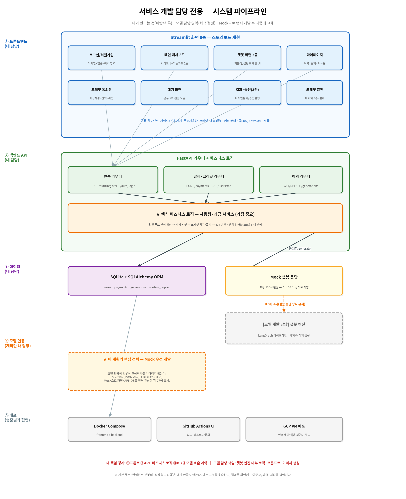
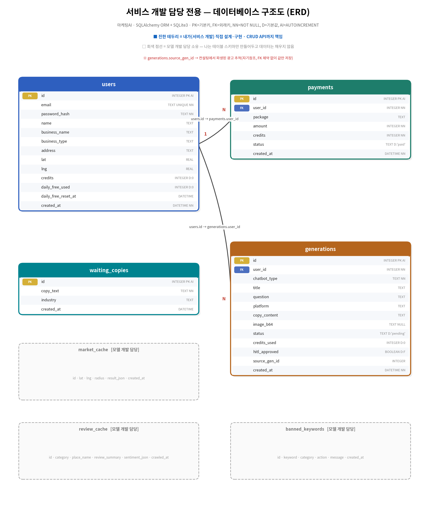

# 소프트웨어 개발 계획서 (SDP) - V1
## 서비스 개발 담당 전용 — 매출부스터 통합 플랫폼

- **작성 기준**: 코드잇 스프린트 파트4 팀 고급 프로젝트 / 요구사항 명세서 v10 기반
- **개발 기간**: 2026년 8월 10일(월) ~ 8월 22일(토)
- **투입 인원**: 서비스 개발 담당 **1명** (초급 AI 엔지니어)
- **문서 버전**: SDP_SD v1.0

---

## 1. 프로젝트 개요 (Project Overview)

### 1.1 우리가 만드는 것
**소상공인을 위한 통합 플랫폼 "매출부스터"**. 챗봇이 2개다.

- **기본 챗봇(게시물 생성)** — 광고 문구 + 광고 이미지를 만들어 준다.
- **컨설턴트 챗봇** — 상권을 분석해 전략을 제안한다. **이제 그 전략을 바로 광고로 만들 수 있다(v10 확정).**

**왜 2개인가**: 소상공인의 고민은 "광고를 어떻게 쓰지?"만이 아니라 "뭘 팔아야 하지?"도 있기 때문이다.
두 챗봇을 한 플랫폼에 담는 것이 다른 팀과의 차별점이다.

**어떻게 쓰는가(스토리보드 기준)**: 로그인 → 좌측 사이드바에서 **두 챗봇 중 하나를 클릭** →
채팅으로 대화 → 결과물 확인. 하루 무료 사용 횟수가 있고, 초과하면 크레딧을 쓴다.

### 1.2 이 문서의 목적
위 서비스에서 **서비스 개발 담당 1명이 맡는 부분만** 분리 후, 
10일 안에 개발 가능한 실행 계획 작성.

### 1.3 서비스 개발 담당 한 줄 정의
> **"챗봇이 잘 돌아갈 수 있는 웹서비스 개발(UI/UX·API·DB·과금)."**

---

## 2. 개발 범위(Scope)

> 스코프 정의는 SDP에서 가장 중요하다. **'No'라고 말하는 용기**가 일정을 지킨다.

### 2.1 ✅ 포함 범위 (In-Scope)

| 영역 | 내용 |
| --- | --- |
| **프론트엔드(UI/UX)** | (예) Streamlit 화면 8종 + 공통 사이드바 + 에러 배너 3종 |
| **백엔드(REST API)** | (예) FastAPI 라우터 12개 (인증·결제·크레딧·이력) |
| **비즈니스 로직** | (예) **일일 무료 사용량 + 크레딧 차감/롤백 + 생성 상태 관리** ← 가장 중요 |
| **데이터베이스** | (예) SQLAlchemy ORM 또는 SQLite3, 테이블 4개 설계·구현 |
| **모델 연동** | (예) 챗봇 호출 **인터페이스(API 계약)** 정의 + Mock 구현 |
| **통합 테스트** | (예) 회원가입 → 생성 → 과금 → 이력까지 E2E 시나리오 |

### 2.2 ❌ 미포함 범위 (Out-of-Scope)

| 미포함 항목 | 담당 |
| --- | --- |
| **기본 챗봇 생성 로직**(광고 문구·이미지 생성 알고리즘) | 모델 개발 담당 |
| **컨설턴트 챗봇 로직**(상권 분석·전략 수립 알고리즘) | 모델 개발 담당 |
| LangGraph 파이프라인 내부 노드 구현 | 모델 개발 담당 또는 전민재 PM |
| 프롬프트 엔지니어링 / RAG 검색 / SDXL 이미지 생성 | 모델 개발 담당 |
| 상권 API·트렌드 API·리뷰 크롤링 호출 로직 | 모델 개발 담당 |
| `market_cache` / `review_cache` / `banned_keywords` 데이터 적재 | 모델 개발 담당과 협의 진행 예정 |
| Triton 서빙·GPU 최적화 | 모델 서빙 담당 - 미정 |
| GCP VM 배포·CI/CD 파이프라인 | 임시 인프라 담당 - 윤승준 |

> ⚠️ **경계에서 헷갈리기 쉬운 것**
> - `generations` **테이블 생성·저장 API 설계 작업은 개발 범위에 포함**되지만, **거기 들어갈 데이터 적재 작업은 모델 담당과 협의 진행 예정**
> - `banned_keywords` **테이블을 설계 작업은 개발 범위에 포함**되지만, **키워드를 채우고 판정 로직을 짜는 건 모델 담당 또는 전민재 PM과 협의 진행 예정.**
> - 대기 화면 **UI/UX 설계 작업은 개발 범위에 포함**되지만, 대기 중 표시할 **문구 100건 작성은 모델 담당자 또는 전민재 PM과 협의 진행 예정**

### 2.3 우선순위 — MUST / SHOULD / COULD

> 10일 안에 다 못 만들 수 있다. 하여 **미리 우선 순서를 정해둔다.**

| 등급 | 항목 | 판단 기준 |
| --- | --- | --- |
| 🔴 **MUST** | 로그인/회원가입, 사이드바, 챗봇 화면 2종, 크레딧·무료사용량 로직, DB 4테이블, API 12개, Mock 연동 | **없으면 라이브 시연 불가** |
| 🟠 **SHOULD** | 마이페이지(이력·통계), 크레딧 충전 화면, 동의창, 대기 화면, 결과·승인 화면, 에러 배너 3종 | 구현 시 기술적 완성도 향상 |
| 🟢 **COULD** | 재사용/재생성, 사이드바 토글 애니메이션, 컨설팅→광고 연계 버튼, React 전환 | **필요 시 구현 진행** |

---

## 3. 개발 방법론 (Methodology)

### 3.1 애자일 · 2 스프린트 구성
- 1인 개발 + 2주 → 모놀리식 코드라도 동작 먼저, 리팩토링 나중
- 매일 데일리 스크럼 참여 필수
- **스프린트 1**(8/10~8/14): DB·API·UI/UX 설계 및 Mock 우선 개발
- **스프린트 2**(8/17~8/21): 실제 챗봇 연동 + 부가 화면
- **8/22(토)**: 통합 테스트 + 버퍼

### 3.2 ★ 핵심 전략 — Mock 우선 개발 (중요!)

> **문제**: 모델 담당 (기본/컨설턴트)챗봇이 완성되기 기다리면, 서비스 개발 계획대로 작업하기 어려움.
> **해법**: 응답 형식(JSON 계약)만 먼저 합의하고, 가짜 응답(Mock)으로 우선 개발 진행.

```
[D1] 모델 담당과 API 응답 형식(JSON 계약) 합의   ← 이것만 하면 됨
   ↓
[D1~D6] Mock 챗봇(고정 JSON 반환)으로 화면·API·DB·과금 전부 완성
   ↓
[D7] 모델 담당자가 구현한 실제 챗봇으로 교체 (같은 응답 형식이므로 코드 수정 최소)
   ↓
[D8~D10] 통합 테스트 · 버그 수정 · 부가 화면
```

**왜 이 방식인가**: 초급 개발자가 가장 많이 겪는 실패가 **"남의 작업을 기다리다 시간을 다 쓰는 것"** 이다.
Mock을 쓰면 **첫날부터 마지막 날까지 개발 계획서 대로 작업을 진행할 수 있다.**

### 3.3 데일리 스크럼 참여
매일 10~15분 **[어제 한 일 / 오늘 할 일 / 막히는 부분(Blocker)]** 공유.
초급 개발자는 혼자 오래 파는 경향이 있으므로, **30분 룰**(30분 시도해도 안 되면 즉시 공유)을 지킨다.

### 3.4 일일 통합(Daily Merge) 원칙
최소 2일 단위로 GitHub에 머지한다. 마지막에 한꺼번에 합치면 충돌로 하루를 날린다.

---

## 4. 일정 및 마일스톤 (Schedule & Milestones)

> **실작업일 계산**: 8/10~8/22 중 주말(8/15·8/16 일부) 제외 → **실작업 11일 + 마지막 토요일 버퍼**

### 4.1 스프린트 1 — (8/10 월 ~ 8/14 금)

| 일자 | 작업 내용 | 완료 기준(DoD) |
| --- | --- | --- |
| **D1** 8/10(월) | · **모델 담당자와 API 계약(JSON 형식) 합의** ← 최우선<br>· 프로젝트 구조 세팅, SQLAlchemy 모델 4개 작성<br>· DB 초기화 스크립트 | `python init_db.py` 실행 시 테이블 4개 생성됨 |
| **D2** 8/11(화) | · 인증 API (회원가입·로그인·세션)<br>· 비밀번호 해시(bcrypt)<br>· 회원가입 시 위치→좌표 저장 필드 준비 | curl로 가입·로그인 성공 |
| **D3** 8/12(수) | · **★ 사용량·과금 서비스 구현**(핵심)<br>· 일일 무료 잔여 확인 / 자정 리셋 / 크레딧 차감·롤백<br>· 402 응답 처리 | 무료 소진 → 크레딧 차감 → 0이면 402 반환 확인 |
| **D4** 8/13(목) | · Mock 챗봇 응답 구현<br>· `POST /generate` API (계약대로 동작)<br>· generations 저장 로직 | Mock 응답이 DB에 저장되고 크레딧이 차감됨 |
| **D5** 8/14(금) | · (예) Streamlit 로그인/회원가입 화면<br>· 메인 대시보드 + **공통 사이드바**<br>· **스프린트 1 회고(KPT)** | 브라우저에서 로그인 → 대시보드 진입 성공 |

> **스프린트 1 목표(가장 중요)**: **"가짜 응답(Mock)이지만 끝까지 흐르는 앱"** 개발 목표 설정.
> 이 상태가 되면 이후에 무슨 일이 생겨도 시연할 것이 있다.

### 4.2 스프린트 2 — 실제 연동 + 완성도 (8/17 월 ~ 8/21 금)

| 일자 | 작업 내용 | 완료 기준(DoD) |
| --- | --- | --- |
| **D6** 8/17(월) | · 챗봇 화면 2종(기본/컨설턴트) 채팅 UI<br>· 플랫폼 선택 버튼(인스타/현수막)<br>· 보조정보 입력 폼(선택사항·건너뛰기) | 채팅으로 Mock 결과가 화면에 표시됨 |
| **D7** 8/18(화) | · **★ Mock → 실제 챗봇 교체**(모델 담당자와 협의 후 연동 작업 진행)<br>· 응답 형식 불일치 대응<br>· 통합 오류 처리 | 실제 챗봇 응답이 화면에 표시됨 |
| **D8** 8/19(수) | · 크레딧 동의창(예상차감·잔액)<br>· 대기 화면(문구 5초 랜덤)<br>· 결과·승인 화면(제안 3안 + 승인/다시만들기) | 생성 전체 흐름이 스토리보드대로 동작 |
| **D9** 8/20(목) | · 마이페이지(통계 4종 + 생성 이력)<br>· 크레딧 충전 화면(패키지 3종)<br>· 에러 배너 3종(402/429/5xx) | 이력이 쌓이고 충전이 반영됨 |
| **D10** 8/21(금) | · 재사용/재생성(COULD)<br>· UI 다듬기 · 반응형 토글<br>· **스프린트 2 회고(KPT)** | 전체 화면 흐름 자연스러움 |

### 4.3 마무리 (8/22 토)
- E2E 통합 테스트(§7 시나리오 전체 수행)
- 버그 수정 · 발표용 시연 리허설
- **버퍼**: 앞선 일정이 밀렸다면 못했던 개발 작업 이어서 진행

### 4.4 마일스톤 요약

| 마일스톤 | 날짜 | 판정 기준 |
| --- | --- | --- |
| **M1** API 계약 확정 | 8/10 | 모델 담당자와 JSON 형식 합의 완료 |
| **M2** 백엔드 관통 | 8/13 | Mock으로 생성→과금→저장이 API로 동작 |
| **M3** 화면 관통 | 8/14 | 브라우저에서 로그인→대시보드 진입 |
| **M4** 실제 챗봇 연동 | 8/18 | Mock 없이 실제 응답 표시 |
| **M5** 시연 가능 상태 | 8/21 | 전체 흐름 스토리보드대로 동작 |

---

## 5. 자원 및 역할 (Resources & Roles)

### 5.1 인력
| 역할 | 인원 | 비고 |
| --- | --- | --- |
| 서비스 개발 담당 | **1명 (초급 AI 엔지니어)** | 본 SDP의 대상 |
| 모델 개발 담당 2인 | 별도 | 챗봇 엔진 |
| 인프라 담당 | 임시 - 윤승준 | 배포·CI/CD |
| PM | 전민재 | 일정·의사결정/Langgraph 오케스트레이션/노드 기능 구현 |

### 5.2 기술 스택

| 영역 | 선택 | 선택 이유 |
| --- | --- | --- |
| 프론트엔드 | (예) **Streamlit** | 코드잇 가이드가 명시적으로 허용. React 대비 학습·구현 시간 1/3. **10일 안에 완주 가능** |
| 백엔드 | **FastAPI** | 파트4-3에서 학습 완료. 자동 문서(/docs)로 모델 담당자와 협업 편함 |
| ORM/DB | **SQLAlchemy + SQLite3** | 요구사항 명세 v10 확정. 별도 DB 서버 불필요 |
| 인증 | **세션 + bcrypt** | JWT보다 단순. 초급자 구현 난이도 낮음 |
| 패키지 관리 | **uv** | 팀 합의 사항 |
| 컨테이너 | **Docker Compose** | 인프라 담당이 만든 스켈레톤 활용 |

> **[결정 필요] React 전환 여부**
> 팀 PR에 "추후 React UI로 교체" 계획 논의함. 그러나 **초급 1명 · 10일** 조건에서 React+FastAPI 신규 구축은
> 기간 안에 개발하기 어려울 수 있음. 하여 **본 SDP는 Streamlit을 기본안으로 하고, React는 시간 여유 시 진행한다.(COULD)**
> 코드잇 가이드도 *"Streamlit을 사용하더라도 그 한계 내에서 최대한 사용하기 편한 UI/UX를 설계해야 합니다"* 라고 명시하고 있어
> Streamlit 선택은 평가 기준상 불리하지 않다.

### 5.3 개발 환경
- 로컬: VSCode + Remote-SSH로 GCP VM 접속 (팀 표준)
- 코드 반영: **GitHub PR → main merge** (VM 직접 수정 금지 — 팀 원칙)
- 브랜치: `feature/service-*` 네이밍

---

## 6. 시스템 설계

### 6.1 파이프라인 (서비스 개발 관점)


```
① 프론트엔드(내 담당)  (예) Streamlit 화면 8종
        ↓
② 백엔드 API(내 담당)  FastAPI 라우터 + ★사용량·과금 서비스
        ↓                              ↘ POST /generate
③ 데이터(내 담당)      SQLite+SQLAlchemy   ④ Mock 챗봇 → (D7) 모델 담당 챗봇 엔진
        ↓
⑤ 배포(인프라 담당 협업) Docker Compose → GitHub Actions → GCP VM
```

### 6.2 데이터베이스 구조도 (ERD)


- **내가 만드는 테이블(4개)**: `users`, `payments`, `generations`, `waiting_copies`
- **모델 담당 소유(3개)**: `market_cache`, `review_cache`, `banned_keywords`
  → **DB 테이블 설계**만 직접 해두고 데이터 적재 업무는 모델 담당자와 협의 후 진행 예정.
- **관계**: `users(1) — payments(N)`, `users(1) — generations(N)`

### 6.3 ★ 모델 담당자와의 API 계약 (D1에 반드시 합의)

> 이 계약만 정해지면 **양쪽이 서로를 기다리지 않고 병렬로 개발**할 수 있다.

**요청 (서비스 → 모델)**
```json
{
  "chatbot_type": "basic",
  "user_id": 1,
  "question": "여름 신메뉴 홍보 문구 만들어줘",
  "platform": "instagram",
  "store": { "name": "카페 코드잇", "type": "카페",
             "address": "서울 강남구 역삼동", "lat": 37.5, "lng": 127.0 },
  "extra": { "purpose": "신메뉴 출시", "price_range": "5000-8000" }
}
```

**응답 (모델 → 서비스)**
```json
{
  "status": "ok",
  "title": "여름 신메뉴 홍보",
  "proposals": [
    { "copy": "제안1 문구...", "image_b64": "iVBORw0KG..." },
    { "copy": "제안2 문구...", "image_b64": "..." },
    { "copy": "제안3 문구...", "image_b64": "..." }
  ],
  "sources": ["상권분석", "트렌드"],
  "tokens_used": 1520
}
```

> **협의 포인트**: ① 제안 개수는 **3개 고정**(스토리보드 확정) ② 이미지는 **base64 인라인**(파일 경로 아님)
> ③ 실패 시 `{"status":"error","message":"..."}` 형식 ④ 컨설턴트 챗봇도 **같은 형식** 사용(proposals 1개)

### 6.4 REST API 명세

| # | 메서드 | 경로 | 기능 | 우선순위 |
| --- | --- | --- | --- | --- |
| 1 | POST | `/auth/register` | 회원가입 | 🔴 MUST |
| 2 | POST | `/auth/login` | 로그인 | 🔴 MUST |
| 3 | POST | `/auth/logout` | 로그아웃 | 🟠 SHOULD |
| 4 | GET | `/users/me` | 내 정보(크레딧·무료잔여 포함) | 🔴 MUST |
| 5 | PATCH | `/users/me` | 가게 정보 수정 | 🟢 COULD |
| 6 | POST | `/generate/estimate` | **예상 차감 크레딧·잔액 조회**(동의창용) | 🟠 SHOULD |
| 7 | POST | `/generate` | 생성 요청(과금+모델 호출+저장) | 🔴 MUST |
| 8 | GET | `/generations` | 생성 이력 목록 | 🟠 SHOULD |
| 9 | GET | `/generations/{id}` | 이력 상세(재사용 또는 재생성) | 🟢 COULD |
| 10 | DELETE | `/generations/{id}` | 이력 삭제 | 🟢 COULD |
| 11 | POST | `/payments` | 크레딧 충전 | 🟠 SHOULD |
| 12 | GET | `/waiting-copies` | 대기 화면 문구 조회 | 🟠 SHOULD |

### 6.5 ★ 핵심 비즈니스 로직 — 사용량·과금 처리 순서

> **이 로직이 이 프로젝트에서 서비스 개발 담당자가 개발 해야할 가장 중요한 로직이다.** D3에 집중해서 구현한다.

```
[생성 요청 도착]
 1. daily_free_reset_at 확인 → 자정 지났으면 daily_free_used = 0 리셋
 2. daily_free_used < 일일무료한도 ?
      YES → 무료 처리 (daily_free_used += 1, credits_used = 0)
      NO  → 3번으로
 3. users.credits >= 차감액 ?
      YES → 동의창 표시 → 사용자 [확인] → credits 차감 → status='generating'
      NO  → HTTP 402 반환 → 프론트는 "크레딧이 부족합니다" 화면
 4. 모델 호출 (Mock 또는 실제)
 5. 성공 → status='done', generations 저장
    실패 → status='failed', **차감한 크레딧 롤백** ← 반드시!
```

> ⚠️ **초급자가 놓치기 쉬운 함정 3가지**
> 1. **실패 시 롤백 누락** → 사용자는 실패했는데 크레딧만 잃는다. 컴플레인 1순위.
> 2. **재시도 시 중복 차감** → [다시 시도] 버튼을 누를 때마다 또 차감된다. 요청 ID로 방지.
> 3. **잔액을 화면마다 따로 계산** → 사이드바와 마이페이지 숫자가 달라진다. **`GET /users/me` 하나만 쓴다.**

### 6.6 생성 상태 값 - (generations 테이블 status 컬럼)

| status | 의미 |
| --- | --- |
| `pending` | 동의창 표시, 사용자 확인 대기 |
| `generating` | 생성 중(대기 화면 노출) |
| `done` | 생성 완료(결과·승인 화면) |
| `failed` | 실패(크레딧 롤백됨) |
| `published` | 사용자 승인·발행 완료 |

---

## 7. 프로젝트 디렉토리 구조 (팀 통합본)

> **디렉토리 구조 변경 사항**: `model_basic/`·`model_consult/` → **`models/{shared,basic,consult}/`** 로 재편.
> 두 챗봇에 중복되던 `llm.py` 등을 `models/shared/`(전민재 PM 관리)로 통합했다. (D-030, D-031)

> **통합 원칙 6가지**
> 1. **4개 SDP의 모든 경로·주석을 보존한다** — 하나도 삭제하지 않음
> 2. **1인칭("내 담당")은 전부 역할명으로 치환** — 통합 시 누구인지 알 수 없게 되므로
> 3. **같은 경로에 여러 담당자 파일이 있으면 합친다** — `tests/`·`docs/`가 해당
> 4. **문서는 루트 `docs/` 한 곳으로 모은다** — 3곳에 흩어져 있으면 못 찾음
> 5. **완전히 동일한 코드만 `models/shared/`로 올린다** — 하는 일이 다르면 분리 유지
> 6. **`models/`는 `backend/`의 형제다** — 하위로 넣지 않음(배포 단위·Mock 전략·관리자 경계 유지)

### 7.1 관리자 한눈에 보기

| 디렉토리 | 관리자 | 다른 담당자 |
| --- | --- | --- |
| `validation/` | **전민재 PM** | import만 (수정 금지) |
| `models/shared/` | **전민재 PM** | import만 (수정 금지) |
| `cache/` | **컨설턴트 챗봇 담당** | import만 (수정 금지) |
| `shared_data/` | **전민재 PM + 컨설턴트 담당** | 읽기만 |
| `backend/` · `frontend/` | **서비스 개발 담당** | — |
| `models/basic/` | **기본 챗봇(게시물 생성) 담당** | — |
| `models/consult/` | **컨설턴트 챗봇 담당** | — |
| `scripts/` (루트) | **전민재 PM** | — |
| `tests/` (루트) | **서비스 개발 담당 + 전민재 PM** | 파일명으로 구분 |
| `docs/` (루트) | **전원 공용** | 파일명으로 구분 |

> ⚠️ **한 파일에는 관리자 한 명.** 남의 디렉토리 파일은 **import만** 하고 내부를 수정하지 않는다.
> 수정이 필요하면 관리자에게 요청한다. → 머지 충돌 방지

---

### 7.2 전체 구조

```
(예시)
sales-booster/
│
├── validation/                       # ★★ 전민재 PM 관리 — 두 챗봇 담당자는 import만
│   ├── keywords.py                   # banned_keywords 로딩·대조 (공통 유틸)
│   ├── patterns.py                   # 인젝션 대표 패턴 · RISKY_HINTS(1단 필터)
│   ├── security.py                   # check_input(보안1) + check_output(보안2)
│   │                                 #   ※ 둘 다 순수 보안이라 한 파일로 관리
│   │                                 #   ★ D1에 두 함수 모두 pass 스텁으로 먼저 커밋
│   │                                 #     check_input  → D2에 내용 채움
│   │                                 #     check_output → D5에 내용 채움
│   ├── regulation.py                 # ★ check_regulation — 1단 키워드 + 2단 RAG
│   │                                 #   ★ D1 스텁 → D4 구현
│   ├── self_check.py                 # self_check (품질 검사 — 보안 아님)
│   │                                 #   ★ D1 스텁 → D5 구현
│   ├── legal_retriever.py            # legal_kb FAISS 검색 래퍼
│   └── data/
│       └── banned_keywords.csv       # 규제 키워드 사전 (전민재 PM 작성)
│
├── cache/                            # ★★ 컨설턴트 챗봇 담당 관리 (1·2층) — 두 챗봇 공용
│   ├── models.py                     # MarketCache·TrendCache·ReviewCache ORM
│   │                                 #   ※ 테이블 DDL은 서비스 개발 담당자가 생성
│   ├── market_repo.py                # ★ Cache-Aside · TTL 7일 · get_market()   [MUST]
│   │                                 #   market_cache 적재 + get_market() 조회
│   ├── trend_repo.py                 # ★ Cache-Aside · TTL 7일 · get_trend()    [SHOULD]
│   │                                 #   트렌드 API 호출 + get_trend() 조회
│   ├── review_repo.py                # 사전 배치 전용 · TTL 30일 · get_review()  [COULD]
│   │                                 #   review_cache 적재 + 조회
│   │                                 #   ※ 기본 챗봇 담당자는 미사용
│   └── ttl.py                        # TTL 만료 판정 공통 유틸
│                                     #   ★ D1에 mock 반환 스텁으로 먼저 커밋
│
├── shared_data/                      # ★ 전민재 PM/컨설턴트 담당자가 채우는 데이터 자산
│   │                                 #   기본 챗봇 담당자는 읽기만
│   ├── legal_kb.md                   # ★ 규제 RAG 원본
│   │                                 #   (전민재 PM 작성·1차 검토, 2차 검토 - 다른 담당자)
│   ├── legal_kb.json                 # 스크립트가 생성 (gitignore 가능)
│   ├── legal_index/                  # FAISS 인덱스 파일
│   ├── golden_dataset.json           # 골든 데이터셋 55문항
│   │                                 #   (기준=전민재 PM, 문항=팀 분담)
│   │                                 #   ※ 컨설팅 문항은 컨설턴트 챗봇 담당자가 작성
│   └── benchmark_kb.json             # 업종 벤치마크 KB 데이터
│                                     #   (전민재 PM 또는 컨설턴트 챗봇 담당자가 작성)
│
├── backend/                          # ★★ 서비스 개발 담당 관리
│   ├── main.py                       # FastAPI 앱 조립 · 라우터 등록 · CORS
│   ├── config.py                     # .env 로딩(설정값·상수)
│   ├── database.py                   # SQLAlchemy engine/session, get_db()
│   ├── models.py                     # ORM 모델 4개 (users/payments/generations/waiting_copies)
│   │                                 #   ※ 최상위 models/ 디렉토리와 다름 — 서비스 ORM 전용
│   ├── schemas.py                    # Pydantic 요청·응답 스키마
│   ├── auth.py                       # 비밀번호 해시·세션 검증
│   ├── init_db.py                    # 테이블 생성 + 시드 데이터
│   │
│   ├── routers/                      # ★ API 라우터 (서비스 개발 담당)
│   │   ├── auth_router.py            # 회원가입·로그인·로그아웃
│   │   ├── users_router.py           # 내 정보 조회/수정
│   │   ├── generate_router.py        # 생성 요청·예상 차감 조회
│   │   ├── generations_router.py     # 이력 목록·상세·삭제
│   │   ├── payments_router.py        # 크레딧 충전
│   │   └── waiting_router.py         # 대기 문구 제공
│   │
│   ├── services/                     # ★ 비즈니스 로직 (가장 중요)
│   │   ├── usage_service.py          # 일일 무료 확인·자정 리셋
│   │   ├── credit_service.py         # 크레딧 차감·롤백·잔액 조회
│   │   └── generation_service.py     # 생성 오케스트레이션·상태 전이
│   │
│   ├── clients/                      # ★ 모델 담당 연동부 (계약 경계)
│   │   ├── chatbot_client.py         # 실제 챗봇 호출 (D7에 연결)
│   │   │                             #   → models.basic.main / models.consult.main 을 호출
│   │   └── mock_chatbot.py           # Mock 응답 (D1~D6 개발용)
│   │
│   ├── requirements.txt / pyproject.toml (uv)
│   ├── Dockerfile / .dockerignore
│   └── app.db                        # SQLite 파일 (gitignore)
│
├── frontend/                         # ★★ 서비스 개발 담당 관리
│   ├── streamlit_app.py              # 진입점 · 로그인 상태 라우팅
│   ├── api_client.py                 # 백엔드 호출 래퍼 (requests)
│   │
│   ├── pages/                        # ★ 화면 8종
│   │   ├── login.py                  # 로그인/회원가입
│   │   ├── dashboard.py              # 메인 대시보드(기능 카드 2종)
│   │   ├── basic_chatbot.py          # 기본 챗봇(게시물 생성)
│   │   ├── consultant_chatbot.py     # 컨설턴트 챗봇
│   │   ├── mypage.py                 # 마이페이지(통계·이력)
│   │   └── billing.py                # 크레딧 충전
│   │
│   ├── components/                   # ★ 공통 컴포넌트
│   │   ├── sidebar.py                # 내 가게·무료사용량·크레딧·메뉴4종
│   │   ├── credit_dialog.py          # 크레딧 동의창(예상차감·잔액)
│   │   ├── waiting_screen.py         # 대기 화면(문구 5초 랜덤)
│   │   ├── result_view.py            # 결과·승인(제안 3안)
│   │   └── error_banner.py           # 에러 배너 3종(402/429/5xx)
│   │
│   ├── requirements.txt
│   └── Dockerfile
│
├── models/                           # ★★★ 모델 코드 묶음 — backend/ 의 형제 (하위 아님)
│   │                                 #   ※ backend/ 하위에 두지 않는 이유:
│   │                                 #     ① 배포 단위 분리(모델 수정이 backend 재빌드 유발 안 함)
│   │                                 #     ② Mock 우선 전략 유지(D1~D6 backend 독립 개발)
│   │                                 #     ③ 관리자 경계 유지 ④ 추후 GPU 서버 분리 대비
│   │
│   ├── shared/                       # ★ 전민재 PM 관리 — 두 챗봇 담당자는 import만
│   │   │                             #   ※ 완전히 동일한 코드만 여기로 올린다
│   │   ├── llm.py                    # OpenAI 호출 래퍼(+429 백오프)
│   │   │                             #   ★ 두 챗봇이 100% 동일 → 통합 (중복 제거)
│   │   ├── state_common.py           # ★ CommonState — 두 챗봇 공통 GraphState (D-002)
│   │   │                             #   chatbot_type·user_id·question·store
│   │   │                             #   context·result·sources·tokens_used
│   │   │                             #   validation·source_gen_id
│   │   ├── base_nodes.py             # ★ 전민재 PM 검증 함수를 감싸는 노드 4종 공통 래퍼
│   │   │                             #   security_input · regulation · security_output · self_check
│   │   └── retry.py                  # 429 백오프·재시도 상한 공통 유틸
│   │
│   ├── basic/                        # ★★ 기본 챗봇(게시물 생성) 담당 작업 영역
│   │   ├── main.py                   # 챗봇 진입점 (서비스 개발 담당자가 호출)
│   │   ├── config.py                 # 채널 규칙·재생성 상한 등 기본 챗봇 전용 상수
│   │   │                             #   ※ 모델명·온도 등 공통값은 models/shared/ 참조
│   │   │
│   │   ├── graph/                    # ★ LangGraph 골격 (기본 챗봇 담당자가 관리)
│   │   │   ├── state.py              # BasicState — CommonState 상속 + 전용 필드
│   │   │   │                         #   platform·extra·proposals·retry_count
│   │   │   └── build_basic.py        # 노드 조립 + 조건부 엣지(재생성 루프)
│   │   │
│   │   ├── nodes/                    # ★ 기본 챗봇 담당자가 개발하는 노드들
│   │   │   ├── security_input.py     # 보안1 노드 — 전민재 PM의 check_input() 감싸기
│   │   │   ├── question_analysis.py  # 질문 분석·정보충분성
│   │   │   ├── extra_form.py         # 보조정보 폼 처리(선택사항)
│   │   │   ├── channel.py            # 채널(플랫폼) 확정
│   │   │   ├── market_for_copy.py    # 상권 카피용 요약(3층) — cache.get_market() 호출
│   │   │   ├── trend_for_copy.py     # 시즌·이슈 카피용 요약(3층) — cache.get_trend() 호출
│   │   │   ├── benchmark_node.py     # 업종 벤치마크 RAG 검색·요약(3층)
│   │   │   ├── copy_gen.py           # ★ 광고 카피 생성 (가장 중요)
│   │   │   ├── ranking.py            # 배리언트 랭킹(LLM Judge)
│   │   │   ├── regulation_node.py    # 규제검증 노드 — 전민재 PM의 check_regulation() 감싸기
│   │   │   ├── image_gen.py          # 광고 이미지 생성 노드
│   │   │   ├── image_review.py       # 이미지 자동 검수
│   │   │   ├── channel_format.py     # 채널별 리포맷
│   │   │   ├── security_output.py    # 보안2 노드 — 전민재 PM의 check_output() 감싸기
│   │   │   └── self_check_node.py    # self_check 노드 — 전민재 PM의 self_check() 감싸기
│   │   │   # ※ context_review.py 없음 — 경쟁사 리뷰는 컨설턴트 전담
│   │   │   # ※ context_trend.py 없음 — 트렌드 API 호출은 컨설턴트 전담
│   │   │   # ★ 검증 노드 4개는 D2에 모두 연결 완료
│   │   │   #   → 전민재 PM이 스텁 내용만 채우면 자동 반영
│   │   │
│   │   ├── clients/                  # ★ 외부 연동부 (교체 가능하게 분리)
│   │   │   └── image_client.py       # 1차 API → 2차 SDXL 교체 지점
│   │   │   # ※ trend_api.py 없음 — cache/trend_repo.py(컨설턴트)로 이관
│   │   │
│   │   ├── retrieval/                # 벤치마크 RAG (인덱싱·검색 = 기본 챗봇 담당 영역)
│   │   │   ├── vectorstore.py        # FAISS 인덱스 로드·검색
│   │   │   └── embedder.py           # text-embedding-3-small
│   │   │
│   │   ├── scripts/                  # ★ 기본 챗봇 담당 배치 (별도 트랙)
│   │   │   └── build_benchmark_index.py  # KB 데이터(전민재 PM 제공) → FAISS 인덱싱
│   │   │   # ※ 데이터 작성 자체는 전민재 PM/컨설턴트 영역
│   │   │
│   │   ├── eval/                     # ★ 평가 — 코드는 기본 챗봇 담당, 데이터는 전민재 PM
│   │   │   ├── eval_retrieval.py     # HitRate@5 · MRR
│   │   │   ├── eval_generation.py    # LLM Judge · Faithfulness
│   │   │   ├── eval_image.py         # CLIP Score
│   │   │   └── reports/              # 평가 결과 리포트 · 튜닝 전후 비교표
│   │   │   # ※ golden_dataset.json 은 shared_data/ 에 위치(전민재 PM 작성)
│   │   │
│   │   ├── tests/
│   │   │   └── test_pipeline.py      # 그래프 E2E 테스트
│   │   │   # ※ test_regulation.py(검증 함수 단위 테스트)는 전민재 PM 영역
│   │   │
│   │   ├── requirements.txt / pyproject.toml (uv)
│   │   └── README.md
│   │
│   └── consult/                      # ★★ 컨설턴트 챗봇 담당 작업 영역
│       ├── main.py                   # 챗봇 진입점 (서비스 개발 담당자가 호출)
│       ├── config.py                 # TTL 상수 등 컨설턴트 전용 상수
│       │                             #   ※ 모델명·온도 등 공통값은 models/shared/ 참조
│       │
│       ├── graph/                    # ★ LangGraph 골격 (컨설턴트 챗봇 담당자가 관리)
│       │   ├── state.py              # ConsultState — CommonState 상속 + 전용 필드
│       │   │                         #   strategy·reasons·suggested_chips
│       │   └── build_consultant.py   # 노드 조립 + 조건부 엣지(재생성 루프)
│       │
│       ├── nodes/                    # ★ 컨설턴트 챗봇 담당자가 개발하는 노드들
│       │   ├── security_input.py     # 보안1 노드 — 전민재 PM의 check_input() 감싸기
│       │   ├── question_analysis.py  # 질문 분석·정보충분성
│       │   ├── suggested_chips.py    # 추천 질문 칩 3종 처리
│       │   ├── market_for_consult.py # 상권·경쟁 밀도 분석 (3층, 컨설팅용)
│       │   ├── review_for_consult.py # 경쟁사 리뷰 차별점 (3층)        [COULD]
│       │   ├── trend_for_consult.py  # 시즌·수요 타이밍 (3층)
│       │   ├── strategy.py           # ★ 마케팅 전략 제안 (가장 중요)
│       │   ├── strategy_check.py     # 전략 품질 검증(근거·실행가능성)
│       │   ├── link_to_ads.py        # ★ [이 전략으로 광고 만들기] 연계
│       │   ├── security_output.py    # 보안2 노드 — 전민재 PM의 check_output() 감싸기
│       │   └── self_check_node.py    # self_check 노드 — 전민재 PM의 self_check() 감싸기
│       │   # ※ *_for_copy.py 없음 — 카피용 요약은 기본 챗봇 담당 영역
│       │
│       ├── clients/                  # ★ 외부 API 호출부 (Cache-Aside의 '미스' 경로)
│       │   ├── market_api.py         # 상권정보 OpenAPI 호출
│       │   ├── trend_api.py          # NAVER 검색어 트렌드 호출
│       │   └── review_crawler.py     # 네이버 플레이스 배치 크롤러   [COULD]
│       │   # ※ geocode_api.py 없음 — 지오코딩은 서비스 개발 담당 영역
│       │
│       ├── analysis/                 # 컨설팅 분석 유틸
│       │   ├── density.py            # 경쟁 밀도·최근접 거리 계산
│       │   └── sentiment.py          # KcELECTRA 감성분석(CPU)       [COULD]
│       │
│       ├── scripts/                  # ★ 배치 적재 (파이프라인과 분리)
│       │   ├── preload_demo_cache.py # ★ 시연용 캐시 사전 적재(강남역 등) — D9
│       │   └── load_review_cache.py  # 리뷰 사전 수집 배치          [COULD]
│       │   # ※ 상권·트렌드는 Cache-Aside라 별도 적재 배치 불필요
│       │
│       ├── eval/                     # ★ 평가
│       │   ├── eval_strategy.py      # 전략 품질 LLM Judge
│       │   ├── eval_retrieval.py     # 데이터 조회 정확도·캐시 히트율
│       │   └── reports/              # 평가 결과 · 튜닝 전후 비교표
│       │
│       ├── tests/
│       │   ├── test_market_repo.py   # Cache-Aside 동작 테스트(히트/미스)
│       │   └── test_pipeline.py      # 그래프 E2E 테스트
│       │
│       ├── requirements.txt / pyproject.toml (uv)
│       └── README.md
│
├── scripts/                          # ★ 전민재 PM 배치 스크립트 (루트)
│   ├── load_banned_keywords.py       # CSV → DB 적재
│   └── build_legal_kb.py             # ★ md → JSON → 임베딩 → FAISS 인덱싱
│
├── tests/                            # ★ 루트 테스트 — 서비스 개발 담당 + 전민재 PM
│   │                                 #   ※ 모델 테스트는 각 models/*/tests/ 에 위치
│   ├── test_auth.py                  # [서비스] 회원가입·로그인
│   ├── test_credit.py                # [서비스] ★ 과금 로직(가장 중요한 테스트)
│   ├── test_e2e.py                   # [서비스] 전체 시나리오
│   ├── test_security.py              # [PM] 보안1·2 차단 테스트
│   ├── test_regulation.py            # [PM] 규제 검증 (과잉 차단·누락 케이스)
│   └── test_self_check.py            # [PM] 답변 검증 규칙 테스트
│
├── docs/                             # ★ 팀 공용 문서 — 한 곳에 모음
│   │                                 #   ※ 흩어져 있으면 못 찾으므로 루트로 통합
│   │
│   ├── sdp_pm.md                     # [PM] 전민재 PM SDP
│   ├── sdp_service.md                # [서비스] 서비스 개발 담당 SDP
│   ├── sdp_basic.md                  # [기본] 기본 챗봇 담당 SDP
│   ├── sdp_consult.md                # [컨설턴트] 컨설턴트 챗봇 담당 SDP
│   │
│   ├── pipeline_sdp_pm.png           # [PM] 파이프라인 다이어그램
│   ├── pipeline_sdp_service.png      # [서비스] 파이프라인 다이어그램
│   ├── pipeline_sdp_basic.png        # [기본] 파이프라인 다이어그램
│   ├── pipeline_sdp_consult.png      # [컨설턴트] 파이프라인 다이어그램
│   ├── erd_sdp_service.png           # [서비스] ERD 다이어그램
│   │
│   ├── directory_structure.md        # ★ 본 통합 디렉토리 구조 (단일 소스)
│   ├── api_contract.md               # ★ 서비스 ↔ 모델 API 계약서
│   ├── validation_contract.md        # ★ [PM] 검증 함수 4종 계약서(두 담당자용)
│   ├── repo_contract.md              # ★ [컨설턴트] 조회 함수 시그니처(기본 챗봇 담당자용)
│   ├── graphstate_spec.md            # ★ [PM] GraphState 공통 규격(D1 확정)
│   ├── decisions.md                  # ★ [PM] 의사결정 로그(수치 3건 등)
│   ├── demo_scenario.md              # [PM] 발표 시연 시나리오
│   └── prompt_tuning_log.md          # ★ 프롬프트 튜닝 실험 기록(D10)
│
├── docker-compose.yml                # [서비스] 로컬 통합 실행
├── .env.example                      # [서비스] 환경변수 템플릿
├── requirements.txt / pyproject.toml (uv)   # 루트 공통 의존성
└── README.md                         # 프로젝트 최상위 안내
```

---

### 7.3 `models/shared/` 로 통합한 것과 하지 않은 것

> **판단 기준**: *"두 챗봇이 100% 같은 코드인가?"* 하나라도 다르면 분리 유지한다.

| 항목 | 두 챗봇 비교 | 판정 | 위치 |
| --- | --- | --- | --- |
| `llm.py` (OpenAI 래퍼 + 429 백오프) | **완전히 동일** | ✅ 통합 | `models/shared/llm.py` |
| 429 재시도·백오프 유틸 | **완전히 동일** | ✅ 통합 | `models/shared/retry.py` |
| GraphState 공통 필드 | 공통 + 각자 필드 | ⚠️ 공통만 통합 | `models/shared/state_common.py` |
| 검증 노드 4종 래퍼 | 전민재 PM 함수 감싸기 — 거의 동일 | ✅ 통합 | `models/shared/base_nodes.py` |
| `config.py` (모델명·온도) | 공통값은 같고 TTL·채널규칙은 각자 | ⚠️ 공통만 통합 | 공통=`shared/`, 전용=각자 |
| `main.py` | 각자 다른 그래프를 호출 | ❌ 분리 유지 | `basic/` · `consult/` |
| `graph/build_*.py` | 노드 구성이 완전히 다름 | ❌ 분리 유지 | `basic/` · `consult/` |
| `nodes/copy_gen.py` vs `strategy.py` | **하는 일이 완전히 다름** | ❌ 분리 유지 | `basic/` · `consult/` |

> **`nodes/` 를 통째로 합치지 않는 이유**: 카피 생성과 전략 제안은 목적이 다르다.
> 한 폴더에 25개 파일이 쌓이면 **오히려 못 찾는다.**

---

## 8. 품질 보증 (QA)

### 8.1 E2E 통합 테스트 시나리오 (8/22 수행)

```
1. 회원가입 (이름·이메일·비밀번호·업종·위치) → 성공
2. 로그인 → 대시보드 진입, 사이드바에 가게명·무료사용량·크레딧 표시
3. [게시물 생성] 클릭 → 플랫폼 선택(인스타그램) → 보조정보 건너뛰기
4. 생성 요청 → 무료 잔여 있음 → 바로 생성 → 대기 화면 표시
5. 결과 3안 표시 → [승인하고 발행] → 마이페이지 이력에 저장 확인
6. 무료 횟수 소진할 때까지 반복 → 소진 후 생성 시 [크레딧 동의창] 표시
7. [확인] → 크레딧 차감 → 잔액이 사이드바·마이페이지 모두 동일하게 갱신
8. 크레딧 0으로 만들기 → 생성 시 402 → "크레딧이 부족합니다" + [충전하기]
9. [크레딧 충전] → 패키지 선택 → 잔액 증가 확인
10. [컨설턴트 챗봇] → 전략 제안 → [이 전략으로 광고 만들기] → 기본 챗봇 연동
```

### 8.2 단위 테스트 (최소 3개 — 초급 AI 엔지니어 기준)
- `test_credit.py` : 무료 소진 → 크레딧 차감 → 0이면 402
- `test_credit.py` : 생성 실패 시 **크레딧 롤백** 확인
- `test_auth.py` : 중복 이메일 가입 시 400

### 8.3 코드 품질 기준
- 함수마다 한 줄 주석 (코드잇 평가 항목: *"코드 내 주석 및 마크다운이 잘 작성되어 있나요?"*)
- API는 `/docs`(Swagger)로 자동 문서화 → 모델 담당자가 스스로 확인 가능
- 비밀값은 `.env`에만, GitHub 커밋 금지

---

## 9. 위험 관리 — "무엇이 문제가 될 수 있고, 어떻게 막을 것인가?"

| # | 리스크 | 발생 확률 | 영향 | 대응책 |
| --- | --- | --- | --- | --- |
| R1 | **모델 담당 챗봇 완성 지연** | 높음 | 치명적 | **Mock 우선 개발**(§3.2). 끝까지 안 되면 Mock으로 시연 |
| R2 | **크레딧 수치 미확정**(무료 5 vs 10회, 차감 10 vs 50) | 높음 | 중 | **config.py에 상수로 분리**. 확정되면 값만 교체 |
| R3 | **API 응답 형식 불일치**(D7 연동 시) | 중 | 높음 | D1에 계약 문서화(`docs/api_contract.md`). 양쪽이 같은 문서 참조 |
| R4 | **초급자 기술 난이도**(SQLAlchemy·세션) | 중 | 중 | **30분 룰** — 막히면 즉시 팀에 공유. 파트4-3 강의자료 재활용 |
| R5 | (예) **Streamlit UI 한계**(스토리보드 재현 어려움) | 중 | 낮음 | 기능 우선, 디자인은 근사치. `st.columns`·`st.container`로 최대한 재현 |
| R6 | **일정 지연** | 중 | 높음 | COULD 항목 개발 대상 제외(§2.3). 8/22 버퍼 확보 |
| R7 | **OpenAI 429 오류** | 중 | 중 | 서비스 개발자는 **재시도·에러 배너 UI만** 담당. 호출 제어는 모델 담당 |

> **가장 큰 리스크는 R1이다.** 그래서 이 SDP 개발 계획서 문서 전체가 **Mock 우선**으로 설계돼 있다.

---

## 10. 팀 협업 규칙

### 10.1 데일리 스크럼 (매일 10~15분)
[어제 한 일 / 오늘 할 일 / 막히는 부분(Blocker)] 공유

### 10.2 스프린트 회고 — KPT
| 항목 | 내용 |
| --- | --- |
| **Keep** | 좋았던 점, 계속 유지할 점 |
| **Problem** | 아쉬웠던 점, 기술적/소통적 문제점 |
| **Try** | 다음 스프린트에 시도할 구체적 액션 |

- 1차 회고: 8/14(금) · 2차 회고: 8/21(금)

### 10.3 협업일지 (매일 작성 — 평가 항목)
> 코드잇 평가에 포함된다. **오늘 팀을 위해 내가 어떤 기여를 했는지**를 중심으로,
> 작성한 코드·얻은 인사이트·했던 고민·실수까지 구체적으로 남긴다.

### 10.4 문서화 규칙
API 명세·DB 스키마 변경은 **GitHub Issue 또는 docs/에 즉시 기록**해 파편화를 막는다.

---

## 11. 미확정 사항 — 개발 시작 전 팀 확정 필요

> 아래가 정해져야 코드에 값을 넣을 수 있다. **정해지기 전까지는 `config.py`에 상수로 두고 개발한다.**

| # | 항목 | 현재 상태 | 기한 |
| --- | --- | --- | --- |
| 1 | **일일 무료 한도** (5회 vs 10회) | 스토리보드 내 불일치 | **8/10 D1** |
| 2 | **회당 크레딧 차감액** (10 vs 50, 문구/이미지 차등?) | 스토리보드 내 불일치 | **8/10 D1** |
| 3 | **크레딧 잔액 단일 소스** | 화면 간 값 불일치 | **8/10 D1** |
| 4 | **API 응답 계약** | 본 SDP §6.3 초안 | **8/10 D1** |
| 5 | 컨설턴트 챗봇 과금 여부 | 미정 | 8/12 D3 |
| 6 | 재사용 또는 재생성 시 동의창 재노출 여부 | 미정 | 8/19 D8 |
| 7 | React 전환 여부 | (예) Streamlit 기본안 | 8/17 D6 |
| 8 | 서비스명 통일 (예) 매출부스터 | 문서마다 상이 | 8/10 D1 |

---

## 12. 완료 정의 (Definition of Done)

**이 SDP 개발 계획서가 성공적인 산출물이라고 말할 수 있는 조건**

- [ ] 사용자가 회원가입하고 로그인할 수 있다
- [ ] 사이드바에 내 가게·무료사용량·크레딧이 정확히 표시된다
- [ ] 두 챗봇 화면에 각각 진입해 대화할 수 있다
- [ ] 생성 요청 시 무료→크레딧 순서로 정확히 차감된다
- [ ] 크레딧 부족 시 402와 충전 안내가 뜬다
- [ ] 생성 실패 시 크레딧이 롤백된다
- [ ] 생성 이력이 마이페이지에 쌓인다
- [ ] 모델 담당자가 구현한 실제 챗봇이 연동되어 결과가 표시된다
- [ ] Docker Compose로 한 번에 실행된다
- [ ] E2E 시나리오 10단계가 모두 통과한다

---

## 부록 A. 골든 데이터셋 참고

> **골든 데이터셋(Golden Dataset)이란**
> 인공지능(AI) 및 머신러닝 시스템에서 모델의 성능을 평가하고 검증하기 위해
> 사람이 직접 검증하여 신뢰성을 확보한 **고품질의 표준(Reference) 데이터셋**을 의미한다.

**서비스 개발 담당자와의 관계**: 골든 데이터셋 **구축·평가는 모델 개발 담당의 업무**다.
다만 서비스 개발자는 **평가 결과를 저장·조회할 수 있는 구조**(generations 테이블의 tokens_used 등)를 설계한다.

---

## 부록 B. 참고 문서
- 요구사항 명세서 v10 (`v10_sw_req_spec.md`)
- 수정 스토리보드 (화면 시안)
- 파이프라인 다이어그램 (`pipeline_sdp_service.png`)
- ERD 다이어그램 (`erd_sdp_service.png`)
- API 계약서 (`docs/api_contract.md` — D1 작성 예정)