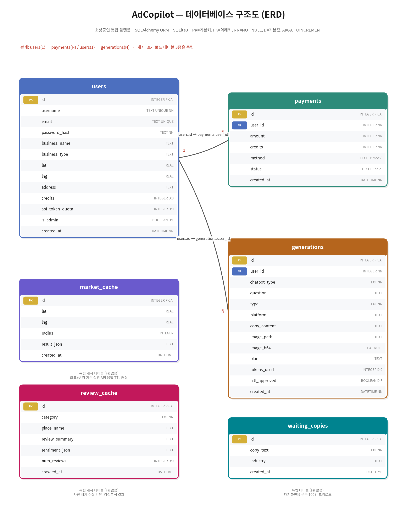
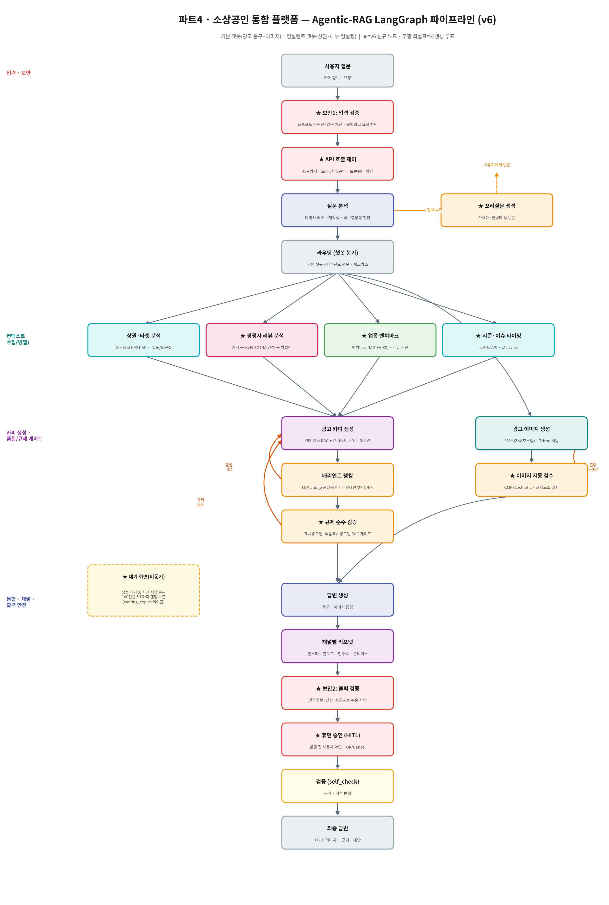

# 요구사항 명세서 v6

## 1. 문서 개요
- **목적**: 생성형 AI로 광고 콘텐츠(문구·이미지)를 손쉽게 제작 하는 챗봇과 컨설턴트 챗봇 이 두 가지를 포함한 소상공인들의 통합 플랫폼 요구사항 정의.
- **범위**: 광고 콘텐츠(문구·이미지) 생성 챗봇과 컨설턴트 챗봇 둘 다 메인 챗봇 프로그램으로 개발 범위 정의.
- **핵심 변경(v2 대비)**:
    - (1) 네이버 트렌드 API → **NAVER API HUB로 이관 확정**(개발자센터 신규 발급 불가, 2026-07-31부)
    - (2) 경쟁사 리뷰 분석 → **[확장]으로 분리**(공식 API 부재, Selenium 크롤링은 약관·안정성 리스크)
    - (3) 이미지 생성 → **GCP L4 서버에서 자체 호스팅(self-hosted) SDXL + Triton 서빙**
      (로컬 PC 아님 — 개발·서빙 모두 GCP VM에서 수행, GPU 활용으로 평가 가점)
    - (4) 지오코딩 → **NAVER Maps API 채택**(무료 대략 월 300만)
    - (5) 상권 API 활용 필드 확장(업종 3단계 분류·좌표·행정동·totalCount → 파생 지표 산출)
- **핵심 변경(v5 대비, v6 신규)**:
    - (6) **2개 챗봇 통합 플랫폼으로 확장**: 기본 챗봇(광고 문구+이미지 생성) + 컨설턴트 챗봇(상권·메뉴 컨설팅).
      플랜을 free/paid로 나누는 방식이 아니라, **기본 챗봇이 카피+이미지를 모두 생성**하고
      컨설턴트 챗봇은 별도 페르소나로 컨설팅을 수행한다. (타팀 대비 차별점 = 통합 플랫폼)
    - (7) **보안 노드 2종 + 규제 검증 + HITL + 이미지 자동 검수 노드 추가**(part4_team_pipeline_v2.png 반영)
    - (8) **OpenAI API 429 대응 설계 추가**(요청 간격·큐잉·토큰 쿼터·개인 크레딧 폴백)
    - (9) **대기 화면(문구 100건 랜덤 노출) 추가** — 생성 대기 시간의 사용자 이탈 방지
    - (10) **평가 지표·골든 데이터셋 대폭 확장**(검색/생성/이미지 3축)
    - (11) **ERD·파이프라인 다이어그램(.png)·디렉토리 구조 신규 산출물 추가**
- **용어**: 소상공인(사용자), 노드(파이프라인 기능 단위), 라우터(질의 분기 로직),
  크레딧(선불 충전형 유료 재화), 경쟁 밀도(반경 내 동일 소분류 업종 수 기반 지표),
  자체 호스팅(self-hosted, 외부 API가 아닌 우리 GCP 서버에서 직접 모델을 구동·서빙),
  **기본 챗봇**(광고 문구+이미지 생성 전담 페르소나), **컨설턴트 챗봇**(상권·메뉴·전략 컨설팅 전담 페르소나),
  **HITL**(Human-In-The-Loop, 발행 전 사용자 승인 단계).

---

## 2. 시스템 개요
사용자는 로그인 후 광고 콘텐츠 생성 챗봇을 이용한다. 챗봇은
(a) 주소를 **네이버 지오코딩**으로 좌표 변환 →
(b) **소상공인시장진흥공단 상권 API**로 반경 내 업종 분포·경쟁 밀도(정량) 분석 →
(c) **네이버 데이터랩(NAVER API HUB) 검색어 트렌드**로 시의성 키워드 반영 →
(d) 플랫폼별 광고 문구+이미지(유료) 생성한다.(필요 시 문구(무료) 추가)
내부적으로 라우터가 질의를 Agentic-RAG / 문구생성 / 이미지생성 노드로 분기한다.

> ⚠️ 경쟁사 "리뷰" 정성 분석은 네이버가 리뷰 API를 제공하지 않아 MVP에서 제외.
> 리뷰 기반 분석은 [확장]에서 사전 수집(배치) 캐시 데이터로만 제한적으로 다룬다.
> 실시간 크롤링은 이용약관·안정성 리스크로 서비스 핵심 경로에 넣지 않는다.

### 2.1 (v6 추가) 통합 플랫폼 구성 — 2개 챗봇 페르소나
본 서비스는 단일 챗봇이 아니라 **소상공인 통합 플랫폼**이며, 두 개의 메인 챗봇을 포함한다.
사용자는 웹 메인 페이지 좌측 사이드바에서 이용할 챗봇을 선택한다.

| 구분 | 기본 챗봇 (광고 콘텐츠 생성) | 컨설턴트 챗봇 (상권·메뉴 컨설팅) |
| --- | --- | --- |
| 페르소나 | 광고 카피라이터 + 디자이너 | 상권 분석 컨설턴트 |
| 진입 | 사이드바 "게시물 생성" 탭/체크박스 | 사이드바 "컨설턴트 챗봇" 버튼 |
| 핵심 기능 | 광고 문구 + 광고 이미지 생성(둘 다 기본 제공) | 메뉴 제안, 상권 분석, 프로모션·타겟팅 전략 |
| 주요 데이터 | 트렌드 API, 레퍼런스 RAG, SDXL | 상권정보 OpenAPI, 네이버 데이터랩, 업종 벤치마크 |
| 출력 | 카피 3~5안 + 이미지 + 대안 | 근거 포함 컨설팅 리포트 + 전략 제안 |
| 담당(권장) | 모델 개발 담당 A | 모델 개발 담당 B |

> **주의사항(add 14 반영)**: 기본 챗봇·컨설턴트 챗봇 둘 다 메인 챗봇 프로그램이며,
> 이 둘을 포함한 **소상공인 통합 플랫폼**을 개발한다. 카피+이미지 생성은 기본 챗봇의 기본 기능이므로
> free(카피만)/paid(카피+이미지)로 나누지 않는다. 유료화는 **API 토큰 쿼터/크레딧 차감** 방식으로 전환한다.
> 두 챗봇을 잇는 연계(컨설팅 결과 → 광고 콘텐츠 생성)는 EX-05에서 다룬다.

### 2.2 (v6 추가) 사용자 흐름 (End-to-End)
```
로그인 → 메인 페이지(사이드바)
  ├─ [기본 챗봇] "게시물 생성" 탭/체크박스 클릭
  │     → "게시물 생성" 팝업(OK/Cancel)
  │     → OK 시 크레딧/토큰 쿼터 확인 → 차감 → 파이프라인 실행
  │     → (대기 중) 사전 저장 문구 100건 랜덤 노출 화면
  │     → 카피 3~5안 + 이미지 + 대안 제시 → HITL 승인 → 발행/다운로드
  └─ [컨설턴트 챗봇] "컨설턴트 챗봇" 버튼 클릭
        → 상권/업종 질의 → 상권 API + 트렌드 + 벤치마크 분석
        → 메뉴·프로모션·타겟팅 전략 제안(근거 포함)
        → (EX-05) 전략 승인 시 기본 챗봇으로 콘텐츠 생성 연계
```

---

## 3. 기능 요구사항

### [MVP] 필수 구현 (발표·시연 대상)
| ID | 기능 | 입력 | 출력 |
| --- | --- | --- | --- |
| FR-01 | 주소→좌표 지오코딩 | 주소 문자열 | lat, lng |
| FR-02 | 상권 정보 조회 | 좌표+반경(≤2000m) | 반경 내 매장 리스트(업종3단계·좌표·행정동 포함) |
| FR-03 | 상권 정량 분석 | FR-02 결과 | 경쟁밀도·동일업종수·최근접거리·업종다양성 |
| FR-04 | 업종 트렌드 조회 | 업종·키워드 | 검색어 트렌드 추이 |
| FR-05 | 플랫폼별 문구 생성 | 소재+플랫폼(인스타/블로그/현수막) | 플랫폼별 문구 3안 |
| FR-06 | 광고 이미지 생성(유료) | 문구+스타일 | 광고 이미지(SDXL) |
| FR-07 | 게시물 생성(유료) | 생성요청+플랜 | 유료:문구+이미지(필요 시 무료:문구 추가) |
| FR-08 | 대안 제시·재생성 | 최초 생성물 | 1안/2안 선택지 |
| FR-09 | 꼬리질문 정보 보완 | 최초 질문 | 반문 질문→반영 결과 |
| FR-10 | 회원가입·로그인 | 이메일·비밀번호·가게정보 | 세션 발급 |
| FR-11 | 크레딧 결제·차감 | 충전 요청 / 유료 생성 | 크레딧 잔액·차감 결과 |
| FR-12 | 라우터 분기 | 사용자 질의 | 적합 노드로 라우팅 |
| FR-13 | 품질 평가(개발용) | 생성물·참조데이터 | HitRate@k / MRR / LLM Judge |

### [MVP 추가] v6 신규 기능 요구사항 (add_sw_req_spec 반영)
| ID | 기능 | 입력 | 출력 | 근거 |
| --- | --- | --- | --- | --- |
| FR-14 | 컨설턴트 챗봇 (별도 페르소나) | 상권·업종 질의 | 근거 포함 컨설팅 답변 | add 13, 14 |
| FR-15 | 상권/업종 분석 기반 메뉴·차별점 추천 | 업종·좌표·반경 | 유행 메뉴, 반경 내 미판매(차별) 아이템 추천 | add 8 |
| FR-16 | 마케팅 전략 제안 | 상권 정량 분석 결과 | 프로모션·이벤트·가격·타겟팅 전략(근거 포함) | add 8 |
| FR-17 | 실시간 시의성 데이터 반영 카피 | 날씨/뉴스/트렌드 API | 시의성 반영 카피(예: 눈 예보→겨울 카피) | add 5 |
| FR-18 | 채널별 포맷팅 상세 규칙 적용 | 소재 + 채널 | 인스타(해시태그·이모지), 블로그(장문·소제목), 현수막(짧은 한 줄·가독성) | add 3, 4 |
| FR-19 | 보안1: 입력 검증 노드 | 사용자 질의 | 프롬프트 인젝션·탈옥 차단, 불법 광고 요청 거부 | add 16 |
| FR-20 | 보안2: 출력 검증 노드 | 생성 답변 | 민감정보·신상·시스템 프롬프트 누출 차단 | add 16 |
| FR-21 | 규제 준수 검증 노드 (광고규제 RAG) | 생성 카피 | 표시광고법·식품표시광고법 위반 위험 판정 + 대안 문구 | add 16 |
| FR-22 | 이미지 자동 검수 노드 | 생성 이미지 | 품질·금지요소 검사, 불량 시 재생성 트리거 | add 16 |
| FR-23 | 휴먼 승인 (HITL) | 최종 생성물 | 발행 전 사용자 확인(OK/Cancel) 후 확정 | add 16 |
| FR-24 | 대기 화면 문구 랜덤 노출 | - | 사전 저장 문구 100건 중 5초마다 랜덤 표시 | add 12 |
| FR-25 | API 토큰 사용 제한 + 추가 결제 | 사용자 요청 | 쿼터 초과 시 차단, 추가 결제 시 사용 가능 | add 15 |
| FR-26 | OpenAI 429 방지 호출 제어 | API 호출 요청 | 요청 간격 확보·큐잉·재시도(백오프)로 429 최소화 | add 17, 18 |
| FR-27 | OpenAI 키 폴백 전환 | 429/한도 초과 감지 | 대체 키(개인 크레딧)로 자동 전환(로컬 테스트 한정) | add 17 |
| FR-28 | 메인 페이지 UI (사이드바·팝업) | 사용자 클릭 | 로그인 페이지, 사이드바 탭, 생성 팝업(OK/Cancel) | add 7 |
| FR-29 | 이미지 품질 평가(개발용) | 생성 이미지+프롬프트 | CLIP Score / Aesthetic Score / 멀티모달 LLM-Judge | add 모델 성능 평가 지표 |

### [확장] 시간 허락 시 (필요 시 진행)
| ID | 기능 | 비고 |
| --- | --- | --- |
| EX-01 | 경쟁사 리뷰 감성·차별점 분석 | 사전 수집 리뷰 캐시 → ① KcELECTRA 계열 감성분석 모델로 긍/부정·측면 분류(CPU) → ② LLM 모델로 부정 측면 기반 차별화 전략 요약. 실시간 크롤링 경로 금지 |
| EX-02 | 경쟁사 리뷰 정성 분석 | 네이버 플레이스 Selenium 크롤링. **약관·안정성 리스크로 사전 배치 수집 캐시만 사용**. 실시간 경로 금지 |
| EX-03 | 실시간 날씨·뉴스 반영 카피 | 기상청/뉴스 API. MVP는 트렌드만으로 시의성 확보 |
| EX-04 | 마케팅 전략 제안 | 상권 정량 분석→프로모션/타겟팅 전략 텍스트 |
| EX-05 | 컨설팅→콘텐츠 연계 | 전략 승인 시 문구 생성 자동 트리거 |
| EX-06 | 이미지 제품 보존 생성 | IP-Adapter/ControlNet으로 제품 사진 보존 광고 이미지(가이드 '이미지 만들기 3') |
| EX-07 | 음성 컨설턴트 챗봇 | STT(음성인식)+TTS(음성합성) 적용. 추후 논의(add 13) |
| EX-08 | 스케치→광고 이미지 생성 | ControlNet(Canny/Scribble)로 스케치 기반 생성(가이드 '이미지 만들기 4') |
| EX-09 | 이미지 스타일 변환(Pix2pix/CycleGAN) | 강의자료 기반. 메뉴판·배너 스타일 변환 실험용 |

> **경쟁사 리뷰 관련 구현 방침(add 1, 2 반영)**: 상권 API로 반경 내 경쟁사를 식별한 뒤,
> 경쟁사 리뷰는 **사전 배치 수집 → review_cache 저장 → 요청 시 캐시 조회** 순서로 처리한다.
> ① 감성분석 모델로 부정 측면(대기·주차·가격 등) 집계 → ② LLM이 "경쟁사 약점 대비 우리 가게 강점"을
> 차별점 문장으로 생성 → ③ 광고 카피에 반영. 실시간 크롤링은 시연 리스크로 핵심 경로에서 제외한다.

---

## 4. 비기능 요구사항
- **성능**:
  - 텍스트 생성: OpenAI API(gpt 계열). 응답 목표 p95 < 15초.
  - 이미지 생성: **GCP VM(L4 GPU)에서 자체 호스팅 SDXL(Stable Diffusion XL) + Triton 서빙.**
    - 실행 위치: 개발·추론 모두 **GCP 서버**에서 수행(로컬 PC GPU 미사용).
      로컬은 편집만, 실행은 VSCode Remote-SSH로 서버에서.
    - 구현 순서(서버 내부에서): ① diffusers로 SDXL 직접 로드·품질/프롬프트 확보
      → ② ONNX/TensorRT 변환 → ③ Triton 서빙 + FastAPI↔Triton gRPC 연결.
      **①을 건너뛰고 Triton부터 붙이지 않는다.**(Triton은 품질 확보 후 서빙 최적화 단계)
    - 폴백: Triton 전환이 지연될 경우, ①의 diffusers 직접 서빙 상태로도 시연 가능하게 유지.
    - 모델 가중치는 GCP 디스크에 캐싱(재다운로드 방지, 디스크 100GB 한도 내 관리).
    - 이미지 응답은 base64 인라인 반환(파일경로/URL 아님).
    - 이미지 생성 목표 지연: 1장 기준 p95 < 20초(콜드스타트 제외).
- **배포/운영**: GitHub Actions 자동배포(main merge→빌드→VM pull&restart)만 허용.
  VM 직접 코드 수정 금지. SSH는 트러블슈팅 전용, 팀원 전원 개방.
  **GPU 컨테이너는 nvidia-container-toolkit로 GPU 접근 보장(--gpus all).**
- **보안**: 비밀번호 해시 저장(평문 금지), API 키는 .env(서버)·GitHub 금지,
  네이버/OpenAI 키 분리 관리, 결제정보 최소 보관.
- **사용성**: 비전문가용 클릭·대화 흐름. 로딩 상태·실패 메시지 노출.
  **이미지 생성처럼 수 초 이상 걸리는 작업은 진행 표시(스피너/예상 시간) 필수.**
- **확장성**: 노드 기반 구조로 신규 노드 추가 용이.
- **모니터링**: 구조화 로그 필수. GPU 사용량(nvidia-smi) 주기 확인. Prometheus/Grafana는 [확장].

### 4.1 (v6 추가) 외부 API 호출 안정성 — HTTP 429 대응 (add 17, 18)
- **429 발생 원인**: HTTP 요청 간격이 짧을 때, 또는 한 번에 여러 번 동시 요청할 때 발생.
- **로컬 테스트/평가 단계(운영 배포 대상 제외)**
  - 코드잇 제공 OpenAI API 키로 대규모 평가(골든 데이터셋 전량) 실행 시 429 빈발.
  - 대응: **평가 전용 호출 로직 분리** + 대체 키(팀원 개인 크레딧) 폴백 전환.
  - 평가 스크립트는 **직렬 실행 + 요청 간 sleep**을 기본값으로 한다(병렬 금지).
- **운영 배포 이후(사용자 직접 이용)**
  - **요청 큐잉**: 사용자 요청을 큐에 넣고 워커가 순차 처리(동시 호출 수 상한 설정).
  - **요청 간격 확보(rate limit)**: 초당/분당 호출 상한을 코드 레벨에서 강제.
  - **지수 백오프 재시도**: 429 수신 시 대기 시간을 늘려가며 재시도(최대 N회).
  - **파이프라인 Step 분산**: 한 요청에서 LLM을 연속 호출하지 않도록 노드 사이에 간격/캐시 삽입.
  - **호출 횟수 자체 절감**: 컨텍스트 캐싱(market_cache/review_cache), 배리언트 수 상한, 재생성 횟수 상한.
  - **토큰 쿼터 사전 확인**: 요청 진입 시 users.api_token_quota 확인 → 초과 시 차단·결제 유도(FR-25).
- **목표**: 운영 중 429 발생률 1% 미만, 발생 시 사용자에게 즉시 실패가 아닌 재시도·대기 안내 노출.

### 4.2 (v6 추가) 대기 시간 UX (add 12)
- 광고 문구·이미지 생성은 수십 초가 소요될 수 있으므로, **대기 화면**을 필수 구현한다.
- **사전 저장 문구 100건**을 DB(waiting_copies)에 프리로드하고, **5초마다 랜덤으로 1건씩 노출**한다.
- 목적: 대기 시간이 길어도 사용자가 이탈하지 않고 유하게 받아들이도록 함.
  좋은 결과물(광고 문구·이미지)이 나오는 것이 속도보다 우선이라는 서비스 철학 반영.
- 진행률/예상 소요 시간(초)도 함께 표시한다.

### 4.3 (v6 추가) 보안·규제 준수 (add 16)
- **보안1(입력 검증)**: 프롬프트 인젝션·탈옥 시도 차단, **불법 광고 문구/게시물 요청 거부**.
- **보안2(출력 검증)**: 개인정보·신상정보·시스템 프롬프트 누출 차단.
- **규제 준수 검증**: 표시광고법(거짓·과장/기만/부당비교/비방), 식품 등의 표시·광고에 관한 법률
  (질병 예방·치료 효능 표현 금지) 등 **광고규제 KB를 RAG로 참조**하여 위반 위험 문구를 판정하고
  안전한 대안 문구를 제시한다. 위반 판정 시 카피 생성 노드로 되돌려 재생성한다.
- **이미지 자동 검수**: 생성 이미지의 품질(해상도·왜곡)과 금지 요소(부적절 콘텐츠, 타사 로고 등)를
  검사하고, 불량 시 재생성 루프로 되돌린다.
- **HITL(휴먼 승인)**: 최종 발행 전 사용자가 결과물을 확인하고 OK/Cancel로 승인한다.
  승인 결과는 generations.hitl_approved에 기록한다.

---

## 5. 데이터 요구사항 (DB: SQLAlchemy, SQLite3)

### users
| 컬럼 | 타입 | 설명 |
| --- | --- | --- |
| id | INTEGER PK AUTOINCREMENT | 사용자 ID |
| username | TEXT UNIQUE NOT NULL | 사용자 이름 |
| email | TEXT UNIQUE | 로그인 아이디 |
| password_hash | TEXT NOT NULL | 비밀번호 해시(**구현 방식 팀 통일 필요**: 현행 POC=SHA-256+hmac / 권장=bcrypt) |
| business_name | TEXT | 가게명 |
| business_type | TEXT | 업종(상권·트렌드에 사용) |
| lat | REAL | 위도(상권 API용, 지오코딩 결과 저장) |
| lng | REAL | 경도 |
| address | TEXT | 원본 주소 |
| credits | INTEGER DEFAULT 0 | 보유 크레딧(유료 차감 대상) |
| api_token_quota | INTEGER DEFAULT 0 | **(v6 추가)** 잔여 API 토큰 쿼터(FR-25, 초과 시 추가 결제 유도) |
| is_admin | BOOLEAN DEFAULT FALSE | 관리자 여부 |
| created_at | DATETIME NOT NULL | 가입일시 |

### payments
| 컬럼 | 타입 | 설명 |
| --- | --- | --- |
| id | INTEGER PK AUTOINCREMENT | 결제 ID |
| user_id | INTEGER NOT NULL FK→users.id | 결제자 |
| amount | INTEGER NOT NULL | 결제 금액(원) |
| credits | INTEGER NOT NULL | 충전된 크레딧 수 |
| method | TEXT DEFAULT 'mock' | 결제수단(POC=mock) |
| status | TEXT DEFAULT 'paid' | pending/refunded/completed/failed |
| created_at | DATETIME NOT NULL | 결제 일시 |

### generations  (※ v1의 content/contents 명칭 혼용 → generations 통일)
| 컬럼 | 타입 | 설명 |
| --- | --- | --- |
| id | INTEGER PK AUTOINCREMENT | 생성물 ID |
| user_id | INTEGER NOT NULL FK→users.id | 요청자 |
| chatbot_type | TEXT NOT NULL | **(v6 추가)** 'basic'(기본 챗봇) / 'consultant'(컨설턴트 챗봇) |
| question | TEXT | 사용자 요청 |
| type | TEXT NOT NULL | 'copy+image(카피+이미지)'(필요 시 'copy(카피)'/ 추가) |
| platform | TEXT | instagram/blog/banner |
| copy_content | TEXT | 생성 문구 |
| image_path | TEXT | 생성 이미지 경로(유료) |
| image_b64 | TEXT nullable | 유료 이미지(**base64 인라인**, 파일경로/URL 아님) |
| plan | TEXT | free/paid |
| tokens_used | INTEGER DEFAULT 0 | 토큰 사용량 |
| hitl_approved | BOOLEAN DEFAULT FALSE | **(v6 추가)** 휴먼 승인(HITL) 통과 여부 |
| created_at | DATETIME NOT NULL | 생성 일시 |

### market_cache (신규 — 상권 조회 결과 캐시)
| 컬럼 | 타입 | 설명 |
| --- | --- | --- |
| id | INTEGER PK AUTOINCREMENT | 캐시 ID |
| lat | REAL | 조회 중심 위도 |
| lng | REAL | 조회 중심 경도 |
| radius | INTEGER | 조회 반경(m) |
| result_json | TEXT | 상권 API 응답(JSON 직렬화) |
| created_at | DATETIME | 조회 일시(TTL 관리용) |

### review_cache (v6 신규 — 경쟁사 리뷰 사전 수집 캐시)
| 컬럼 | 타입 | 설명 |
| --- | --- | --- |
| id | INTEGER PK AUTOINCREMENT | 캐시 ID |
| category | TEXT NOT NULL | 업종/카테고리 |
| place_name | TEXT | 경쟁사 상호명 |
| review_summary | TEXT | LLM 리뷰 요약(불만·강점 키워드) |
| sentiment_json | TEXT | 감성분석 결과(긍/부정·측면별 집계 JSON) |
| num_reviews | INTEGER DEFAULT 0 | 수집 리뷰 수 |
| crawled_at | DATETIME | 수집 일시(신선도 표기용) |

### waiting_copies (v6 신규 — 대기 화면용 문구 프리로드)
| 컬럼 | 타입 | 설명 |
| --- | --- | --- |
| id | INTEGER PK AUTOINCREMENT | 문구 ID |
| copy_text | TEXT NOT NULL | 대기 화면에 노출할 문구(총 100건 목표) |
| industry | TEXT | 업종(선택적 필터링용) |
| created_at | DATETIME | 등록 일시 |

### 5.1 데이터베이스 구조도 (ERD)


- **관계**: `users(1) ─ payments(N)`, `users(1) ─ generations(N)`
- **독립 테이블**: `market_cache`, `review_cache`, `waiting_copies` (FK 없음, 캐시/프리로드 용도)
- 산출물 파일: `erd_v6.png`

---

## 6. 인터페이스 요구사항
- **외부 API**
  - **소상공인시장진흥공단 상권정보** `storeListInRadius`
    (`http://apis.data.go.kr/B553077/api/open/sdsc2/storeListInRadius`,
     좌표 기반, 반경≤2000m, 30tps, 페이지≤1000, xml/json,
     활용 필드: indsLclsNm/indsMclsNm/indsSclsNm, lon/lat, adongNm, totalCount)
  - **네이버 클라우드 플랫폼 Maps Geocoding(주소→좌표)**: `https://maps.apigw.ntruss.com/map-geocode/v2/geocode`
    (헤더 `X-NCP-APIGW-API-KEY-ID`/`X-NCP-APIGW-API-KEY`, 무료 월 300만, JSON)
    → 검색어 트렌드와 동일 플랫폼(NCP)이라 키·인증 방식 통합 관리
  - **네이버 클라우드 플랫폼 검색어 트렌드 (NAVER API HUB)**
    (`https://naverapihub.apigw.ntruss.com/search-trend/v1/search`, 헤더 `X-NCP-APIGW-API-KEY-ID`/`X-NCP-APIGW-API-KEY`,
     ⚠️ 개발자센터(developers) 신규 발급 2026-07-31 종료 → **HUB로 발급**,
     현행 POC trend.py의 X-Naver-Client-* 헤더를 HUB 방식으로 수정 필요)
  - **OpenAI API**: 문구 생성·임베딩(gpt 계열, text-embedding-3-small)
  - **(v6 추가) 기상청 단기예보 API / 뉴스 API**: 시의성 카피 생성(FR-17, EX-03)
- **비용 관리**: 네이버 클라우드 플랫폼 결제수단 등록 필요(무료 한도 내 과금 없음). 
사용량 알림 설정, 지오코딩 결과 캐싱(market_cache 활용)으로 중복 호출 방지.
- **내부 연동**: FastAPI ↔ Triton Inference Server(gRPC, 이미지 생성)
- **정적 데이터(참고 KB)**: 업종분류(2302) xlsx, 주요상권현황 csv → 업종코드 매핑·상권명 참조
- **UI**: 로그인, 메인 사이드바(플랜·채널·컨텍스트 체크박스), 생성 결과·대안·이미지 표시

### 6.1 (v6 추가) UI 상세 요구사항 (add 7)
- **CASE 1: UI 구현**
  - 로그인 페이지 및 로그인 버튼
  - 메인 페이지 좌측 사이드바 탭/체크박스: **"게시물 생성"**, **"컨설턴트 챗봇"**
  - "게시물 생성" 클릭 시 **게시물 생성 팝업 화면(OK/Cancel 버튼 포함)**
  - 생성 대기 중 **대기 화면**(문구 100건 랜덤 5초 간격 노출 + 진행률)
  - 결과 화면: 카피 3~5안, 이미지, 대안(1안/2안), 근거, **HITL 승인 버튼(OK/Cancel)**
- **CASE 2: REST API 구현**
  - 로그인 / 회원가입 / 세션
  - "게시물 생성" 팝업 OK 클릭 → 생성 요청 → **건당 크레딧/토큰 쿼터 차감 처리**
  - 컨설턴트 챗봇 질의 API
  - 생성 이력 조회/삭제 API
- **CASE 3: DB 테이블(SQLAlchemy, sqlite3) 설계**
  - users(사용자 정보), payments(결제 정보), generations(문구/게시물 생성),
    market_cache(상권 캐시), review_cache(리뷰 캐시), waiting_copies(대기 문구)

---

## 7. (v6 추가) 파이프라인



```
사용자 질문
  → ★보안1: 입력 검증 (프롬프트 인젝션·탈옥·불법광고 요청 차단)
  → ★API 호출 제어 (429 방지: 요청 간격/큐잉 · 토큰 쿼터 확인)
  → 질문 분석 (대명사 해소·재작성·정보충분성 판단)
        └─(정보 부족)→ ★꼬리질문 생성 → 사용자에게 반문
  → 라우팅 (기본 챗봇 / 컨설턴트 챗봇 분기)
  ├─ 컨텍스트 수집 (병렬)
  │    ├─ 상권·타겟 분석 (상권정보 REST API · 밀도/최근접)
  │    ├─ ★경쟁사 리뷰 분석 (캐시 → KcELECTRA 감성 → 차별점)
  │    ├─ ★업종 벤치마크 (벤치마크 RAG · 메뉴 추천)
  │    └─ ★시즌·이슈 타이밍 (트렌드 API · 날씨/뉴스)
  │  → 광고 카피 생성 (레퍼런스 RAG + 컨텍스트 반영 · 3~5안)
  │  → 배리언트 랭킹 (LLM Judge · 대안 1안/2안 제시)
  │        └─(품질 미달)→ 카피 생성으로 재생성 루프
  │  → ★규제 준수 검증 (표시광고법·식품표시광고법 RAG 게이트)
  │        └─(규제 위반)→ 카피 생성으로 재생성 루프
  └─ ★광고 이미지 생성 (SDXL 자체호스팅 · Triton 서빙)
       → ★이미지 자동 검수 (CLIP/Aesthetic · 금지요소)
             └─(불량)→ 이미지 재생성 루프
  → 답변 생성 (문구·이미지 통합)
  → 채널별 리포맷 (인스타·블로그·현수막·플레이스)
  → ★보안2: 출력 검증 (민감정보·신상·프롬프트 누출 차단)
  → ★휴먼 승인 HITL (발행 전 사용자 확인 · OK/Cancel)
  → 검증 self_check (근거·거부 판정)
  → 최종 답변 (카피 + 이미지 + 근거 + 대안)

※ 비동기: 생성 대기 중 ★대기 화면에서 사전 저장 문구 100건을 5초마다 랜덤 노출
```
- 산출물 파일: `pipeline_v6.png`

---

## 8. (v6 추가) 프로젝트 디렉토리 구조

```
adcopilot-platform/
├── backend/
│   ├── main.py                     # FastAPI 앱 조립 · 라우터 등록 · CORS
│   ├── config.py / config.yaml     # 설정 로딩(.env + yaml)
│   ├── database.py                 # SQLAlchemy engine/session (SQLite3)
│   ├── models.py                   # ORM 모델 (users/payments/generations/caches)
│   ├── schemas.py                  # Pydantic 요청·응답 스키마
│   ├── auth.py                     # 로그인·세션·API Key 검증
│   ├── rate_limiter.py             # ★429 대응: 큐잉·간격 제어·지수 백오프
│   ├── llm.py                      # OpenAI 래퍼(+키 폴백·오프라인 목)
│   ├── routers/
│   │   ├── auth_router.py          # 회원가입·로그인
│   │   ├── payments_router.py      # 결제·크레딧 충전/차감
│   │   ├── generate_router.py      # 기본 챗봇(카피+이미지) 생성
│   │   ├── consultant_router.py    # ★컨설턴트 챗봇 질의
│   │   ├── generations_router.py   # 생성 이력 조회/삭제
│   │   └── waiting_router.py       # ★대기 화면 문구 제공
│   ├── graph/
│   │   ├── state.py                # GraphState 정의
│   │   ├── build_basic.py          # 기본 챗봇 그래프 조립
│   │   └── build_consultant.py     # ★컨설턴트 챗봇 그래프 조립
│   ├── nodes/
│   │   ├── security_input.py       # ★보안1: 입력 검증
│   │   ├── question_analysis.py    # 질문 분석 · 정보충분성
│   │   ├── clarify.py              # 꼬리질문(반문)
│   │   ├── routing.py              # 챗봇/기능 라우팅
│   │   ├── market.py               # 상권·타겟 분석(상권 API)
│   │   ├── geocode.py              # 주소→좌표(NCP Maps)
│   │   ├── trend.py                # 검색어 트렌드(NAVER API HUB)
│   │   ├── weather_news.py         # ★시의성 데이터(날씨/뉴스)
│   │   ├── competitor.py           # ★경쟁사 리뷰 캐시 조회·차별점
│   │   ├── benchmark.py            # ★업종 벤치마크 RAG · 메뉴 추천
│   │   ├── copy_gen.py             # 광고 카피 생성(3~5안)
│   │   ├── ranking.py              # 배리언트 랭킹(LLM Judge)·대안
│   │   ├── regulation.py           # ★규제 준수 검증(광고규제 RAG)
│   │   ├── image_gen.py            # 광고 이미지 생성(SDXL/Triton)
│   │   ├── image_review.py         # ★이미지 자동 검수
│   │   ├── channel_format.py       # 채널별 리포맷
│   │   ├── security_output.py      # ★보안2: 출력 검증
│   │   ├── hitl.py                 # ★휴먼 승인
│   │   ├── self_check.py           # 근거·거부 판정
│   │   └── strategy.py             # ★마케팅 전략 제안(컨설턴트)
│   ├── retrieval/
│   │   ├── vectorstore.py          # FAISS 인덱스 로드·검색
│   │   ├── embedder.py             # 임베딩(text-embedding-3-small)
│   │   └── reranker.py             # CrossEncoder 재순위(선택)
│   ├── serving/
│   │   ├── triton_client.py        # FastAPI↔Triton gRPC 클라이언트
│   │   └── sdxl_pipeline.py        # diffusers 직접 서빙(폴백 경로)
│   ├── data/
│   │   ├── benchmark_kb.json       # 업종 벤치마크 KB
│   │   ├── legal_kb.json           # ★광고규제·판례 KB
│   │   ├── industry_codes.xlsx     # 업종분류(2302) 연계표
│   │   ├── major_markets.csv       # 주요상권현황
│   │   └── waiting_copies.json     # ★대기 화면 문구 100건 시드
│   ├── requirements.txt / pyproject.toml (uv)
│   ├── Dockerfile / .dockerignore
│   └── app.db                      # SQLite 파일(gitignore)
├── frontend/
│   ├── streamlit_app.py            # 메인 진입(로그인·사이드바 라우팅)
│   ├── pages/
│   │   ├── basic_chatbot.py        # ★기본 챗봇 화면(게시물 생성 팝업)
│   │   ├── consultant_chatbot.py   # ★컨설턴트 챗봇 화면
│   │   ├── history.py              # 생성 이력
│   │   └── billing.py              # 크레딧·결제
│   ├── components/
│   │   ├── waiting_screen.py       # ★대기 화면(문구 랜덤 5초)
│   │   ├── hitl_dialog.py          # ★HITL 승인 팝업(OK/Cancel)
│   │   └── result_view.py          # 카피·이미지·대안·근거 표시
│   ├── requirements.txt
│   └── Dockerfile
├── crawler/                        # ★사전 배치 수집(운영 경로 분리)
│   ├── place_crawler.py            # 네이버 플레이스 리뷰 수집(배치 전용)
│   ├── sentiment.py                # KcELECTRA 감성분석(CPU)
│   ├── summarize.py                # 리뷰 요약·차별점 생성
│   └── run_batch.py                # 스케줄 실행 진입점
├── triton/
│   └── model_repository/
│       └── sdxl/
│           ├── config.pbtxt        # Triton 모델 설정
│           └── 1/model.onnx        # 변환된 모델(gitignore)
├── eval/
│   ├── golden_dataset.json         # ★골든 데이터셋(단일/다중/후속/거부)
│   ├── eval_retrieval.py           # HitRate@k · Recall@k · MRR · Context P/R
│   ├── eval_generation.py          # RAGAS · ROUGE · BERTScore · LLM Judge
│   ├── eval_image.py               # ★CLIP Score · Aesthetic · LLM Judge(멀티모달)
│   └── reports/                    # 평가 결과 리포트
├── docs/
│   ├── v6_sw_req_spec.md           # 본 문서
│   ├── erd_v6.png                  # ★ERD 다이어그램
│   ├── pipeline_v6.png             # ★파이프라인 다이어그램
│   └── 보고서.pdf                   # 최종 제출 보고서
├── scripts/
│   ├── seed.py                     # 데모 계정·시드 데이터
│   └── seed_waiting_copies.py      # ★대기 문구 100건 적재
├── .github/workflows/deploy.yml    # GitHub Actions 자동 배포
├── docker-compose.yml              # backend + frontend + triton
├── .env.example
└── README.md
```

---

## 9. (v6 추가) 모델 성능 평가 지표

### 9.1 검색(Retrieval) 지표
- **세트 1**: all-hit@20(다중 문서 질문에 대해 양쪽 문서 모두 회수한 비율), Hit Rate@5(정답 근거가 상위 5개 안에 든 비율)
- **세트 2**(골든 데이터셋 1~100번 문항 활용): Recall@3, Recall@5, Recall@10, MRR
- **세트 3**: Hit Rate@5, MRR(Mean Reciprocal Rank), Context Recall, Context Precision

### 9.2 생성(Generation) 지표
- **세트 1**: RAGAS — Faithfulness, Answer-Relevance, Context-Recall, Context-Precision
- **세트 2**(골든 데이터셋 101~122번 문항 활용): 생성 실패율, 응답시간, Faithfulness, Answer Relevance,
  Context Recall, Context Precision, Retrieval Accuracy
- **세트 3**: Faithfulness, Answer Correctness, RAGAS-Score(종합 지표), ROUGE-1, ROUGE-L, BERTScore-F1, BLEU

### 9.3 이미지 생성 지표
기본: FID (Fréchet Inception Distance), CLIP Score

- **축 1 — 텍스트-이미지 정합성 (가장 중요, 이 축을 두껍게)**
  FID, CLIP Score, CLIPScore의 확장 — ImageReward, VQAScore / TIFA
- **축 2 — 미적 품질 (광고는 "예뻐야" 함, 이 축이 광고엔 특히 중요)**
  Aesthetic Score (LAION Aesthetic Predictor), HPS v2 (Human Preference Score)
- **축 3 — 사람 평가 (정량 지표의 한계를 보완, 가장 신뢰도 높음)**
  LLM-as-a-Judge (멀티모달): GPT 계열 비전 모델 / 간단한 A/B 사용자 평가

| ID | 기능 | 입력 | 출력 |
| --- | --- | --- | --- |
| FR-13b | 이미지 품질 평가(개발용) | 생성 이미지+프롬프트 | ① CLIP Score(정합성) ② Aesthetic Score(미적품질) ③ 멀티모달 LLM-Judge(광고매력도·규제위험) / FID는 샘플 확보 시 참고용 |

> **지표 선택 근거(발표용)**: 본 과제는 **정답 이미지가 없는 순수 생성(Text-to-Image)** 태스크이므로,
> 참조 이미지가 필요한 **PSNR·LPIPS는 기본 평가에서 제외**한다.
> 단, EX-06(IP-Adapter 제품 사진 보존)을 구현할 경우 **입력 제품 대비 보존도 측정에 LPIPS를 제한적으로 사용**한다.
> FID는 통계적 신뢰를 위해 다수 샘플이 필요하므로, 샘플 확보 시 참고 지표로만 활용한다.

> 참고 자료: 이미지 생성과 변환에 대한 이해, 이미지생성_GAN.ipynb, 이미지변환_Pix2pix.ipynb, 디퓨전_모델.ipynb
> (강의 노트북은 `diffusers.DiffusionPipeline` + Stable Diffusion v1.5 기준. 본 프로젝트는 SDXL로 확장 적용)

---

## 10. (v6 추가) 골든 데이터셋

- **세트 1**: 총 92 문항(단일 문서 질문 52개, 다중 문서 질문 40개)
- **세트 2**: 총 122 문항(단일:79 / 다중:14 / 후속:7 / 기타:22)
  - 기타에는 "모른다"가 정답인 문항, 문체 변환, 범위 밖의 질문(답변 거부가 정답)인 경우 해당
  - 데이터: 파싱 파이프라인 Parity 검증율
- **세트 3**: 총 63 문항(단일 20 / 다중 15 / 후속 15 / 거부 13)
  - 데이터: 문서 로딩 성공률, 메타데이터 결측률, 청크 길이 분포, 민감정보 마스킹 정확도, 골든 데이터셋 검증율

> **운영 주의(add 17 반영)**: 골든 데이터셋 전량 평가는 OpenAI API 호출이 대량 발생하여 429가 빈발한다.
> 평가 스크립트는 **직렬 실행 + 요청 간 sleep**을 기본으로 하고, 필요 시 대체 키로 폴백한다.

---

## 참고

> "우리가 하고 싶은 것(리뷰 크롤링, 실시간 반영)과 안정적으로 되는 것(공식 API 정량 분석)을 구분함. **라이브 시연 대상 기능은 MVP, 리스크 있는 것을 확장 항목** 분류함. 특히 외부 API의 경우 검색어 트렌드, 지오코딩은 네이버로 통합합니다. 이미지는 SDXL+Triton으로 가되, 품질부터 잡고 서빙 최적화를 나중에 붙이는 순서로."

**추가 논의 사항**: (1) 네이버 클라우드 플랫폼 계정 만들어서 검색어 트렌드 HUB, 지오코딩 키 발급 담당자 지정, (2) `password_hash` 방식 최종 통일(SHA-256 유지 vs bcrypt 전환).

SDXL+Triton 구현 로드맵(diffusers 프로토타입 → ONNX 변환 → Triton 서빙)을 주차별 태스크로 쪼갠 표가 필요 시 AI 도구 활용 예정.

### (v6 추가) 논의·결정 필요 사항
1. **모델 개발 담당 2명 배정**(add 14): 기본 챗봇(광고 문구+이미지) 담당 / 컨설턴트 챗봇 담당
2. **OpenAI 키 운용 정책**: 코드잇 제공 키(운영·시연용) vs 개인 크레딧(로컬 평가용) 분리 기준
3. **대기 문구 100건 작성 담당자** 및 업종별 분포
4. **광고규제 KB 구축 담당자**: 법제처 국가법령정보 공동활용 API로 판례·조문 수집
5. **HITL 승인 UX 범위**: 전체 결과 승인 vs 카피/이미지 개별 승인

## 참고 자료

### 네이버 클라우드 플랫폼
#### 주의사항: 무료 사용량은 존재하나 회원 가입 시 결제수단(카드) 등록 필요.
#### NAVER API HUB - 검색어 트렌드 조회
- 네이버 데이터랩 검색 API, 검색어 트렌드, 쇼핑 인사이트 서비스 종료 및 NAVER API HUB 이관 안내 - [바로가기](https://developers.naver.com/notice/article/32530)

- NAVER API HUB 개요 - [바로가기](https://api.ncloud-docs.com/docs/naver-api-hub-overview)

- 검색어 트렌드 조회 명세서 — [바로가기](https://api.ncloud-docs.com/docs/naver-api-hub-search-trend)

#### NAVER Maps - 지오코딩
- Maps 개요 - [바로가기](https://api.ncloud-docs.com/docs/application-maps-overview)

- Geocoding 조회 명세서 — [바로가기](https://api.ncloud-docs.com/docs/application-maps-geocoding)

### 소상공인시장진흥공단
- OpenAPI 반경내 상가업소 조회 명세서 — [바로가기](https://2026-codeit-part4-6team.github.io/codeit-part4-poc-chatbot/소상공인시장진흥공단_상가(상권)정보_storeListInRadius_OpenApi.pdf)

- OpenAPI 활용가이드 — [다운로드](https://raw.githubusercontent.com/2026-Codeit-Part4-6Team/codeit-part4-poc-chatbot/main/docs/%EC%86%8C%EC%83%81%EA%B3%B5%EC%9D%B8%EC%8B%9C%EC%9E%A5%EC%A7%84%ED%9D%A5%EA%B3%B5%EB%8B%A8_%EC%83%81%EA%B0%80%28%EC%83%81%EA%B6%8C%29%EC%A0%95%EB%B3%B4_OpenApi%20%ED%99%9C%EC%9A%A9%EA%B0%80%EC%9D%B4%EB%93%9C.hwp)

- 업종분류(2302) 및 연계표 v1 — [다운로드](https://raw.githubusercontent.com/2026-Codeit-Part4-6Team/codeit-part4-poc-chatbot/main/docs/%EC%86%8C%EC%83%81%EA%B3%B5%EC%9D%B8%EC%8B%9C%EC%9E%A5%EC%A7%84%ED%9D%A5%EA%B3%B5%EB%8B%A8_%EC%83%81%EA%B0%80%28%EC%83%81%EA%B6%8C%29%EC%A0%95%EB%B3%B4_%EC%97%85%EC%A2%85%EB%B6%84%EB%A5%98%282302%29_%EB%B0%8F_%EC%97%B0%EA%B3%84%ED%91%9C_v1.xlsx)

- 주요상권현황 — [다운로드](https://raw.githubusercontent.com/2026-Codeit-Part4-6Team/codeit-part4-poc-chatbot/main/docs/%EC%86%8C%EC%83%81%EA%B3%B5%EC%9D%B8%EC%8B%9C%EC%9E%A5%EC%A7%84%ED%9D%A5%EA%B3%B5%EB%8B%A8_%EC%A3%BC%EC%9A%94%EC%83%81%EA%B6%8C%ED%98%84%ED%99%A9_20240101.csv)

### (v6 추가) 이미지 생성·평가
- 강의자료: 이미지 생성과 변환에 대한 이해 / 이미지생성_GAN.ipynb / 이미지변환_Pix2pix.ipynb / 디퓨전_모델.ipynb
- 팀 통합 파이프라인 참고: part4_team_pipeline_v2.png (보안1/보안2·HITL·규제검증·이미지 자동검수 노드 근거)
